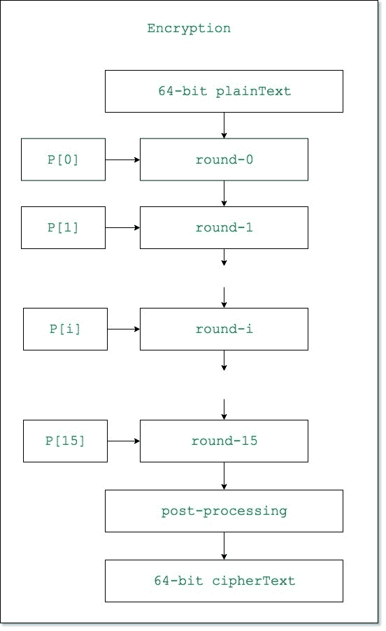
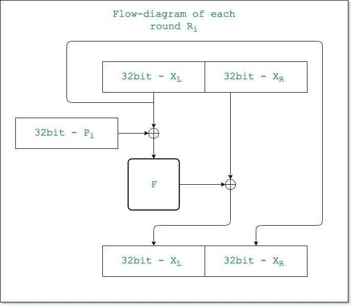
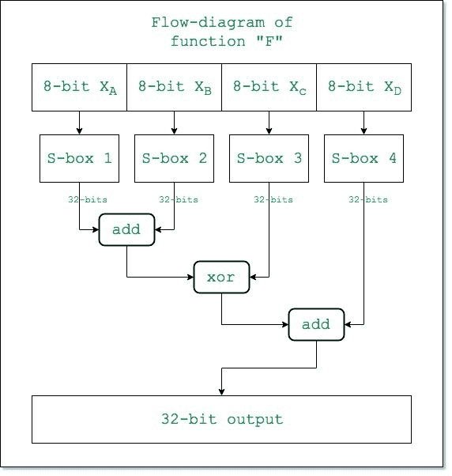
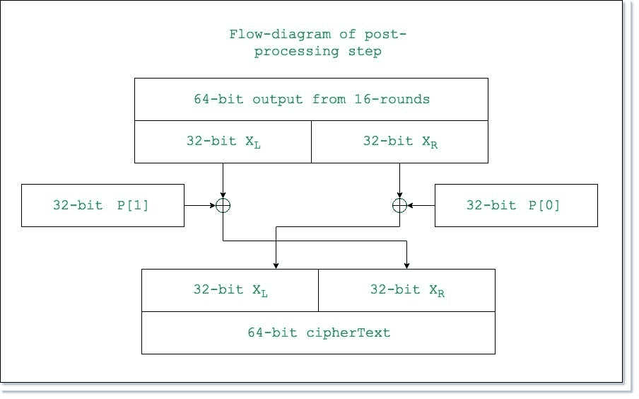
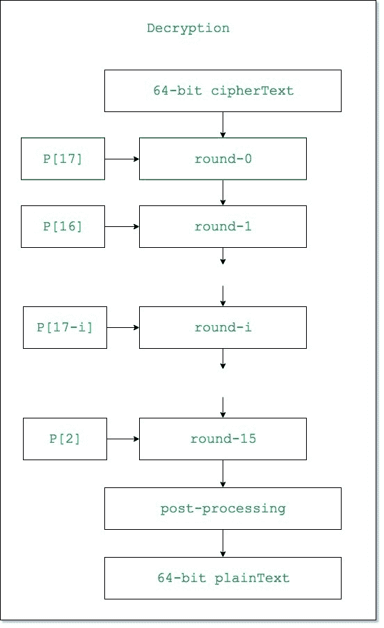
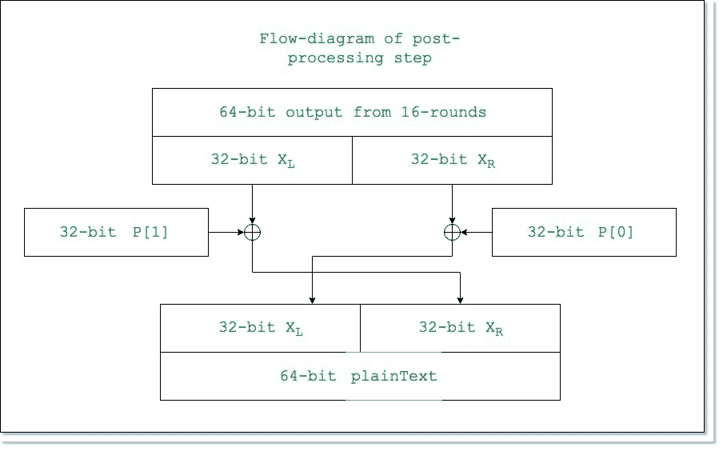

# 河豚算法示例

> 原文:[https://www . geeksforgeeks . org/blow fish-带示例的算法/](https://www.geeksforgeeks.org/blowfish-algorithm-with-examples/)

**河豚**是**布鲁斯·施奈尔**在 1993 年设计的一种加密技术，作为 [DES 加密技术](https://www.geeksforgeeks.org/data-encryption-standard-des-set-1/)的替代品。它比 DES 快得多，并且提供了良好的加密速率，迄今为止没有发现有效的[密码分析技术](https://www.geeksforgeeks.org/introduction-to-crypto-terminologies/)。它是第一个不受任何专利限制的安全密码，因此任何人都可以免费使用。

1.  **区块化** : 64 位元
2.  **密钥大小** : 32 位至 448 位可变大小
3.  **子键数量**:18【P 阵】
4.  **回合数** : 16
5.  **替换框**的数量:4[每个替换框有 512 个条目，每个条目 32 位]

**<u>河豚加密算法</u>**

**整个加密过程可以阐述为:**



让我们一步一步来看:

**<u>第一步:生成子项:</u>**

*   加密和解密过程都需要 18 个子密钥{P[0]…P[17]}，并且两个过程使用相同的子密钥。
*   这 18 个子关键字存储在一个 P 数组中，每个数组元素是一个 32 位的条目。
*   它是用圆周率(？).
*   每个子项的十六进制表示由下式给出:

```
P[0] = "243f6a88"
P[1] = "85a308d3"
.
.
.
P[17] = "8979fb1b"
```


*   现在，每个子项相对于输入项的变化如下:

```
P[0] = P[0] xor 1st 32-bits of input key
P[1] = P[1] xor 2nd 32-bits of input key
.
.
.
P[i] = P[i] xor (i+1)th 32-bits of input key 
(roll over to 1st 32-bits depending on the key length)
.
.
.
P[17] = P[17] xor 18th 32-bits of input key 
(roll over to 1st 32-bits depending on key length)
```

**最终的 P 数组包含 18 个子密钥，在整个加密过程中使用**

**<u>步骤 2:初始化替换框:</u>**

*   在加密和解密过程中都需要 4 个替换盒(S 盒){S[0]…S[4]}，每个 S 盒有 256 个条目{S[i][0]…S[i][255]，0&lei&le4}，其中每个条目都是 32 位的。
*   它是用圆周率(？)初始化 P 型阵列后。[你可以在这里找到 **s 盒**！](https://github.com/Ray784/Blowfish-S-boxes)

**<u>第三步:加密:</u>**

*   加密函数由两部分组成:
    **<u>a .</u>**加密由 16 轮组成，每轮(Ri)输入前一轮的明文(P.T .)和相应的子项(Pi)。每一轮的描述如下:



功能“F”的描述如下:



这里的函数“加法”是模 2^32.加法

**<u>b .后处理:</u>**16 回合后的输出处理如下:



下面是一个演示河豚加密的 Java 程序:

## Java 语言(一种计算机语言，尤用于创建网站)

```
// Java Program to demonstrate Blowfish encryption

import java.util.*;

public class Main {

    // Substitution boxes each string is a 32 bit hexadecimal value.
    String S[][]
        = { { "d1310ba6", "98dfb5ac", "2ffd72db", "d01adfb7", "b8e1afed",
              "6a267e96", "ba7c9045", "f12c7f99", "24a19947", "b3916cf7",
              "0801f2e2", "858efc16", "636920d8", "71574e69", "a458fea3",
              "f4933d7e", "0d95748f", "728eb658", "718bcd58", "82154aee",
              "7b54a41d", "c25a59b5", "9c30d539", "2af26013", "c5d1b023",
              "286085f0", "ca417918", "b8db38ef", "8e79dcb0", "603a180e",
              "6c9e0e8b", "b01e8a3e", "d71577c1", "bd314b27", "78af2fda",
              "55605c60", "e65525f3", "aa55ab94", "57489862", "63e81440",
              "55ca396a", "2aab10b6", "b4cc5c34", "1141e8ce", "a15486af",
              "7c72e993", "b3ee1411", "636fbc2a", "2ba9c55d", "741831f6",
              "ce5c3e16", "9b87931e", "afd6ba33", "6c24cf5c", "7a325381",
              "28958677", "3b8f4898", "6b4bb9af", "c4bfe81b", "66282193",
              "61d809cc", "fb21a991", "487cac60", "5dec8032", "ef845d5d",
              "e98575b1", "dc262302", "eb651b88", "23893e81", "d396acc5",
              "0f6d6ff3", "83f44239", "2e0b4482", "a4842004", "69c8f04a",
              "9e1f9b5e", "21c66842", "f6e96c9a", "670c9c61", "abd388f0",
              "6a51a0d2", "d8542f68", "960fa728", "ab5133a3", "6eef0b6c",
              "137a3be4", "ba3bf050", "7efb2a98", "a1f1651d", "39af0176",
              "66ca593e", "82430e88", "8cee8619", "456f9fb4", "7d84a5c3",
              "3b8b5ebe", "e06f75d8", "85c12073", "401a449f", "56c16aa6",
              "4ed3aa62", "363f7706", "1bfedf72", "429b023d", "37d0d724",
              "d00a1248", "db0fead3", "49f1c09b", "075372c9", "80991b7b",
              "25d479d8", "f6e8def7", "e3fe501a", "b6794c3b", "976ce0bd",
              "04c006ba", "c1a94fb6", "409f60c4", "5e5c9ec2", "196a2463",
              "68fb6faf", "3e6c53b5", "1339b2eb", "3b52ec6f", "6dfc511f",
              "9b30952c", "cc814544", "af5ebd09", "bee3d004", "de334afd",
              "660f2807", "192e4bb3", "c0cba857", "45c8740f", "d20b5f39",
              "b9d3fbdb", "5579c0bd", "1a60320a", "d6a100c6", "402c7279",
              "679f25fe", "fb1fa3cc", "8ea5e9f8", "db3222f8", "3c7516df",
              "fd616b15", "2f501ec8", "ad0552ab", "323db5fa", "fd238760",
              "53317b48", "3e00df82", "9e5c57bb", "ca6f8ca0", "1a87562e",
              "df1769db", "d542a8f6", "287effc3", "ac6732c6", "8c4f5573",
              "695b27b0", "bbca58c8", "e1ffa35d", "b8f011a0", "10fa3d98",
              "fd2183b8", "4afcb56c", "2dd1d35b", "9a53e479", "b6f84565",
              "d28e49bc", "4bfb9790", "e1ddf2da", "a4cb7e33", "62fb1341",
              "cee4c6e8", "ef20cada", "36774c01", "d07e9efe", "2bf11fb4",
              "95dbda4d", "ae909198", "eaad8e71", "6b93d5a0", "d08ed1d0",
              "afc725e0", "8e3c5b2f", "8e7594b7", "8ff6e2fb", "f2122b64",
              "8888b812", "900df01c", "4fad5ea0", "688fc31c", "d1cff191",
              "b3a8c1ad", "2f2f2218", "be0e1777", "ea752dfe", "8b021fa1",
              "e5a0cc0f", "b56f74e8", "18acf3d6", "ce89e299", "b4a84fe0",
              "fd13e0b7", "7cc43b81", "d2ada8d9", "165fa266", "80957705",
              "93cc7314", "211a1477", "e6ad2065", "77b5fa86", "c75442f5",
              "fb9d35cf", "ebcdaf0c", "7b3e89a0", "d6411bd3", "ae1e7e49",
              "00250e2d", "2071b35e", "226800bb", "57b8e0af", "2464369b",
              "f009b91e", "5563911d", "59dfa6aa", "78c14389", "d95a537f",
              "207d5ba2", "02e5b9c5", "83260376", "6295cfa9", "11c81968",
              "4e734a41", "b3472dca", "7b14a94a", "1b510052", "9a532915",
              "d60f573f", "bc9bc6e4", "2b60a476", "81e67400", "08ba6fb5",
              "571be91f", "f296ec6b", "2a0dd915", "b6636521", "e7b9f9b6",
              "ff34052e", "c5855664", "53b02d5d", "a99f8fa1", "08ba4799",
              "6e85076a" },
            { "4b7a70e9", "b5b32944", "db75092e", "c4192623", "ad6ea6b0",
              "49a7df7d", "9cee60b8", "8fedb266", "ecaa8c71", "699a17ff",
              "5664526c", "c2b19ee1", "193602a5", "75094c29", "a0591340",
              "e4183a3e", "3f54989a", "5b429d65", "6b8fe4d6", "99f73fd6",
              "a1d29c07", "efe830f5", "4d2d38e6", "f0255dc1", "4cdd2086",
              "8470eb26", "6382e9c6", "021ecc5e", "09686b3f", "3ebaefc9",
              "3c971814", "6b6a70a1", "687f3584", "52a0e286", "b79c5305",
              "aa500737", "3e07841c", "7fdeae5c", "8e7d44ec", "5716f2b8",
              "b03ada37", "f0500c0d", "f01c1f04", "0200b3ff", "ae0cf51a",
              "3cb574b2", "25837a58", "dc0921bd", "d19113f9", "7ca92ff6",
              "94324773", "22f54701", "3ae5e581", "37c2dadc", "c8b57634",
              "9af3dda7", "a9446146", "0fd0030e", "ecc8c73e", "a4751e41",
              "e238cd99", "3bea0e2f", "3280bba1", "183eb331", "4e548b38",
              "4f6db908", "6f420d03", "f60a04bf", "2cb81290", "24977c79",
              "5679b072", "bcaf89af", "de9a771f", "d9930810", "b38bae12",
              "dccf3f2e", "5512721f", "2e6b7124", "501adde6", "9f84cd87",
              "7a584718", "7408da17", "bc9f9abc", "e94b7d8c", "ec7aec3a",
              "db851dfa", "63094366", "c464c3d2", "ef1c1847", "3215d908",
              "dd433b37", "24c2ba16", "12a14d43", "2a65c451", "50940002",
              "133ae4dd", "71dff89e", "10314e55", "81ac77d6", "5f11199b",
              "043556f1", "d7a3c76b", "3c11183b", "5924a509", "f28fe6ed",
              "97f1fbfa", "9ebabf2c", "1e153c6e", "86e34570", "eae96fb1",
              "860e5e0a", "5a3e2ab3", "771fe71c", "4e3d06fa", "2965dcb9",
              "99e71d0f", "803e89d6", "5266c825", "2e4cc978", "9c10b36a",
              "c6150eba", "94e2ea78", "a5fc3c53", "1e0a2df4", "f2f74ea7",
              "361d2b3d", "1939260f", "19c27960", "5223a708", "f71312b6",
              "ebadfe6e", "eac31f66", "e3bc4595", "a67bc883", "b17f37d1",
              "018cff28", "c332ddef", "be6c5aa5", "65582185", "68ab9802",
              "eecea50f", "db2f953b", "2aef7dad", "5b6e2f84", "1521b628",
              "29076170", "ecdd4775", "619f1510", "13cca830", "eb61bd96",
              "0334fe1e", "aa0363cf", "b5735c90", "4c70a239", "d59e9e0b",
              "cbaade14", "eecc86bc", "60622ca7", "9cab5cab", "b2f3846e",
              "648b1eaf", "19bdf0ca", "a02369b9", "655abb50", "40685a32",
              "3c2ab4b3", "319ee9d5", "c021b8f7", "9b540b19", "875fa099",
              "95f7997e", "623d7da8", "f837889a", "97e32d77", "11ed935f",
              "16681281", "0e358829", "c7e61fd6", "96dedfa1", "7858ba99",
              "57f584a5", "1b227263", "9b83c3ff", "1ac24696", "cdb30aeb",
              "532e3054", "8fd948e4", "6dbc3128", "58ebf2ef", "34c6ffea",
              "fe28ed61", "ee7c3c73", "5d4a14d9", "e864b7e3", "42105d14",
              "203e13e0", "45eee2b6", "a3aaabea", "db6c4f15", "facb4fd0",
              "c742f442", "ef6abbb5", "654f3b1d", "41cd2105", "d81e799e",
              "86854dc7", "e44b476a", "3d816250", "cf62a1f2", "5b8d2646",
              "fc8883a0", "c1c7b6a3", "7f1524c3", "69cb7492", "47848a0b",
              "5692b285", "095bbf00", "ad19489d", "1462b174", "23820e00",
              "58428d2a", "0c55f5ea", "1dadf43e", "233f7061", "3372f092",
              "8d937e41", "d65fecf1", "6c223bdb", "7cde3759", "cbee7460",
              "4085f2a7", "ce77326e", "a6078084", "19f8509e", "e8efd855",
              "61d99735", "a969a7aa", "c50c06c2", "5a04abfc", "800bcadc",
              "9e447a2e", "c3453484", "fdd56705", "0e1e9ec9", "db73dbd3",
              "105588cd", "675fda79", "e3674340", "c5c43465", "713e38d8",
              "3d28f89e", "f16dff20", "153e21e7", "8fb03d4a", "e6e39f2b",
              "db83adf7" },
            { "e93d5a68", "948140f7", "f64c261c", "94692934", "411520f7",
              "7602d4f7", "bcf46b2e", "d4a20068", "d4082471", "3320f46a",
              "43b7d4b7", "500061af", "1e39f62e", "97244546", "14214f74",
              "bf8b8840", "4d95fc1d", "96b591af", "70f4ddd3", "66a02f45",
              "bfbc09ec", "03bd9785", "7fac6dd0", "31cb8504", "96eb27b3",
              "55fd3941", "da2547e6", "abca0a9a", "28507825", "530429f4",
              "0a2c86da", "e9b66dfb", "68dc1462", "d7486900", "680ec0a4",
              "27a18dee", "4f3ffea2", "e887ad8c", "b58ce006", "7af4d6b6",
              "aace1e7c", "d3375fec", "ce78a399", "406b2a42", "20fe9e35",
              "d9f385b9", "ee39d7ab", "3b124e8b", "1dc9faf7", "4b6d1856",
              "26a36631", "eae397b2", "3a6efa74", "dd5b4332", "6841e7f7",
              "ca7820fb", "fb0af54e", "d8feb397", "454056ac", "ba489527",
              "55533a3a", "20838d87", "fe6ba9b7", "d096954b", "55a867bc",
              "a1159a58", "cca92963", "99e1db33", "a62a4a56", "3f3125f9",
              "5ef47e1c", "9029317c", "fdf8e802", "04272f70", "80bb155c",
              "05282ce3", "95c11548", "e4c66d22", "48c1133f", "c70f86dc",
              "07f9c9ee", "41041f0f", "404779a4", "5d886e17", "325f51eb",
              "d59bc0d1", "f2bcc18f", "41113564", "257b7834", "602a9c60",
              "dff8e8a3", "1f636c1b", "0e12b4c2", "02e1329e", "af664fd1",
              "cad18115", "6b2395e0", "333e92e1", "3b240b62", "eebeb922",
              "85b2a20e", "e6ba0d99", "de720c8c", "2da2f728", "d0127845",
              "95b794fd", "647d0862", "e7ccf5f0", "5449a36f", "877d48fa",
              "c39dfd27", "f33e8d1e", "0a476341", "992eff74", "3a6f6eab",
              "f4f8fd37", "a812dc60", "a1ebddf8", "991be14c", "db6e6b0d",
              "c67b5510", "6d672c37", "2765d43b", "dcd0e804", "f1290dc7",
              "cc00ffa3", "b5390f92", "690fed0b", "667b9ffb", "cedb7d9c",
              "a091cf0b", "d9155ea3", "bb132f88", "515bad24", "7b9479bf",
              "763bd6eb", "37392eb3", "cc115979", "8026e297", "f42e312d",
              "6842ada7", "c66a2b3b", "12754ccc", "782ef11c", "6a124237",
              "b79251e7", "06a1bbe6", "4bfb6350", "1a6b1018", "11caedfa",
              "3d25bdd8", "e2e1c3c9", "44421659", "0a121386", "d90cec6e",
              "d5abea2a", "64af674e", "da86a85f", "bebfe988", "64e4c3fe",
              "9dbc8057", "f0f7c086", "60787bf8", "6003604d", "d1fd8346",
              "f6381fb0", "7745ae04", "d736fccc", "83426b33", "f01eab71",
              "b0804187", "3c005e5f", "77a057be", "bde8ae24", "55464299",
              "bf582e61", "4e58f48f", "f2ddfda2", "f474ef38", "8789bdc2",
              "5366f9c3", "c8b38e74", "b475f255", "46fcd9b9", "7aeb2661",
              "8b1ddf84", "846a0e79", "915f95e2", "466e598e", "20b45770",
              "8cd55591", "c902de4c", "b90bace1", "bb8205d0", "11a86248",
              "7574a99e", "b77f19b6", "e0a9dc09", "662d09a1", "c4324633",
              "e85a1f02", "09f0be8c", "4a99a025", "1d6efe10", "1ab93d1d",
              "0ba5a4df", "a186f20f", "2868f169", "dcb7da83", "573906fe",
              "a1e2ce9b", "4fcd7f52", "50115e01", "a70683fa", "a002b5c4",
              "0de6d027", "9af88c27", "773f8641", "c3604c06", "61a806b5",
              "f0177a28", "c0f586e0", "006058aa", "30dc7d62", "11e69ed7",
              "2338ea63", "53c2dd94", "c2c21634", "bbcbee56", "90bcb6de",
              "ebfc7da1", "ce591d76", "6f05e409", "4b7c0188", "39720a3d",
              "7c927c24", "86e3725f", "724d9db9", "1ac15bb4", "d39eb8fc",
              "ed545578", "08fca5b5", "d83d7cd3", "4dad0fc4", "1e50ef5e",
              "b161e6f8", "a28514d9", "6c51133c", "6fd5c7e7", "56e14ec4",
              "362abfce", "ddc6c837", "d79a3234", "92638212", "670efa8e",
              "406000e0" },
            { "3a39ce37", "d3faf5cf", "abc27737", "5ac52d1b", "5cb0679e",
              "4fa33742", "d3822740", "99bc9bbe", "d5118e9d", "bf0f7315",
              "d62d1c7e", "c700c47b", "b78c1b6b", "21a19045", "b26eb1be",
              "6a366eb4", "5748ab2f", "bc946e79", "c6a376d2", "6549c2c8",
              "530ff8ee", "468dde7d", "d5730a1d", "4cd04dc6", "2939bbdb",
              "a9ba4650", "ac9526e8", "be5ee304", "a1fad5f0", "6a2d519a",
              "63ef8ce2", "9a86ee22", "c089c2b8", "43242ef6", "a51e03aa",
              "9cf2d0a4", "83c061ba", "9be96a4d", "8fe51550", "ba645bd6",
              "2826a2f9", "a73a3ae1", "4ba99586", "ef5562e9", "c72fefd3",
              "f752f7da", "3f046f69", "77fa0a59", "80e4a915", "87b08601",
              "9b09e6ad", "3b3ee593", "e990fd5a", "9e34d797", "2cf0b7d9",
              "022b8b51", "96d5ac3a", "017da67d", "d1cf3ed6", "7c7d2d28",
              "1f9f25cf", "adf2b89b", "5ad6b472", "5a88f54c", "e029ac71",
              "e019a5e6", "47b0acfd", "ed93fa9b", "e8d3c48d", "283b57cc",
              "f8d56629", "79132e28", "785f0191", "ed756055", "f7960e44",
              "e3d35e8c", "15056dd4", "88f46dba", "03a16125", "0564f0bd",
              "c3eb9e15", "3c9057a2", "97271aec", "a93a072a", "1b3f6d9b",
              "1e6321f5", "f59c66fb", "26dcf319", "7533d928", "b155fdf5",
              "03563482", "8aba3cbb", "28517711", "c20ad9f8", "abcc5167",
              "ccad925f", "4de81751", "3830dc8e", "379d5862", "9320f991",
              "ea7a90c2", "fb3e7bce", "5121ce64", "774fbe32", "a8b6e37e",
              "c3293d46", "48de5369", "6413e680", "a2ae0810", "dd6db224",
              "69852dfd", "09072166", "b39a460a", "6445c0dd", "586cdecf",
              "1c20c8ae", "5bbef7dd", "1b588d40", "ccd2017f", "6bb4e3bb",
              "dda26a7e", "3a59ff45", "3e350a44", "bcb4cdd5", "72eacea8",
              "fa6484bb", "8d6612ae", "bf3c6f47", "d29be463", "542f5d9e",
              "aec2771b", "f64e6370", "740e0d8d", "e75b1357", "f8721671",
              "af537d5d", "4040cb08", "4eb4e2cc", "34d2466a", "0115af84",
              "e1b00428", "95983a1d", "06b89fb4", "ce6ea048", "6f3f3b82",
              "3520ab82", "011a1d4b", "277227f8", "611560b1", "e7933fdc",
              "bb3a792b", "344525bd", "a08839e1", "51ce794b", "2f32c9b7",
              "a01fbac9", "e01cc87e", "bcc7d1f6", "cf0111c3", "a1e8aac7",
              "1a908749", "d44fbd9a", "d0dadecb", "d50ada38", "0339c32a",
              "c6913667", "8df9317c", "e0b12b4f", "f79e59b7", "43f5bb3a",
              "f2d519ff", "27d9459c", "bf97222c", "15e6fc2a", "0f91fc71",
              "9b941525", "fae59361", "ceb69ceb", "c2a86459", "12baa8d1",
              "b6c1075e", "e3056a0c", "10d25065", "cb03a442", "e0ec6e0e",
              "1698db3b", "4c98a0be", "3278e964", "9f1f9532", "e0d392df",
              "d3a0342b", "8971f21e", "1b0a7441", "4ba3348c", "c5be7120",
              "c37632d8", "df359f8d", "9b992f2e", "e60b6f47", "0fe3f11d",
              "e54cda54", "1edad891", "ce6279cf", "cd3e7e6f", "1618b166",
              "fd2c1d05", "848fd2c5", "f6fb2299", "f523f357", "a6327623",
              "93a83531", "56cccd02", "acf08162", "5a75ebb5", "6e163697",
              "88d273cc", "de966292", "81b949d0", "4c50901b", "71c65614",
              "e6c6c7bd", "327a140a", "45e1d006", "c3f27b9a", "c9aa53fd",
              "62a80f00", "bb25bfe2", "35bdd2f6", "71126905", "b2040222",
              "b6cbcf7c", "cd769c2b", "53113ec0", "1640e3d3", "38abbd60",
              "2547adf0", "ba38209c", "f746ce76", "77afa1c5", "20756060",
              "85cbfe4e", "8ae88dd8", "7aaaf9b0", "4cf9aa7e", "1948c25c",
              "02fb8a8c", "01c36ae4", "d6ebe1f9", "90d4f869", "a65cdea0",
              "3f09252d", "c208e69f", "b74e6132", "ce77e25b", "578fdfe3",
              "3ac372e6" } };

    // Subkeys initialisation with digits of pi.
    String P[] = { "243f6a88", "85a308d3", "13198a2e", "03707344", "a4093822",
                   "299f31d0", "082efa98", "ec4e6c89", "452821e6", "38d01377",
                   "be5466cf", "34e90c6c", "c0ac29b7", "c97c50dd", "3f84d5b5",
                   "b5470917", "9216d5d9", "8979fb1b" };

    // to store 2^32(for addition modulo 2^32).
    long modVal = 1;

    // to convert hexadecimal to binary.
    private String hexToBin(String plainText)
    {
        String binary = "";
        Long num;
        String binary4B;
        int n = plainText.length();
        for (int i = 0; i < n; i++) {

            num = Long.parseUnsignedLong(
                plainText.charAt(i) + "", 16);
            binary4B = Long.toBinaryString(num);

            // each value in hexadecimal is 4 bits in binary.
            binary4B = "0000" + binary4B;

            binary4B = binary4B.substring(binary4B.length() - 4);
            binary += binary4B;
        }
        return binary;
    }

    // convert from binary to hexadecimal.
    private String binToHex(String plainText)
    {

        long num = Long.parseUnsignedLong(plainText, 2);
        String hexa = Long.toHexString(num);
        while (hexa.length() < (plainText.length() / 4))

            // maintain output length same length
            // as input by appending leading zeroes.
            hexa = "0" + hexa;

        return hexa;
    }

    // xor two hexadecimal strings of the same length.
    private String xor(String a, String b)
    {
        a = hexToBin(a);
        b = hexToBin(b);
        String ans = "";
        for (int i = 0; i < a.length(); i++)
            ans += (char)(((a.charAt(i) - '0')
                           ^ (b.charAt(i) - '0'))
                          + '0');
        ans = binToHex(ans);
        return ans;
    }

    // addition modulo 2^32 of two hexadecimal strings.
    private String addBin(String a, String b)
    {
        String ans = "";
        long n1 = Long.parseUnsignedLong(a, 16);
        long n2 = Long.parseUnsignedLong(b, 16);
        n1 = (n1 + n2) % modVal;
        ans = Long.toHexString(n1);
        ans = "00000000" + ans;
        return ans.substring(ans.length() - 8);
    }

    // function F explained above.
    private String f(String plainText)
    {
        String a[] = new String[4];
        String ans = "";
        for (int i = 0; i < 8; i += 2) {
            // the column number for S-box
            // is 8-bit value(8*4 = 32 bit plain text)
            long col
                = Long.parseUnsignedLong(
                    hexToBin(
                        plainText
                            .substring(i, i + 2)),
                    2);
            a[i / 2] = S[i / 2][(int)col];
        }
        ans = addBin(a[0], a[1]);
        ans = xor(ans, a[2]);
        ans = addBin(ans, a[3]);
        return ans;
    }

    // generate subkeys.
    private void keyGenerate(String key)
    {
        int j = 0;
        for (int i = 0; i < P.length; i++) {

            // xor-ing 32-bit parts of the key
            // with initial subkeys.
            P[i] = xor(P[i], key.substring(j, j + 8));

            System.out.println("subkey "
                               + (i + 1) + ": "
                               + P[i]);
            j = (j + 8) % key.length();
        }
    }

    // round function
    private String round(int time, String plainText)
    {
        String left, right;
        left = plainText.substring(0, 8);
        right = plainText.substring(8, 16);
        left = xor(left, P[time]);

        // output from F function
        String fOut = f(left);

        right = xor(fOut, right);

        System.out.println(
            "round " + time + ": "
            + right + left);

        // swap left and right
        return right + left;
    }

    // encryption
    private String encrypt(String plainText)
    {
        for (int i = 0; i < 16; i++)
            plainText = round(i, plainText);

        // postprocessing
        String right = plainText.substring(0, 8);
        String left = plainText.substring(8, 16);
        right = xor(right, P[16]);
        left = xor(left, P[17]);
        return left + right;
    }

    Main()
    {
        // storing 2^32 in modVal
        //(<<1 is equivalent to multiply by 2)
        for (int i = 0; i < 32; i++)
            modVal = modVal << 1;

        String plainText = "123456abcd132536";
        String key = "aabb09182736ccdd";

        keyGenerate(key);

        System.out.println("-----Encryption-----");
        String cipherText = encrypt(plainText);
        System.out.println("Cipher Text: " + cipherText);
    }

    public static void main(String args[])
    {
        new Main();
    }
}

// This code is contributed by AbhayBhat
```

**Output:** 

```
subkey 1: 8e846390
subkey 2: a295c40e
subkey 3: b9a28336
subkey 4: 2446bf99
subkey 5: 0eb2313a
subkey 6: 0ea9fd0d
subkey 7: a295f380
subkey 8: cb78a054
subkey 9: ef9328fe
subkey 10: 1fe6dfaa
subkey 11: 14ef6fd7
subkey 12: 13dfc0b1
subkey 13: 6a1720af
subkey 14: ee4a9c00
subkey 15: 953fdcad
subkey 16: 9271c5ca
subkey 17: 38addcc1
subkey 18: ae4f37c6
-----Encryption-----
round 0: 77b3ba639cb0353b
round 1: 0cc7d63fd5267e6d
round 2: c799728ab5655509
round 3: 69612395e3dfcd13
round 4: f3f5b74b67d312af
round 5: 52023d4efd5c4a46
round 6: 5b785180f097cece
round 7: cc946d119000f1d4
round 8: 6af47a4b230745ef
round 9: 9fb82cc57512a5e1
round 10: 1106c1ab8b574312
round 11: 7d7a616502d9011a
round 12: 81e9ce71176d41ca
round 13: 9727e50a6fa35271
round 14: eb761e34021839a7
round 15: 0599d9367907dbfe
Cipher Text: d748ec383d3405f7
```

**<u>Decryption</u>**

解密过程类似于加密过程，并且子密钥反向使用{ P[17]–P[0]}。整个解密过程可以详细描述为:



让我们一步一步来看:

**<u>第一步:生成子项:</u>**

*   解密过程需要 18 个子密钥{P[0]…P[17]}。
*   这 18 个子关键字存储在一个 P 数组中，每个数组元素是一个 32 位的条目。
*   它是用圆周率(？).
*   每个子项的十六进制表示由下式给出:

```
P[0] = "243f6a88"
P[1] = "85a308d3"
.
.
.
P[17] = "8979fb1b"
```

**注:**P 阵初始值见加密。

*   现在每个子项相对于输入键的变化如下:

```
P[0] = P[0] xor 1st 32-bits of input key
P[1] = P[1] xor 2nd 32-bits of input key
.
.
.
P[i] = P[i] xor (i+1)th 32-bits of input key
(roll over to 1st 32-bits depending on the key length)
.
.
.
P[17] = P[17] xor 18th 32-bits of input key
(roll over to 1st 32-bits depending on key length)
```

**最终的 P 数组包含 18 个子密钥，在整个加密过程中使用**

**<u>步骤 2:初始化替换框:</u>**

*   在加密和解密过程中都需要 4 个替换盒(S 盒){S[0]…S[4]}，每个 S 盒有 256 个条目{S[i][0]…S[i][255]，0&lei&le4}，其中每个条目都是 32 位的。
*   它是用圆周率(？)初始化 P 型阵列后。[你可以在这里找到 **s 盒**！](https://github.com/Ray784/Blowfish-S-boxes)

**<u>第三步:解密:</u>**

*   解密功能也由两部分组成:
    1.  **<u>轮次:</u>** 解密也由 16 轮次组成，每轮(Ri)(如上所述)从上一轮输入密文(C.T .)和相应的子密钥(P[17-i])(即，对于解密，子密钥反向使用)。
    2.  **<u>后处理:</u>**16 回合后的输出处理如下:



下面是一个演示解密的 Java 程序

## Java 语言(一种计算机语言，尤用于创建网站)

```
// Java program to demonstrate
// Blowfish decryption Algorithm

import java.util.*;

public class Main {

    // Substitution boxes each string is a 32 bit hexadecimal value.
    String S[][]
        = { { "d1310ba6", "98dfb5ac", "2ffd72db", "d01adfb7", "b8e1afed",
              "6a267e96", "ba7c9045", "f12c7f99", "24a19947", "b3916cf7",
              "0801f2e2", "858efc16", "636920d8", "71574e69", "a458fea3",
              "f4933d7e", "0d95748f", "728eb658", "718bcd58", "82154aee",
              "7b54a41d", "c25a59b5", "9c30d539", "2af26013", "c5d1b023",
              "286085f0", "ca417918", "b8db38ef", "8e79dcb0", "603a180e",
              "6c9e0e8b", "b01e8a3e", "d71577c1", "bd314b27", "78af2fda",
              "55605c60", "e65525f3", "aa55ab94", "57489862", "63e81440",
              "55ca396a", "2aab10b6", "b4cc5c34", "1141e8ce", "a15486af",
              "7c72e993", "b3ee1411", "636fbc2a", "2ba9c55d", "741831f6",
              "ce5c3e16", "9b87931e", "afd6ba33", "6c24cf5c", "7a325381",
              "28958677", "3b8f4898", "6b4bb9af", "c4bfe81b", "66282193",
              "61d809cc", "fb21a991", "487cac60", "5dec8032", "ef845d5d",
              "e98575b1", "dc262302", "eb651b88", "23893e81", "d396acc5",
              "0f6d6ff3", "83f44239", "2e0b4482", "a4842004", "69c8f04a",
              "9e1f9b5e", "21c66842", "f6e96c9a", "670c9c61", "abd388f0",
              "6a51a0d2", "d8542f68", "960fa728", "ab5133a3", "6eef0b6c",
              "137a3be4", "ba3bf050", "7efb2a98", "a1f1651d", "39af0176",
              "66ca593e", "82430e88", "8cee8619", "456f9fb4", "7d84a5c3",
              "3b8b5ebe", "e06f75d8", "85c12073", "401a449f", "56c16aa6",
              "4ed3aa62", "363f7706", "1bfedf72", "429b023d", "37d0d724",
              "d00a1248", "db0fead3", "49f1c09b", "075372c9", "80991b7b",
              "25d479d8", "f6e8def7", "e3fe501a", "b6794c3b", "976ce0bd",
              "04c006ba", "c1a94fb6", "409f60c4", "5e5c9ec2", "196a2463",
              "68fb6faf", "3e6c53b5", "1339b2eb", "3b52ec6f", "6dfc511f",
              "9b30952c", "cc814544", "af5ebd09", "bee3d004", "de334afd",
              "660f2807", "192e4bb3", "c0cba857", "45c8740f", "d20b5f39",
              "b9d3fbdb", "5579c0bd", "1a60320a", "d6a100c6", "402c7279",
              "679f25fe", "fb1fa3cc", "8ea5e9f8", "db3222f8", "3c7516df",
              "fd616b15", "2f501ec8", "ad0552ab", "323db5fa", "fd238760",
              "53317b48", "3e00df82", "9e5c57bb", "ca6f8ca0", "1a87562e",
              "df1769db", "d542a8f6", "287effc3", "ac6732c6", "8c4f5573",
              "695b27b0", "bbca58c8", "e1ffa35d", "b8f011a0", "10fa3d98",
              "fd2183b8", "4afcb56c", "2dd1d35b", "9a53e479", "b6f84565",
              "d28e49bc", "4bfb9790", "e1ddf2da", "a4cb7e33", "62fb1341",
              "cee4c6e8", "ef20cada", "36774c01", "d07e9efe", "2bf11fb4",
              "95dbda4d", "ae909198", "eaad8e71", "6b93d5a0", "d08ed1d0",
              "afc725e0", "8e3c5b2f", "8e7594b7", "8ff6e2fb", "f2122b64",
              "8888b812", "900df01c", "4fad5ea0", "688fc31c", "d1cff191",
              "b3a8c1ad", "2f2f2218", "be0e1777", "ea752dfe", "8b021fa1",
              "e5a0cc0f", "b56f74e8", "18acf3d6", "ce89e299", "b4a84fe0",
              "fd13e0b7", "7cc43b81", "d2ada8d9", "165fa266", "80957705",
              "93cc7314", "211a1477", "e6ad2065", "77b5fa86", "c75442f5",
              "fb9d35cf", "ebcdaf0c", "7b3e89a0", "d6411bd3", "ae1e7e49",
              "00250e2d", "2071b35e", "226800bb", "57b8e0af", "2464369b",
              "f009b91e", "5563911d", "59dfa6aa", "78c14389", "d95a537f",
              "207d5ba2", "02e5b9c5", "83260376", "6295cfa9", "11c81968",
              "4e734a41", "b3472dca", "7b14a94a", "1b510052", "9a532915",
              "d60f573f", "bc9bc6e4", "2b60a476", "81e67400", "08ba6fb5",
              "571be91f", "f296ec6b", "2a0dd915", "b6636521", "e7b9f9b6",
              "ff34052e", "c5855664", "53b02d5d", "a99f8fa1", "08ba4799",
              "6e85076a" },
            { "4b7a70e9", "b5b32944", "db75092e", "c4192623", "ad6ea6b0",
              "49a7df7d", "9cee60b8", "8fedb266", "ecaa8c71", "699a17ff",
              "5664526c", "c2b19ee1", "193602a5", "75094c29", "a0591340",
              "e4183a3e", "3f54989a", "5b429d65", "6b8fe4d6", "99f73fd6",
              "a1d29c07", "efe830f5", "4d2d38e6", "f0255dc1", "4cdd2086",
              "8470eb26", "6382e9c6", "021ecc5e", "09686b3f", "3ebaefc9",
              "3c971814", "6b6a70a1", "687f3584", "52a0e286", "b79c5305",
              "aa500737", "3e07841c", "7fdeae5c", "8e7d44ec", "5716f2b8",
              "b03ada37", "f0500c0d", "f01c1f04", "0200b3ff", "ae0cf51a",
              "3cb574b2", "25837a58", "dc0921bd", "d19113f9", "7ca92ff6",
              "94324773", "22f54701", "3ae5e581", "37c2dadc", "c8b57634",
              "9af3dda7", "a9446146", "0fd0030e", "ecc8c73e", "a4751e41",
              "e238cd99", "3bea0e2f", "3280bba1", "183eb331", "4e548b38",
              "4f6db908", "6f420d03", "f60a04bf", "2cb81290", "24977c79",
              "5679b072", "bcaf89af", "de9a771f", "d9930810", "b38bae12",
              "dccf3f2e", "5512721f", "2e6b7124", "501adde6", "9f84cd87",
              "7a584718", "7408da17", "bc9f9abc", "e94b7d8c", "ec7aec3a",
              "db851dfa", "63094366", "c464c3d2", "ef1c1847", "3215d908",
              "dd433b37", "24c2ba16", "12a14d43", "2a65c451", "50940002",
              "133ae4dd", "71dff89e", "10314e55", "81ac77d6", "5f11199b",
              "043556f1", "d7a3c76b", "3c11183b", "5924a509", "f28fe6ed",
              "97f1fbfa", "9ebabf2c", "1e153c6e", "86e34570", "eae96fb1",
              "860e5e0a", "5a3e2ab3", "771fe71c", "4e3d06fa", "2965dcb9",
              "99e71d0f", "803e89d6", "5266c825", "2e4cc978", "9c10b36a",
              "c6150eba", "94e2ea78", "a5fc3c53", "1e0a2df4", "f2f74ea7",
              "361d2b3d", "1939260f", "19c27960", "5223a708", "f71312b6",
              "ebadfe6e", "eac31f66", "e3bc4595", "a67bc883", "b17f37d1",
              "018cff28", "c332ddef", "be6c5aa5", "65582185", "68ab9802",
              "eecea50f", "db2f953b", "2aef7dad", "5b6e2f84", "1521b628",
              "29076170", "ecdd4775", "619f1510", "13cca830", "eb61bd96",
              "0334fe1e", "aa0363cf", "b5735c90", "4c70a239", "d59e9e0b",
              "cbaade14", "eecc86bc", "60622ca7", "9cab5cab", "b2f3846e",
              "648b1eaf", "19bdf0ca", "a02369b9", "655abb50", "40685a32",
              "3c2ab4b3", "319ee9d5", "c021b8f7", "9b540b19", "875fa099",
              "95f7997e", "623d7da8", "f837889a", "97e32d77", "11ed935f",
              "16681281", "0e358829", "c7e61fd6", "96dedfa1", "7858ba99",
              "57f584a5", "1b227263", "9b83c3ff", "1ac24696", "cdb30aeb",
              "532e3054", "8fd948e4", "6dbc3128", "58ebf2ef", "34c6ffea",
              "fe28ed61", "ee7c3c73", "5d4a14d9", "e864b7e3", "42105d14",
              "203e13e0", "45eee2b6", "a3aaabea", "db6c4f15", "facb4fd0",
              "c742f442", "ef6abbb5", "654f3b1d", "41cd2105", "d81e799e",
              "86854dc7", "e44b476a", "3d816250", "cf62a1f2", "5b8d2646",
              "fc8883a0", "c1c7b6a3", "7f1524c3", "69cb7492", "47848a0b",
              "5692b285", "095bbf00", "ad19489d", "1462b174", "23820e00",
              "58428d2a", "0c55f5ea", "1dadf43e", "233f7061", "3372f092",
              "8d937e41", "d65fecf1", "6c223bdb", "7cde3759", "cbee7460",
              "4085f2a7", "ce77326e", "a6078084", "19f8509e", "e8efd855",
              "61d99735", "a969a7aa", "c50c06c2", "5a04abfc", "800bcadc",
              "9e447a2e", "c3453484", "fdd56705", "0e1e9ec9", "db73dbd3",
              "105588cd", "675fda79", "e3674340", "c5c43465", "713e38d8",
              "3d28f89e", "f16dff20", "153e21e7", "8fb03d4a", "e6e39f2b",
              "db83adf7" },
            { "e93d5a68", "948140f7", "f64c261c", "94692934", "411520f7",
              "7602d4f7", "bcf46b2e", "d4a20068", "d4082471", "3320f46a",
              "43b7d4b7", "500061af", "1e39f62e", "97244546", "14214f74",
              "bf8b8840", "4d95fc1d", "96b591af", "70f4ddd3", "66a02f45",
              "bfbc09ec", "03bd9785", "7fac6dd0", "31cb8504", "96eb27b3",
              "55fd3941", "da2547e6", "abca0a9a", "28507825", "530429f4",
              "0a2c86da", "e9b66dfb", "68dc1462", "d7486900", "680ec0a4",
              "27a18dee", "4f3ffea2", "e887ad8c", "b58ce006", "7af4d6b6",
              "aace1e7c", "d3375fec", "ce78a399", "406b2a42", "20fe9e35",
              "d9f385b9", "ee39d7ab", "3b124e8b", "1dc9faf7", "4b6d1856",
              "26a36631", "eae397b2", "3a6efa74", "dd5b4332", "6841e7f7",
              "ca7820fb", "fb0af54e", "d8feb397", "454056ac", "ba489527",
              "55533a3a", "20838d87", "fe6ba9b7", "d096954b", "55a867bc",
              "a1159a58", "cca92963", "99e1db33", "a62a4a56", "3f3125f9",
              "5ef47e1c", "9029317c", "fdf8e802", "04272f70", "80bb155c",
              "05282ce3", "95c11548", "e4c66d22", "48c1133f", "c70f86dc",
              "07f9c9ee", "41041f0f", "404779a4", "5d886e17", "325f51eb",
              "d59bc0d1", "f2bcc18f", "41113564", "257b7834", "602a9c60",
              "dff8e8a3", "1f636c1b", "0e12b4c2", "02e1329e", "af664fd1",
              "cad18115", "6b2395e0", "333e92e1", "3b240b62", "eebeb922",
              "85b2a20e", "e6ba0d99", "de720c8c", "2da2f728", "d0127845",
              "95b794fd", "647d0862", "e7ccf5f0", "5449a36f", "877d48fa",
              "c39dfd27", "f33e8d1e", "0a476341", "992eff74", "3a6f6eab",
              "f4f8fd37", "a812dc60", "a1ebddf8", "991be14c", "db6e6b0d",
              "c67b5510", "6d672c37", "2765d43b", "dcd0e804", "f1290dc7",
              "cc00ffa3", "b5390f92", "690fed0b", "667b9ffb", "cedb7d9c",
              "a091cf0b", "d9155ea3", "bb132f88", "515bad24", "7b9479bf",
              "763bd6eb", "37392eb3", "cc115979", "8026e297", "f42e312d",
              "6842ada7", "c66a2b3b", "12754ccc", "782ef11c", "6a124237",
              "b79251e7", "06a1bbe6", "4bfb6350", "1a6b1018", "11caedfa",
              "3d25bdd8", "e2e1c3c9", "44421659", "0a121386", "d90cec6e",
              "d5abea2a", "64af674e", "da86a85f", "bebfe988", "64e4c3fe",
              "9dbc8057", "f0f7c086", "60787bf8", "6003604d", "d1fd8346",
              "f6381fb0", "7745ae04", "d736fccc", "83426b33", "f01eab71",
              "b0804187", "3c005e5f", "77a057be", "bde8ae24", "55464299",
              "bf582e61", "4e58f48f", "f2ddfda2", "f474ef38", "8789bdc2",
              "5366f9c3", "c8b38e74", "b475f255", "46fcd9b9", "7aeb2661",
              "8b1ddf84", "846a0e79", "915f95e2", "466e598e", "20b45770",
              "8cd55591", "c902de4c", "b90bace1", "bb8205d0", "11a86248",
              "7574a99e", "b77f19b6", "e0a9dc09", "662d09a1", "c4324633",
              "e85a1f02", "09f0be8c", "4a99a025", "1d6efe10", "1ab93d1d",
              "0ba5a4df", "a186f20f", "2868f169", "dcb7da83", "573906fe",
              "a1e2ce9b", "4fcd7f52", "50115e01", "a70683fa", "a002b5c4",
              "0de6d027", "9af88c27", "773f8641", "c3604c06", "61a806b5",
              "f0177a28", "c0f586e0", "006058aa", "30dc7d62", "11e69ed7",
              "2338ea63", "53c2dd94", "c2c21634", "bbcbee56", "90bcb6de",
              "ebfc7da1", "ce591d76", "6f05e409", "4b7c0188", "39720a3d",
              "7c927c24", "86e3725f", "724d9db9", "1ac15bb4", "d39eb8fc",
              "ed545578", "08fca5b5", "d83d7cd3", "4dad0fc4", "1e50ef5e",
              "b161e6f8", "a28514d9", "6c51133c", "6fd5c7e7", "56e14ec4",
              "362abfce", "ddc6c837", "d79a3234", "92638212", "670efa8e",
              "406000e0" },
            { "3a39ce37", "d3faf5cf", "abc27737", "5ac52d1b", "5cb0679e",
              "4fa33742", "d3822740", "99bc9bbe", "d5118e9d", "bf0f7315",
              "d62d1c7e", "c700c47b", "b78c1b6b", "21a19045", "b26eb1be",
              "6a366eb4", "5748ab2f", "bc946e79", "c6a376d2", "6549c2c8",
              "530ff8ee", "468dde7d", "d5730a1d", "4cd04dc6", "2939bbdb",
              "a9ba4650", "ac9526e8", "be5ee304", "a1fad5f0", "6a2d519a",
              "63ef8ce2", "9a86ee22", "c089c2b8", "43242ef6", "a51e03aa",
              "9cf2d0a4", "83c061ba", "9be96a4d", "8fe51550", "ba645bd6",
              "2826a2f9", "a73a3ae1", "4ba99586", "ef5562e9", "c72fefd3",
              "f752f7da", "3f046f69", "77fa0a59", "80e4a915", "87b08601",
              "9b09e6ad", "3b3ee593", "e990fd5a", "9e34d797", "2cf0b7d9",
              "022b8b51", "96d5ac3a", "017da67d", "d1cf3ed6", "7c7d2d28",
              "1f9f25cf", "adf2b89b", "5ad6b472", "5a88f54c", "e029ac71",
              "e019a5e6", "47b0acfd", "ed93fa9b", "e8d3c48d", "283b57cc",
              "f8d56629", "79132e28", "785f0191", "ed756055", "f7960e44",
              "e3d35e8c", "15056dd4", "88f46dba", "03a16125", "0564f0bd",
              "c3eb9e15", "3c9057a2", "97271aec", "a93a072a", "1b3f6d9b",
              "1e6321f5", "f59c66fb", "26dcf319", "7533d928", "b155fdf5",
              "03563482", "8aba3cbb", "28517711", "c20ad9f8", "abcc5167",
              "ccad925f", "4de81751", "3830dc8e", "379d5862", "9320f991",
              "ea7a90c2", "fb3e7bce", "5121ce64", "774fbe32", "a8b6e37e",
              "c3293d46", "48de5369", "6413e680", "a2ae0810", "dd6db224",
              "69852dfd", "09072166", "b39a460a", "6445c0dd", "586cdecf",
              "1c20c8ae", "5bbef7dd", "1b588d40", "ccd2017f", "6bb4e3bb",
              "dda26a7e", "3a59ff45", "3e350a44", "bcb4cdd5", "72eacea8",
              "fa6484bb", "8d6612ae", "bf3c6f47", "d29be463", "542f5d9e",
              "aec2771b", "f64e6370", "740e0d8d", "e75b1357", "f8721671",
              "af537d5d", "4040cb08", "4eb4e2cc", "34d2466a", "0115af84",
              "e1b00428", "95983a1d", "06b89fb4", "ce6ea048", "6f3f3b82",
              "3520ab82", "011a1d4b", "277227f8", "611560b1", "e7933fdc",
              "bb3a792b", "344525bd", "a08839e1", "51ce794b", "2f32c9b7",
              "a01fbac9", "e01cc87e", "bcc7d1f6", "cf0111c3", "a1e8aac7",
              "1a908749", "d44fbd9a", "d0dadecb", "d50ada38", "0339c32a",
              "c6913667", "8df9317c", "e0b12b4f", "f79e59b7", "43f5bb3a",
              "f2d519ff", "27d9459c", "bf97222c", "15e6fc2a", "0f91fc71",
              "9b941525", "fae59361", "ceb69ceb", "c2a86459", "12baa8d1",
              "b6c1075e", "e3056a0c", "10d25065", "cb03a442", "e0ec6e0e",
              "1698db3b", "4c98a0be", "3278e964", "9f1f9532", "e0d392df",
              "d3a0342b", "8971f21e", "1b0a7441", "4ba3348c", "c5be7120",
              "c37632d8", "df359f8d", "9b992f2e", "e60b6f47", "0fe3f11d",
              "e54cda54", "1edad891", "ce6279cf", "cd3e7e6f", "1618b166",
              "fd2c1d05", "848fd2c5", "f6fb2299", "f523f357", "a6327623",
              "93a83531", "56cccd02", "acf08162", "5a75ebb5", "6e163697",
              "88d273cc", "de966292", "81b949d0", "4c50901b", "71c65614",
              "e6c6c7bd", "327a140a", "45e1d006", "c3f27b9a", "c9aa53fd",
              "62a80f00", "bb25bfe2", "35bdd2f6", "71126905", "b2040222",
              "b6cbcf7c", "cd769c2b", "53113ec0", "1640e3d3", "38abbd60",
              "2547adf0", "ba38209c", "f746ce76", "77afa1c5", "20756060",
              "85cbfe4e", "8ae88dd8", "7aaaf9b0", "4cf9aa7e", "1948c25c",
              "02fb8a8c", "01c36ae4", "d6ebe1f9", "90d4f869", "a65cdea0",
              "3f09252d", "c208e69f", "b74e6132", "ce77e25b", "578fdfe3",
              "3ac372e6" } };

    // Subkeys initialisation with digits of pi.
    String P[] = { "243f6a88", "85a308d3", "13198a2e", "03707344", "a4093822",
                   "299f31d0", "082efa98", "ec4e6c89", "452821e6", "38d01377",
                   "be5466cf", "34e90c6c", "c0ac29b7", "c97c50dd", "3f84d5b5",
                   "b5470917", "9216d5d9", "8979fb1b" };

    // to store 2^32(for addition modulo 2^32).
    long modVal = 1;

    // to convert hexadecimal to binary.
    private String hexToBin(String plainText)
    {
        String binary = "";
        Long num;
        String binary4B;
        int n = plainText.length();
        for (int i = 0; i < n; i++) {
            num
                = Long.parseUnsignedLong(
                    plainText.charAt(i) + "", 16);
            binary4B = Long.toBinaryString(num);

            // each value in hexadecimal
            // is 4 bits in binary.
            binary4B = "0000" + binary4B;
            binary4B
                = binary4B.substring(
                    binary4B.length() - 4);
            binary += binary4B;
        }
        return binary;
    }

    // convert from binary to hexadecimal.
    private String binToHex(String plainText)
    {
        long num = Long.parseUnsignedLong(plainText, 2);
        String hexa = Long.toHexString(num);
        while (hexa.length() < (plainText.length() / 4))

            // maintain output length same length
            // as input by appending leading zeroes.
            hexa = "0" + hexa;
        return hexa;
    }

    // xor two hexadecimal strings of same length.
    private String xor(String a, String b)
    {
        a = hexToBin(a);
        b = hexToBin(b);
        String ans = "";
        for (int i = 0; i < a.length(); i++)
            ans += (char)(((a.charAt(i) - '0')
                           ^ (b.charAt(i) - '0'))
                          + '0');
        ans = binToHex(ans);
        return ans;
    }

    // addition modulo 2^32 of two hexadecimal strings.
    private String addBin(String a, String b)
    {
        String ans = "";
        long n1 = Long.parseUnsignedLong(a, 16);
        long n2 = Long.parseUnsignedLong(b, 16);
        n1 = (n1 + n2) % modVal;
        ans = Long.toHexString(n1);
        ans = "00000000" + ans;
        return ans.substring(ans.length() - 8);
    }

    // function F explained above.
    private String f(String plainText)
    {
        String a[] = new String[4];
        String ans = "";
        for (int i = 0; i < 8; i += 2) {
            // the column number for S-box
            // is 8-bit value(8*4 = 32 bit plain text)
            long col
                = Long.parseUnsignedLong(
                    hexToBin(
                        plainText.substring(i, i + 2)),
                    2);
            a[i / 2] = S[i / 2][(int)col];
        }
        ans = addBin(a[0], a[1]);
        ans = xor(ans, a[2]);
        ans = addBin(ans, a[3]);
        return ans;
    }

    // generate subkeys.
    private void keyGenerate(String key)
    {
        int j = 0;
        for (int i = 0; i < P.length; i++) {
            P[i] = xor(P[i], key.substring(j, j + 8));
            System.out.println("subkey "
                               + (i + 1) + ": "
                               + P[i]);
            j = (j + 8) % key.length();
        }
    }

    // round function
    private String round(int time, String plainText)
    {
        String left, right;
        left = plainText.substring(0, 8);
        right = plainText.substring(8, 16);
        left = xor(left, P[time]);
        String fOut = f(left); // output from F function
        right = xor(fOut, right);

        System.out.println("round " + time + ": "
                           + right + left);

        // swap left and right
        return right + left;
    }

    // decryption
    private String decrypt(String plainText)
    {
        for (int i = 17; i > 1; i--)
            plainText = round(i, plainText);

        // postprocessing
        String right = plainText.substring(0, 8);
        String left = plainText.substring(8, 16);
        right = xor(right, P[1]);
        left = xor(left, P[0]);
        return left + right;
    }

    Main()
    {
        // storing 2^32 in modVal
        //(<<1 is equivalent to multiply by 2)
        for (int i = 0; i < 32; i++)
            modVal = modVal << 1;
        String cipherText = "d748ec383d3405f7";
        String key = "aabb09182736ccdd";

        keyGenerate(key);

        System.out.println("-----Decryption-----");
        String plainText = decrypt(cipherText);
        System.out.println("Plain Text: "
                           + plainText);
    }

    public static void main(String args[])
    {
        new Main();
    }
}

// This code is contributed by AbhayBhat
```

**Output:** 

```
subkey 1: 8e846390
subkey 2: a295c40e
subkey 3: b9a28336
subkey 4: 2446bf99
subkey 5: 0eb2313a
subkey 6: 0ea9fd0d
subkey 7: a295f380
subkey 8: cb78a054
subkey 9: ef9328fe
subkey 10: 1fe6dfaa
subkey 11: 14ef6fd7
subkey 12: 13dfc0b1
subkey 13: 6a1720af
subkey 14: ee4a9c00
subkey 15: 953fdcad
subkey 16: 9271c5ca
subkey 17: 38addcc1
subkey 18: ae4f37c6
-----Decryption-----
round 17: 3ab5e5667907dbfe
round 16: fdd297bb021839a7
round 15: 82529d676fa35271
round 14: ec939d1a176d41ca
round 13: e14063bd02d9011a
round 12: 66cd65508b574312
round 11: 37e82a387512a5e1
round 10: 8fe62e7e230745ef
round 9: 1f04e6309000f1d4
round 8: 3624ea12f097cece
round 7: c546e12ffd5c4a46
round 6: ed76301e67d312af
round 5: bbd76433e3dfcd13
round 4: f160c1f4b5655509
round 3: 2512b60dd5267e6d
round 2: 6f86e1389cb0353b
Plain Text: 123456abcd132536
```

**<u>Advantages and Disadvantages of Blowfish Algorithm:</u>**

*   Blowfish 是一种快速分组密码，除非更换密钥。每个新密钥都需要相当于 4KB 文本的预处理。
*   它比 DES 加密更快、更好。
*   河豚使用 64 位块大小，这使得它容易受到[生日攻击](https://www.geeksforgeeks.org/birthday-attack-in-cryptography/)。
*   已知河豚的简化回合变体易受已知的纯文本攻击([二阶差分攻击](https://en.wikipedia.org/wiki/Higher-order_differential_cryptanalysis)–4 回合)。

**<u>Applications of Blowfish Algorithm:</u>**

*   批量加密。
*   分组加密(自动柜员机分组)
*   [密码散列](https://www.geeksforgeeks.org/passwords-and-cryptographic-hash-function/)