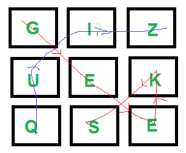

# Boggle(在字符板中查找所有可能的单词)| Set 1

> 原文:[https://www . geesforgeks . org/bogle-find-可能的单词-board-characters/](https://www.geeksforgeeks.org/boggle-find-possible-words-board-characters/)

给定一个字典，一个在字典中查找的方法和一个 M×N 板，其中每个单元格都有一个字符。找出所有可能由一系列相邻字符组成的单词。请注意，我们可以移动到 8 个相邻字符中的任何一个，但是一个单词不应该有同一个单元格的多个实例。
**例:**

```
Input: dictionary[] = {"GEEKS", "FOR", "QUIZ", "GO"};
       boggle[][]   = {{'G', 'I', 'Z'},
                       {'U', 'E', 'K'},
                       {'Q', 'S', 'E'}};
      isWord(str): returns true if str is present in dictionary
                   else false.

Output:  Following words of dictionary are present
         GEEKS
         QUIZ
```



### [我们强烈建议您点击此处进行练习，然后再进入解决方案。](https://practice.geeksforgeeks.org/problems/word-boggle4143/1)

这个想法是将每个字符都视为一个起始字符，并找到以它开头的所有单词。使用[深度优先遍历](https://www.geeksforgeeks.org/depth-first-traversal-for-a-graph/)可以找到从一个字符开始的所有单词。我们从每个单元开始进行深度优先遍历。我们跟踪被访问的单元格，以确保一个单元格在一个单词中只被考虑一次。

## C++

```
// C++ program for Boggle game
#include <cstring>
#include <iostream>
using namespace std;

#define M 3
#define N 3

// Let the given dictionary be following
string dictionary[] = { "GEEKS", "FOR", "QUIZ", "GO" };
int n = sizeof(dictionary) / sizeof(dictionary[0]);

// A given function to check if a given string is present in
// dictionary. The implementation is naive for simplicity. As
// per the question dictionary is given to us.
bool isWord(string& str)
{
    // Linearly search all words
    for (int i = 0; i < n; i++)
        if (str.compare(dictionary[i]) == 0)
            return true;
    return false;
}

// A recursive function to print all words present on boggle
void findWordsUtil(char boggle[M][N], bool visited[M][N], int i,
                   int j, string& str)
{
    // Mark current cell as visited and append current character
    // to str
    visited[i][j] = true;
    str = str + boggle[i][j];

    // If str is present in dictionary, then print it
    if (isWord(str))
        cout << str << endl;

    // Traverse 8 adjacent cells of boggle[i][j]
    for (int row = i - 1; row <= i + 1 && row < M; row++)
        for (int col = j - 1; col <= j + 1 && col < N; col++)
            if (row >= 0 && col >= 0 && !visited[row][col])
                findWordsUtil(boggle, visited, row, col, str);

    // Erase current character from string and mark visited
    // of current cell as false
    str.erase(str.length() - 1);
    visited[i][j] = false;
}

// Prints all words present in dictionary.
void findWords(char boggle[M][N])
{
    // Mark all characters as not visited
    bool visited[M][N] = { { false } };

    // Initialize current string
    string str = "";

    // Consider every character and look for all words
    // starting with this character
    for (int i = 0; i < M; i++)
        for (int j = 0; j < N; j++)
            findWordsUtil(boggle, visited, i, j, str);
}

// Driver program to test above function
int main()
{
    char boggle[M][N] = { { 'G', 'I', 'Z' },
                          { 'U', 'E', 'K' },
                          { 'Q', 'S', 'E' } };

    cout << "Following words of dictionary are present\n";
    findWords(boggle);
    return 0;
}
```

## Java 语言(一种计算机语言，尤用于创建网站)

```
// Java program for Boggle game
class GFG {
    // Let the given dictionary be following
    static final String dictionary[] = { "GEEKS", "FOR", "QUIZ", "GUQ", "EE" };
    static final int n = dictionary.length;
    static final int M = 3, N = 3;

    // A given function to check if a given string is present in
    // dictionary. The implementation is naive for simplicity. As
    // per the question dictionary is given to us.
    static boolean isWord(String str)
    {
        // Linearly search all words
        for (int i = 0; i < n; i++)
            if (str.equals(dictionary[i]))
                return true;
        return false;
    }

    // A recursive function to print all words present on boggle
    static void findWordsUtil(char boggle[][], boolean visited[][], int i,
                              int j, String str)
    {
        // Mark current cell as visited and append current character
        // to str
        visited[i][j] = true;
        str = str + boggle[i][j];

        // If str is present in dictionary, then print it
        if (isWord(str))
            System.out.println(str);

        // Traverse 8 adjacent cells of boggle[i][j]
        for (int row = i - 1; row <= i + 1 && row < M; row++)
            for (int col = j - 1; col <= j + 1 && col < N; col++)
                if (row >= 0 && col >= 0 && !visited[row][col])
                    findWordsUtil(boggle, visited, row, col, str);

        // Erase current character from string and mark visited
        // of current cell as false
        str = "" + str.charAt(str.length() - 1);
        visited[i][j] = false;
    }

    // Prints all words present in dictionary.
    static void findWords(char boggle[][])
    {
        // Mark all characters as not visited
        boolean visited[][] = new boolean[M][N];

        // Initialize current string
        String str = "";

        // Consider every character and look for all words
        // starting with this character
        for (int i = 0; i < M; i++)
            for (int j = 0; j < N; j++)
                findWordsUtil(boggle, visited, i, j, str);
    }

    // Driver program to test above function
    public static void main(String args[])
    {
        char boggle[][] = { { 'G', 'I', 'Z' },
                            { 'U', 'E', 'K' },
                            { 'Q', 'S', 'E' } };

        System.out.println("Following words of dictionary are present");
        findWords(boggle);
    }
}
```

## 蟒蛇 3

```
# Python3 program for Boggle game
# Let the given dictionary be following

dictionary = ["GEEKS", "FOR", "QUIZ", "GO"]
n = len(dictionary)
M = 3
N = 3

# A given function to check if a given string
# is present in dictionary. The implementation is
# naive for simplicity. As per the question
# dictionary is given to us.
def isWord(Str):

    # Linearly search all words
    for i in range(n):
        if (Str == dictionary[i]):
            return True
    return False

# A recursive function to print all words present on boggle
def findWordsUtil(boggle, visited, i, j, Str):
    # Mark current cell as visited and
    # append current character to str
    visited[i][j] = True
    Str = Str + boggle[i][j]

    # If str is present in dictionary,
    # then print it
    if (isWord(Str)):
        print(Str)

    # Traverse 8 adjacent cells of boggle[i,j]
    row = i - 1
    while row <= i + 1 and row < M:
        col = j - 1
        while col <= j + 1 and col < N:
            if (row >= 0 and col >= 0 and not visited[row][col]):
                findWordsUtil(boggle, visited, row, col, Str)
            col+=1
        row+=1

    # Erase current character from string and
    # mark visited of current cell as false
    Str = "" + Str[-1]
    visited[i][j] = False

# Prints all words present in dictionary.
def findWords(boggle):

    # Mark all characters as not visited
    visited = [[False for i in range(N)] for j in range(M)]

    # Initialize current string
    Str = ""

    # Consider every character and look for all words
    # starting with this character
    for i in range(M):
      for j in range(N):
        findWordsUtil(boggle, visited, i, j, Str)

# Driver Code
boggle = [["G", "I", "Z"], ["U", "E", "K"], ["Q", "S", "E"]]

print("Following words of", "dictionary are present")
findWords(boggle)

#  This code is contributed by divyesh072019.
```

## C#

```
// C# program for Boggle game
using System;
using System.Collections.Generic;

class GFG
{
    // Let the given dictionary be following
    static readonly String []dictionary = { "GEEKS", "FOR",
                                            "QUIZ", "GUQ", "EE" };
    static readonly int n = dictionary.Length;
    static readonly int M = 3, N = 3;

    // A given function to check if a given string
    // is present in dictionary. The implementation is
    // naive for simplicity. As per the question
    // dictionary is given to us.
    static bool isWord(String str)
    {
        // Linearly search all words
        for (int i = 0; i < n; i++)
            if (str.Equals(dictionary[i]))
                return true;
        return false;
    }

    // A recursive function to print all words present on boggle
    static void findWordsUtil(char [,]boggle, bool [,]visited,
                              int i, int j, String str)
    {
        // Mark current cell as visited and
        // append current character to str
        visited[i, j] = true;
        str = str + boggle[i, j];

        // If str is present in dictionary,
        // then print it
        if (isWord(str))
            Console.WriteLine(str);

        // Traverse 8 adjacent cells of boggle[i,j]
        for (int row = i - 1; row <= i + 1 && row < M; row++)
            for (int col = j - 1; col <= j + 1 && col < N; col++)
                if (row >= 0 && col >= 0 && !visited[row, col])
                    findWordsUtil(boggle, visited, row, col, str);

        // Erase current character from string and
        // mark visited of current cell as false
        str = "" + str[str.Length - 1];
        visited[i, j] = false;
    }

    // Prints all words present in dictionary.
    static void findWords(char [,]boggle)
    {
        // Mark all characters as not visited
        bool [,]visited = new bool[M, N];

        // Initialize current string
        String str = "";

        // Consider every character and look for all words
        // starting with this character
        for (int i = 0; i < M; i++)
            for (int j = 0; j < N; j++)
                findWordsUtil(boggle, visited, i, j, str);
    }

    // Driver Code
    public static void Main(String []args)
    {
        char [,]boggle = { { 'G', 'I', 'Z' },
                           { 'U', 'E', 'K' },
                           { 'Q', 'S', 'E' } };

        Console.WriteLine("Following words of " + 
                          "dictionary are present");
        findWords(boggle);
    }
}

// This code is contributed by PrinciRaj1992
```

## java 描述语言

```
<script>
      // JavaScript program for Boggle game
      // Let the given dictionary be following
      var dictionary = ["GEEKS", "FOR", "QUIZ", "GO"];
      var n = dictionary.length;
      var M = 3,
        N = 3;

      // A given function to check if a given string
      // is present in dictionary. The implementation is
      // naive for simplicity. As per the question
      // dictionary is given to us.
      function isWord(str)
      {

        // Linearly search all words
        for (var i = 0; i < n; i++) if (str == dictionary[i]) return true;
        return false;
      }

      // A recursive function to print all words present on boggle
      function findWordsUtil(boggle, visited, i, j, str)
      {

        // Mark current cell as visited and
        // append current character to str
        visited[i][j] = true;
        str = str + boggle[i][j];

        // If str is present in dictionary,
        // then print it
        if (isWord(str)) document.write(str + "<br>");

        // Traverse 8 adjacent cells of boggle[i,j]
        for (var row = i - 1; row <= i + 1 && row < M; row++)
          for (var col = j - 1; col <= j + 1 && col < N; col++)
            if (row >= 0 && col >= 0 && !visited[row][col])
              findWordsUtil(boggle, visited, row, col, str);

        // Erase current character from string and
        // mark visited of current cell as false
        str = "" + str[str.length - 1];
        visited[i][j] = false;
      }

      // Prints all words present in dictionary.
      function findWords(boggle)
      {

        // Mark all characters as not visited
        var visited = Array.from(Array(M), () => new Array(N).fill(0));

        // Initialize current string
        var str = "";

        // Consider every character and look for all words
        // starting with this character
        for (var i = 0; i < M; i++)
          for (var j = 0; j < N; j++) findWordsUtil(boggle, visited, i, j, str);
      }

      // Driver Code
      var boggle = [
        ["G", "I", "Z"],
        ["U", "E", "K"],
        ["Q", "S", "E"],
      ];

      document.write("Following words of " + "dictionary are present <br>");
      findWords(boggle);

      // This code is contributed by rdtank.
    </script>
```

**Output**

```
Following words of dictionary are present
GEEKS
QUIZ
```

请注意，上述解决方案可能会多次打印同一个单词。例如，如果我们在字典中添加“SEEK”，它会被打印多次。为了避免这种情况，我们可以使用哈希来跟踪所有打印的单词。
在下面的第 2 集，我们已经讨论了基于 Trie 的优化解决方案:
[**博格|第 2 集(使用 Trie)**](https://www.geeksforgeeks.org/boggle-set-2-using-trie/)
本文由**里沙布**供稿。如果你发现任何不正确的地方，或者你想分享更多关于上面讨论的话题的信息，请写评论。