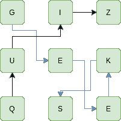

# 博格|第 2 集(使用特里)

> 原文:[https://www.geeksforgeeks.org/boggle-set-2-using-trie/](https://www.geeksforgeeks.org/boggle-set-2-using-trie/)

给定一个字典，一个在字典中查找的方法和一个 M×N 板，其中每个单元格都有一个字符。找出所有可能由一系列相邻字符组成的单词。请注意，我们可以移动到 8 个相邻字符中的任何一个，但是一个单词不应该有同一个单元格的多个实例。
**例:**

```
Input: dictionary[] = {"GEEKS", "FOR", "QUIZ", "GO"};
       boggle[][]   = {{'G', 'I', 'Z'},
                       {'U', 'E', 'K'},
                       {'Q', 'S', 'E'}};

Output: Following words of the dictionary are present
         GEEKS
         QUIZ

Explanation:
```



```
Input: dictionary[] = {"GEEKS", "ABCFIHGDE"};
       boggle[][]   = {{'A', 'B', 'C'},
                       {'D', 'E', 'F'},
                       {'G', 'H', 'I'}};
Output: Following words of the dictionary are present
         ABCFIHGDE
Explanation:
```


我们已经在下面的帖子中讨论了一个基于图形 DFS 的解决方案。
[博格勒(在字符板中查找所有可能的单词)|集合 1](https://www.geeksforgeeks.org/boggle-find-possible-words-board-characters/)
这里我们讨论一个基于[特里](https://www.geeksforgeeks.org/trie-insert-and-search/)的解决方案，它比基于 DFS 的解决方案更好。
给定词典词典[]= {“GEEKS”、“FOR”、“QUIZ”、“GO”}
1。创建一个空的 trie 并将给定词典的所有单词插入 trie

```
After insertion, Trie looks like(leaf nodes are in RED)
                       root
                    /       
                    G   F     Q
                 /  |   |     |
                O   E   O     U
                    |   |     |
                    E    R     I
                    |         |  
                    K         Z 
                    |   
                    S   
```

2.在此之后，我们只挑选了博格[][]中那些角色，它们是特里根的子代
让我们在上面挑选‘G’博格[0][0]，‘Q’博格[2][0](它们都存在于博格矩阵中)
3。在以我们在步骤 2
中选择的字符开头的 trie 中搜索一个单词

```
1) Create bool visited boolean matrix (Visited[M][N] = false )
2) Call SearchWord() for every cell (i, j) which has one of the
   first characters of dictionary words. In above example,
   we have 'G' and 'Q' as first characters.

SearchWord(Trie *root, i, j, visited[][N])
if root->leaf == true 
   print word 

if we have seen this element first time then make it visited.
   visited[i][j] = true
   do
      traverse all child of current root 
      k goes (0 to 26 ) [there are only 26 Alphabet] 
      add current char and search for next character 

      find next character which is adjacent to boggle[i][j]
      they are 8 adjacent cells of boggle[i][j] (i+1, j+1), 
      (i+1, j) (i-1, j) and so on.

   make it unvisited visited[i][j] = false 
```

以下是上述思路的实现:

## C++

```
// C++ program for Boggle game
#include <bits/stdc++.h>
using namespace std;

// Converts key current character into index
// use only 'A' through 'Z'
#define char_int(c) ((int)c - (int)'A')

// Alphabet size
#define SIZE (26)

#define M 3
#define N 3

// trie Node
struct TrieNode {
    TrieNode* Child[SIZE];

    // isLeaf is true if the node represents
    // end of a word
    bool leaf;
};

// Returns new trie node (initialized to NULLs)
TrieNode* getNode()
{
    TrieNode* newNode = new TrieNode;
    newNode->leaf = false;
    for (int i = 0; i < SIZE; i++)
        newNode->Child[i] = NULL;
    return newNode;
}

// If not present, inserts a key into the trie
// If the key is a prefix of trie node, just
// marks leaf node
void insert(TrieNode* root, char* Key)
{
    int n = strlen(Key);
    TrieNode* pChild = root;

    for (int i = 0; i < n; i++) {
        int index = char_int(Key[i]);

        if (pChild->Child[index] == NULL)
            pChild->Child[index] = getNode();

        pChild = pChild->Child[index];
    }

    // make last node as leaf node
    pChild->leaf = true;
}

// function to check that current location
// (i and j) is in matrix range
bool isSafe(int i, int j, bool visited[M][N])
{
    return (i >= 0 && i < M && j >= 0 && j < N && !visited[i][j]);
}

// A recursive function to print all words present on boggle
void searchWord(TrieNode* root, char boggle[M][N], int i,
                int j, bool visited[][N], string str)
{
    // if we found word in trie / dictionary
    if (root->leaf == true)
        cout << str << endl;

    // If both I and j in  range and we visited
    // that element of matrix first time
    if (isSafe(i, j, visited)) {
        // make it visited
        visited[i][j] = true;

        // traverse all childs of current root
        for (int K = 0; K < SIZE; K++) {
            if (root->Child[K] != NULL) {
                // current character
                char ch = (char)K + (char)'A';

                // Recursively search reaming character of word
                // in trie for all 8 adjacent cells of boggle[i][j]
                if (isSafe(i + 1, j + 1, visited)
                    && boggle[i + 1][j + 1] == ch)
                    searchWord(root->Child[K], boggle,
                               i + 1, j + 1, visited, str + ch);
                if (isSafe(i, j + 1, visited)
                    && boggle[i][j + 1] == ch)
                    searchWord(root->Child[K], boggle,
                               i, j + 1, visited, str + ch);
                if (isSafe(i - 1, j + 1, visited)
                    && boggle[i - 1][j + 1] == ch)
                    searchWord(root->Child[K], boggle,
                               i - 1, j + 1, visited, str + ch);
                if (isSafe(i + 1, j, visited)
                    && boggle[i + 1][j] == ch)
                    searchWord(root->Child[K], boggle,
                               i + 1, j, visited, str + ch);
                if (isSafe(i + 1, j - 1, visited)
                    && boggle[i + 1][j - 1] == ch)
                    searchWord(root->Child[K], boggle,
                               i + 1, j - 1, visited, str + ch);
                if (isSafe(i, j - 1, visited)
                    && boggle[i][j - 1] == ch)
                    searchWord(root->Child[K], boggle,
                               i, j - 1, visited, str + ch);
                if (isSafe(i - 1, j - 1, visited)
                    && boggle[i - 1][j - 1] == ch)
                    searchWord(root->Child[K], boggle,
                               i - 1, j - 1, visited, str + ch);
                if (isSafe(i - 1, j, visited)
                    && boggle[i - 1][j] == ch)
                    searchWord(root->Child[K], boggle,
                               i - 1, j, visited, str + ch);
            }
        }

        // make current element unvisited
        visited[i][j] = false;
    }
}

// Prints all words present in dictionary.
void findWords(char boggle[M][N], TrieNode* root)
{
    // Mark all characters as not visited
    bool visited[M][N];
    memset(visited, false, sizeof(visited));

    TrieNode* pChild = root;

    string str = "";

    // traverse all matrix elements
    for (int i = 0; i < M; i++) {
        for (int j = 0; j < N; j++) {
            // we start searching for word in dictionary
            // if we found a character which is child
            // of Trie root
            if (pChild->Child[char_int(boggle[i][j])]) {
                str = str + boggle[i][j];
                searchWord(pChild->Child[char_int(boggle[i][j])],
                           boggle, i, j, visited, str);
                str = "";
            }
        }
    }
}

// Driver program to test above function
int main()
{
    // Let the given dictionary be following
    char* dictionary[] = { "GEEKS", "FOR", "QUIZ", "GEE" };

    // root Node of trie
    TrieNode* root = getNode();

    // insert all words of dictionary into trie
    int n = sizeof(dictionary) / sizeof(dictionary[0]);
    for (int i = 0; i < n; i++)
        insert(root, dictionary[i]);

    char boggle[M][N] = { { 'G', 'I', 'Z' },
                          { 'U', 'E', 'K' },
                          { 'Q', 'S', 'E' } };

    findWords(boggle, root);

    return 0;
}
```

## Java 语言(一种计算机语言，尤用于创建网站)

```
// Java program for Boggle game
public class Boggle {

    // Alphabet size
    static final int SIZE = 26;

    static final int M = 3;
    static final int N = 3;

    // trie Node
    static class TrieNode {
        TrieNode[] Child = new TrieNode[SIZE];

        // isLeaf is true if the node represents
        // end of a word
        boolean leaf;

        // constructor
        public TrieNode()
        {
            leaf = false;
            for (int i = 0; i < SIZE; i++)
                Child[i] = null;
        }
    }

    // If not present, inserts a key into the trie
    // If the key is a prefix of trie node, just
    // marks leaf node
    static void insert(TrieNode root, String Key)
    {
        int n = Key.length();
        TrieNode pChild = root;

        for (int i = 0; i < n; i++) {
            int index = Key.charAt(i) - 'A';

            if (pChild.Child[index] == null)
                pChild.Child[index] = new TrieNode();

            pChild = pChild.Child[index];
        }

        // make last node as leaf node
        pChild.leaf = true;
    }

    // function to check that current location
    // (i and j) is in matrix range
    static boolean isSafe(int i, int j, boolean visited[][])
    {
        return (i >= 0 && i < M && j >= 0
                && j < N && !visited[i][j]);
    }

    // A recursive function to print
    // all words present on boggle
    static void searchWord(TrieNode root, char boggle[][], int i,
                           int j, boolean visited[][], String str)
    {
        // if we found word in trie / dictionary
        if (root.leaf == true)
            System.out.println(str);

        // If both I and j in  range and we visited
        // that element of matrix first time
        if (isSafe(i, j, visited)) {
            // make it visited
            visited[i][j] = true;

            // traverse all child of current root
            for (int K = 0; K < SIZE; K++) {
                if (root.Child[K] != null) {
                    // current character
                    char ch = (char)(K + 'A');

                    // Recursively search reaming character of word
                    // in trie for all 8 adjacent cells of
                    // boggle[i][j]
                    if (isSafe(i + 1, j + 1, visited)
                        && boggle[i + 1][j + 1] == ch)
                        searchWord(root.Child[K], boggle,
                                   i + 1, j + 1,
                                   visited, str + ch);
                    if (isSafe(i, j + 1, visited)
                        && boggle[i][j + 1] == ch)
                        searchWord(root.Child[K], boggle,
                                   i, j + 1,
                                   visited, str + ch);
                    if (isSafe(i - 1, j + 1, visited)
                        && boggle[i - 1][j + 1] == ch)
                        searchWord(root.Child[K], boggle,
                                   i - 1, j + 1,
                                   visited, str + ch);
                    if (isSafe(i + 1, j, visited)
                        && boggle[i + 1][j] == ch)
                        searchWord(root.Child[K], boggle,
                                   i + 1, j,
                                   visited, str + ch);
                    if (isSafe(i + 1, j - 1, visited)
                        && boggle[i + 1][j - 1] == ch)
                        searchWord(root.Child[K], boggle,
                                   i + 1, j - 1,
                                   visited, str + ch);
                    if (isSafe(i, j - 1, visited)
                        && boggle[i][j - 1] == ch)
                        searchWord(root.Child[K], boggle,
                                   i, j - 1,
                                   visited, str + ch);
                    if (isSafe(i - 1, j - 1, visited)
                        && boggle[i - 1][j - 1] == ch)
                        searchWord(root.Child[K], boggle,
                                   i - 1, j - 1,
                                   visited, str + ch);
                    if (isSafe(i - 1, j, visited)
                        && boggle[i - 1][j] == ch)
                        searchWord(root.Child[K], boggle,
                                   i - 1, j,
                                   visited, str + ch);
                }
            }

            // make current element unvisited
            visited[i][j] = false;
        }
    }

    // Prints all words present in dictionary.
    static void findWords(char boggle[][], TrieNode root)
    {
        // Mark all characters as not visited
        boolean[][] visited = new boolean[M][N];
        TrieNode pChild = root;

        String str = "";

        // traverse all matrix elements
        for (int i = 0; i < M; i++) {
            for (int j = 0; j < N; j++) {
                // we start searching for word in dictionary
                // if we found a character which is child
                // of Trie root
                if (pChild.Child[(boggle[i][j]) - 'A'] != null) {
                    str = str + boggle[i][j];
                    searchWord(pChild.Child[(boggle[i][j]) - 'A'],
                               boggle, i, j, visited, str);
                    str = "";
                }
            }
        }
    }

    // Driver program to test above function
    public static void main(String args[])
    {
        // Let the given dictionary be following
        String dictionary[] = { "GEEKS", "FOR", "QUIZ", "GEE" };

        // root Node of trie
        TrieNode root = new TrieNode();

        // insert all words of dictionary into trie
        int n = dictionary.length;
        for (int i = 0; i < n; i++)
            insert(root, dictionary[i]);

        char boggle[][] = { { 'G', 'I', 'Z' },
                            { 'U', 'E', 'K' },
                            { 'Q', 'S', 'E' } };

        findWords(boggle, root);
    }
}
// This code is contributed by Sumit Ghosh
```

## 蟒蛇 3

```
# Python program for Boggle game
class TrieNode:

    # Trie node class
    def __init__(self):
        self.children = [None] * 26

        # isEndOfWord is True if node represent the end of the word
        self.isEndOfWord = False

M = 3
N = 3
class Boogle:

    # Trie data structure class
    def __init__(self):
        self.root = self.getNode()

    def getNode(self):

        # Returns new trie node (initialized to NULLs)
        return TrieNode()

    def _charToIndex(self, ch):

        # private helper function
        # Converts key current character into index
        # use only 'A' through 'Z' and upper case
        return ord(ch) - ord('A')

    def insert(self, key):

        # If not present, inserts key into trie
        # If the key is prefix of trie node,
        # just marks leaf node
        pCrawl = self.root
        length = len(key)
        for level in range(length):
            index = self._charToIndex(key[level])

            # if current character is not present
            if not pCrawl.children[index]:

                pCrawl.children[index] = self.getNode()
            pCrawl = pCrawl.children[index]
            # print('h', self.root.children)

        # mark last node as leaf
        pCrawl.isEndOfWord = True

def is_Safe(i, j, vis):
    return 0 <= i < M and 0 <= j < N and not vis[i][j]

def search_word(root, boggle, i, j, vis, string):
    if root.isEndOfWord:
        print(string)

    if is_Safe(i, j, vis):
        vis[i][j] = True
        for K in range(26):
            if root.children[K] is not None:
                ch = chr(K+ord('A'))

                # Recursively search reaming character of word
                # in trie for all 8 adjacent cells of boggle[i][j]
                if is_Safe(i + 1, j + 1, vis) and boggle[i + 1][j + 1] == ch:
                    search_word(root.children[K], boggle,
                                i + 1, j + 1, vis, string + ch)
                if is_Safe(i, j + 1, vis) and boggle[i][j + 1] == ch:
                    search_word(root.children[K], boggle,
                                i, j + 1, vis, string + ch)
                if is_Safe(i - 1, j + 1, vis) and boggle[i - 1][j + 1] == ch:
                    search_word(root.children[K], boggle,
                                i - 1, j + 1, vis, string + ch)
                if is_Safe(i + 1, j, vis) and boggle[i + 1][j] == ch:
                    search_word(root.children[K], boggle,
                                i + 1, j, vis, string + ch)
                if is_Safe(i + 1, j - 1, vis) and boggle[i + 1][j - 1] == ch:
                    search_word(root.children[K], boggle,
                                i + 1, j - 1, vis, string + ch)
                if is_Safe(i, j - 1, vis) and boggle[i][j - 1] == ch:
                    search_word(root.children[K], boggle,
                                i, j - 1, vis, string + ch)
                if is_Safe(i - 1, j - 1, vis) and boggle[i - 1][j - 1] == ch:
                    search_word(root.children[K], boggle,
                                i - 1, j - 1, vis, string + ch)
                if is_Safe(i - 1, j, vis) and boggle[i - 1][j] == ch:
                    search_word(root.children[K], boggle,
                                i - 1, j, vis, string + ch)
                vis[i][j] = False

def char_int(ch):

    # private helper function
    # Converts key current character into index
    # use only 'A' through 'Z' and upper case
    return ord(ch) - ord('A')

def findWords(boggle, root):

    # Mark all characters as not visited
    visited = [[False for i in range(N)] for i in range(M)]

    pChild = root

    string = ""

    # traverse all matrix elements
    for i in range(M):
        for j in range(N):
            # we start searching for word in dictionary
            # if we found a character which is child
            # of Trie root
            if pChild.children[char_int(boggle[i][j])]:
                # print('h')
                string = string + boggle[i][j]
                search_word(pChild.children[char_int(boggle[i][j])],
                            boggle, i, j, visited, string)
                string = ""

dictionary = ["GEEKS", "FOR", "QUIZ", "GEE"]

# root Node of trie
t = Boogle()

# insert all words of dictionary into trie
n = len(dictionary)
for i in range(n):

    t.insert(dictionary[i])
root = t.root
boggle = [['G', 'I', 'Z'],
          ['U', 'E', 'K'],
          ['Q', 'S', 'E']]

# print(root.children)
findWords(boggle, root)

# This code is contributed by Yashwant Kumar
```

## C#

```
// C# program for Boggle game
using System;

public class Boggle {

    // Alphabet size
    static readonly int SIZE = 26;

    static readonly int M = 3;
    static readonly int N = 3;

    // trie Node
    public class TrieNode {
        public TrieNode[] Child = new TrieNode[SIZE];

        // isLeaf is true if the node represents
        // end of a word
        public bool leaf;

        // constructor
        public TrieNode()
        {
            leaf = false;
            for (int i = 0; i < SIZE; i++)
                Child[i] = null;
        }
    }

    // If not present, inserts a key into the trie
    // If the key is a prefix of trie node, just
    // marks leaf node
    static void insert(TrieNode root, String Key)
    {
        int n = Key.Length;
        TrieNode pChild = root;

        for (int i = 0; i < n; i++) {
            int index = Key[i] - 'A';

            if (pChild.Child[index] == null)
                pChild.Child[index] = new TrieNode();

            pChild = pChild.Child[index];
        }

        // make last node as leaf node
        pChild.leaf = true;
    }

    // function to check that current location
    // (i and j) is in matrix range
    static bool isSafe(int i, int j, bool[, ] visited)
    {
        return (i >= 0 && i < M && j >= 0 && j < N && !visited[i, j]);
    }

    // A recursive function to print all words present on boggle
    static void searchWord(TrieNode root, char[, ] boggle, int i,
                           int j, bool[, ] visited, String str)
    {
        // if we found word in trie / dictionary
        if (root.leaf == true)
            Console.WriteLine(str);

        // If both I and j in range and we visited
        // that element of matrix first time
        if (isSafe(i, j, visited)) {
            // make it visited
            visited[i, j] = true;

            // traverse all child of current root
            for (int K = 0; K < SIZE; K++) {
                if (root.Child[K] != null) {
                    // current character
                    char ch = (char)(K + 'A');

                    // Recursively search reaming character of word
                    // in trie for all 8 adjacent cells of
                    // boggle[i, j]
                    if (isSafe(i + 1, j + 1, visited) && boggle[i + 1, j + 1] == ch)
                        searchWord(root.Child[K], boggle, i + 1, j + 1,
                                   visited, str + ch);
                    if (isSafe(i, j + 1, visited) && boggle[i, j + 1] == ch)
                        searchWord(root.Child[K], boggle, i, j + 1,
                                   visited, str + ch);
                    if (isSafe(i - 1, j + 1, visited) && boggle[i - 1, j + 1] == ch)
                        searchWord(root.Child[K], boggle, i - 1, j + 1,
                                   visited, str + ch);
                    if (isSafe(i + 1, j, visited) && boggle[i + 1, j] == ch)
                        searchWord(root.Child[K], boggle, i + 1, j,
                                   visited, str + ch);
                    if (isSafe(i + 1, j - 1, visited) && boggle[i + 1, j - 1] == ch)
                        searchWord(root.Child[K], boggle, i + 1, j - 1,
                                   visited, str + ch);
                    if (isSafe(i, j - 1, visited) && boggle[i, j - 1] == ch)
                        searchWord(root.Child[K], boggle, i, j - 1,
                                   visited, str + ch);
                    if (isSafe(i - 1, j - 1, visited) && boggle[i - 1, j - 1] == ch)
                        searchWord(root.Child[K], boggle, i - 1, j - 1,
                                   visited, str + ch);
                    if (isSafe(i - 1, j, visited) && boggle[i - 1, j] == ch)
                        searchWord(root.Child[K], boggle, i - 1, j,
                                   visited, str + ch);
                }
            }

            // make current element unvisited
            visited[i, j] = false;
        }
    }

    // Prints all words present in dictionary.
    static void findWords(char[, ] boggle, TrieNode root)
    {
        // Mark all characters as not visited
        bool[, ] visited = new bool[M, N];
        TrieNode pChild = root;

        String str = "";

        // traverse all matrix elements
        for (int i = 0; i < M; i++) {
            for (int j = 0; j < N; j++) {
                // we start searching for word in dictionary
                // if we found a character which is child
                // of Trie root
                if (pChild.Child[(boggle[i, j]) - 'A'] != null) {
                    str = str + boggle[i, j];
                    searchWord(pChild.Child[(boggle[i, j]) - 'A'],
                               boggle, i, j, visited, str);
                    str = "";
                }
            }
        }
    }

    // Driver program to test above function
    public static void Main(String[] args)
    {
        // Let the given dictionary be following
        String[] dictionary = { "GEEKS", "FOR", "QUIZ", "GEE" };

        // root Node of trie
        TrieNode root = new TrieNode();

        // insert all words of dictionary into trie
        int n = dictionary.Length;
        for (int i = 0; i < n; i++)
            insert(root, dictionary[i]);

        char[, ] boggle = { { 'G', 'I', 'Z' },
                            { 'U', 'E', 'K' },
                            { 'Q', 'S', 'E' } };
        findWords(boggle, root);
    }
}

// This code has been contributed by 29AjayKumar
```

## java 描述语言

```
<script>
// Javascript program for Boggle game

// Alphabet size
let SIZE = 26;
let M = 3;
let N = 3;

 // trie Node
class TrieNode
{
    constructor()
    {
        this.leaf=false;
        this.Child = new Array(SIZE);
        for (let i = 0; i < SIZE; i++)
            this.Child[i]=null;
    }
}

// If not present, inserts a key into the trie
    // If the key is a prefix of trie node, just
    // marks leaf node
function insert(root,Key)
{
    let n = Key.length;
        let pChild = root;

        for (let i = 0; i < n; i++) {
            let index = Key[i].charCodeAt(0) - 'A'.charCodeAt(0);

            if (pChild.Child[index] == null)
                pChild.Child[index] = new TrieNode();

            pChild = pChild.Child[index];
        }

        // make last node as leaf node
        pChild.leaf = true;
}

// function to check that current location
    // (i and j) is in matrix range
function isSafe(i,j,visited)
{
    return (i >= 0 && i < M && j >= 0
                && j < N && !visited[i][j]);
}

// A recursive function to print
    // all words present on boggle
function searchWord(root,boggle,i,j,visited,str)
{
    // if we found word in trie / dictionary
        if (root.leaf == true)
            document.write(str+" <br>");

        // If both I and j in  range and we visited
        // that element of matrix first time
        if (isSafe(i, j, visited)) {
            // make it visited
            visited[i][j] = true;

            // traverse all child of current root
            for (let K = 0; K < SIZE; K++) {
                if (root.Child[K] != null) {
                    // current character
                    let ch = String.fromCharCode(K + 'A'.charCodeAt(0));

                    // Recursively search reaming character of word
                    // in trie for all 8 adjacent cells of
                    // boggle[i][j]
                    if (isSafe(i + 1, j + 1, visited)
                        && boggle[i + 1][j + 1] == ch)
                        searchWord(root.Child[K], boggle,
                                   i + 1, j + 1,
                                   visited, str + ch);
                    if (isSafe(i, j + 1, visited)
                        && boggle[i][j + 1] == ch)
                        searchWord(root.Child[K], boggle,
                                   i, j + 1,
                                   visited, str + ch);
                    if (isSafe(i - 1, j + 1, visited)
                        && boggle[i - 1][j + 1] == ch)
                        searchWord(root.Child[K], boggle,
                                   i - 1, j + 1,
                                   visited, str + ch);
                    if (isSafe(i + 1, j, visited)
                        && boggle[i + 1][j] == ch)
                        searchWord(root.Child[K], boggle,
                                   i + 1, j,
                                   visited, str + ch);
                    if (isSafe(i + 1, j - 1, visited)
                        && boggle[i + 1][j - 1] == ch)
                        searchWord(root.Child[K], boggle,
                                   i + 1, j - 1,
                                   visited, str + ch);
                    if (isSafe(i, j - 1, visited)
                        && boggle[i][j - 1] == ch)
                        searchWord(root.Child[K], boggle,
                                   i, j - 1,
                                   visited, str + ch);
                    if (isSafe(i - 1, j - 1, visited)
                        && boggle[i - 1][j - 1] == ch)
                        searchWord(root.Child[K], boggle,
                                   i - 1, j - 1,
                                   visited, str + ch);
                    if (isSafe(i - 1, j, visited)
                        && boggle[i - 1][j] == ch)
                        searchWord(root.Child[K], boggle,
                                   i - 1, j,
                                   visited, str + ch);
                }
            }

            // make current element unvisited
            visited[i][j] = false;
        }
}

// Prints all words present in dictionary.
function findWords(boggle,root)
{
    // Mark all characters as not visited
        let visited = new Array(M);
        for(let i=0;i<M;i++)
        {
            visited[i]=new Array(N);
            for(let j=0;j<N;j++)
            {
                visited[i][j]=false;
            }
        }
        let pChild = root;

        let str = "";

        // traverse all matrix elements
        for (let i = 0; i < M; i++) {
            for (let j = 0; j < N; j++) {
                // we start searching for word in dictionary
                // if we found a character which is child
                // of Trie root
                if (pChild.Child[(boggle[i][j]).charCodeAt(0) - 'A'.charCodeAt(0)] != null) {
                    str = str + boggle[i][j];
                    searchWord(pChild.Child[(boggle[i][j]).charCodeAt(0) - 'A'.charCodeAt(0)],
                               boggle, i, j, visited, str);
                    str = "";
                }
            }
        }
}

// Driver program to test above function
let dictionary=["GEEKS", "FOR", "QUIZ", "GEE" ];
// root Node of trie
let root = new TrieNode();

// insert all words of dictionary into trie
let n = dictionary.length;
for (let i = 0; i < n; i++)
    insert(root, dictionary[i]);

let boggle = [[ 'G', 'I', 'Z' ],
[ 'U', 'E', 'K' ],
[ 'Q', 'S', 'E' ]];

findWords(boggle, root);

// This code is contributed by rag2127
</script>
```

**输出:**

```
GEE, GEEKS, QUIZ
```

**复杂度分析:**

*   **时间复杂度:** O(4^(N^2)).
    即使在应用 trie 之后，时间复杂度仍然保持不变。每个细胞有 4 个方向，有 N^2 细胞。所以时间复杂度是 O(4^(N^2)).
*   **辅助空间:** O(N^2).
    递归的最大长度可以是 N^2，其中 n 是矩阵的边长。所以空间的复杂性是 O(N^2).

本文由 [**尼尚·辛格**](https://practice.geeksforgeeks.org/user-profile.php?user=_code) 供稿。如果你喜欢 GeeksforGeeks 并想投稿，你也可以使用[write.geeksforgeeks.org](https://write.geeksforgeeks.org)写一篇文章或者把你的文章邮寄到 review-team@geeksforgeeks.org。看到你的文章出现在极客博客主页上，帮助其他极客。
如果发现有不正确的地方，或者想分享更多关于上述话题的信息，请写评论。