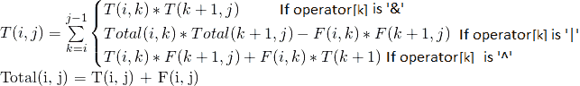
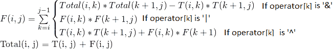

# 布尔圆括号问题| DP-37

> 原文:[https://www . geesforgeks . org/boolean-圆括号-problem-dp-37/](https://www.geeksforgeeks.org/boolean-parenthesization-problem-dp-37/)

给定一个带有下列符号的布尔表达式。

```
Symbols
    'T' ---> true 
    'F' ---> false 
```

和填充在符号之间的下列运算符

```
Operators
    &   ---> boolean AND
    |   ---> boolean OR
    ^   ---> boolean XOR 
```

数一数我们可以给表达式加上圆括号的方法，这样表达式的值就可以计算为真。
让输入以两个数组的形式出现，一个按顺序包含符号(t 和 f)，另一个包含运算符(&、|和^})

**示例:**

```
Input: symbol[]    = {T, F, T}
       operator[]  = {^, &}
Output: 2
The given expression is "T ^ F & T", it evaluates true
in two ways "((T ^ F) & T)" and "(T ^ (F & T))"

Input: symbol[]    = {T, F, F}
       operator[]  = {^, |}
Output: 2
The given expression is "T ^ F | F", it evaluates true
in two ways "( (T ^ F) | F )" and "( T ^ (F | F) )". 

Input: symbol[]    = {T, T, F, T}
       operator[]  = {|, &, ^}
Output: 4
The given expression is "T | T & F ^ T", it evaluates true
in 4 ways ((T|T)&(F^T)), (T|(T&(F^T))), (((T|T)&F)^T) 
and (T|((T&F)^T)). 
```

**解决方案:**
让 **<u>T(i，j)</u>** 表示在 I 和 j(包括 I 和 j)之间插入符号的方法数量，这样 I 和 j 之间的子表达式的计算结果为真。

![T(i,j)=\sum_{k=i}^{j-1}\begin{Bmatrix} T(i,k)*T(k+1,j) & if&operator&[k]is '\&'\\ Total(i,k)*Total(k+1,j)-F(i,k)*F(k+1,j) &if&operator&[k]&is'|' \\ T(i,k)*F(k+1,j)+F(i,k)*T(k+1,j) &if&operator&[k]&is '\oplus' \end{Bmatrix} Total(i,j)= T(i,j)+F(i,j)              ](img/4e8cca126d3223226bb19f8b248d602f.png "Rendered by QuickLaTeX.com")



让 **<u>F(i，j)</u>** 表示在 I 和 j(包括 I 和 j)之间插入符号的方法的数量，这样 I 和 j 之间的子表达式的计算结果为 false。
![F(i,j)=\sum_{k=i}^{j-1} \begin{Bmatrix} Total(i,k)*Total(k+1,j)-T(i,k)*T(k+1,j) & if&operator[k]&is'\&'\\ F(i,k)*F(k+1,j) &if&operator[k] &is'|' \\ T(i,k)*T(k+1,j)+F(i,k)*F(k+1,j) &if&operator[k]&is'\oplus' \end{Bmatrix} Total(i,j)=T(i,j)+F(i,j)              ](img/b574d7d7d56222dc85fbfb4aa1fb301c.png "Rendered by QuickLaTeX.com")



基本案例:

```
T(i, i) = 1 if symbol[i] = 'T' 
T(i, i) = 0 if symbol[i] = 'F' 

F(i, i) = 1 if symbol[i] = 'F' 
F(i, i) = 0 if symbol[i] = 'T'
```

如果我们画出上面递归解的递归树，我们可以观察到它有许多重叠的子问题。和其他[动态规划问题](https://www.geeksforgeeks.org/tag/dynamic-programming/)一样，可以通过自下而上的方式填表来解决。下面是动态编程解决方案的实现。

## C++

```
#include <cstring>
#include <iostream>
using namespace std;

// Returns count of all possible
// parenthesizations that lead
// to result true for a boolean
// expression with symbols like
// true and false and operators
// like &, | and ^ filled
// between symbols
int countParenth(char symb[], char oper[], int n)
{
    int F[n][n], T[n][n];

    // Fill diagonal entries first
    // All diagonal entries in
    // T[i][i] are 1 if symbol[i]
    // is T (true).  Similarly,
    // all F[i][i] entries are 1 if
    // symbol[i] is F (False)
    for (int i = 0; i < n; i++) {
        F[i][i] = (symb[i] == 'F') ? 1 : 0;
        T[i][i] = (symb[i] == 'T') ? 1 : 0;
    }

    // Now fill T[i][i+1],
    // T[i][i+2], T[i][i+3]... in order
    // And F[i][i+1], F[i][i+2],
    // F[i][i+3]... in order
    for (int gap = 1; gap < n; ++gap)
    {
        for (int i = 0, j = gap;
             j < n; ++i, ++j)
        {
            T[i][j] = F[i][j] = 0;
            for (int g = 0;
                 g < gap; g++)
            {
                // Find place of parenthesization using
                // current value of gap
                int k = i + g;

                // Store Total[i][k]
                // and Total[k+1][j]
                int tik = T[i][k] + F[i][k];
                int tkj = T[k + 1][j]
                  + F[k + 1][j];

                // Follow the recursive formulas
                // according
                // to the current operator
                if (oper[k] == '&') {
                    T[i][j] += T[i][k]
                            * T[k + 1][j];
                    F[i][j] += (tik * tkj
                                - T[i][k]
                                * T[k + 1][j]);
                }
                if (oper[k] == '|') {
                    F[i][j] += F[i][k]
                      * F[k + 1][j];
                    T[i][j] += (tik * tkj
                                - F[i][k]
                                * F[k + 1][j]);
                }
                if (oper[k] == '^') {
                    T[i][j] += F[i][k]
                      * T[k + 1][j]
                      + T[i][k]
                      * F[k + 1][j];
                    F[i][j] += T[i][k]
                            * T[k + 1][j]
                            + F[i][k] * F[k + 1][j];
                }
            }
        }
    }
    return T[0][n - 1];
}

// Driver code
int main()
{
    char symbols[] = "TTFT";
    char operators[] = "|&^";
    int n = strlen(symbols);

    // There are 4 ways
    // ((T|T)&(F^T)), (T|(T&(F^T))), (((T|T)&F)^T) and
    // (T|((T&F)^T))
    cout << countParenth(symbols, operators, n);
    return 0;
}
```

## Java 语言(一种计算机语言，尤用于创建网站)

```
class GFG {

    // Returns count of all possible
    // parenthesizations that lead to
    // result true for a boolean
    // expression with symbols like true
    // and false and operators like &, |
    // and ^ filled between symbols
    static int countParenth(char symb[],
                            char oper[],
                            int n)
    {
        int F[][] = new int[n][n];
        int T[][] = new int[n][n];

        // Fill diagonal entries first
        // All diagonal entries in T[i][i]
        // are 1 if symbol[i] is T (true).
        // Similarly, all F[i][i] entries
        // are 1 if symbol[i] is F (False)
        for (int i = 0; i < n; i++) {
            F[i][i] = (symb[i] == 'F') ? 1 : 0;
            T[i][i] = (symb[i] == 'T') ? 1 : 0;
        }

        // Now fill T[i][i+1], T[i][i+2],
        // T[i][i+3]... in order And F[i][i+1],
        // F[i][i+2], F[i][i+3]... in order
        for (int gap = 1; gap < n; ++gap)
        {
            for (int i = 0,
                 j = gap; j < n;
                 ++i, ++j)
            {
                T[i][j] = F[i][j] = 0;
                for (int g = 0; g < gap; g++)

                {
                    // Find place of parenthesization
                    // using current value of gap
                    int k = i + g;

                    // Store Total[i][k]
                    // and Total[k+1][j]
                    int tik = T[i][k]
                      + F[i][k];
                    int tkj = T[k + 1][j]
                      + F[k + 1][j];

                    // Follow the recursive formulas
                    // according to the current operator
                    if (oper[k] == '&')
                    {
                        T[i][j] += T[i][k]
                                * T[k + 1][j];
                        F[i][j]
                            += (tik * tkj
                                - T[i][k]
                                * T[k + 1][j]);
                    }
                    if (oper[k] == '|')
                    {
                        F[i][j] += F[i][k]
                                * F[k + 1][j];
                        T[i][j]
                            += (tik * tkj
                                - F[i][k]
                                * F[k + 1][j]);
                    }
                    if (oper[k] == '^')
                    {
                        T[i][j] += F[i][k]
                               * T[k + 1][j]
                                   + T[i][k]
                                   * F[k + 1][j];
                        F[i][j] += T[i][k]
                               * T[k + 1][j]
                                   + F[i][k]
                               * F[k + 1][j];
                    }
                }
            }
        }
        return T[0][n - 1];
    }

    // Driver code
    public static void main(String[] args)
    {
        char symbols[] = "TTFT".toCharArray();
        char operators[] = "|&^".toCharArray();
        int n = symbols.length;

        // There are 4 ways
        // ((T|T)&(F^T)), (T|(T&(F^T))),
        // (((T|T)&F)^T) and (T|((T&F)^T))
        System.out.println(
            countParenth(symbols, operators, n));
    }
}

// This code has been contributed
// by 29AjayKumar
```

## 计算机编程语言

```
# Returns count of all possible
# parenthesizations that lead to
# result true for a boolean
# expression with symbols like
# true and false and operators
# like &, | and ^ filled between symbols

def countParenth(symb, oper, n):
    F = [[0 for i in range(n + 1)]
         for i in range(n + 1)]
    T = [[0 for i in range(n + 1)]
         for i in range(n + 1)]

    # Fill diagonal entries first
    # All diagonal entries in
    # T[i][i] are 1 if symbol[i]
    # is T (true). Similarly, all
    # F[i][i] entries are 1 if
    # symbol[i] is F (False)
    for i in range(n):
        if symb[i] == 'F':
            F[i][i] = 1
        else:
            F[i][i] = 0

        if symb[i] == 'T':
            T[i][i] = 1
        else:
            T[i][i] = 0

    # Now fill T[i][i+1], T[i][i+2],
    # T[i][i+3]... in order And
    # F[i][i+1], F[i][i+2],
    # F[i][i+3]... in order
    for gap in range(1, n):
        i = 0
        for j in range(gap, n):
            T[i][j] = F[i][j] = 0
            for g in range(gap):

                # Find place of parenthesization
                # using current value of gap
                k = i + g

                # Store Total[i][k] and Total[k+1][j]
                tik = T[i][k] + F[i][k]
                tkj = T[k + 1][j] + F[k + 1][j]

                # Follow the recursive formulas
                # according to the current operator
                if oper[k] == '&':
                    T[i][j] += T[i][k] * T[k + 1][j]
                    F[i][j] += (tik * tkj - T[i][k] *
                                T[k + 1][j])
                if oper[k] == '|':
                    F[i][j] += F[i][k] * F[k + 1][j]
                    T[i][j] += (tik * tkj - F[i][k] *
                                F[k + 1][j])
                if oper[k] == '^':
                    T[i][j] += (F[i][k] * T[k + 1][j] +
                                T[i][k] * F[k + 1][j])
                    F[i][j] += (T[i][k] * T[k + 1][j] +
                                F[i][k] * F[k + 1][j])
            i += 1
    return T[0][n - 1]

# Driver Code
symbols = "TTFT"
operators = "|&^"
n = len(symbols)

# There are 4 ways
# ((T|T)&(F^T)), (T|(T&(F^T))),
# (((T|T)&F)^T) and (T|((T&F)^T))
print(countParenth(symbols, operators, n))

# This code is contributed by
# sahil shelangia
```

## C#

```
// C# program of above approach
using System;

class GFG
{

    // Returns count of all possible
    // parenthesizations that lead to
    // result true for a boolean
    // expression with symbols like true
    // and false and operators like &, |
    // and ^ filled between symbols
    static int countParenth(char []symb,
                    char []oper, int n)
    {
        int [,]F = new int[n, n];
        int [,]T = new int[n, n];

        // Fill diagonal entries first
        // All diagonal entries in T[i,i]
        // are 1 if symbol[i] is T (true).
        // Similarly, all F[i,i] entries
        // are 1 if symbol[i] is F (False)
        for (int i = 0; i < n; i++)
        {
            F[i,i] = (symb[i] == 'F') ? 1 : 0;
            T[i,i] = (symb[i] == 'T') ? 1 : 0;
        }

        // Now fill T[i,i+1], T[i,i+2],
        // T[i,i+3]... in order And F[i,i+1],
        // F[i,i+2], F[i,i+3]... in order
        for (int gap = 1; gap < n; ++gap)
        {
            for (int i = 0, j = gap; j < n; ++i, ++j)
            {
                T[i, j] = F[i, j] = 0;
                for (int g = 0; g < gap; g++)
                {
                    // Find place of parenthesization
                    // using current value of gap
                    int k = i + g;

                    // Store Total[i,k] and Total[k+1,j]
                    int tik = T[i, k] + F[i, k];
                    int tkj = T[k + 1, j] + F[k + 1, j];

                    // Follow the recursive formulas
                    // according to the current operator
                    if (oper[k] == '&')
                    {
                        T[i, j] += T[i, k]
                                * T[k + 1, j];
                        F[i, j] += (tik * tkj
                                - T[i, k] * T[k + 1, j]);
                    }
                    if (oper[k] == '|')
                    {
                        F[i,j] += F[i, k]
                          * F[k + 1, j];
                        T[i,j] += (tik
                               * tkj - F[i, k]
                                   * F[k + 1, j]);
                    }
                    if (oper[k] == '^')
                    {
                        T[i, j] += F[i, k] * T[k + 1, j] +
                                    T[i, k] * F[k + 1, j];
                        F[i, j] += T[i, k] * T[k + 1, j] +
                                    F[i, k] * F[k + 1, j];
                    }
                }
            }
        }
        return T[0,n - 1];
    }

    // Driver code
    public static void Main()
    {
        char []symbols = "TTFT".ToCharArray();
        char []operators = "|&^".ToCharArray();
        int n = symbols.Length;

        // There are 4 ways
        // ((T|T)&(F^T)), (T|(T&(F^T))),
        // (((T|T)&F)^T) and (T|((T&F)^T))
        Console.WriteLine(countParenth(symbols,
                            operators, n));
    }
}

/* This code contributed by PrinciRaj1992 */
```

## java 描述语言

```
<script>
    // Returns count of all possible
    // parenthesizations that lead to
    // result true for a boolean
    // expression with symbols like true
    // and false and operators like &, |
    // and ^ filled between symbols
    function countParenth(symb, oper, n)
    {
        let F = new Array(n);
        let T = new Array(n);

        for (let i = 0; i < n; i++)
        {
            F[i] = new Array(n);
            T[i] = new Array(n);
            for(let j = 0; j < n; j++)
            {
                F[i][j] = 0;
                T[i][j] = 0;
            }
        }

        // Fill diagonal entries first
        // All diagonal entries in T[i][i]
        // are 1 if symbol[i] is T (true).
        // Similarly, all F[i][i] entries
        // are 1 if symbol[i] is F (False)
        for (let i = 0; i < n; i++) {
            F[i][i] = (symb[i] == 'F') ? 1 : 0;
            T[i][i] = (symb[i] == 'T') ? 1 : 0;
        }

        // Now fill T[i][i+1], T[i][i+2],
        // T[i][i+3]... in order And F[i][i+1],
        // F[i][i+2], F[i][i+3]... in order
        for (let gap = 1; gap < n; ++gap)
        {
            for (let i = 0,
                 j = gap; j < n;
                 ++i, ++j)
            {
                T[i][j] = F[i][j] = 0;
                for (let g = 0; g < gap; g++)

                {
                    // Find place of parenthesization
                    // using current value of gap
                    let k = i + g;

                    // Store Total[i][k]
                    // and Total[k+1][j]
                    let tik = T[i][k]
                      + F[i][k];
                    let tkj = T[k + 1][j]
                      + F[k + 1][j];

                    // Follow the recursive formulas
                    // according to the current operator
                    if (oper[k] == '&')
                    {
                        T[i][j] += T[i][k]
                                * T[k + 1][j];
                        F[i][j]
                            += (tik * tkj
                                - T[i][k]
                                * T[k + 1][j]);
                    }
                    if (oper[k] == '|')
                    {
                        F[i][j] += F[i][k]
                                * F[k + 1][j];
                        T[i][j]
                            += (tik * tkj
                                - F[i][k]
                                * F[k + 1][j]);
                    }
                    if (oper[k] == '^')
                    {
                        T[i][j] += F[i][k]
                               * T[k + 1][j]
                                   + T[i][k]
                                   * F[k + 1][j];
                        F[i][j] += T[i][k]
                               * T[k + 1][j]
                                   + F[i][k]
                               * F[k + 1][j];
                    }
                }
            }
        }
        return T[0][n - 1];
    }

    let symbols = "TTFT".split('');
    let operators = "|&^".split('');
    let n = symbols.length;

    // There are 4 ways
    // ((T|T)&(F^T)), (T|(T&(F^T))),
    // (((T|T)&F)^T) and (T|((T&F)^T))
    document.write(countParenth(symbols, operators, n));

    // This code is contributed by mukesh07.
</script>
```

**输出:**

```
4
```

**时间复杂度:**O(n<sup>3</sup>)
T5】辅助空间: O(n <sup>2</sup>

**方法 2:**

我们也可以使用递归方法(自顶向下 dp)，这种方法使用记忆化。

## C++

```
#include <bits/stdc++.h>
using namespace std;

int dp[101][101][2];
int parenthesis_count(string s,
                      int i,
                      int j,
                      int isTrue)
{
    // Base Condition
    if (i > j)
        return false;
    if (i == j) {
        if (isTrue == 1)
            return s[i] == 'T';
        else
            return s[i] == 'F';
    }

    if (dp[i][j][isTrue] != -1)
        return dp[i][j][isTrue];
    int ans = 0;
    for (int k = i + 1
         ; k <= j - 1; k = k + 2)
    {
        int leftF, leftT, rightT, rightF;
        if (dp[i][k - 1][1] == -1)
        {
            leftT = parenthesis_count(s, i, k - 1, 1);
        } // Count no. of T in left partition
        else {
            leftT = dp[i][k - 1][1];
        }

        if (dp[k + 1][j][1] == -1)
        {
            rightT = parenthesis_count(s, k + 1, j, 1);
        } // Count no. of T in right partition
        else
        {
            rightT = dp[k + 1][j][1];
        }

        if (dp[i][k - 1][0] == -1)
        {
            // Count no. of F in left partition
            leftF = parenthesis_count(s, i, k - 1, 0);
        }
        else
        {
            leftF = dp[i][k - 1][0];
        }

        if (dp[k + 1][j][0] == -1)
        {
            // Count no. of F in right partition
            rightF = parenthesis_count(s, k + 1, j, 0);
        }
        else
        {
            rightF = dp[k + 1][j][0];
        }

        if (s[k] == '&')
        {
            if (isTrue == 1)
                ans += leftT * rightT;
            else
                ans += leftF * rightF + leftT * rightF
                       + leftF * rightT;
        }
        else if (s[k] == '|')
        {
            if (isTrue == 1)
                ans += leftT * rightT + leftT * rightF
                       + leftF * rightT;
            else
                ans = ans + leftF * rightF;
        }
        else if (s[k] == '^')
        {
            if (isTrue == 1)
                ans = ans + leftF * rightT + leftT * rightF;
            else
                ans = ans + leftT * rightT + leftF * rightF;
        }
        dp[i][j][isTrue] = ans;
    }
    return ans;
}

// Driver Code
int main()
{
    string symbols = "TTFT";
    string operators = "|&^";
    string s;
    int j = 0;

    for (int i = 0; i < symbols.length(); i++)
    {
        s.push_back(symbols[i]);
        if (j < operators.length())
            s.push_back(operators[j++]);
    }

    // We obtain the string  T|T&F^T
    int n = s.length();

    // There are 4 ways
    // ((T|T)&(F^T)), (T|(T&(F^T))), (((T|T)&F)^T) and
    // (T|((T&F)^T))
    memset(dp, -1, sizeof(dp));
    cout << parenthesis_count(s, 0, n - 1, 1);
    return 0;
}
```

## Java 语言(一种计算机语言，尤用于创建网站)

```
import java.io.*;
import java.util.*;

class GFG {
    public static int countWays(int N, String S)
    {
        int dp[][][] = new int[N + 1][N + 1][2];

        for (int row[][] : dp)
            for (int col[] : row)
                Arrays.fill(col, -1);
        return parenthesis_count(S, 0, N - 1, 1, dp);
    }

    public static int parenthesis_count(String str, int i,
                                        int j, int isTrue,
                                        int[][][] dp)
    {
        if (i > j)
            return 0;

        if (i == j)
        {
            if (isTrue == 1)
            {
                return (str.charAt(i) == 'T') ? 1 : 0;
            }
            else
            {
                return (str.charAt(i) == 'F') ? 1 : 0;
            }
        }

        if (dp[i][j][isTrue] != -1)
            return dp[i][j][isTrue];

        int temp_ans = 0;

        int leftTrue, rightTrue, leftFalse, rightFalse;

        for (int k = i + 1; k <= j - 1; k = k + 2)
        {

            if (dp[i][k - 1][1] != -1)
                leftTrue = dp[i][k - 1][1];
            else
            {
                // Count number of True in left Partition
                leftTrue = parenthesis_count(str, i, k - 1,
                                             1, dp);
            }
            if (dp[i][k - 1][0] != -1)
                leftFalse = dp[i][k - 1][0];
            else
            {

                // Count number of False in left Partition
                leftFalse = parenthesis_count(str, i, k - 1,
                                              0, dp);
            }
            if (dp[k + 1][j][1] != -1)
                rightTrue = dp[k + 1][j][1];
            else
            {

                // Count number of True in right Partition
                rightTrue = parenthesis_count(str, k + 1, j,
                                              1, dp);
            }
            if (dp[k + 1][j][0] != -1)
                rightFalse = dp[k + 1][j][0];
            else
            {

                // Count number of False in right Partition
                rightFalse = parenthesis_count(str, k + 1,
                                               j, 0, dp);
            }

            // Evaluate AND operation
            if (str.charAt(k) == '&')
            {
                if (isTrue == 1)
                {
                    temp_ans
                        = temp_ans + leftTrue * rightTrue;
                }
                else
                {
                    temp_ans = temp_ans
                               + leftTrue * rightFalse
                               + leftFalse * rightTrue
                               + leftFalse * rightFalse;
                }
            }
            // Evaluate OR operation
            else if (str.charAt(k) == '|')
            {
                if (isTrue == 1)
                {
                    temp_ans = temp_ans
                               + leftTrue * rightTrue
                               + leftTrue * rightFalse
                               + leftFalse * rightTrue;
                }
                else
                {
                    temp_ans
                        = temp_ans + leftFalse * rightFalse;
                }
            }

            // Evaluate XOR operation
            else if (str.charAt(k) == '^')
            {
                if (isTrue == 1)
                {
                    temp_ans = temp_ans
                               + leftTrue * rightFalse
                               + leftFalse * rightTrue;
                }
                else
                {
                    temp_ans = temp_ans
                               + leftTrue * rightTrue
                               + leftFalse * rightFalse;
                }
            }
            dp[i][j][isTrue] = temp_ans;
        }
        return temp_ans;
    }

  // Driver code
    public static void main(String[] args)
    {
        String symbols = "TTFT";
        String operators = "|&^";
        StringBuilder S = new StringBuilder();
        int j = 0;

        for (int i = 0; i < symbols.length(); i++)
        {
            S.append(symbols.charAt(i));
            if (j < operators.length())
                S.append(operators.charAt(j++));
        }

        // We obtain the string  T|T&F^T
        int N = S.length();

        // There are 4 ways
        // ((T|T)&(F^T)), (T|(T&(F^T))), (((T|T)&F)^T) and
        // (T|((T&F)^T))
        System.out.println(countWays(N, S.toString()));
    }
}

// This code is contributed by farheenbano.
```

## 蟒蛇 3

```
def parenthesis_count(Str, i, j, isTrue, dp) :

    if (i > j) :
      return 0

    if (i == j) :

      if (isTrue == 1) :

        return 1 if Str[i] == 'T' else 0

      else :

        return 1 if Str[i] == 'F' else 0

    if (dp[i][j][isTrue] != -1) :
      return dp[i][j][isTrue]

    temp_ans = 0

    for k in range(i + 1, j, 2) :

      if (dp[i][k - 1][1] != -1) :
        leftTrue = dp[i][k - 1][1]
      else :
        # Count number of True in left Partition
        leftTrue = parenthesis_count(Str, i, k - 1, 1, dp)

      if (dp[i][k - 1][0] != -1) :
        leftFalse = dp[i][k - 1][0]
      else :
        # Count number of False in left Partition
        leftFalse = parenthesis_count(Str, i, k - 1, 0, dp)

      if (dp[k + 1][j][1] != -1) :
        rightTrue = dp[k + 1][j][1]
      else :
        # Count number of True in right Partition
        rightTrue = parenthesis_count(Str, k + 1, j, 1, dp)

      if (dp[k + 1][j][0] != -1) :
        rightFalse = dp[k + 1][j][0]
      else :
        # Count number of False in right Partition
        rightFalse = parenthesis_count(Str, k + 1, j, 0, dp)

      # Evaluate AND operation
      if (Str[k] == '&') :
        if (isTrue == 1) :
          temp_ans = temp_ans + leftTrue * rightTrue
        else :
          temp_ans = temp_ans + leftTrue * rightFalse + leftFalse * rightTrue + leftFalse * rightFalse
      # Evaluate OR operation
      elif (Str[k] == '|') :
        if (isTrue == 1) :
          temp_ans = temp_ans + leftTrue * rightTrue + leftTrue * rightFalse + leftFalse * rightTrue
        else :
          temp_ans = temp_ans + leftFalse * rightFalse

      # Evaluate XOR operation
      elif (Str[k] == '^') :
        if (isTrue == 1) :
          temp_ans = temp_ans + leftTrue * rightFalse + leftFalse * rightTrue
        else :
          temp_ans = temp_ans + leftTrue * rightTrue + leftFalse * rightFalse
      dp[i][j][isTrue] = temp_ans

    return temp_ans

def countWays(N, S) :

    dp = [[[-1 for k in range(2)] for i in range(N + 1)] for j in range(N + 1)]
    return parenthesis_count(S, 0, N - 1, 1, dp)

symbols = "TTFT"
operators = "|&^"
S = ""
j = 0
for i in range(len(symbols)) :

  S = S + symbols[i]
  if (j < len(operators)) :
    S = S + operators[j]
    j += 1

# We obtain the string  T|T&F^T
N = len(S)

# There are 4 ways
# ((T|T)&(F^T)), (T|(T&(F^T))), (((T|T)&F)^T) and
# (T|((T&F)^T))
print(countWays(N, S))

# This code is contributed by divyesh072019
```

## C#

```
using System;
class GFG
{

  static int parenthesis_count(string str, int i,
                               int j, int isTrue,
                               int[,,] dp)
  {
    if (i > j)
      return 0;

    if (i == j)
    {
      if (isTrue == 1)
      {
        return (str[i] == 'T') ? 1 : 0;
      }
      else
      {
        return (str[i] == 'F') ? 1 : 0;
      }
    }

    if (dp[i, j, isTrue] != -1)
      return dp[i, j, isTrue];

    int temp_ans = 0;

    int leftTrue, rightTrue, leftFalse, rightFalse;

    for (int k = i + 1; k <= j - 1; k = k + 2)
    {

      if (dp[i, k - 1, 1] != -1)
        leftTrue = dp[i, k - 1, 1];
      else
      {
        // Count number of True in left Partition
        leftTrue = parenthesis_count(str, i, k - 1, 1, dp);
      }
      if (dp[i, k - 1, 0] != -1)
        leftFalse = dp[i, k - 1, 0];
      else
      {

        // Count number of False in left Partition
        leftFalse = parenthesis_count(str, i, k - 1, 0, dp);
      }
      if (dp[k + 1, j, 1] != -1)
        rightTrue = dp[k + 1, j, 1];
      else
      {

        // Count number of True in right Partition
        rightTrue = parenthesis_count(str, k + 1, j,
                                      1, dp);
      }
      if (dp[k + 1, j, 0] != -1)
        rightFalse = dp[k + 1, j, 0];
      else
      {

        // Count number of False in right Partition
        rightFalse = parenthesis_count(str, k + 1,
                                       j, 0, dp);
      }

      // Evaluate AND operation
      if (str[k] == '&')
      {
        if (isTrue == 1)
        {
          temp_ans
            = temp_ans + leftTrue * rightTrue;
        }
        else
        {
          temp_ans = temp_ans
            + leftTrue * rightFalse
            + leftFalse * rightTrue
            + leftFalse * rightFalse;
        }
      }
      // Evaluate OR operation
      else if (str[k] == '|')
      {
        if (isTrue == 1)
        {
          temp_ans = temp_ans
            + leftTrue * rightTrue
            + leftTrue * rightFalse
            + leftFalse * rightTrue;
        }
        else
        {
          temp_ans
            = temp_ans + leftFalse * rightFalse;
        }
      }

      // Evaluate XOR operation
      else if (str[k] == '^')
      {
        if (isTrue == 1)
        {
          temp_ans = temp_ans
            + leftTrue * rightFalse
            + leftFalse * rightTrue;
        }
        else
        {
          temp_ans = temp_ans
            + leftTrue * rightTrue
            + leftFalse * rightFalse;
        }
      }
      dp[i, j, isTrue] = temp_ans;
    }
    return temp_ans;
  }

  static int countWays(int N, string S)
  {
    int[,,] dp = new int[N + 1, N + 1, 2];
    for(int i = 0; i < (N + 1); i++)
    {
      for(int j = 0; j < (N + 1); j++)
      {
        for(int k = 0; k < 2; k++)
        {
          dp[i, j, k] = -1;
        }
      }
    }
    return parenthesis_count(S, 0, N - 1, 1, dp);
  }

  // Driver code
  static void Main()
  {
    string symbols = "TTFT";
    string operators = "|&^";
    string S = "";
    int j = 0;
    for (int i = 0; i < symbols.Length; i++)
    {
      S = S + symbols[i];
      if (j < operators.Length)
        S = S + operators[j++];
    }

    // We obtain the string  T|T&F^T
    int N = S.Length;

    // There are 4 ways
    // ((T|T)&(F^T)), (T|(T&(F^T))), (((T|T)&F)^T) and
    // (T|((T&F)^T))
    Console.WriteLine(countWays(N, S));
  }
}

// This code is contributed by divyeshrabadiya07.
```

## java 描述语言

```
<script>

function countWays(N, S)
{
    let dp = new Array(N + 1);
    for(let i = 0; i < N + 1; i++)
    {
        dp[i] = new Array(N+1);
        for(let j = 0; j < N + 1;j++)
        {
            dp[i][j] = new Array(2);
            for(let k = 0; k < 2; k++)
                dp[i][j][k] = -1;
        }
    }

        return parenthesis_count(S, 0, N - 1, 1, dp);
}

function parenthesis_count(str, i, j, isTrue, dp)
{
    if (i > j)
            return 0;

        if (i == j)
        {
            if (isTrue == 1)
            {
                return (str[i] == 'T') ? 1 : 0;
            }
            else
            {
                return (str[i] == 'F') ? 1 : 0;
            }
        }

        if (dp[i][j][isTrue] != -1)
            return dp[i][j][isTrue];

        let temp_ans = 0;

        let leftTrue, rightTrue, leftFalse, rightFalse;

        for (let k = i + 1; k <= j - 1; k = k + 2)
        {

            if (dp[i][k - 1][1] != -1)
                leftTrue = dp[i][k - 1][1];
            else
            {
                // Count number of True in left Partition
                leftTrue = parenthesis_count(str, i, k - 1,
                                             1, dp);
            }
            if (dp[i][k - 1][0] != -1)
                leftFalse = dp[i][k - 1][0];
            else
            {

                // Count number of False in left Partition
                leftFalse = parenthesis_count(str, i, k - 1,
                                              0, dp);
            }
            if (dp[k + 1][j][1] != -1)
                rightTrue = dp[k + 1][j][1];
            else
            {

                // Count number of True in right Partition
                rightTrue = parenthesis_count(str, k + 1, j,
                                              1, dp);
            }
            if (dp[k + 1][j][0] != -1)
                rightFalse = dp[k + 1][j][0];
            else
            {

                // Count number of False in right Partition
                rightFalse = parenthesis_count(str, k + 1,
                                               j, 0, dp);
            }

            // Evaluate AND operation
            if (str[k] == '&')
            {
                if (isTrue == 1)
                {
                    temp_ans
                        = temp_ans + leftTrue * rightTrue;
                }
                else
                {
                    temp_ans = temp_ans
                               + leftTrue * rightFalse
                               + leftFalse * rightTrue
                               + leftFalse * rightFalse;
                }
            }
            // Evaluate OR operation
            else if (str[k] == '|')
            {
                if (isTrue == 1)
                {
                    temp_ans = temp_ans
                               + leftTrue * rightTrue
                               + leftTrue * rightFalse
                               + leftFalse * rightTrue;
                }
                else
                {
                    temp_ans
                        = temp_ans + leftFalse * rightFalse;
                }
            }

            // Evaluate XOR operation
            else if (str[k] == '^')
            {
                if (isTrue == 1)
                {
                    temp_ans = temp_ans
                               + leftTrue * rightFalse
                               + leftFalse * rightTrue;
                }
                else
                {
                    temp_ans = temp_ans
                               + leftTrue * rightTrue
                               + leftFalse * rightFalse;
                }
            }
            dp[i][j][isTrue] = temp_ans;
        }
        return temp_ans;
}

 // Driver code
let symbols = "TTFT";
let operators = "|&^";
let S = [];
let j = 0;

for (let i = 0; i < symbols.length; i++)
{
    S.push(symbols[i]);
    if (j < operators.length)
        S.push(operators[j++]);
}

// We obtain the string  T|T&F^T
let N = S.length;

// There are 4 ways
// ((T|T)&(F^T)), (T|(T&(F^T))), (((T|T)&F)^T) and
// (T|((T&F)^T))
document.write(countWays(N, S.join("")));

// This code is contributed by avanitrachhadiya2155
</script>
```

**Output**

```
4
```

**参考文献:**
[【http://people.cs.clemson.edu/~bcdean/dp_practice/dp_9.swf】](http://people.cs.clemson.edu/~bcdean/dp_practice/dp_9.swf)
如发现有不正确的地方，请写评论，或者想分享以上讨论话题的更多信息