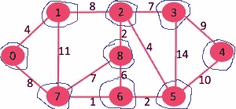
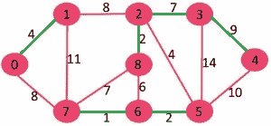
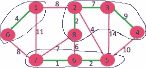
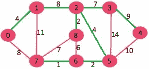

# 博鲁夫卡算法|贪婪算法-9

> 原文:[https://www . geesforgeks . org/boruvkas-algorithm-greedy-algo-9/](https://www.geeksforgeeks.org/boruvkas-algorithm-greedy-algo-9/)

我们已经讨论了以下关于最小生成树的主题。

[最小生成树问题的应用](https://www.geeksforgeeks.org/applications-of-minimum-spanning-tree/)
[克鲁斯卡尔最小生成树算法](https://www.geeksforgeeks.org/greedy-algorithms-set-2-kruskals-minimum-spanning-tree-mst/)
[普里姆最小生成树算法](https://www.geeksforgeeks.org/greedy-algorithms-set-5-prims-minimum-spanning-tree-mst-2/)

在这篇文章中，讨论了博鲁瓦卡的算法。和 Prim 和 Kruskal 的算法一样，Boruvka 的算法也是一个 Greedy 算法。下面是完整的算法。

```
1) Input is a connected, weighted and un-directed graph.
2) Initialize all vertices as individual components (or sets).
3) Initialize MST as empty.
4) While there are more than one components, do following
   for each component.
      a)  Find the closest weight edge that connects this 
          component to any other component.
      b)  Add this closest edge to MST if not already added.  
5) Return MST.

```

以下是上述算法背后的思路(思路与 [Prim 的 MST 算法](https://www.geeksforgeeks.org/greedy-algorithms-set-5-prims-minimum-spanning-tree-mst-2/)相同)。

*生成树意味着所有的顶点都必须是连通的。因此，两个不相交的顶点子集(上面讨论过)必须连接起来才能构成生成树。并且它们必须与最小权边连接，使其成为最小生成树。*

让我们用下面的例子来理解这个算法。

[](https://media.geeksforgeeks.org/wp-content/cdn-uploads/Fig-0.jpg) 
最初 MST 为空。每个顶点都是单个组件，如下图中蓝色突出显示。
[](https://media.geeksforgeeks.org/wp-content/cdn-uploads/4.jpg)

对于每个组件，找到将其连接到其他组件的最便宜的边。

```
Component                Cheapest Edge that connects 
                         it to some other component
  {0}                           0-1
  {1}                           0-1
  {2}                           2-8
  {3}                           2-3
  {4}                           3-4
  {5}                           5-6
  {6}                           6-7
  {7}                           6-7
  {8}                           2-8 
```

最便宜的边缘用绿色突出显示。现在 MST 变成了{0-1，2-8，2-3，3-4，5-6，6-7}。
[](https://media.geeksforgeeks.org/wp-content/cdn-uploads/13.jpg) 
经过以上步骤，组件为{{0，1}、{2，3，4，8}、{5，6，7}}。组件被蓝色包围。
[](https://media.geeksforgeeks.org/wp-content/cdn-uploads/131.jpg)

我们再次重复该步骤，即对于每个组件，找到将其连接到某个其他组件的最便宜的边。

```
Component                Cheapest Edge that connects 
                         it to some other component
  {0,1}                        1-2 (or 0-7)
  {2,3,4,8}                    2-5
  {5,6,7}                      2-5
```

最便宜的边缘用绿色突出显示。现在 MST 变成了{0-1，2-8，2-3，3-4，5-6，6-7，1-2，2-5}
[](https://media.geeksforgeeks.org/wp-content/cdn-uploads/14.jpg)

在这个阶段，只有一个组件{0，1，2，3，4，5，6，7，8}具有所有边。由于只剩下一个组件，我们停止并返回 MST。

**实现:**
下面是上面算法的实现。输入图形表示为边的集合，[联合查找数据结构](https://www.geeksforgeeks.org/union-find-algorithm-set-2-union-by-rank/)用于跟踪组件。

## C/C++

```
// Boruvka's algorithm to find Minimum Spanning
// Tree of a given connected, undirected and
// weighted graph
#include <stdio.h>

// a structure to represent a weighted edge in graph
struct Edge
{
    int src, dest, weight;
};

// a structure to represent a connected, undirected
// and weighted graph as a collection of edges.
struct Graph
{
    // V-> Number of vertices, E-> Number of edges
    int V, E;

    // graph is represented as an array of edges.
    // Since the graph is undirected, the edge
    // from src to dest is also edge from dest
    // to src. Both are counted as 1 edge here.
    Edge* edge;
};

// A structure to represent a subset for union-find
struct subset
{
    int parent;
    int rank;
};

// Function prototypes for union-find (These functions are defined
// after boruvkaMST() )
int find(struct subset subsets[], int i);
void Union(struct subset subsets[], int x, int y);

// The main function for MST using Boruvka's algorithm
void boruvkaMST(struct Graph* graph)
{
    // Get data of given graph
    int V = graph->V, E = graph->E;
    Edge *edge = graph->edge;

    // Allocate memory for creating V subsets.
    struct subset *subsets = new subset[V];

    // An array to store index of the cheapest edge of
    // subset.  The stored index for indexing array 'edge[]'
    int *cheapest = new int[V];

    // Create V subsets with single elements
    for (int v = 0; v < V; ++v)
    {
        subsets[v].parent = v;
        subsets[v].rank = 0;
        cheapest[v] = -1;
    }

    // Initially there are V different trees.
    // Finally there will be one tree that will be MST
    int numTrees = V;
    int MSTweight = 0;

    // Keep combining components (or sets) until all
    // compnentes are not combined into single MST.
    while (numTrees > 1)
    {
         // Everytime initialize cheapest array
          for (int v = 0; v < V; ++v)
           {
               cheapest[v] = -1;
           }

        // Traverse through all edges and update
        // cheapest of every component
        for (int i=0; i<E; i++)
        {
            // Find components (or sets) of two corners
            // of current edge
            int set1 = find(subsets, edge[i].src);
            int set2 = find(subsets, edge[i].dest);

            // If two corners of current edge belong to
            // same set, ignore current edge
            if (set1 == set2)
                continue;

            // Else check if current edge is closer to previous
            // cheapest edges of set1 and set2
            else
            {
               if (cheapest[set1] == -1 ||
                   edge[cheapest[set1]].weight > edge[i].weight)
                 cheapest[set1] = i;

               if (cheapest[set2] == -1 ||
                   edge[cheapest[set2]].weight > edge[i].weight)
                 cheapest[set2] = i;
            }
        }

        // Consider the above picked cheapest edges and add them
        // to MST
        for (int i=0; i<V; i++)
        {
            // Check if cheapest for current set exists
            if (cheapest[i] != -1)
            {
                int set1 = find(subsets, edge[cheapest[i]].src);
                int set2 = find(subsets, edge[cheapest[i]].dest);

                if (set1 == set2)
                    continue;
                MSTweight += edge[cheapest[i]].weight;
                printf("Edge %d-%d included in MST\n",
                       edge[cheapest[i]].src, edge[cheapest[i]].dest);

                // Do a union of set1 and set2 and decrease number
                // of trees
                Union(subsets, set1, set2);
                numTrees--;
            }
        }
    }

    printf("Weight of MST is %d\n", MSTweight);
    return;
}

// Creates a graph with V vertices and E edges
struct Graph* createGraph(int V, int E)
{
    Graph* graph = new Graph;
    graph->V = V;
    graph->E = E;
    graph->edge = new Edge[E];
    return graph;
}

// A utility function to find set of an element i
// (uses path compression technique)
int find(struct subset subsets[], int i)
{
    // find root and make root as parent of i
    // (path compression)
    if (subsets[i].parent != i)
      subsets[i].parent =
             find(subsets, subsets[i].parent);

    return subsets[i].parent;
}

// A function that does union of two sets of x and y
// (uses union by rank)
void Union(struct subset subsets[], int x, int y)
{
    int xroot = find(subsets, x);
    int yroot = find(subsets, y);

    // Attach smaller rank tree under root of high
    // rank tree (Union by Rank)
    if (subsets[xroot].rank < subsets[yroot].rank)
        subsets[xroot].parent = yroot;
    else if (subsets[xroot].rank > subsets[yroot].rank)
        subsets[yroot].parent = xroot;

    // If ranks are same, then make one as root and
    // increment its rank by one
    else
    {
        subsets[yroot].parent = xroot;
        subsets[xroot].rank++;
    }
}

// Driver program to test above functions
int main()
{
    /* Let us create following weighted graph
             10
        0--------1
        |  \     |
       6|   5\   |15
        |      \ |
        2--------3
            4       */
    int V = 4;  // Number of vertices in graph
    int E = 5;  // Number of edges in graph
    struct Graph* graph = createGraph(V, E);

    // add edge 0-1
    graph->edge[0].src = 0;
    graph->edge[0].dest = 1;
    graph->edge[0].weight = 10;

    // add edge 0-2
    graph->edge[1].src = 0;
    graph->edge[1].dest = 2;
    graph->edge[1].weight = 6;

    // add edge 0-3
    graph->edge[2].src = 0;
    graph->edge[2].dest = 3;
    graph->edge[2].weight = 5;

    // add edge 1-3
    graph->edge[3].src = 1;
    graph->edge[3].dest = 3;
    graph->edge[3].weight = 15;

    // add edge 2-3
    graph->edge[4].src = 2;
    graph->edge[4].dest = 3;
    graph->edge[4].weight = 4;

    boruvkaMST(graph);

    return 0;
}

// Thanks to Anukul Chand for modifying above code.
```

## 计算机编程语言

```
# Boruvka's algorithm to find Minimum Spanning
# Tree of a given connected, undirected and weighted graph

from collections import defaultdict

#Class to represent a graph
class Graph:

    def __init__(self,vertices):
        self.V= vertices #No. of vertices
        self.graph = [] # default dictionary to store graph

    # function to add an edge to graph
    def addEdge(self,u,v,w):
        self.graph.append([u,v,w])

    # A utility function to find set of an element i
    # (uses path compression technique)
    def find(self, parent, i):
        if parent[i] == i:
            return i
        return self.find(parent, parent[i])

    # A function that does union of two sets of x and y
    # (uses union by rank)
    def union(self, parent, rank, x, y):
        xroot = self.find(parent, x)
        yroot = self.find(parent, y)

        # Attach smaller rank tree under root of high rank tree
        # (Union by Rank)
        if rank[xroot] < rank[yroot]:
            parent[xroot] = yroot
        elif rank[xroot] > rank[yroot]:
            parent[yroot] = xroot
        #If ranks are same, then make one as root and increment
        # its rank by one
        else :
            parent[yroot] = xroot
            rank[xroot] += 1

    # The main function to construct MST using Kruskal's algorithm
    def boruvkaMST(self):
        parent = []; rank = []; 

        # An array to store index of the cheapest edge of
        # subset. It store [u,v,w] for each component
        cheapest =[]

        # Initially there are V different trees.
        # Finally there will be one tree that will be MST
        numTrees = self.V
        MSTweight = 0

        # Create V subsets with single elements
        for node in range(self.V):
            parent.append(node)
            rank.append(0)
            cheapest =[-1] * self.V

        # Keep combining components (or sets) until all
        # compnentes are not combined into single MST

        while numTrees > 1:

            # Traverse through all edges and update
               # cheapest of every component
            for i in range(len(self.graph)):

                # Find components (or sets) of two corners
                # of current edge
                u,v,w =  self.graph[i]
                set1 = self.find(parent, u)
                set2 = self.find(parent ,v)

                # If two corners of current edge belong to
                # same set, ignore current edge. Else check if 
                # current edge is closer to previous
                # cheapest edges of set1 and set2
                if set1 != set2:     

                    if cheapest[set1] == -1 or cheapest[set1][2] > w :
                        cheapest[set1] = [u,v,w] 

                    if cheapest[set2] == -1 or cheapest[set2][2] > w :
                        cheapest[set2] = [u,v,w]

            # Consider the above picked cheapest edges and add them
            # to MST
            for node in range(self.V):

                #Check if cheapest for current set exists
                if cheapest[node] != -1:
                    u,v,w = cheapest[node]
                    set1 = self.find(parent, u)
                    set2 = self.find(parent ,v)

                    if set1 != set2 :
                        MSTweight += w
                        self.union(parent, rank, set1, set2)
                        print ("Edge %d-%d with weight %d included in MST" % (u,v,w))
                        numTrees = numTrees - 1

            #reset cheapest array
            cheapest =[-1] * self.V

        print ("Weight of MST is %d" % MSTweight)

g = Graph(4)
g.addEdge(0, 1, 10)
g.addEdge(0, 2, 6)
g.addEdge(0, 3, 5)
g.addEdge(1, 3, 15)
g.addEdge(2, 3, 4)

g.boruvkaMST()

#This code is contributed by Neelam Yadav
```

Output:

```
Edge 0-3 included in MST
Edge 0-1 included in MST
Edge 2-3 included in MST
Weight of MST is 19
```

**关于 Boruvka 算法的有趣事实:**
1)Boruvka 算法的时间复杂度为 O(E log V)，与 Kruskal 和 Prim 算法相同。

2) Boruvka 的算法被用作在线性时间 O(E) 工作的[更快随机化算法中的一个步骤。](http://en.wikipedia.org/wiki/Expected_linear_time_MST_algorithm)

3) Boruvka 算法是最古老的最小生成树算法，是 Boruuvka 在 1926 年发现的，远在计算机出现之前。该算法被公布为一种构建高效电力网络的方法。

**练习:**
上面的代码假设输入图是连通的，如果给定的是一个不连通的图，那么就会失败。扩展上述算法，使其也适用于断开连接的图，并生成一个森林。

**参考文献:**
[http://en.wikipedia.org/wiki/Bor%C5%AFvka%27s_algorithm](http://en.wikipedia.org/wiki/Bor%C5%AFvka%27s_algorithm)

如果您发现任何不正确的地方，或者您想分享关于上面讨论的主题的更多信息，请写评论