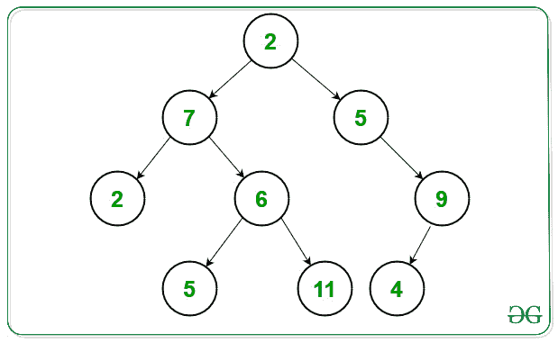

# 二叉树中从左下到右上的遍历

> 原文:[https://www . geeksforgeeks . org/从左下向上向右遍历二叉树/](https://www.geeksforgeeks.org/bottom-left-to-upward-right-traversal-in-a-binary-tree/)

给定一个[二叉树](https://www.geeksforgeeks.org/binary-tree-data-structure/)，任务是打印给定二叉树的从左下到右上的[遍历，即以从左下到右上的节点为级别的级别顺序遍历。](https://www.geeksforgeeks.org/tree-traversals-inorder-preorder-and-postorder/)

**示例:**

> **输入:**下面是给定的树:
> 
> 
> 
> **输出:**2 7 2 5 6 5 11 4 9
> T3】解释:T5】
> 
> 级别 1: 2 7 2(从左下到右向上到根)
> 级别 2: 5 6 5(从第 1 层的每个节点向右/或从该层的左下到右上)
> 级别 3: 11 4 9(从第 2 层的每个节点向右/或从该层的左下到右上)
> 
> **输入:** 1 2 3 4 5 6 7
> **输出:** 4 2 1 5 6 3 2
> **解释**
> 层 1: 4 2 1(从左下到右到根向上)
> 层 2: 5 6 3(从层 1 中的每个节点向右/或在该层中从左下到右向上)
> 层 3: 2(从层 2 中的每个节点向右/或在该层中从左下到右向上)

**方法:**想法是使用[广度优先搜索](https://www.geeksforgeeks.org/breadth-first-traversal-for-a-graph/)技术。遵循解决此问题所需的步骤:

*   初始化二叉树中的**层**。它是一个节点列表，从上一层旁边的最左下角节点开始，到上一层旁边的最右上角节点结束。
*   创建一个[栈](https://www.geeksforgeeks.org/stack-data-structure/)来存储每一层的所有节点。
*   初始化一个[队列](https://www.geeksforgeeks.org/queue-data-structure/)来维护每一层中的**根**，层中的一个根是一个节点，从这个节点可以只使用左边的子节点向下。
*   推送队列中第一层的根节点(树根)。
*   定义一个指示器(比如 **lyr_root** )一个在层末端的节点，它是当前的层头，层头是层中的第一个节点。
*   遍历直到[队列为非空](https://www.geeksforgeeks.org/queueempty-queuesize-c-stl/)，并执行以下操作:
    *   从队列前面获取一个**层根**
    *   如果这个层根是一个新层的层头，那么，[弹出堆栈](https://www.geeksforgeeks.org/stack-pop-method-in-java/)中的每一个元素，也就是上一个层元素，并打印出来。
    *   从**右上角**到**左下角**遍历图层，对于每个元素，如果它有一个右子元素，那么检查遍历的节点是否是图层头。如果发现为真，则更改预期指示器，以指示下一个层头。
    *   将正确的子代推到队列的根。
    *   推送堆栈中被遍历的节点。
*   遍历完所有层之后，最后一层可能还在堆栈中，所以我们需要弹出其中的每个元素并打印出来。

下面是上述方法的实现:

## C++

```
// C++ program for the above approach
#include <bits/stdc++.h>
#include <iostream>
using namespace std;

// Node Structures
typedef struct Node {
    int data;
    Node* left;
    Node* right;
} Node;

// Function to add the new Node in
// the Binary Tree
Node* newNode(int data)
{
    Node* n;

    // Create a new Node
    n = new Node();
    n->data = data;
    n->right = NULL;
    n->left = NULL;
    return n;
}

// Function to traverse the tree in the
// order of bottom left to the upward
// right order
vector<int>
leftBottomTopRightTraversal(Node* root)
{
    // Stores the data of the node
    vector<int> rr;

    // Stores every element in each layer
    stack<int> r;

    // Stores the roots in the layers
    queue<Node*> roots;

    // Push the layer head of the
    // first layer
    roots.push(root);

    // Define the first layer head
    // as the tree root
    Node* lyr_root = root;

    // Traverse all layers
    while (!roots.empty()) {

        // get current layer root
        Node* n = roots.front();

        // Pop element from roots
        roots.pop();
        if (lyr_root == n) {

            // Layer root was also
            // the layer head
            while (!r.empty()) {

                rr.push_back(r.top());

                // Pop every element
                // from the stack
                r.pop();
            }
        }

        while (n) {

            if (n->right) {

                // Current traversed node
                // has right child then
                // this root is next layer
                if (n == lyr_root) {
                    lyr_root = n->right;
                }

                // Push the right child
                // to layer roots queue
                roots.push(n->right);
            }

            // Push node to the
            // layer stack
            r.push(n->data);
            n = n->left;
        }
    }

    // Insert all remaining elements
    // for the traversal
    while (!r.empty()) {

        // After all of the layer
        // roots traversed check the
        // final layer in stack
        rr.push_back(r.top());
        r.pop();
    }

    // Return the traversal of nodes
    return rr;
}

// Function that builds the binary tree
// from the given string
Node* buildBinaryTree(char* t)
{
    Node* root = NULL;

    // Using queue to build tree
    queue<Node**> q;
    int data = 0;

    // Stores the status of last
    // node to be ignored or not
    bool ignore_last = false;
    while (*t != '\0') {
        int d = *t - '0';

        // If the current character
        // is a digits then form the
        // number of it
        if (d >= 0 && d <= 9) {
            data *= 10;
            data += d;
            ignore_last = false;
        }

        // If the current character
        // is N then it is the
        // NULL node
        else if (*t == 'N') {
            data = 0;
            q.pop();
            ignore_last = true;
        }

        // If space occured then
        // add the number formed
        else if (*t == ' ') {

            // If last is ignored
            if (!ignore_last) {

                // If root node is not NULL
                if (root) {

                    Node** p = q.front();
                    q.pop();

                    if (p != NULL) {
                        *p = newNode(data);
                        q.push(&((*p)->left));
                        q.push(&((*p)->right));
                    }
                }

                // Else create a new
                // root node
                else {
                    root = newNode(data);
                    q.push(&(root->left));
                    q.push(&(root->right));
                }
                data = 0;
            }
        }

        // Increment t
        t++;
    }

    // Return the root node of the tree
    return root;
}

// Driver Code
int main()
{
    // Given order of nodes
    char T[] = "2 7 5 2 6 N 9 N N 5 11 4 N";

    // Builds the Binary Tree
    Node* root = buildBinaryTree(T);

    // Function Call
    vector<int> result
        = leftBottomTopRightTraversal(root);

    // Print the final traversal
    for (int i = 0; i < result.size(); ++i) {
        cout << result[i] << " ";
    }

    return 0;
}
```

**Output:** 

```
2 7 2 5 6 5 11 4 9
```

***时间复杂度:**O(N)*
T5**辅助空间:** O(N)