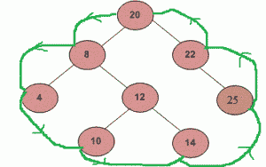

# 二叉树的边界遍历

> 原文:[https://www . geesforgeks . org/二叉树的边界遍历/](https://www.geeksforgeeks.org/boundary-traversal-of-binary-tree/)

给定一棵二叉树，从根开始逆时针打印二叉树的边界节点**。边界按顺序包括左边界、树叶和右边界，没有重复的节点。(节点的值可能仍然是重复的。)
**左侧边界**定义为从根到**最左侧**节点的路径。**右边界**定义为从根到**最右侧**节点的路径。如果根没有左子树或右子树，那么根本身就是左边界或右边界。注意这个定义只适用于输入二叉树，不适用于任何子树。
**最左边的**节点被定义为一个**叶子**节点，如果它存在的话，当你总是首先移动到左边的子树时，你可以到达这个节点。如果没有，就去右边的子树。重复以上步骤，直到到达叶节点。
**最右边的**节点也以相同的方式定义，左右互换。
例如，以下树的边界遍历为“20 8 4 10 14 25 22”** 

****

**我们把问题分成 3 部分:
**1。**自上而下打印左边界。
T4【2】。从左到右打印所有叶节点，又可以细分为两个子部分:
….. **2.1** 从左到右打印左子树的所有叶节点。
….. **2.2** 从左到右打印右子树的所有叶节点。
**3。**自下而上打印右边界。
我们需要注意一点，节点不要再打印了。例如，最左边的节点也是树的叶节点。
基于以上案例，下面是实现:** 

## **C**

```
/* C program for boundary traversal
of a binary tree */

#include <stdio.h>
#include <stdlib.h>

/* A binary tree node has data, pointer to left child
and a pointer to right child */
struct node {
    int data;
    struct node *left, *right;
};

// A simple function to print leaf nodes of a binary tree
void printLeaves(struct node* root)
{
    if (root == NULL)
        return;

    printLeaves(root->left);

    // Print it if it is a leaf node
    if (!(root->left) && !(root->right))
        printf("%d ", root->data);

    printLeaves(root->right);
}

// A function to print all left boundary nodes, except a leaf node.
// Print the nodes in TOP DOWN manner
void printBoundaryLeft(struct node* root)
{
    if (root == NULL)
        return;

    if (root->left) {

        // to ensure top down order, print the node
        // before calling itself for left subtree
        printf("%d ", root->data);
        printBoundaryLeft(root->left);
    }
    else if (root->right) {
        printf("%d ", root->data);
        printBoundaryLeft(root->right);
    }
    // do nothing if it is a leaf node, this way we avoid
    // duplicates in output
}

// A function to print all right boundary nodes, except a leaf node
// Print the nodes in BOTTOM UP manner
void printBoundaryRight(struct node* root)
{
    if (root == NULL)
        return;

    if (root->right) {
        // to ensure bottom up order, first call for right
        // subtree, then print this node
        printBoundaryRight(root->right);
        printf("%d ", root->data);
    }
    else if (root->left) {
        printBoundaryRight(root->left);
        printf("%d ", root->data);
    }
    // do nothing if it is a leaf node, this way we avoid
    // duplicates in output
}

// A function to do boundary traversal of a given binary tree
void printBoundary(struct node* root)
{
    if (root == NULL)
        return;

    printf("%d ", root->data);

    // Print the left boundary in top-down manner.
    printBoundaryLeft(root->left);

    // Print all leaf nodes
    printLeaves(root->left);
    printLeaves(root->right);

    // Print the right boundary in bottom-up manner
    printBoundaryRight(root->right);
}

// A utility function to create a node
struct node* newNode(int data)
{
    struct node* temp = (struct node*)malloc(sizeof(struct node));

    temp->data = data;
    temp->left = temp->right = NULL;

    return temp;
}

// Driver program to test above functions
int main()
{
    // Let us construct the tree given in the above diagram
    struct node* root = newNode(20);
    root->left = newNode(8);
    root->left->left = newNode(4);
    root->left->right = newNode(12);
    root->left->right->left = newNode(10);
    root->left->right->right = newNode(14);
    root->right = newNode(22);
    root->right->right = newNode(25);

    printBoundary(root);

    return 0;
}
```

## **Java 语言(一种计算机语言，尤用于创建网站)**

```
// Java program to print boundary traversal of binary tree

/* A binary tree node has data, pointer to left child
and a pointer to right child */
class Node {
    int data;
    Node left, right;

    Node(int item)
    {
        data = item;
        left = right = null;
    }
}

class BinaryTree {
    Node root;

    // A simple function to print leaf nodes of a binary tree
    void printLeaves(Node node)
    {
        if (node == null)
            return;

        printLeaves(node.left);
        // Print it if it is a leaf node
        if (node.left == null && node.right == null)
            System.out.print(node.data + " ");
        printLeaves(node.right);
    }

    // A function to print all left boundary nodes, except a leaf node.
    // Print the nodes in TOP DOWN manner
    void printBoundaryLeft(Node node)
    {
        if (node == null)
            return;

        if (node.left != null) {
            // to ensure top down order, print the node
            // before calling itself for left subtree
            System.out.print(node.data + " ");
            printBoundaryLeft(node.left);
        }
        else if (node.right != null) {
            System.out.print(node.data + " ");
            printBoundaryLeft(node.right);
        }

        // do nothing if it is a leaf node, this way we avoid
        // duplicates in output
    }

    // A function to print all right boundary nodes, except a leaf node
    // Print the nodes in BOTTOM UP manner
    void printBoundaryRight(Node node)
    {
        if (node == null)
            return;

        if (node.right != null) {
            // to ensure bottom up order, first call for right
            // subtree, then print this node
            printBoundaryRight(node.right);
            System.out.print(node.data + " ");
        }
        else if (node.left != null) {
            printBoundaryRight(node.left);
            System.out.print(node.data + " ");
        }
        // do nothing if it is a leaf node, this way we avoid
        // duplicates in output
    }

    // A function to do boundary traversal of a given binary tree
    void printBoundary(Node node)
    {
        if (node == null)
            return;

        System.out.print(node.data + " ");

        // Print the left boundary in top-down manner.
        printBoundaryLeft(node.left);

        // Print all leaf nodes
        printLeaves(node.left);
        printLeaves(node.right);

        // Print the right boundary in bottom-up manner
        printBoundaryRight(node.right);
    }

    // Driver program to test above functions
    public static void main(String args[])
    {
        BinaryTree tree = new BinaryTree();
        tree.root = new Node(20);
        tree.root.left = new Node(8);
        tree.root.left.left = new Node(4);
        tree.root.left.right = new Node(12);
        tree.root.left.right.left = new Node(10);
        tree.root.left.right.right = new Node(14);
        tree.root.right = new Node(22);
        tree.root.right.right = new Node(25);
        tree.printBoundary(tree.root);
    }
}
```

## **蟒蛇 3**

```
# Python3 program for binary traversal of binary tree

# A binary tree node
class Node:

    # Constructor to create a new node
    def __init__(self, data):
        self.data = data
        self.left = None
        self.right = None

# A simple function to print leaf nodes of a Binary Tree
def printLeaves(root):
    if(root):
        printLeaves(root.left)

        # Print it if it is a leaf node
        if root.left is None and root.right is None:
            print(root.data),

        printLeaves(root.right)

# A function to print all left boundary nodes, except a
# leaf node. Print the nodes in TOP DOWN manner
def printBoundaryLeft(root):

    if(root):
        if (root.left):

            # to ensure top down order, print the node
            # before calling itself for left subtree
            print(root.data)
            printBoundaryLeft(root.left)

        elif(root.right):
            print (root.data)
            printBoundaryLeft(root.right)

        # do nothing if it is a leaf node, this way we
        # avoid duplicates in output

# A function to print all right boundary nodes, except
# a leaf node. Print the nodes in BOTTOM UP manner
def printBoundaryRight(root):

    if(root):
        if (root.right):
            # to ensure bottom up order, first call for
            # right subtree, then print this node
            printBoundaryRight(root.right)
            print(root.data)

        elif(root.left):
            printBoundaryRight(root.left)
            print(root.data)

        # do nothing if it is a leaf node, this way we
        # avoid duplicates in output

# A function to do boundary traversal of a given binary tree
def printBoundary(root):
    if (root):
        print(root.data)

        # Print the left boundary in top-down manner
        printBoundaryLeft(root.left)

        # Print all leaf nodes
        printLeaves(root.left)
        printLeaves(root.right)

        # Print the right boundary in bottom-up manner
        printBoundaryRight(root.right)

# Driver program to test above function
root = Node(20)
root.left = Node(8)
root.left.left = Node(4)
root.left.right = Node(12)
root.left.right.left = Node(10)
root.left.right.right = Node(14)
root.right = Node(22)
root.right.right = Node(25)
printBoundary(root)

# This code is contributed by
# Nikhil Kumar Singh(nickzuck_007)
```

## **C#**

```
// C# program to print boundary traversal
// of binary tree
using System;

/* A binary tree node has data,
pointer to left child and a pointer
to right child */
public class Node {
    public int data;
    public Node left, right;

    public Node(int item)
    {
        data = item;
        left = right = null;
    }
}

class GFG {
    public Node root;

    // A simple function to print leaf
    // nodes of a binary tree
    public virtual void printLeaves(Node node)
    {
        if (node == null)
            return;

        printLeaves(node.left);

        // Print it if it is a leaf node
        if (node.left == null && node.right == null) {
            Console.Write(node.data + " ");
        }
        printLeaves(node.right);
    }

    // A function to print all left boundary
    // nodes, except a leaf node. Print the
    // nodes in TOP DOWN manner
    public virtual void printBoundaryLeft(Node node)
    {
        if (node == null)
            return;

        if (node.left != null) {

            // to ensure top down order, print the node
            // before calling itself for left subtree
            Console.Write(node.data + " ");
            printBoundaryLeft(node.left);
        }
        else if (node.right != null) {
            Console.Write(node.data + " ");
            printBoundaryLeft(node.right);
        }

        // do nothing if it is a leaf node,
        // this way we avoid duplicates in output
    }

    // A function to print all right boundary
    // nodes, except a leaf node. Print the
    // nodes in BOTTOM UP manner
    public virtual void printBoundaryRight(Node node)
    {
        if (node == null)
            return;

        if (node.right != null) {
            // to ensure bottom up order,
            // first call for right subtree,
            // then print this node
            printBoundaryRight(node.right);
            Console.Write(node.data + " ");
        }
        else if (node.left != null) {
            printBoundaryRight(node.left);
            Console.Write(node.data + " ");
        }
        // do nothing if it is a leaf node,
        // this way we avoid duplicates in output
    }

    // A function to do boundary traversal
    // of a given binary tree
    public virtual void printBoundary(Node node)
    {
        if (node == null)
            return;

        Console.Write(node.data + " ");

        // Print the left boundary in
        // top-down manner.
        printBoundaryLeft(node.left);

        // Print all leaf nodes
        printLeaves(node.left);
        printLeaves(node.right);

        // Print the right boundary in
        // bottom-up manner
        printBoundaryRight(node.right);
    }

    // Driver Code
    public static void Main(string[] args)
    {
        GFG tree = new GFG();
        tree.root = new Node(20);
        tree.root.left = new Node(8);
        tree.root.left.left = new Node(4);
        tree.root.left.right = new Node(12);
        tree.root.left.right.left = new Node(10);
        tree.root.left.right.right = new Node(14);
        tree.root.right = new Node(22);
        tree.root.right.right = new Node(25);
        tree.printBoundary(tree.root);
    }
}

// This code is contributed by Shrikant13
```

## **java 描述语言**

```
<script>

    // JavaScript program to print boundary
    // traversal of binary tree

    class Node
    {
        constructor(item) {
           this.left = null;
           this.right = null;
           this.data = item;
        }
    }

    let root;

    // A simple function to print leaf nodes of a binary tree
    function printLeaves(node)
    {
        if (node == null)
            return;

        printLeaves(node.left);
        // Print it if it is a leaf node
        if (node.left == null && node.right == null)
            document.write(node.data + " ");
        printLeaves(node.right);
    }

    // A function to print all left boundary nodes,
    // except a leaf node.
    // Print the nodes in TOP DOWN manner
    function printBoundaryLeft(node)
    {
        if (node == null)
            return;

        if (node.left != null) {
            // to ensure top down order, print the node
            // before calling itself for left subtree
            document.write(node.data + " ");
            printBoundaryLeft(node.left);
        }
        else if (node.right != null) {
            document.write(node.data + " ");
            printBoundaryLeft(node.right);
        }

        // do nothing if it is a leaf node, this way we avoid
        // duplicates in output
    }

    // A function to print all right boundary nodes,
    // except a leaf node
    // Print the nodes in BOTTOM UP manner
    function printBoundaryRight(node)
    {
        if (node == null)
            return;

        if (node.right != null) {
            // to ensure bottom up order, first call for right
            // subtree, then print this node
            printBoundaryRight(node.right);
            document.write(node.data + " ");
        }
        else if (node.left != null) {
            printBoundaryRight(node.left);
            document.write(node.data + " ");
        }
        // do nothing if it is a leaf node, this way we avoid
        // duplicates in output
    }

    // A function to do boundary traversal of a given binary tree
    function printBoundary(node)
    {
        if (node == null)
            return;

        document.write(node.data + " ");

        // Print the left boundary in top-down manner.
        printBoundaryLeft(node.left);

        // Print all leaf nodes
        printLeaves(node.left);
        printLeaves(node.right);

        // Print the right boundary in bottom-up manner
        printBoundaryRight(node.right);
    }

    root = new Node(20);
    root.left = new Node(8);
    root.left.left = new Node(4);
    root.left.right = new Node(12);
    root.left.right.left = new Node(10);
    root.left.right.right = new Node(14);
    root.right = new Node(22);
    root.right.right = new Node(25);
    printBoundary(root);

</script>
```

****输出:****

```
20 8 4 10 14 25 22
```

****时间复杂度:** O(n)，其中 n 为二叉树中的节点数。** 

**如果发现有不正确的地方，请写评论，或者想分享更多关于以上讨论话题的信息**