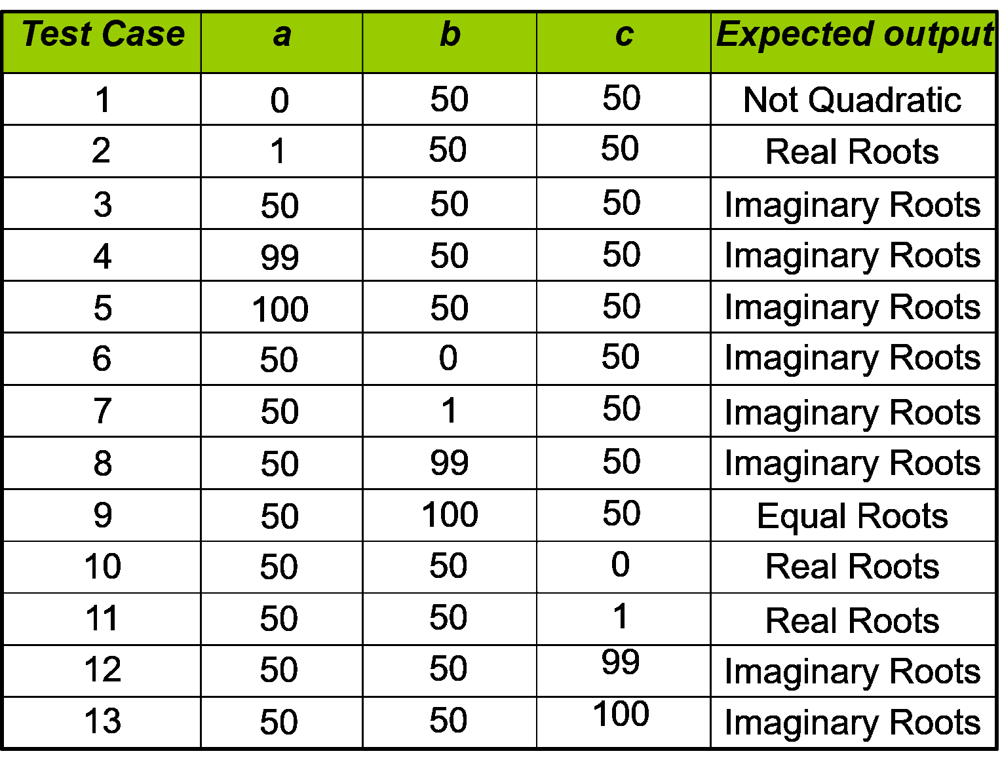

# 边值分析:二次方程根的性质

> 原文:[https://www . geeksforgeeks . org/边界值分析-二次方程的根的性质/](https://www.geeksforgeeks.org/boundary-value-analysis-nature-of-roots-of-a-quadratic-equation/)

考虑一个确定一个[二次方程](https://www.geeksforgeeks.org/program-to-find-number-of-solutions-in-quadratic-equation/)的根的性质的问题，其中输入是 3 个变量(a，b，c)，它们的值可能来自区间[0，100]。根据变量的值，输出可能是以下之一:

*   不是二次方程，
*   真正的根，
*   想象的根，
*   等根

**我们的目标是设计边界值测试用例。**

[边界值分析](https://www.geeksforgeeks.org/boundary-value-analysis-triangle-problem/)是一种[软件测试技术](https://www.geeksforgeeks.org/types-software-testing/)，其中测试被设计成包括一个范围内的边界值的代表。**边界值分析总共有 4*n+1 个不同的测试用例**，其中 n 是问题中的变量数量。

这里我们必须考虑所有三个变量，并设计所有不同的可能测试用例。我们总共会有 **13 个测试用例**作为 n = 3。

**Quadratic equation will be of type: ax<sup>2</sup>+bx+c=0**
*   根是真实的如果(b<sup>2</sup>–4ac)>0
*   根是**假想的**if(b<sup>2</sup>–4ac)<0
*   如果(b<sup>2</sup>–4ac)= 0，则根**等于**
*   如果 a = 0，方程**不是二次的**

**我们如何设计测试用例？**
对于每个变量，我们考虑以下 5 种情况:

*   a <sub>分钟</sub> = 0
*   a <sub>分钟+1</sub> = 1
*   a <sub>标称值</sub> = 50
*   a <sub>最大值-1</sub> = 99
*   a <sub>最大值</sub> = 100

当我们考虑一个变量的这 5 种情况时，其余的变量都有标称值，就像上面的例子中‘a’的值在 0 到 100 之间变化一样，‘b’和‘c’的值将被视为标称值或平均值。同样，当变量“b”的值从 0 变化到 100 时，“a”和“c”的值将是标称值或平均值，即 50。

边界值分析中二次方程根的性质的可能测试情况可以是:

[](https://media.geeksforgeeks.org/wp-content/uploads/20200204100842/BVA-table-2.png)

下面是验证上表中考虑的测试用例的程序。该程序接受用户定义的输入，以便您可以检查上面提到的任何测试用例。

## C++

```
// C++ program to check the nature of the roots

#include <bits/stdc++.h>
using namespace std;

// BVA for nature of roots of a quadratic equation
void nature_of_roots(int a, int b, int c)
{

    // If a = 0, D/2a will yield exception
    // Hence it is not a valid Quadratic Equation
    if (a == 0) {
        cout << "Not a Quadratic Equation"
             << endl;
        return;
    }

    int D = b * b - 4 * a * c;

    // If D > 0, it will be Real Roots
    if (D > 0) {
        cout << "Real Roots" << endl;
    }

    // If D == 0, it will be Equal Roots
    else if (D == 0) {
        cout << "Equal Roots" << endl;
    }

    // If D < 0, it will be Imaginary Roots
    else {
        cout << "Imaginary Roots" << endl;
    }
}

// Function to check for all testcases
void checkForAllTestCase()
{

    cout << "Testcase"
         << "\ta\tb\tc\tActual Output"
         << endl;
    cout << endl;
    int a, b, c;
    int testcase = 1;
    while (testcase <= 13) {
        if (testcase == 1) {
            a = 0;
            b = 50;
            c = 50;
        }
        else if (testcase == 2) {
            a = 1;
            b = 50;
            c = 50;
        }
        else if (testcase == 3) {
            a = 50;
            b = 50;
            c = 50;
        }
        else if (testcase == 4) {
            a = 99;
            b = 50;
            c = 50;
        }
        else if (testcase == 5) {
            a = 100;
            b = 50;
            c = 50;
        }
        else if (testcase == 6) {
            a = 50;
            b = 0;
            c = 50;
        }
        else if (testcase == 7) {
            a = 50;
            b = 1;
            c = 50;
        }
        else if (testcase == 8) {
            a = 50;
            b = 99;
            c = 50;
        }
        else if (testcase == 9) {
            a = 50;
            b = 100;
            c = 50;
        }
        else if (testcase == 10) {
            a = 50;
            b = 50;
            c = 0;
        }
        else if (testcase == 11) {
            a = 50;
            b = 50;
            c = 1;
        }
        else if (testcase == 12) {
            a = 50;
            b = 50;
            c = 99;
        }
        else if (testcase == 13) {
            a = 50;
            b = 50;
            c = 100;
        }
        cout << "\t" << testcase << "\t"
             << a << "\t" << b << "\t"
             << c << "\t";
        nature_of_roots(a, b, c);
        cout << endl;
        testcase++;
    }
}

// Driver Code
int main()
{
    checkForAllTestCase();
    return 0;
}
```

## Java 语言(一种计算机语言，尤用于创建网站)

```
// Java program to check the nature of the roots
import java.util.*;

class GFG
{

// BVA for nature of roots of a quadratic equation
static void nature_of_roots(int a, int b, int c)
{

    // If a = 0, D/2a will yield exception
    // Hence it is not a valid Quadratic Equation
    if (a == 0)
    {
        System.out.print("Not a Quadratic Equation"
            +"\n");
        return;
    }

    int D = b * b - 4 * a * c;

    // If D > 0, it will be Real Roots
    if (D > 0) {
        System.out.print("Real Roots" +"\n");
    }

    // If D == 0, it will be Equal Roots
    else if (D == 0) {
        System.out.print("Equal Roots" +"\n");
    }

    // If D < 0, it will be Imaginary Roots
    else {
        System.out.print("Imaginary Roots" +"\n");
    }
}

// Function to check for all testcases
static void checkForAllTestCase()
{

    System.out.print("Testcase"
        + "\ta\tb\tc\tActual Output"
        +"\n");
    System.out.println();
    int a, b, c;
    a = b = c = 0;
    int testcase = 1;
    while (testcase <= 13) {
        if (testcase == 1) {
            a = 0;
            b = 50;
            c = 50;
        }
        else if (testcase == 2) {
            a = 1;
            b = 50;
            c = 50;
        }
        else if (testcase == 3) {
            a = 50;
            b = 50;
            c = 50;
        }
        else if (testcase == 4) {
            a = 99;
            b = 50;
            c = 50;
        }
        else if (testcase == 5) {
            a = 100;
            b = 50;
            c = 50;
        }
        else if (testcase == 6) {
            a = 50;
            b = 0;
            c = 50;
        }
        else if (testcase == 7) {
            a = 50;
            b = 1;
            c = 50;
        }
        else if (testcase == 8) {
            a = 50;
            b = 99;
            c = 50;
        }
        else if (testcase == 9) {
            a = 50;
            b = 100;
            c = 50;
        }
        else if (testcase == 10) {
            a = 50;
            b = 50;
            c = 0;
        }
        else if (testcase == 11) {
            a = 50;
            b = 50;
            c = 1;
        }
        else if (testcase == 12) {
            a = 50;
            b = 50;
            c = 99;
        }
        else if (testcase == 13) {
            a = 50;
            b = 50;
            c = 100;
        }
        System.out.print("\t" + testcase+ "\t"
            + a+ "\t" + b+ "\t"
            + c+ "\t");
        nature_of_roots(a, b, c);
        System.out.println();
        testcase++;
    }
}

// Driver Code
public static void main(String[] args)
{
    checkForAllTestCase();
}
}

// This code is contributed by 29AjayKumar
```

## 蟒蛇 3

```
# Python3 program to check the nature of the roots

# BVA for nature of roots of a quadratic equation
def nature_of_roots(a, b, c):

    # If a = 0, D/2a will yield exception
    # Hence it is not a valid Quadratic Equation
    if (a == 0):
        print("Not a Quadratic Equation");
        return;

    D = b * b - 4 * a * c;

    # If D > 0, it will be Real Roots
    if (D > 0):
        print("Real Roots");

    # If D == 0, it will be Equal Roots
    elif(D == 0):
        print("Equal Roots");

    # If D < 0, it will be Imaginary Roots
    else:
        print("Imaginary Roots");

# Function to check for all testcases
def checkForAllTestCase():

    print("Testcase\ta\tb\tc\tActual Output");
    print();
    a = b = c = 0;
    testcase = 1;
    while (testcase <= 13):
        if (testcase == 1):
            a = 0;
            b = 50;
            c = 50;
        elif(testcase == 2):
            a = 1;
            b = 50;
            c = 50;
        elif(testcase == 3):
            a = 50;
            b = 50;
            c = 50;
        elif(testcase == 4):
            a = 99;
            b = 50;
            c = 50;
        elif(testcase == 5):
            a = 100;
            b = 50;
            c = 50;
        elif(testcase == 6):
            a = 50;
            b = 0;
            c = 50;
        elif(testcase == 7):
            a = 50;
            b = 1;
            c = 50;
        elif(testcase == 8):
            a = 50;
            b = 99;
            c = 50;
        elif(testcase == 9):
            a = 50;
            b = 100;
            c = 50;
        elif(testcase == 10):
            a = 50;
            b = 50;
            c = 0;
        elif(testcase == 11):
            a = 50;
            b = 50;
            c = 1;
        elif(testcase == 12):
            a = 50;
            b = 50;
            c = 99;
        elif(testcase == 13):
            a = 50;
            b = 50;
            c = 100;

        print("\t" , testcase , "\t" , a , "\t" , b , "\t" , c , "\t", end="");
        nature_of_roots(a, b, c);
        print();
        testcase += 1;

# Driver Code
if __name__ == '__main__':
    checkForAllTestCase();

# This code is contributed by 29AjayKumar
```

## C#

```
// C# program to check the nature of the roots
using System;

class GFG
{

// BVA for nature of roots of a quadratic equation
static void nature_of_roots(int a, int b, int c)
{

    // If a = 0, D/2a will yield exception
    // Hence it is not a valid Quadratic Equation
    if (a == 0)
    {
        Console.Write("Not a Quadratic Equation"
                       +"\n");
        return;
    }

    int D = b * b - 4 * a * c;

    // If D > 0, it will be Real Roots
    if (D > 0) {
        Console.Write("Real Roots" +"\n");
    }

    // If D == 0, it will be Equal Roots
    else if (D == 0) {
        Console.Write("Equal Roots" +"\n");
    }

    // If D < 0, it will be Imaginary Roots
    else {
        Console.Write("Imaginary Roots" +"\n");
    }
}

// Function to check for all testcases
static void checkForAllTestCase()
{

    Console.Write("Testcase"
        + "\ta\tb\tc\tActual Output"
        +"\n");
    Console.WriteLine();
    int a, b, c;
    a = b = c = 0;
    int testcase = 1;
    while (testcase <= 13) {
        if (testcase == 1) {
            a = 0;
            b = 50;
            c = 50;
        }
        else if (testcase == 2) {
            a = 1;
            b = 50;
            c = 50;
        }
        else if (testcase == 3) {
            a = 50;
            b = 50;
            c = 50;
        }
        else if (testcase == 4) {
            a = 99;
            b = 50;
            c = 50;
        }
        else if (testcase == 5) {
            a = 100;
            b = 50;
            c = 50;
        }
        else if (testcase == 6) {
            a = 50;
            b = 0;
            c = 50;
        }
        else if (testcase == 7) {
            a = 50;
            b = 1;
            c = 50;
        }
        else if (testcase == 8) {
            a = 50;
            b = 99;
            c = 50;
        }
        else if (testcase == 9) {
            a = 50;
            b = 100;
            c = 50;
        }
        else if (testcase == 10) {
            a = 50;
            b = 50;
            c = 0;
        }
        else if (testcase == 11) {
            a = 50;
            b = 50;
            c = 1;
        }
        else if (testcase == 12) {
            a = 50;
            b = 50;
            c = 99;
        }
        else if (testcase == 13) {
            a = 50;
            b = 50;
            c = 100;
        }
        Console.Write("\t" + testcase+ "\t"
                        + a+ "\t" + b+ "\t"
                        + c+ "\t");
        nature_of_roots(a, b, c);
        Console.WriteLine();
        testcase++;
    }
}

// Driver Code
public static void Main(String[] args)
{
    checkForAllTestCase();
}
}

// This code is contributed by 29AjayKumar
```

**Output:**

```
Testcase    a    b    c    Actual Output

    1    0    50    50    Not a Quadratic Equation

    2    1    50    50    Real Roots

    3    50    50    50    Imaginary Roots

    4    99    50    50    Imaginary Roots

    5    100    50    50    Imaginary Roots

    6    50    0    50    Imaginary Roots

    7    50    1    50    Imaginary Roots

    8    50    99    50    Imaginary Roots

    9    50    100    50    Equal Roots

    10    50    50    0    Real Roots

    11    50    50    1    Real Roots

    12    50    50    99    Imaginary Roots

    13    50    50    100    Imaginary Roots

```