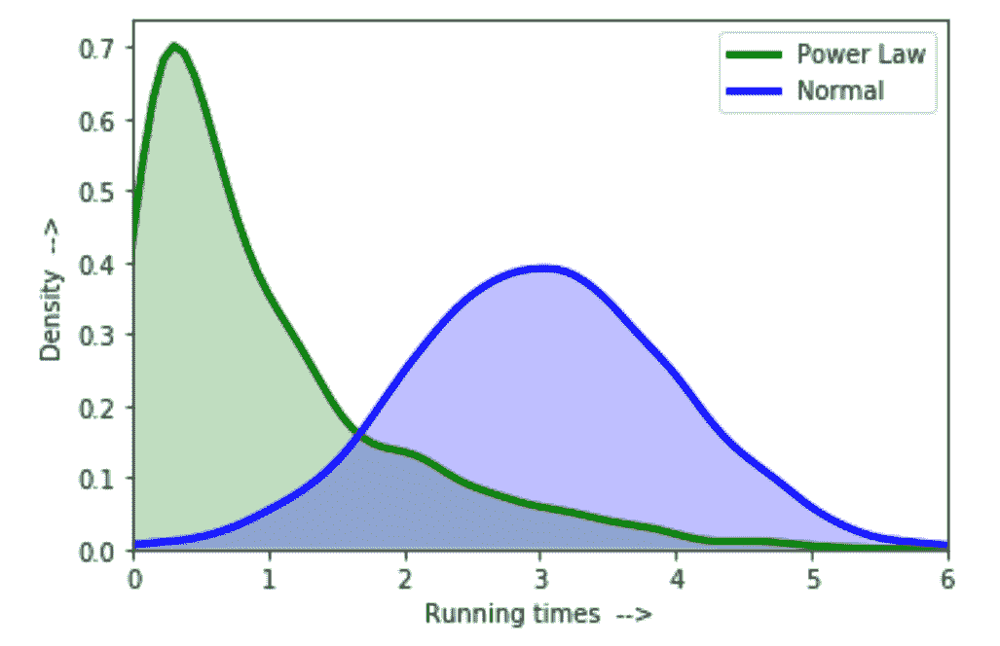
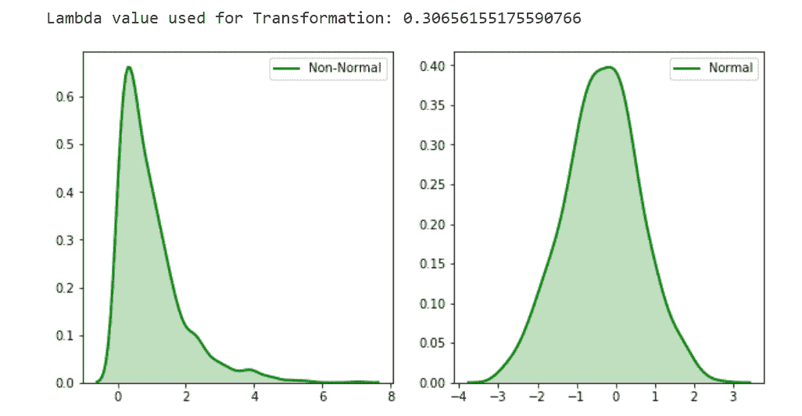

# Python | Box-Cox 变换

> 原文:[https://www . geesforgeks . org/box-Cox-transformation-use-python/](https://www.geeksforgeeks.org/box-cox-transformation-using-python/)

想象一下，你正在观看一场赛马，就像任何其他比赛一样，有跑得快的和跑得慢的。所以，从逻辑上讲，跑在最前面的马和跟在后面的快马完成时间的差别是一样的，而最慢的马完成时间的差别更大。

我们可以把它与统计学中一个非常著名的术语**方差**联系起来，这个术语指的是数据相对于平均值的变化量。在我们的例子中，快马和慢马之间存在不一致的方差(异方差)，因为在较短的完成时间内会有小的变化，反之亦然。

因此，我们数据的分布不会是钟形曲线或正态分布，因为右侧会有一个较长的尾部。这些类型的分布遵循**幂律**或 **80-20 法则**，其中一个量的相对变化随着另一个量的幂而变化。

<center>
</center>

在上面的图中，我们可以看到幂律分布，由于方差小，运行时间短，幂律分布已经达到峰值，由于运行时间长，幂律分布的尾部很重。这些幂律分布在物理学、生物学、经济学等领域都有。

所以，想一想，如果这些分布存在于这么多领域，如果我们能把它转换成像正态分布一样舒适的分布呢？那会让我们的生活轻松很多。幸运的是，我们有办法使用 **Box-Cox 变换**将幂律或任何非线性分布变换为正态

**让我们直观地思考，如果我们自己做这个改造，我们会怎么进行？**

从上图中可以清楚地看到，如果我们能以某种方式扩大非正态分布左侧的可变性，即峰值，并减少尾部的可变性。简而言之，试图将峰值向中心移动，那么我们可以得到一条接近钟形曲线的曲线。

形式上，A Box cox 变换被定义为将数据中的非正态因变量转换为正态形状的一种方式，通过这种方式，我们可以运行比我们可能运行的更多的测试。

**Box-Cox 变换背后的数学:**

如何把我们的直觉思维转化成数学变换函数？对数变换是我们所需要的。当对数变换应用于非正态分布时，它试图扩大较小值之间的差异，因为对数函数的斜率对于较小值更陡，而较大值之间的差异可以减小，因为对于较大值，对数分布具有中等斜率。这就是我们想做的，对吗？

Box-cox 变换只关心计算的值，该值从–5 到 5 不等。如果能够将非正态曲线近似为正态曲线，则的值被称为最佳值。转换公式如下:

<center></center>

该功能要求输入为正。手动使用这个公式是一项非常费力的任务，因此许多流行的库都提供了这个功能。

**实施:**

SciPy 的 stats 包提供了一个名为`boxcox`的函数，用于执行 box-cox 幂变换，该函数将原始非正态数据作为输入，并返回拟合数据以及用于将非正态分布拟合为正态分布的 lambda 值。

下面是相同的代码。

**示例:**

```
# Python3 code to show Box-cox Transformation 
# of non-normal data

# import modules
import numpy as np
from scipy import stats

# plotting modules
import seaborn as sns
import matplotlib.pyplot as plt

# generate non-normal data (exponential)
original_data = np.random.exponential(size = 1000)

# transform training data & save lambda value
fitted_data, fitted_lambda = stats.boxcox(original_data)

# creating axes to draw plots
fig, ax = plt.subplots(1, 2)

# plotting the original data(non-normal) and 
# fitted data (normal)
sns.distplot(original_data, hist = False, kde = True,
            kde_kws = {'shade': True, 'linewidth': 2}, 
            label = "Non-Normal", color ="green", ax = ax[0])

sns.distplot(fitted_data, hist = False, kde = True,
            kde_kws = {'shade': True, 'linewidth': 2}, 
            label = "Normal", color ="green", ax = ax[1])

# adding legends to the subplots
plt.legend(loc = "upper right")

# rescaling the subplots
fig.set_figheight(5)
fig.set_figwidth(10)

print(f"Lambda value used for Transformation: {fitted_lambda}")
```

**输出:**

<center>
</center>

我们可以看到，使用`SciPy.stats.boxcox()`将非正态分布转化为正态分布或者更接近正态分布。

**Box-Cox 总是起作用吗？**

答案是**否**。Box-cox 不能保证正态性，因为它从不检查正态性，而正态性是万无一失的，无论它是否正确地转换了非正态分布。它只检查最小的标准偏差。

因此，绝对有必要始终使用概率图检查转换数据的正态性。