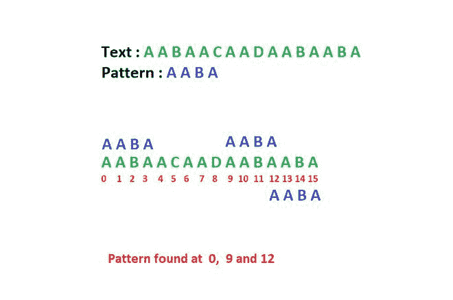
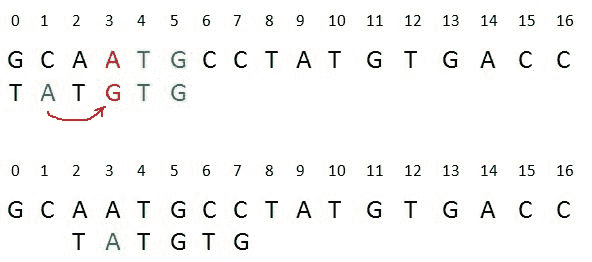
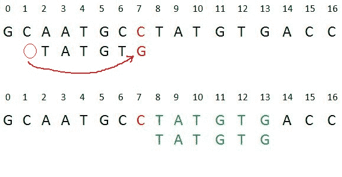

# 模式搜索的 Boyer Moore 算法

> 原文:[https://www . geeksforgeeks . org/boyer-Moore-算法用于模式搜索/](https://www.geeksforgeeks.org/boyer-moore-algorithm-for-pattern-searching/)

模式搜索是计算机科学中的一个重要问题。当我们在记事本/word 文件、浏览器或数据库中搜索字符串时，会使用模式搜索算法来显示搜索结果。一个典型的问题陈述是-
给定一个文本 txt[0..n-1]和模式 pat[0..m-1]其中 n 是文本的长度，m 是模式的长度，编写一个函数 search(char pat[]，char txt[])，打印所有出现在 txt[]中的 pat[]。你可以假设 n>m
个例子:

```
Input:  txt[] = "THIS IS A TEST TEXT"
        pat[] = "TEST"
Output: Pattern found at index 10

Input:  txt[] =  "AABAACAADAABAABA"
        pat[] =  "AABA"
Output: Pattern found at index 0
        Pattern found at index 9
        Pattern found at index 12
```



在这篇文章中，我们将讨论博耶摩尔模式搜索算法。像 [KMP](https://www.geeksforgeeks.org/kmp-algorithm-for-pattern-searching/) 和[有限自动机](https://www.geeksforgeeks.org/finite-automata-algorithm-for-pattern-searching/)算法一样，Boyer Moore 算法也对模式进行了预处理。
博耶摩尔是以下两种方法的结合。
1)坏字符启发式
2)好后缀启发式
以上两种启发式也可以独立使用，在文本中搜索模式。让我们首先了解两种独立的方法是如何在 Boyer Moore 算法中协同工作的。如果我们看一下[朴素算法](https://www.geeksforgeeks.org/naive-algorithm-for-pattern-searching/)，它会在文本上一个接一个地滑动模式。 [KMP 算法](https://www.geeksforgeeks.org/searching-for-patterns-set-2-kmp-algorithm/)对模式进行预处理，使模式可以移动一个以上。Boyer Moore 算法出于同样的原因进行预处理。它处理该模式，并为两个试探法中的每一个创建不同的数组。在每一步中，它都按照两个试探法中每一个建议的最大幻灯片数来滑动模式。**所以它在每一步都使用两个试探法建议的最大偏移量**。
与之前的模式搜索算法不同， **Boyer Moore 算法从模式的最后一个字符开始匹配。**
在这篇文章中，我们将在下一篇文章中讨论坏角色启发式和好后缀启发式。

**不良性格启发式**

坏性格启发式的想法很简单。与模式当前字符不匹配的文本字符称为**坏字符**。当不匹配时，我们移动模式，直到–
1)不匹配变成匹配
2)模式 P 移过不匹配的字符。
**案例 1–不匹配变成匹配**
我们将查找模式中不匹配字符最后一次出现的位置，如果模式中存在不匹配的字符，那么我们将移动模式，使其与文本中不匹配的字符对齐



案例 1

**解释:**在上面的例子中，我们在位置 3 得到了一个错配。这里我们的错配字符是“A”。现在我们将在模式中搜索“A”的最后一次出现。我们在模式中的位置 1 得到“A”(显示为蓝色)，这是它的最后一次出现。现在我们将移动模式 2 次，使模式中的“A”与文本中的“A”对齐。
**案例 2–模式移过不匹配字符**
我们将查找模式中最后一次出现不匹配字符的位置，如果字符不存在，我们将移过不匹配字符。



案例 2

**解释:**这里我们在位置 7 有一个错配。不匹配的字符“C”在位置 7 之前的模式中不存在，所以我们将模式移到位置 7，最终在上面的例子中，我们得到了模式的完美匹配(显示为绿色)。我们这样做是因为“C”在模式中不存在，所以在位置 7 之前的每个班次中，我们都会得到不匹配，并且我们的搜索将毫无结果。
在下面的实现中，我们对模式进行预处理，并将每个可能字符的最后一次出现存储在大小等于字母表大小的数组中。如果字符根本不存在，那么它可能导致 m(模式长度)的偏移。因此，坏角色启发式在最好的情况下需要时间。

## C++

```
/* C++ Program for Bad Character Heuristic of Boyer
Moore String Matching Algorithm */
#include <bits/stdc++.h>
using namespace std;
# define NO_OF_CHARS 256

// The preprocessing function for Boyer Moore's
// bad character heuristic
void badCharHeuristic( string str, int size,
                        int badchar[NO_OF_CHARS])
{
    int i;

    // Initialize all occurrences as -1
    for (i = 0; i < NO_OF_CHARS; i++)
        badchar[i] = -1;

    // Fill the actual value of last occurrence
    // of a character
    for (i = 0; i < size; i++)
        badchar[(int) str[i]] = i;
}

/* A pattern searching function that uses Bad
Character Heuristic of Boyer Moore Algorithm */
void search( string txt, string pat)
{
    int m = pat.size();
    int n = txt.size();

    int badchar[NO_OF_CHARS];

    /* Fill the bad character array by calling
    the preprocessing function badCharHeuristic()
    for given pattern */
    badCharHeuristic(pat, m, badchar);

    int s = 0; // s is shift of the pattern with
                // respect to text
    while(s <= (n - m))
    {
        int j = m - 1;

        /* Keep reducing index j of pattern while
        characters of pattern and text are
        matching at this shift s */
        while(j >= 0 && pat[j] == txt[s + j])
            j--;

        /* If the pattern is present at current
        shift, then index j will become -1 after
        the above loop */
        if (j < 0)
        {
            cout << "pattern occurs at shift = " <<  s << endl;

            /* Shift the pattern so that the next
            character in text aligns with the last
            occurrence of it in pattern.
            The condition s+m < n is necessary for
            the case when pattern occurs at the end
            of text */
            s += (s + m < n)? m-badchar[txt[s + m]] : 1;

        }

        else
            /* Shift the pattern so that the bad character
            in text aligns with the last occurrence of
            it in pattern. The max function is used to
            make sure that we get a positive shift.
            We may get a negative shift if the last
            occurrence of bad character in pattern
            is on the right side of the current
            character. */
            s += max(1, j - badchar[txt[s + j]]);
    }
}

/* Driver code */
int main()
{
    string txt= "ABAAABCD";
    string pat = "ABC";
    search(txt, pat);
    return 0;
}

 // This code is contributed by rathbhupendra
```

## C

```
/* C Program for Bad Character Heuristic of Boyer
   Moore String Matching Algorithm */
# include <limits.h>
# include <string.h>
# include <stdio.h>

# define NO_OF_CHARS 256

// A utility function to get maximum of two integers
int max (int a, int b) { return (a > b)? a: b; }

// The preprocessing function for Boyer Moore's
// bad character heuristic
void badCharHeuristic( char *str, int size,
                        int badchar[NO_OF_CHARS])
{
    int i;

    // Initialize all occurrences as -1
    for (i = 0; i < NO_OF_CHARS; i++)
         badchar[i] = -1;

    // Fill the actual value of last occurrence
    // of a character
    for (i = 0; i < size; i++)
         badchar[(int) str[i]] = i;
}

/* A pattern searching function that uses Bad
   Character Heuristic of Boyer Moore Algorithm */
void search( char *txt,  char *pat)
{
    int m = strlen(pat);
    int n = strlen(txt);

    int badchar[NO_OF_CHARS];

    /* Fill the bad character array by calling
       the preprocessing function badCharHeuristic()
       for given pattern */
    badCharHeuristic(pat, m, badchar);

    int s = 0;  // s is shift of the pattern with
                // respect to text
    while(s <= (n - m))
    {
        int j = m-1;

        /* Keep reducing index j of pattern while
           characters of pattern and text are
           matching at this shift s */
        while(j >= 0 && pat[j] == txt[s+j])
            j--;

        /* If the pattern is present at current
           shift, then index j will become -1 after
           the above loop */
        if (j < 0)
        {
            printf("\n pattern occurs at shift = %d", s);

            /* Shift the pattern so that the next
               character in text aligns with the last
               occurrence of it in pattern.
               The condition s+m < n is necessary for
               the case when pattern occurs at the end
               of text */
            s += (s+m < n)? m-badchar[txt[s+m]] : 1;

        }

        else
            /* Shift the pattern so that the bad character
               in text aligns with the last occurrence of
               it in pattern. The max function is used to
               make sure that we get a positive shift.
               We may get a negative shift if the last
               occurrence  of bad character in pattern
               is on the right side of the current
               character. */
            s += max(1, j - badchar[txt[s+j]]);
    }
}

/* Driver program to test above function */
int main()
{
    char txt[] = "ABAAABCD";
    char pat[] = "ABC";
    search(txt, pat);
    return 0;
}
```

## Java 语言(一种计算机语言，尤用于创建网站)

```
/* Java Program for Bad Character Heuristic of Boyer
Moore String Matching Algorithm */

class AWQ{

     static int NO_OF_CHARS = 256;

    //A utility function to get maximum of two integers
     static int max (int a, int b) { return (a > b)? a: b; }

     //The preprocessing function for Boyer Moore's
     //bad character heuristic
     static void badCharHeuristic( char []str, int size,int badchar[])
     {

      // Initialize all occurrences as -1
      for (int i = 0; i < NO_OF_CHARS; i++)
           badchar[i] = -1;

      // Fill the actual value of last occurrence
      // of a character (indices of table are ascii and values are index of occurrence)
      for (int i = 0; i < size; i++)
           badchar[(int) str[i]] = i;
     }

     /* A pattern searching function that uses Bad
     Character Heuristic of Boyer Moore Algorithm */
     static void search( char txt[],  char pat[])
     {
      int m = pat.length;
      int n = txt.length;

      int badchar[] = new int[NO_OF_CHARS];

      /* Fill the bad character array by calling
         the preprocessing function badCharHeuristic()
         for given pattern */
      badCharHeuristic(pat, m, badchar);

      int s = 0;  // s is shift of the pattern with
                  // respect to text
       //there are n-m+1 potential allignments
      while(s <= (n - m))
      {
          int j = m-1;

          /* Keep reducing index j of pattern while
             characters of pattern and text are
             matching at this shift s */
          while(j >= 0 && pat[j] == txt[s+j])
              j--;

          /* If the pattern is present at current
             shift, then index j will become -1 after
             the above loop */
          if (j < 0)
          {
              System.out.println("Patterns occur at shift = " + s);

              /* Shift the pattern so that the next
                 character in text aligns with the last
                 occurrence of it in pattern.
                 The condition s+m < n is necessary for
                 the case when pattern occurs at the end
                 of text */
              //txt[s+m] is character after the pattern in text
              s += (s+m < n)? m-badchar[txt[s+m]] : 1;

          }

          else
              /* Shift the pattern so that the bad character
                 in text aligns with the last occurrence of
                 it in pattern. The max function is used to
                 make sure that we get a positive shift.
                 We may get a negative shift if the last
                 occurrence  of bad character in pattern
                 is on the right side of the current
                 character. */
              s += max(1, j - badchar[txt[s+j]]);
      }
     }

     /* Driver program to test above function */
    public static void main(String []args) {

         char txt[] = "ABAAABCD".toCharArray();
         char pat[] = "ABC".toCharArray();
         search(txt, pat);
    }
}
```

## 计算机编程语言

```
# Python3 Program for Bad Character Heuristic
# of Boyer Moore String Matching Algorithm

NO_OF_CHARS = 256

def badCharHeuristic(string, size):
    '''
    The preprocessing function for
    Boyer Moore's bad character heuristic
    '''

    # Initialize all occurrence as -1
    badChar = [-1]*NO_OF_CHARS

    # Fill the actual value of last occurrence
    for i in range(size):
        badChar[ord(string[i])] = i;

    # return initialized list
    return badChar

def search(txt, pat):
    '''
    A pattern searching function that uses Bad Character
    Heuristic of Boyer Moore Algorithm
    '''
    m = len(pat)
    n = len(txt)

    # create the bad character list by calling
    # the preprocessing function badCharHeuristic()
    # for given pattern
    badChar = badCharHeuristic(pat, m)

    # s is shift of the pattern with respect to text
    s = 0
    while(s <= n-m):
        j = m-1

        # Keep reducing index j of pattern while
        # characters of pattern and text are matching
        # at this shift s
        while j>=0 and pat[j] == txt[s+j]:
            j -= 1

        # If the pattern is present at current shift,
        # then index j will become -1 after the above loop
        if j<0:
            print("Pattern occur at shift = {}".format(s))

            '''   
                Shift the pattern so that the next character in text
                      aligns with the last occurrence of it in pattern.
                The condition s+m < n is necessary for the case when
                   pattern occurs at the end of text
               '''
            s += (m-badChar[ord(txt[s+m])] if s+m<n else 1)
        else:
            '''
               Shift the pattern so that the bad character in text
               aligns with the last occurrence of it in pattern. The
               max function is used to make sure that we get a positive
               shift. We may get a negative shift if the last occurrence
               of bad character in pattern is on the right side of the
               current character.
            '''
            s += max(1, j-badChar[ord(txt[s+j])])

# Driver program to test above function
def main():
    txt = "ABAAABCD"
    pat = "ABC"
    search(txt, pat)

if __name__ == '__main__':
    main()

# This code is contributed by Atul Kumar
# (www.facebook.com/atul.kr.007)
```

## C#

```
/* C# Program for Bad Character Heuristic of Boyer
Moore String Matching Algorithm */

using System;
public class AWQ{

    static int NO_OF_CHARS = 256;

    //A utility function to get maximum of two integers
    static int max (int a, int b) { return (a > b)? a: b; }

    //The preprocessing function for Boyer Moore's
    //bad character heuristic
    static void badCharHeuristic( char []str, int size,int []badchar)
    {
    int i;

    // Initialize all occurrences as -1
    for (i = 0; i < NO_OF_CHARS; i++)
        badchar[i] = -1;

    // Fill the actual value of last occurrence
    // of a character
    for (i = 0; i < size; i++)
        badchar[(int) str[i]] = i;
    }

    /* A pattern searching function that uses Bad
    Character Heuristic of Boyer Moore Algorithm */
    static void search( char []txt, char []pat)
    {
    int m = pat.Length;
    int n = txt.Length;

    int []badchar = new int[NO_OF_CHARS];

    /* Fill the bad character array by calling
        the preprocessing function badCharHeuristic()
        for given pattern */
    badCharHeuristic(pat, m, badchar);

    int s = 0; // s is shift of the pattern with
                // respect to text
    while(s <= (n - m))
    {
        int j = m-1;

        /* Keep reducing index j of pattern while
            characters of pattern and text are
            matching at this shift s */
        while(j >= 0 && pat[j] == txt[s+j])
            j--;

        /* If the pattern is present at current
            shift, then index j will become -1 after
            the above loop */
        if (j < 0)
        {
            Console.WriteLine("Patterns occur at shift = " + s);

            /* Shift the pattern so that the next
                character in text aligns with the last
                occurrence of it in pattern.
                The condition s+m < n is necessary for
                the case when pattern occurs at the end
                of text */
            s += (s+m < n)? m-badchar[txt[s+m]] : 1;

        }

        else
            /* Shift the pattern so that the bad character
                in text aligns with the last occurrence of
                it in pattern. The max function is used to
                make sure that we get a positive shift.
                We may get a negative shift if the last
                occurrence of bad character in pattern
                is on the right side of the current
                character. */
            s += max(1, j - badchar[txt[s+j]]);
    }
    }

    /* Driver program to test above function */
    public static void Main() {

        char []txt = "ABAAABCD".ToCharArray();
        char []pat = "ABC".ToCharArray();
        search(txt, pat);
    }
}

// This code is contributed by PrinciRaj19992
```

## java 描述语言

```
<script>
/* Javascript Program for Bad Character Heuristic of Boyer
Moore String Matching Algorithm */
let NO_OF_CHARS = 256;

// A utility function to get maximum of two integers
function max (a,b)
{
    return (a > b)? a: b;
}

// The preprocessing function for Boyer Moore's
// bad character heuristic
function badCharHeuristic(str,size,badchar)
{
    // Initialize all occurrences as -1
      for (let i = 0; i < NO_OF_CHARS; i++)
           badchar[i] = -1;

      // Fill the actual value of last occurrence
      // of a character (indices of table are ascii and values are index of occurrence)
      for (i = 0; i < size; i++)
           badchar[ str[i].charCodeAt(0)] = i;
}

/* A pattern searching function that uses Bad
     Character Heuristic of Boyer Moore Algorithm */
function search(txt,pat)
{
    let m = pat.length;
      let n = txt.length;

      let badchar = new Array(NO_OF_CHARS);

      /* Fill the bad character array by calling
         the preprocessing function badCharHeuristic()
         for given pattern */
      badCharHeuristic(pat, m, badchar);

      let s = 0;  // s is shift of the pattern with
                  // respect to text
       // there are n-m+1 potential allignments
      while(s <= (n - m))
      {
          let j = m-1;

          /* Keep reducing index j of pattern while
             characters of pattern and text are
             matching at this shift s */
          while(j >= 0 && pat[j] == txt[s+j])
              j--;

          /* If the pattern is present at current
             shift, then index j will become -1 after
             the above loop */
          if (j < 0)
          {
              document.write("Patterns occur at shift = " + s);

              /* Shift the pattern so that the next
                 character in text aligns with the last
                 occurrence of it in pattern.
                 The condition s+m < n is necessary for
                 the case when pattern occurs at the end
                 of text */
              //txt[s+m] is character after the pattern in text
              s += (s+m < n)? m-badchar[txt[s+m].charCodeAt(0)] : 1;

          }

          else
              /* Shift the pattern so that the bad character
                 in text aligns with the last occurrence of
                 it in pattern. The max function is used to
                 make sure that we get a positive shift.
                 We may get a negative shift if the last
                 occurrence  of bad character in pattern
                 is on the right side of the current
                 character. */
              s += max(1, j - badchar[txt[s+j].charCodeAt(0)]);
      }
}

/* Driver program to test above function */
let txt="ABAAABCD".split("");
let pat = "ABC".split("");
search(txt, pat);

// This code is contributed by unknown2108
</script>
```

**输出:**

```
 pattern occurs at shift = 4
```

最坏的情况下，坏角色试探法可能需要时间。当文本和模式的所有字符都相同时，就会出现最坏的情况。比如 txt[]=“aaaaaaaaaaaaaaaaaaaaaaaaaaaaaaaaaaaaaaaaaaaaaaaaaaaaaaaaaaaaaaaaaaaaaaaaaaaaaaaaaaaaaaaaaaaaaaaaaaaaaaaaaaaaaaaaaaaaaaaaaaaaaaaaaaaaaaaa 在最好的情况下，坏角色试探法可能采用 0(n/m)。当文本和模式的所有字符都不同时，出现最佳情况。

[Boyer Moore 算法|好后缀启发式](https://www.geeksforgeeks.org/boyer-moore-algorithm-good-suffix-heuristic/)
本文由阿图尔·库马尔合著。如果你发现任何不正确的地方，或者你想分享更多关于上面讨论的话题的信息，请写评论。