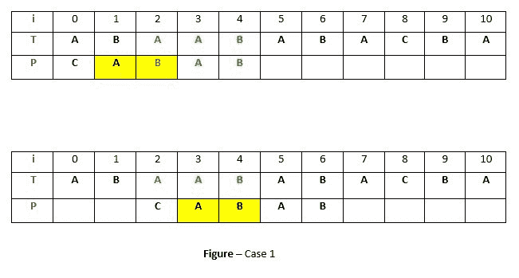
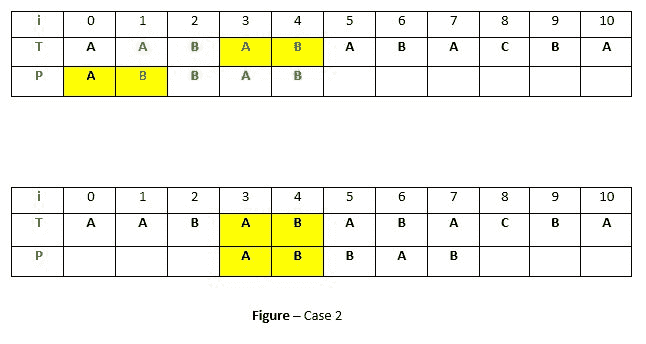
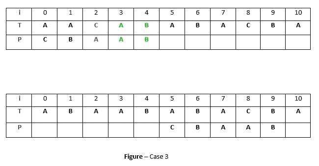
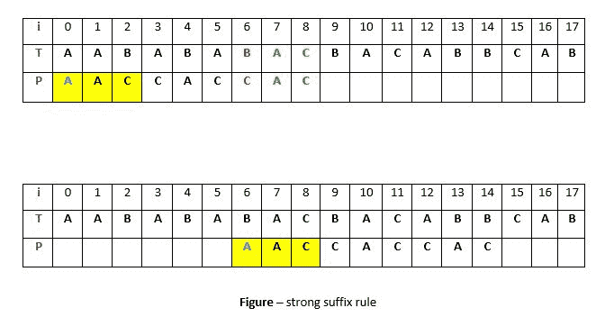
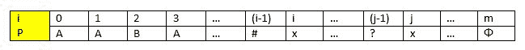

# 博耶摩尔算法|好后缀启发式

> 原文:[https://www . geesforgeks . org/boyer-Moore-algorithm-good-后缀-启发式/](https://www.geeksforgeeks.org/boyer-moore-algorithm-good-suffix-heuristic/)

我们已经讨论了博耶摩尔算法的[坏角色启发式](https://www.geeksforgeeks.org/pattern-searching-set-7-boyer-moore-algorithm-bad-character-heuristic/)变异。在本文中，我们将讨论**好后缀**启发式搜索模式。就像坏字符启发式一样，为好后缀启发式生成预处理表。

**好后缀启发式**

让 **t** 为文本的子串 **T** ，与模式的子串 **P** 匹配。现在我们移动模式直到:
1)在 P 中的 t 的另一个出现与在 t 中的 t 相匹配。
2)P 的前缀，它与 t 的后缀相匹配
3) P 移动经过 t

**情况 1:在 P 中 T 的另一个出现与在 T**
中的 T 相匹配，模式 P 可能包含更少的 **t** 的出现。在这种情况下，我们将尝试移动模式，使其与文本中的 t 对齐



**说明:**在上面的例子中，我们得到了在索引 2 处不匹配之前与模式 P(绿色)匹配的文本 T 的子串 T。现在我们将在 P 中搜索 t(“AB”)的出现。我们已经找到了从位置 1(黄色背景)开始的出现，因此我们将右移模式 2 次，以将 P 中的 t 与 t 中的 t 对齐。这是原始 Boyer Moore 的弱规则，没有太大的效果，我们将很快讨论一个**强好后缀规则**。

**情况二:P 的一个前缀，与 T 的后缀**
匹配，并不总是可能在 P 中找到 T 的出现，有时根本没有出现，在这种情况下有时我们可以搜索一些与 P 的一些**前缀**匹配的 t 的**后缀，尝试通过移位 P 来对齐，例如–**



**说明:**在上面的例子中，我们得到了在不匹配之前在索引 2-4 处与 P(绿色)匹配的 t(“BAB”)。但是因为在 P 中不存在 t 的出现，我们将搜索与 t 的某个后缀匹配的 P 的某个前缀。我们发现从索引 0 开始的前缀“AB”(在黄色背景中)不是与整个 t 匹配，而是与从索引 3 开始的 t 的后缀“AB”匹配。所以现在我们将移动模式 3 次，以对齐前缀和后缀。

**情况 3: P 移过 t**
如果不满足以上两种情况，我们会将模式移过 t，例如–



**解释:**如果上面的例子中，P 中不存在 t(“AB”)的出现，P 中也不存在与 t 的后缀匹配的前缀，那么，在这种情况下，我们在索引 4 之前永远找不到任何完美的匹配，所以我们将把 P 移过 t ie。到索引 5。

**强好后缀启发式**

假设子串 **q = P[i 到 n]** 与 T 中的 **t** 匹配， **c = P[i-1]** 为不匹配字符。现在与情况 1 不同，我们将在 P 中搜索 t，它前面没有字符 **c** 。最接近的这种出现然后通过移动模式 p 与 T 中的 T 对齐。例如–



**说明:**上例中， **q = P[7 到 8]** 与 t 中的 t 匹配，不匹配的字符 **c** 在位置 P[6]处为“C”。现在，如果我们开始在 P 中搜索 t，我们将从位置 4 开始得到 t 的第一次出现。但是这个事件的前面有一个等于 C 的“C”，所以我们将跳过这个，继续搜索。在位置 1，我们得到了 t 的另一个出现(在黄色背景中)。这个事件的前面是“A”(蓝色)，它不等于 C。所以我们将移动模式 P 6 次，使这个事件与 T 中的 T 对齐。我们这样做是因为我们已经知道字符**C =“C”**会导致不匹配。因此，在与 t 对齐时，任何以 c 开头的 t 的出现都会再次导致不匹配，这就是为什么最好跳过这一点。

**好后缀启发式预处理**

作为预处理的一部分，创建一个数组**移位**。如果在位置 **i-1** 出现不匹配，包含距离模式的每个条目 **shift[i]** 将会移动。也就是说，从位置 **i** 开始的模式后缀匹配，并且在位置 **i-1** 出现不匹配。预处理是分别对强好后缀和上述情况 2 进行的。

**1)强好后缀的预处理**
在讨论预处理之前，我们先来讨论一下边框的思想。一个**边框**是一个子串，既有合适的后缀，也有合适的前缀。例如，在字符串**“ccacc”**、**“c”**是边框，**“cc”**是边框，因为它出现在字符串的两端，但**“CCA”**不是边框。

作为预处理的一部分，计算数组 **bpos** (边界位置)。每个条目 **bpos[i]** 包含在给定模式 p 中从索引 I 开始的后缀的边界起始索引。
从位置 m 开始的后缀 **φ** 没有边界，因此 **bpos[m]** 被设置为 **m+1** ，其中 **m** 是模式的长度。
换档位置由不能向左延伸的边界获得。以下是预处理代码–

```
void preprocess_strong_suffix(int *shift, int *bpos,
                  char *pat, int m)
{
    int i = m, j = m+1;
    bpos[i] = j;
    while(i > 0)
    {
        while(j <= m && pat[i-1] != pat[j-1])
        {
            if (shift[j] == 0)
                shift[j] = j-i;
            j = bpos[j];
        }
        i--; j--;
        bpos[i] = j; 
    }
}

```

**说明:**考虑模式**P = " abbab "，m = 7** 。

*   从位置 i = 5 开始的后缀“AB”的最宽边界是从位置 7 开始的φ(无)，因此 bpos[5] = 7。
*   At position i = 2 the suffix is “BABAB”. The widest border for this suffix is “BAB” starting at position 4, so j = bpos[2] = 4.

    我们可以通过下面的例子来理解**bpos[I]= j**-

    

    位于 **i-1** 位置的 **#** 字符是否等同于**字符？**在 **j-1** 位置，我们知道边框会是**？+位置 I 处后缀的边框**开始于位置 **j** ，相当于说 i-1 处后缀的**边框开始于 j-1** 或 **bpos[ i-1 ] = j-1** 或在代码中–

    ```
    i--; 
    j--; 
    bpos[ i ] = j

    ```

    但是如果位置 **i-1** 的字符 **#** 与字符**不匹配呢？**在位置 **j-1** 然后我们继续向右搜索。现在我们知道–

    1.  边框宽度将小于从位置 **j** ie 开始的边框。小于 **x…φ**
    2.  边框必须以 **#** 开始，以 **φ** 结束，或者可以是空的(不存在边框)。

    根据以上两个事实，我们将继续在子字符串 **x…φ** 中从位置 **j 到 m** 进行搜索。下一个边界应该在 **j = bpos[j]** 。更新 **j** 后，我们再次比较位置 **j-1(？)**如果它们相等，那么我们得到我们的边界，否则我们继续向右搜索**直到 j > m** 。该过程由代码显示–

    ```
    while(j <= m && pat[i-1] != pat[j-1])
    {
        j = bpos[j];
    }
    i--; j--;
    bpos[i]=j;

    ```

    在上面的代码中，看看这些条件–

    ```
    pat[i-1] != pat[j-1] 

    ```

    这就是我们在案例 2 中讨论的情况。当模式 P 中 t 出现之前的字符不同于模式 P 中不匹配的字符时，我们停止跳过这些出现并移动模式。所以这里 **P[i] == P[j]** 但是 **P[i-1]！= p[j-1]** 所以我们将模式从 **i 切换到 j** 。所以**换挡【j】= j-I**是 **j** 的记录仪。因此，每当位置 **j** 出现任何不匹配时，我们将模式**向右移动【j+1】**位置。
    在上述代码中，以下条件非常重要–

    ```
    if (shift[j] == 0 )

    ```

    这种情况防止后缀具有相同的边界来修改**移位【j】**值。例如，考虑模式 **P = "addbddcdd"** ，在这种情况下，当我们为 i = 4 然后 j = 7 计算 bpos[ i-1 ]时。我们最终将设置 shift[ 7 ] = 3 的值。现在，如果我们计算 i = 1 的 BPO[I-1]，那么 j = 7，如果没有测试移位[ j ] == 0，我们将再次设置值移位[ 7 ] = 6。这意味着如果我们在位置 6 有一个不匹配，我们将把模式 P 3 位置移到右边，而不是位置 6。

    **2)情况 2 的预处理**
    在情况 2 的预处理中，对于每个后缀，确定包含在该后缀中的整个图案的**最宽边界。
    图案最宽边界的起始位置存储在 **bpos[0]**
    中，在下面的预处理算法中，这个值 bpos[0]最初存储在数组移位的所有自由项中。但是当模式的后缀变得比 bpos[0]短时，算法继续使用模式的下一个更宽的边界，即 bpos[j]。**

    以下是搜索算法的实现–

    ## C++

    ```
    /* C program for Boyer Moore Algorithm with 
       Good Suffix heuristic to find pattern in
       given text string */

    #include <stdio.h>
    #include <string.h>

    // preprocessing for strong good suffix rule
    void preprocess_strong_suffix(int *shift, int *bpos,
                                    char *pat, int m)
    {
        // m is the length of pattern 
        int i=m, j=m+1;
        bpos[i]=j;

        while(i>0)
        {
            /*if character at position i-1 is not equivalent to
              character at j-1, then continue searching to right
              of the pattern for border */
            while(j<=m && pat[i-1] != pat[j-1])
            {
                /* the character preceding the occurrence of t in 
                   pattern P is different than the mismatching character in P, 
                   we stop skipping the occurrences and shift the pattern
                   from i to j */
                if (shift[j]==0)
                    shift[j] = j-i;

                //Update the position of next border 
                j = bpos[j];
            }
            /* p[i-1] matched with p[j-1], border is found.
               store the  beginning position of border */
            i--;j--;
            bpos[i] = j; 
        }
    }

    //Preprocessing for case 2
    void preprocess_case2(int *shift, int *bpos,
                          char *pat, int m)
    {
        int i, j;
        j = bpos[0];
        for(i=0; i<=m; i++)
        {
            /* set the border position of the first character of the pattern
               to all indices in array shift having shift[i] = 0 */ 
            if(shift[i]==0)
                shift[i] = j;

            /* suffix becomes shorter than bpos[0], use the position of 
               next widest border as value of j */
            if (i==j)
                j = bpos[j];
        }
    }

    /*Search for a pattern in given text using
      Boyer Moore algorithm with Good suffix rule */
    void search(char *text, char *pat)
    {
        // s is shift of the pattern with respect to text
        int s=0, j;
        int m = strlen(pat);
        int n = strlen(text);

        int bpos[m+1], shift[m+1];

        //initialize all occurrence of shift to 0
        for(int i=0;i<m+1;i++) shift[i]=0;

        //do preprocessing
        preprocess_strong_suffix(shift, bpos, pat, m);
        preprocess_case2(shift, bpos, pat, m);

        while(s <= n-m)
        {

            j = m-1;

            /* Keep reducing index j of pattern while characters of
                 pattern and text are matching at this shift s*/
            while(j >= 0 && pat[j] == text[s+j])
                j--;

            /* If the pattern is present at the current shift, then index j
                 will become -1 after the above loop */
            if (j<0)
            {
                printf("pattern occurs at shift = %d\n", s);
                s += shift[0];
            }
            else
                /*pat[i] != pat[s+j] so shift the pattern
                  shift[j+1] times  */
                s += shift[j+1];
        }

    }

    //Driver 
    int main()
    {
        char text[] = "ABAAAABAACD";
        char pat[] = "ABA";
        search(text, pat);
        return 0;
    }
    ```

    ## Java 语言(一种计算机语言，尤用于创建网站)

    ```
    /* Java program for Boyer Moore Algorithm with 
    Good Suffix heuristic to find pattern in
    given text string */
    class GFG 
    {

    // preprocessing for strong good suffix rule
    static void preprocess_strong_suffix(int []shift, int []bpos,
                                          char []pat, int m)
    {
        // m is the length of pattern 
        int i = m, j = m + 1;
        bpos[i] = j;

        while(i > 0)
        {
            /*if character at position i-1 is not 
            equivalent to character at j-1, then 
            continue searching to right of the
            pattern for border */
            while(j <= m && pat[i - 1] != pat[j - 1])
            {
                /* the character preceding the occurrence of t 
                in pattern P is different than the mismatching 
                character in P, we stop skipping the occurrences 
                and shift the pattern from i to j */
                if (shift[j] == 0)
                    shift[j] = j - i;

                //Update the position of next border 
                j = bpos[j];
            }
            /* p[i-1] matched with p[j-1], border is found.
            store the beginning position of border */
            i--; j--;
            bpos[i] = j; 
        }
    }

    //Preprocessing for case 2
    static void preprocess_case2(int []shift, int []bpos,
                                  char []pat, int m)
    {
        int i, j;
        j = bpos[0];
        for(i = 0; i <= m; i++)
        {
            /* set the border position of the first character 
            of the pattern to all indices in array shift
            having shift[i] = 0 */
            if(shift[i] == 0)
                shift[i] = j;

            /* suffix becomes shorter than bpos[0], 
            use the position of next widest border
            as value of j */
            if (i == j)
                j = bpos[j];
        }
    }

    /*Search for a pattern in given text using
    Boyer Moore algorithm with Good suffix rule */
    static void search(char []text, char []pat)
    {
        // s is shift of the pattern 
        // with respect to text
        int s = 0, j;
        int m = pat.length;
        int n = text.length;

        int []bpos = new int[m + 1];
        int []shift = new int[m + 1];

        //initialize all occurrence of shift to 0
        for(int i = 0; i < m + 1; i++) 
            shift[i] = 0;

        //do preprocessing
        preprocess_strong_suffix(shift, bpos, pat, m);
        preprocess_case2(shift, bpos, pat, m);

        while(s <= n - m)
        {
            j = m - 1;

            /* Keep reducing index j of pattern while 
            characters of pattern and text are matching 
            at this shift s*/
            while(j >= 0 && pat[j] == text[s+j])
                j--;

            /* If the pattern is present at the current shift, 
            then index j will become -1 after the above loop */
            if (j < 0)
            {
                System.out.printf("pattern occurs at shift = %d\n", s);
                s += shift[0];
            }
            else

                /*pat[i] != pat[s+j] so shift the pattern
                shift[j+1] times */
                s += shift[j + 1];
        }

    }

    // Driver Code
    public static void main(String[] args) 
    {
        char []text = "ABAAAABAACD".toCharArray();
        char []pat = "ABA".toCharArray();
        search(text, pat);
    }
    } 

    // This code is contributed by 29AjayKumar
    ```

    ## 蟒蛇 3

    ```
    # Python3 program for Boyer Moore Algorithm with 
    # Good Suffix heuristic to find pattern in 
    # given text string

    # preprocessing for strong good suffix rule
    def preprocess_strong_suffix(shift, bpos, pat, m):

        # m is the length of pattern
        i = m
        j = m + 1
        bpos[i] = j

        while i > 0:

            '''if character at position i-1 is 
            not equivalent to character at j-1, 
            then continue searching to right 
            of the pattern for border '''
            while j <= m and pat[i - 1] != pat[j - 1]:

                ''' the character preceding the occurrence 
                of t in pattern P is different than the 
                mismatching character in P, we stop skipping
                the occurrences and shift the pattern 
                from i to j '''
                if shift[j] == 0:
                    shift[j] = j - i

                # Update the position of next border
                j = bpos[j]

            ''' p[i-1] matched with p[j-1], border is found. 
            store the beginning position of border '''
            i -= 1
            j -= 1
            bpos[i] = j

    # Preprocessing for case 2
    def preprocess_case2(shift, bpos, pat, m):
        j = bpos[0]
        for i in range(m + 1):

            ''' set the border position of the first character 
            of the pattern to all indices in array shift
            having shift[i] = 0 '''
            if shift[i] == 0:
                shift[i] = j

            ''' suffix becomes shorter than bpos[0], 
            use the position of next widest border
            as value of j '''
            if i == j:
                j = bpos[j]

    '''Search for a pattern in given text using 
    Boyer Moore algorithm with Good suffix rule '''
    def search(text, pat):

        # s is shift of the pattern with respect to text
        s = 0
        m = len(pat)
        n = len(text)

        bpos = [0] * (m + 1)

        # initialize all occurrence of shift to 0
        shift = [0] * (m + 1)

        # do preprocessing
        preprocess_strong_suffix(shift, bpos, pat, m)
        preprocess_case2(shift, bpos, pat, m)

        while s <= n - m:
            j = m - 1

            ''' Keep reducing index j of pattern while characters of 
                pattern and text are matching at this shift s'''
            while j >= 0 and pat[j] == text[s + j]:
                j -= 1

            ''' If the pattern is present at the current shift, 
                then index j will become -1 after the above loop '''
            if j < 0:
                print("pattern occurs at shift = %d" % s)
                s += shift[0]
            else:

                '''pat[i] != pat[s+j] so shift the pattern 
                shift[j+1] times '''
                s += shift[j + 1]

    # Driver Code
    if __name__ == "__main__":
        text = "ABAAAABAACD"
        pat = "ABA"
        search(text, pat)

    # This code is contributed by
    # sanjeev2552
    ```

    ## C#

    ```
    /* C# program for Boyer Moore Algorithm with 
    Good Suffix heuristic to find pattern in
    given text string */
    using System;

    class GFG 
    {

    // preprocessing for strong good suffix rule
    static void preprocess_strong_suffix(int []shift, 
                                         int []bpos,
                                         char []pat, int m)
    {
        // m is the length of pattern 
        int i = m, j = m + 1;
        bpos[i] = j;

        while(i > 0)
        {
            /*if character at position i-1 is not 
            equivalent to character at j-1, then 
            continue searching to right of the
            pattern for border */
            while(j <= m && pat[i - 1] != pat[j - 1])
            {
                /* the character preceding the occurrence of t 
                in pattern P is different than the mismatching 
                character in P, we stop skipping the occurrences 
                and shift the pattern from i to j */
                if (shift[j] == 0)
                    shift[j] = j - i;

                //Update the position of next border 
                j = bpos[j];
            }
            /* p[i-1] matched with p[j-1], border is found.
            store the beginning position of border */
            i--; j--;
            bpos[i] = j; 
        }
    }

    //Preprocessing for case 2
    static void preprocess_case2(int []shift, int []bpos,
                                 char []pat, int m)
    {
        int i, j;
        j = bpos[0];
        for(i = 0; i <= m; i++)
        {
            /* set the border position of the first character 
            of the pattern to all indices in array shift
            having shift[i] = 0 */
            if(shift[i] == 0)
                shift[i] = j;

            /* suffix becomes shorter than bpos[0], 
            use the position of next widest border
            as value of j */
            if (i == j)
                j = bpos[j];
        }
    }

    /*Search for a pattern in given text using
    Boyer Moore algorithm with Good suffix rule */
    static void search(char []text, char []pat)
    {
        // s is shift of the pattern 
        // with respect to text
        int s = 0, j;
        int m = pat.Length;
        int n = text.Length;

        int []bpos = new int[m + 1];
        int []shift = new int[m + 1];

        // initialize all occurrence of shift to 0
        for(int i = 0; i < m + 1; i++) 
            shift[i] = 0;

        // do preprocessing
        preprocess_strong_suffix(shift, bpos, pat, m);
        preprocess_case2(shift, bpos, pat, m);

        while(s <= n - m)
        {
            j = m - 1;

            /* Keep reducing index j of pattern while 
            characters of pattern and text are matching 
            at this shift s*/
            while(j >= 0 && pat[j] == text[s + j])
                j--;

            /* If the pattern is present at the current shift, 
            then index j will become -1 after the above loop */
            if (j < 0)
            {
                Console.Write("pattern occurs at shift = {0}\n", s);
                s += shift[0];
            }
            else

                /*pat[i] != pat[s+j] so shift the pattern
                shift[j+1] times */
                s += shift[j + 1];
        }
    }

    // Driver Code
    public static void Main(String[] args) 
    {
        char []text = "ABAAAABAACD".ToCharArray();
        char []pat = "ABA".ToCharArray();
        search(text, pat);
    }
    } 

    // This code is contributed by PrinciRaj1992
    ```

     **Output:**

    ```
    pattern occurs at shift = 0
    pattern occurs at shift = 5

    ```

    **参考文献**

    *   [http://www . iti . FH-flensburg . de/lang/algorithm/pattern/bmen . htm](http://www.iti.fh-flensburg.de/lang/algorithmen/pattern/bmen.htm)

    本文由 [**阿图尔·库马尔**](https://www.linkedin.com/in/atul-kumar-733b32136/) 供稿。如果你喜欢 GeeksforGeeks 并想投稿，你也可以使用[contribute.geeksforgeeks.org](http://www.contribute.geeksforgeeks.org)写一篇文章或者把你的文章邮寄到 contribute@geeksforgeeks.org。看到你的文章出现在极客博客主页上，帮助其他极客。

    如果你发现任何不正确的地方，或者你想分享更多关于上面讨论的话题的信息，请写评论。