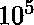

# 破开一个数，使得第一部分是第二部分除以 10 的整数次幂

> 原文:[https://www . geesforgeks . org/breaking-number-first-part-integer-division-second-power-10/](https://www.geeksforgeeks.org/breaking-number-first-part-integral-division-second-power-10/)

给定一个非常大的数 N，我们需要对总数进行计数，这样如果我们将数分成两部分 **a** 和 **b** ，第一部分 **a** 可以通过将第二部分 **b** 积分除以 10 的幂 p 和 p > =0 而得到。
1<= N 中的位数< = 。

**示例:**

```
Input : 220
Output : 1
220 can be divided as a = 2 and b = 20
such that for p = 1, b/10 = a.

Input : 1111
Output : 2
We get answer 2 because we need to consider
integral division.
Let's consider the first partition a = 1,
b = 111\. for p = 2, b/pow(10,p) = a thus
this is a valid partition.
now a = 11, b = 11\. for p = 0, b/pow(10,p) 
= a thus this too is a valid combination.

Input : 2202200
Output : 2
for a = 2 b = 202200, p = 5 and
a = 220, b = 2200, p = 1

```

因为这个数字可能非常大，甚至包含在一个长整型数中，所以我们将它存储为一个字符串。根据问题中提到的条件，划分就是楼层功能。一种简单而低效的方法是将字符串分成两个子字符串，然后将它们转换为整数并执行除法。
一个有效的方法是使用字符串比较函数来匹配两个字符串的最高有效数字，并忽略其余部分(floor 函数)。下面是这个想法的实现:

## C++

```
#include <bits/stdc++.h>
using namespace std;

// c++ function to count ways to divide a
// string in two parts a and b such that
// b/pow(10, p) == a
int calculate(string N)
{
    int len = N.length();
    int l = (len) / 2;
    int count = 0;

    for (int i = 1; i <= l; i++) {

        // substring representing int a
        string s = N.substr(0, i);

        // no of digits in a
        int l1 = s.length();

        // consider only most significant 
        // l1 characters of remaining string 
        // for int b
        string t = N.substr(i, l1);

        // if any of a or b contains leading 0s
        // discard this combination
        if (s[0] == '0' || t[0] == '0')
            continue;

        // if both are equal
        if (s.compare(t) == 0) 
            count++;        
    }
    return count;
}

// driver function to test above function
int main()
{
    string N = "2202200";
    cout << calculate(N);
    return 0;
}
```

## Java 语言(一种计算机语言，尤用于创建网站)

```
// Java program to count ways to divide a
// String in two parts a and b such that
// b/pow(10, p) == a
import java.util.*;

class GFG
{
static int calculate(String N)
{
    int len = N.length();
    int l = (len) / 2;
    int count = 0;

    for (int i = 1; i <= l; i++) 
    {

        // subString representing int a
        String s = N.substring(0, i);

        // no of digits in a
        int l1 = s.length();

        // consider only most significant 
        // l1 characters of remaining String 
        // for int b
        String t = N.substring(i, l1 + i);

        // if any of a or b contains leading 0s
        // discard this combination
        if (s.charAt(0) == '0' || t.charAt(0) == '0')
            continue;

        // if both are equal
        if (s.compareTo(t) == 0) 
            count++;     
    }
    return count;
}

// Driver Code
public static void main(String[] args)
{
    String N = "2202200";
    System.out.print(calculate(N));
}
}

// This code is contributed by Rajput-Ji
```

## 蟒蛇 3

```
# Python3 program to count ways to divide
# a string in two parts a and b such that
# b/pow(10, p) == a

def calculate( N ):
    length = len(N)
    l = int((length) / 2)
    count = 0

    for i in range(l + 1):

        # substring representing int a
        s = N[0: 0 + i]

        # no of digits in a
        l1 = len(s)

        # consider only most significant
        # l1 characters of remaining 
        # string for int b
        t = N[i: l1 + i]

        # if any of a or b contains 
        # leading 0s discard this 
        try:
            if s[0] == '0' or t[0] == '0':
                continue
        except:
            continue

        # if both are equal
        if s == t:
            count+=1
    return count

# driver code to test above function
N = str("2202200")
print(calculate(N))

# This code is contributed by "Sharad_Bhardwaj".
```

## C#

```
// C# program to count ways to divide a
// String in two parts a and b such that
// b/pow(10, p) == a
using System;

class GFG
{
static int calculate(String N)
{
    int len = N.Length;
    int l = (len) / 2;
    int count = 0;

    for (int i = 1; i <= l; i++) 
    {

        // subString representing int a
        String s = N.Substring(0, i);

        // no of digits in a
        int l1 = s.Length;

        // consider only most significant 
        // l1 characters of remaining String 
        // for int b
        String t = N.Substring(i, l1);

        // if any of a or b contains leading 0s
        // discard this combination
        if (s[0] == '0' || t[0] == '0')
            continue;

        // if both are equal
        if (s.CompareTo(t) == 0) 
            count++;     
    }
    return count;
}

// Driver Code
public static void Main(String[] args)
{
    String N = "2202200";
    Console.Write(calculate(N));
}
}

// This code is contributed by PrinciRaj1992
```

**Output:**

```
2

```