# 布雷森汉三维线描算法

> 原文:[https://www . geeksforgeeks . org/bresenhams-3d 线描算法/](https://www.geeksforgeeks.org/bresenhams-algorithm-for-3-d-line-drawing/)

给定两个三维坐标，我们需要找到连接它们的线上的点。所有的点都有整数坐标。

示例:

```
Input  : (-1, 1, 1), (5, 3, -1)
Output : (-1, 1, 1), (0, 1, 1), (1, 2, 0),
          (2, 2, 0), (3, 2, 0), (4, 3, -1), 
          (5, 3, -1)

Input  : (-7, 0, -3), (2, -5, -1)
Output : (-7, 0, -3), (-6, -1, -3), (-5, -1, -3),
         (-4, -2, -2), (-3, -2, -2), (-2, -3, -2),
         (-1, -3, -2), (0, -4, -1), (1, -4, -1),
          (2, -5, -1)

```

Bresenham 算法是有效的，因为它避免了浮点算术运算。与[二维线图](https://www.geeksforgeeks.org/bresenhams-line-generation-algorithm)的情况一样，我们使用一个变量来存储斜率误差，即从实际几何线绘制的线的斜率误差。一旦斜率误差超过允许值，我们就修改数字以消除误差。

要绘制的线的驱动轴是该线行进最远的轴，即轴坐标的差异最大。因此，坐标值沿着驱动轴线性增加 1，并且斜率误差变量用于确定另一个轴的坐标值的变化。

对于二维线，我们使用一个斜率误差变量，但是对于三维线，对于每个非驱动轴，我们需要两个斜率误差变量。如果当前点是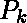 **(x，y，z)** ，驱动轴是正的 X 轴，那么下一个点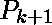可能是

*   **(x+1，y，z)**
*   **(x+1，y+1，z)**
*   **(x+1，y，z+1)**
*   **(x+1，y+1，z+1)**

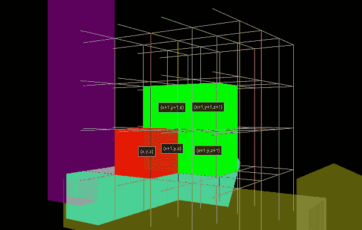

斜率误差变量的值根据以下等式确定:-
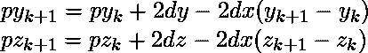

斜率误差变量的初始值由以下等式给出:-
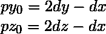
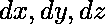这里表示两个端点沿 X、Y、Z 轴的坐标差。

**算法:-**

1.  输入两个端点，并将起始点存储为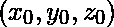
2.  剧情 
3.  计算常数并通过比较
    
    的绝对值确定驱动轴如果 abs( )最大，则 X 轴为驱动轴
    如果 abs( )最大，则 Y 轴为驱动轴
    如果 abs( 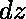)最大，则 Z 轴为驱动轴
4.  假设 X 轴是驱动轴，那么
    
5.  在沿线的每个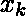处，从 k = 0 开始，检查以下条件
    并确定下一个点:-
    *   如果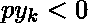和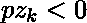，则
        绘制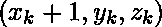和
        设置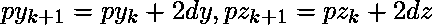
    *   否则如果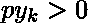和，则
        绘制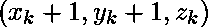和
        设置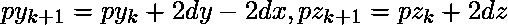
    *   否则如果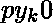，则
        出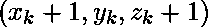和
        设定
    *   否则接着
        剧情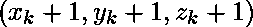和
        设定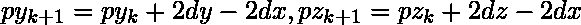T4】
6.  重复第 5 步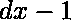次

## 蟒蛇 3

```
# Python3 code for generating points on a 3-D line 
# using Bresenham's Algorithm

def Bresenham3D(x1, y1, z1, x2, y2, z2):
    ListOfPoints = []
    ListOfPoints.append((x1, y1, z1))
    dx = abs(x2 - x1)
    dy = abs(y2 - y1)
    dz = abs(z2 - z1)
    if (x2 > x1):
        xs = 1
    else:
        xs = -1
    if (y2 > y1):
        ys = 1
    else:
        ys = -1
    if (z2 > z1):
        zs = 1
    else:
        zs = -1

    # Driving axis is X-axis"
    if (dx >= dy and dx >= dz):        
        p1 = 2 * dy - dx
        p2 = 2 * dz - dx
        while (x1 != x2):
            x1 += xs
            if (p1 >= 0):
                y1 += ys
                p1 -= 2 * dx
            if (p2 >= 0):
                z1 += zs
                p2 -= 2 * dx
            p1 += 2 * dy
            p2 += 2 * dz
            ListOfPoints.append((x1, y1, z1))

    # Driving axis is Y-axis"
    elif (dy >= dx and dy >= dz):       
        p1 = 2 * dx - dy
        p2 = 2 * dz - dy
        while (y1 != y2):
            y1 += ys
            if (p1 >= 0):
                x1 += xs
                p1 -= 2 * dy
            if (p2 >= 0):
                z1 += zs
                p2 -= 2 * dy
            p1 += 2 * dx
            p2 += 2 * dz
            ListOfPoints.append((x1, y1, z1))

    # Driving axis is Z-axis"
    else:        
        p1 = 2 * dy - dz
        p2 = 2 * dx - dz
        while (z1 != z2):
            z1 += zs
            if (p1 >= 0):
                y1 += ys
                p1 -= 2 * dz
            if (p2 >= 0):
                x1 += xs
                p2 -= 2 * dz
            p1 += 2 * dy
            p2 += 2 * dx
            ListOfPoints.append((x1, y1, z1))
    return ListOfPoints

def main():
    (x1, y1, z1) = (-1, 1, 1)
    (x2, y2, z2) = (5, 3, -1)
    ListOfPoints = Bresenham3D(x1, y1, z1, x2, y2, z2)
    print(ListOfPoints)

main()
```

**Output:**

```
[(-1, 1, 1), (0, 1, 1), (1, 2, 0), (2, 2, 0), (3, 2, 0), (4, 3, -1), (5, 3, -1)]

```