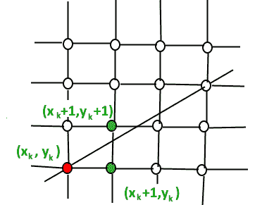

# 布雷森汉姆线生成算法

> 原文:[https://www . geesforgeks . org/bresenhams-line-generation-algorithm/](https://www.geeksforgeeks.org/bresenhams-line-generation-algorithm/)

给定两点 A(x1，y1)和 B(x2，y2)的坐标。寻找在像素的计算机屏幕上绘制直线 AB 所需的所有中间点的任务。请注意，每个像素都有整数坐标。
示例:

```
Input  : A(0,0), B(4,4)
Output : (0,0), (1,1), (2,2), (3,3), (4,4)

Input  : A(0,0), B(4,2)
Output : (0,0), (1,0), (2,1), (3,1), (4,2)
```

下面是一些保持算法简单的假设。

1.  我们从左向右画线。
2.  x1 < x2 和 y1< y2
3.  直线的斜率在 0 和 1 之间。我们从左下角到右上角画一条线。

让我们先从天真的角度来理解这个过程。

```
// A naive way of drawing line
void naiveDrawLine(x1, x2, y1, y2)
{
   m = (y2 - y1)/(x2 - x1)
   for (x  = x1; x <= x2; x++) 
   {    
      // Assuming that the round function finds
      // closest integer to a given float.
      y = round(mx + c);    
      print(x, y); 
   }
}
```

以上算法可行，但速度较慢。Bresenham 算法的思想是避免浮点乘法和加法来计算 mx + c，然后每一步计算(mx + c)的取整值。在 Bresenham 算法中，我们以单位间隔在 x 轴上移动。

1.  我们总是将 X 增加 1，我们选择关于下一个 Y，是需要去 y+1 还是留在 Y 上，换句话说，从任意位置(X <sub>k</sub> ，Y <sub>k</sub> )我们需要在(X <sub>k</sub> + 1，Y <sub>k</sub> )和(X <sub>k</sub> + 1，Y <sub>k</sub> + 1)之间进行选择。



1.  我们想在 Y <sub>k</sub> + 1 和 Y <sub>k</sub> 中选择对应于更接近原始线的点的 Y 值。

我们需要一个决策参数来决定是选择 Y <sub>k</sub> + 1 还是 Y <sub>k</sub> 作为下一个点。这个想法是跟踪从以前的增量到 y 的斜率误差。如果斜率误差变得大于 0.5，我们知道直线已经向上移动了一个像素，我们必须增加我们的 y 坐标并重新调整误差，以表示从新像素顶部的距离——这是通过从误差中减去一来完成的。

```
// Modifying the naive way to use a parameter
// to decide next y.
void withDecisionParameter(x1, x2, y1, y2)
{
   m = (y2 - y1)/(x2 - x1)
   slope_error = [Some Initial Value]
   for (x = x1, y = y1; x = 0.5)  
   {       
      y++;       
      slope_error  -= 1.0;    
   }
}
```

**如何避免浮点运算**
以上算法仍然包含浮点运算。为避免浮点运算，请考虑值 m 以下的值。
m =(y2–y1)/(x2–x1)
我们将两边乘以(x2–x1)
我们还将 slope_error 更改为 slope _ error *(x2–x1)。为了避免与 0.5 进行比较，我们进一步将其更改为 slope _ error *(x2–x1)* 2。
还有，一般比较喜欢 0 比 1。

```
// Modifying the above algorithm to avoid floating 
// point arithmetic and use comparison with 0.
void bresenham(x1, x2, y1, y2)
{
   m_new = 2 * (y2 - y1)
   slope_error_new = [Some Initial Value]
   for (x = x1, y = y1; x = 0)  
   {       
      y++;       
      slope_error_new  -= 2 * (x2 - x1);    
   }
}
```

slope_error_new 的初始值为 2 *(y2–y1)–(x2–x1)。这个值的证明参考[这个](https://csustan.csustan.edu/~tom/Lecture-Notes/Graphics/Bresenham-Line/Bresenham-Line.pdf)
下面是上面算法的实现。

## C++

```
// C++ program for Bresenham’s Line Generation
// Assumptions :
// 1) Line is drawn from left to right.
// 2) x1 < x2 and y1 < y2
// 3) Slope of the line is between 0 and 1.
//    We draw a line from lower left to upper
//    right.
#include<bits/stdc++.h>
using namespace std;

// function for line generation
void bresenham(int x1, int y1, int x2, int y2)
{
   int m_new = 2 * (y2 - y1);
   int slope_error_new = m_new - (x2 - x1);
   for (int x = x1, y = y1; x <= x2; x++)
   {
      cout << "(" << x << "," << y << ")\n";

      // Add slope to increment angle formed
      slope_error_new += m_new;

      // Slope error reached limit, time to
      // increment y and update slope error.
      if (slope_error_new >= 0)
      {
         y++;
         slope_error_new  -= 2 * (x2 - x1);
      }
   }
}

// driver function
int main()
{
  int x1 = 3, y1 = 2, x2 = 15, y2 = 5;
  bresenham(x1, y1, x2, y2);
  return 0;
}
```

## Java 语言(一种计算机语言，尤用于创建网站)

```
// Java program for Bresenhams Line Generation
// Assumptions :
// 1) Line is drawn from left to right.
// 2) x1 < x2 and y1 < y2
// 3) Slope of the line is between 0 and 1.
// We draw a line from lower left to upper
// right.
class GFG
{
    // function for line generation
    static void bresenham(int x1, int y1, int x2,
                                         int y2)
    {
        int m_new = 2 * (y2 - y1);
        int slope_error_new = m_new - (x2 - x1);

        for (int x = x1, y = y1; x <= x2; x++)
        {
            System.out.print("(" +x + "," + y + ")\n");

            // Add slope to increment angle formed
            slope_error_new += m_new;

            // Slope error reached limit, time to
            // increment y and update slope error.
            if (slope_error_new >= 0)
            {
                y++;
                slope_error_new -= 2 * (x2 - x1);
            }
        }
    }         

    // Driver code 
    public static void main (String[] args)
    {
        int x1 = 3, y1 = 2, x2 = 15, y2 = 5;    
        bresenham(x1, y1, x2, y2);
    }
}

// This code is contributed by Anant Agarwal.
```

## 蟒蛇 3

```
# Python 3 program for Bresenham’s Line Generation 
# Assumptions : 
# 1) Line is drawn from left to right. 
# 2) x1 < x2 and y1 < y2 
# 3) Slope of the line is between 0 and 1. 
# We draw a line from lower left to upper 
# right. 

# function for line generation 
def bresenham(x1,y1,x2, y2): 

    m_new = 2 * (y2 - y1) 
    slope_error_new = m_new - (x2 - x1)

    y=y1
    for x in range(x1,x2+1): 

        print("(",x ,",",y ,")\n") 

        # Add slope to increment angle formed 
        slope_error_new =slope_error_new + m_new 

        # Slope error reached limit, time to 
        # increment y and update slope error. 
        if (slope_error_new >= 0): 
            y=y+1
            slope_error_new =slope_error_new - 2 * (x2 - x1) 

# driver function 
if __name__=='__main__':
    x1 = 3
    y1 = 2
    x2 = 15
    y2 = 5
    bresenham(x1, y1, x2, y2) 

#This code is contributed by ash264
```

## C#

```
// C# program for Bresenhams Line Generation
// Assumptions :
// 1) Line is drawn from left to right.
// 2) x1 < x2 and y1< y2
// 3) Slope of the line is between 0 and 1.
// We draw a line from lower left to upper
// right.
using System;

class GFG {

    // function for line generation
    static void bresenham(int x1, int y1, int x2,
                                        int y2)
    {

        int m_new = 2 * (y2 - y1);
        int slope_error_new = m_new - (x2 - x1);

        for (int x = x1, y = y1; x <= x2; x++)
        {
            Console.Write("(" + x + "," + y + ")\n");

            // Add slope to increment angle formed
            slope_error_new += m_new;

            // Slope error reached limit, time to
            // increment y and update slope error.
            if (slope_error_new >= 0)
            {
                y++;
                slope_error_new -= 2 * (x2 - x1);
            }
        }
    }         

    // Driver code 
    public static void Main ()
    {
        int x1 = 3, y1 = 2, x2 = 15, y2 = 5; 

        bresenham(x1, y1, x2, y2);
    }
}

// This code is contributed by nitin mittal.
```

## 服务器端编程语言（Professional Hypertext Preprocessor 的缩写）

```
<?php
// PHP program for Bresenham’s 
// Line Generation Assumptions :

// 1) Line is drawn from
// left to right.
// 2) x1 < x2 and y1 < y2
// 3) Slope of the line is 
// between 0 and 1.
// We draw a line from lower 
// left to upper right.

// function for line generation
function bresenham($x1, $y1, $x2, $y2)
{
$m_new = 2 * ($y2 - $y1);
$slope_error_new = $m_new - ($x2 - $x1);
for ($x = $x1, $y = $y1; $x <= $x2; $x++)
{
    echo "(" ,$x , "," , $y, ")\n";

    // Add slope to increment
    // angle formed
    $slope_error_new += $m_new;

    // Slope error reached limit, 
    // time to increment y and 
    // update slope error.
    if ($slope_error_new >= 0)
    {
        $y++;
        $slope_error_new -= 2 * ($x2 - $x1);
    }
}
}

// Driver Code
$x1 = 3; $y1 = 2; $x2 = 15; $y2 = 5;
bresenham($x1, $y1, $x2, $y2);

// This code is contributed by nitin mittal.
?>
```

## java 描述语言

```
<script>

// javascript program for Bresenhams Line Generation
// Assumptions :
// 1) Line is drawn from left to right.
// 2) x1 < x2 and y1 < y2
// 3) Slope of the line is between 0 and 1.
// We draw a line from lower left to upper
// right.

    // function for line generation
    function bresenham(x1 , y1 , x2,y2)
    {
        var m_new = 2 * (y2 - y1);
        var slope_error_new = m_new - (x2 - x1);

        for (x = x1, y = y1; x <= x2; x++)
        {
            document.write("(" +x + "," + y + ")<br>");

            // Add slope to increment angle formed
            slope_error_new += m_new;

            // Slope error reached limit, time to
            // increment y and update slope error.
            if (slope_error_new >= 0)
            {
                y++;
                slope_error_new -= 2 * (x2 - x1);
            }
        }
    }         

    // Driver code 

var x1 = 3, y1 = 2, x2 = 15, y2 = 5;    
bresenham(x1, y1, x2, y2);

// This code is contributed by Amit Katiyar 

</script>
```

**输出:**

```
(3,2)
(4,3)
(5,3)
(6,3)
(7,3)
(8,4)
(9,4)
(10,4)
(11,4)
(12,5)
(13,5)
(14,5)
(15,5) 
```

**时间复杂度:**O(x2–x1)
T3】辅助空间: O(1)
以上的解释是为了提供算法背后的大致思路。关于详细的解释和证明，读者可以参考下面的参考资料。
**相关文章:**

1.  [中点线生成算法](https://www.geeksforgeeks.org/mid-point-line-generation-algorithm/)
2.  [线条绘制的 DDA 算法](https://www.geeksforgeeks.org/dda-line-generation-algorithm-computer-graphics/)

**参考:**
[https://csustan . csustan . edu/~ Tom/讲课笔记/Graphics/Bresenham-Line/Bresenham-Line . pdf](https://csustan.csustan.edu/~tom/Lecture-Notes/Graphics/Bresenham-Line/Bresenham-Line.pdf)
[【https://en.wikipedia.org/wiki/Bresenham's_line_algorithm】](https://en.wikipedia.org/wiki/Bresenham's_line_algorithm)
[http://Graphics . idav . ucdavis . edu/edu/education/Graphics Notes/Bresenham-algorithm . pdf](http://graphics.idav.ucdavis.edu/education/GraphicsNotes/Bresenhams-Algorithm.pdf)
本文由[**Shivam prad Han(anj _ charm)供稿如果你喜欢 GeeksforGeeks 并想投稿，你也可以使用**](https://www.facebook.com/anuj.charm)**[write.geeksforgeeks.org](https://write.geeksforgeeks.org)写一篇文章或者把你的文章邮寄到 review-team@geeksforgeeks.org。看到你的文章出现在极客博客主页上，帮助其他极客。
如果发现有不正确的地方，或者想分享更多关于上述话题的信息，请写评论。**