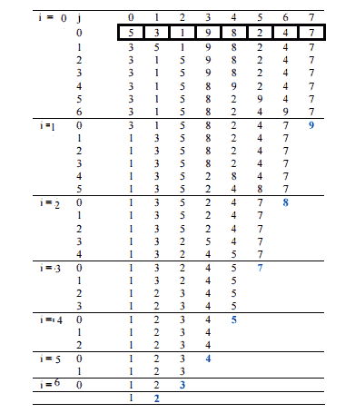

# 气泡排序

> 原文:[https://www.geeksforgeeks.org/bubble-sort/](https://www.geeksforgeeks.org/bubble-sort/)

冒泡排序是最简单的排序算法，如果相邻元素的顺序错误，可以通过重复交换它们来工作。
**例:**
**首通:**
(**5****1**4 2 8)–>(**1****5**4 2 8)，这里，算法比较前两个元素，并互换自 5 > 1。
(1**5****4**2 8)–>(1**4**T22】52 8)、互换自 5>4
(1 4**5**T27】28)–>(1 4**2**T31】58)、 交换自 5>2
(1 4 2**5****8**)–>(1 4 2**5****8**)现在，由于这些元素已经按顺序排列(8 > 5)，算法不会交换它们。
**二传:**
(**1**T48】42 5 8)–>(**1**T52】42 5 8)
(1**4**T57】25 8)–>(1**2**T61】45 8)、 互换自 4>2
(1 2**4**T66】58)–>(1 2**4**T70】58)
(1 2 4**5**T75】8)–>(1 2 4**5** 算法需要一个**整体**通过，没有任何**的**交换才能知道排序。
**第三关:**
(**1****2**4 5 8)–>(**1****2**4 5 8)
(1**2****4**5 8)–>(1**2****4 **(1 2 4**5****8**)–>(1 2 4**5****8**)**** 

下面是冒泡排序的实现。

## C++

```
// C++ program for implementation of Bubble sort
#include <bits/stdc++.h>
using namespace std;

void swap(int *xp, int *yp)
{
    int temp = *xp;
    *xp = *yp;
    *yp = temp;
}

// A function to implement bubble sort
void bubbleSort(int arr[], int n)
{
    int i, j;
    for (i = 0; i < n-1; i++)    

    // Last i elements are already in place
    for (j = 0; j < n-i-1; j++)
        if (arr[j] > arr[j+1])
            swap(&arr[j], &arr[j+1]);
}

/* Function to print an array */
void printArray(int arr[], int size)
{
    int i;
    for (i = 0; i < size; i++)
        cout << arr[i] << " ";
    cout << endl;
}

// Driver code
int main()
{
    int arr[] = {64, 34, 25, 12, 22, 11, 90};
    int n = sizeof(arr)/sizeof(arr[0]);
    bubbleSort(arr, n);
    cout<<"Sorted array: \n";
    printArray(arr, n);
    return 0;
}

// This code is contributed by rathbhupendra
```

## C

```
// C program for implementation of Bubble sort
#include <stdio.h>

void swap(int *xp, int *yp)
{
    int temp = *xp;
    *xp = *yp;
    *yp = temp;
}

// A function to implement bubble sort
void bubbleSort(int arr[], int n)
{
   int i, j;
   for (i = 0; i < n-1; i++)     

       // Last i elements are already in place  
       for (j = 0; j < n-i-1; j++)
           if (arr[j] > arr[j+1])
              swap(&arr[j], &arr[j+1]);
}

/* Function to print an array */
void printArray(int arr[], int size)
{
    int i;
    for (i=0; i < size; i++)
        printf("%d ", arr[i]);
    printf("\n");
}

// Driver program to test above functions
int main()
{
    int arr[] = {64, 34, 25, 12, 22, 11, 90};
    int n = sizeof(arr)/sizeof(arr[0]);
    bubbleSort(arr, n);
    printf("Sorted array: \n");
    printArray(arr, n);
    return 0;
}
```

## Java 语言(一种计算机语言，尤用于创建网站)

```
// Java program for implementation of Bubble Sort
class BubbleSort
{
    void bubbleSort(int arr[])
    {
        int n = arr.length;
        for (int i = 0; i < n-1; i++)
            for (int j = 0; j < n-i-1; j++)
                if (arr[j] > arr[j+1])
                {
                    // swap arr[j+1] and arr[j]
                    int temp = arr[j];
                    arr[j] = arr[j+1];
                    arr[j+1] = temp;
                }
    }

    /* Prints the array */
    void printArray(int arr[])
    {
        int n = arr.length;
        for (int i=0; i<n; ++i)
            System.out.print(arr[i] + " ");
        System.out.println();
    }

    // Driver method to test above
    public static void main(String args[])
    {
        BubbleSort ob = new BubbleSort();
        int arr[] = {64, 34, 25, 12, 22, 11, 90};
        ob.bubbleSort(arr);
        System.out.println("Sorted array");
        ob.printArray(arr);
    }
}
/* This code is contributed by Rajat Mishra */
```

## 计算机编程语言

```
# Python program for implementation of Bubble Sort

def bubbleSort(arr):
    n = len(arr)

    # Traverse through all array elements
    for i in range(n):

        # Last i elements are already in place
        for j in range(0, n-i-1):

            # traverse the array from 0 to n-i-1
            # Swap if the element found is greater
            # than the next element
            if arr[j] > arr[j+1] :
                arr[j], arr[j+1] = arr[j+1], arr[j]

# Driver code to test above
arr = [64, 34, 25, 12, 22, 11, 90]

bubbleSort(arr)

print ("Sorted array is:")
for i in range(len(arr)):
    print ("%d" %arr[i]),
```

## C#

```
// C# program for implementation
// of Bubble Sort
using System;

class GFG
{
    static void bubbleSort(int []arr)
    {
        int n = arr.Length;
        for (int i = 0; i < n - 1; i++)
            for (int j = 0; j < n - i - 1; j++)
                if (arr[j] > arr[j + 1])
                {
                    // swap temp and arr[i]
                    int temp = arr[j];
                    arr[j] = arr[j + 1];
                    arr[j + 1] = temp;
                }
    }

    /* Prints the array */
    static void printArray(int []arr)
    {
        int n = arr.Length;
        for (int i = 0; i < n; ++i)
            Console.Write(arr[i] + " ");
        Console.WriteLine();
    }

    // Driver method
    public static void Main()
    {
        int []arr = {64, 34, 25, 12, 22, 11, 90};
        bubbleSort(arr);
        Console.WriteLine("Sorted array");
        printArray(arr);
    }

}

// This code is contributed by Sam007
```

## 服务器端编程语言（Professional Hypertext Preprocessor 的缩写）

```
<?php
// PHP program for implementation
// of Bubble Sort

function bubbleSort(&$arr)
{
    $n = sizeof($arr);

    // Traverse through all array elements
    for($i = 0; $i < $n; $i++)
    {
        // Last i elements are already in place
        for ($j = 0; $j < $n - $i - 1; $j++)
        {
            // traverse the array from 0 to n-i-1
            // Swap if the element found is greater
            // than the next element
            if ($arr[$j] > $arr[$j+1])
            {
                $t = $arr[$j];
                $arr[$j] = $arr[$j+1];
                $arr[$j+1] = $t;
            }
        }
    }
}

// Driver code to test above
$arr = array(64, 34, 25, 12, 22, 11, 90);

$len = sizeof($arr);
bubbleSort($arr);

echo "Sorted array : \n";

for ($i = 0; $i < $len; $i++)
    echo $arr[$i]." ";

// This code is contributed by ChitraNayal.
?>
```

## java 描述语言

```
<script>

function swap(arr, xp, yp)
{
    var temp = arr[xp];
    arr[xp] = arr[yp];
    arr[yp] = temp;
}

// An optimized version of Bubble Sort
function bubbleSort( arr, n)
{
var i, j;
for (i = 0; i < n-1; i++)
{
    for (j = 0; j < n-i-1; j++)
    {
        if (arr[j] > arr[j+1])
        {
        swap(arr,j,j+1);

        }
    }

}
}

/* Function to print an array */
function printArray(arr, size)
{
    var i;
    for (i=0; i < size; i++)
        document.write(arr[i]+ " ");
    document.write("\n");
}

// Driver program to test above functions
  var arr = [64, 34, 25, 12, 22, 11, 90];
    var n = 7;
    document.write("UnSorted array: \n");
    printArray(arr, n);

    bubbleSort(arr, n);
    document.write("Sorted array: \n");
    printArray(arr, n);

</script>
```

输出:

```
Sorted array:
11 12 22 25 34 64 90
```

插图:



—>
**优化实现:**
上面的函数总是运行 O(n^2)时间，即使数组是排序的。如果内部循环没有导致任何交换，可以通过停止算法来优化它。

## C++

```
// Optimized implementation of Bubble sort
#include <bits/stdc++.h>
using namespace std;
void swap(int *xp, int *yp)
{
    int temp = *xp;
    *xp = *yp;
    *yp = temp;
}

// An optimized version of Bubble Sort
void bubbleSort(int arr[], int n)
{
   int i, j;
   bool swapped;
   for (i = 0; i < n-1; i++)
   {
     swapped = false;
     for (j = 0; j < n-i-1; j++)
     {
        if (arr[j] > arr[j+1])
        {
           swap(&arr[j], &arr[j+1]);
           swapped = true;
        }
     }

     // IF no two elements were swapped by inner loop, then break
     if (swapped == false)
        break;
   }
}

/* Function to print an array */
void printArray(int arr[], int size)
{
    int i;
    for (i = 0; i < size; i++)
        cout <<" "<< arr[i];
    cout <<" n";
}

// Driver program to test above functions
int main()
{
    int arr[] = {64, 34, 25, 12, 22, 11, 90};
    int n = sizeof(arr)/sizeof(arr[0]);
    bubbleSort(arr, n);
    cout <<"Sorted array: \n";
    printArray(arr, n);
    return 0;
}

// This code is contributed by shivanisinghss2110
```

## C

```
// Optimized implementation of Bubble sort
#include <stdio.h>
#include <stdbool.h>

void swap(int *xp, int *yp)
{
    int temp = *xp;
    *xp = *yp;
    *yp = temp;
}

// An optimized version of Bubble Sort
void bubbleSort(int arr[], int n)
{
   int i, j;
   bool swapped;
   for (i = 0; i < n-1; i++)
   {
     swapped = false;
     for (j = 0; j < n-i-1; j++)
     {
        if (arr[j] > arr[j+1])
        {
           swap(&arr[j], &arr[j+1]);
           swapped = true;
        }
     }

     // IF no two elements were swapped by inner loop, then break
     if (swapped == false)
        break;
   }
}

/* Function to print an array */
void printArray(int arr[], int size)
{
    int i;
    for (i=0; i < size; i++)
        printf("%d ", arr[i]);
    printf("n");
}

// Driver program to test above functions
int main()
{
    int arr[] = {64, 34, 25, 12, 22, 11, 90};
    int n = sizeof(arr)/sizeof(arr[0]);
    bubbleSort(arr, n);
    printf("Sorted array: \n");
    printArray(arr, n);
    return 0;
}
```

## Java 语言(一种计算机语言，尤用于创建网站)

```
// Optimized java implementation
// of Bubble sort
import java.io.*;

class GFG
{
    // An optimized version of Bubble Sort
    static void bubbleSort(int arr[], int n)
    {
        int i, j, temp;
        boolean swapped;
        for (i = 0; i < n - 1; i++)
        {
            swapped = false;
            for (j = 0; j < n - i - 1; j++)
            {
                if (arr[j] > arr[j + 1])
                {
                    // swap arr[j] and arr[j+1]
                    temp = arr[j];
                    arr[j] = arr[j + 1];
                    arr[j + 1] = temp;
                    swapped = true;
                }
            }

            // IF no two elements were
            // swapped by inner loop, then break
            if (swapped == false)
                break;
        }
    }

    // Function to print an array
    static void printArray(int arr[], int size)
    {
        int i;
        for (i = 0; i < size; i++)
            System.out.print(arr[i] + " ");
        System.out.println();
    }

    // Driver program
    public static void main(String args[])
    {
        int arr[] = { 64, 34, 25, 12, 22, 11, 90 };
        int n = arr.length;
        bubbleSort(arr, n);
        System.out.println("Sorted array: ");
        printArray(arr, n);
    }
}

// This code is contributed
// by Nikita Tiwari.
```

## 蟒蛇 3

```
# Python3 Optimized implementation
# of Bubble sort

# An optimized version of Bubble Sort
def bubbleSort(arr):
    n = len(arr)

    # Traverse through all array elements
    for i in range(n):
        swapped = False

        # Last i elements are already
        #  in place
        for j in range(0, n-i-1):

            # traverse the array from 0 to
            # n-i-1\. Swap if the element
            # found is greater than the
            # next element
            if arr[j] > arr[j+1] :
                arr[j], arr[j+1] = arr[j+1], arr[j]
                swapped = True

        # IF no two elements were swapped
        # by inner loop, then break
        if swapped == False:
            break

# Driver code to test above
arr = [64, 34, 25, 12, 22, 11, 90]

bubbleSort(arr)

print ("Sorted array :")
for i in range(len(arr)):
    print ("%d" %arr[i],end=" ")

# This code is contributed by Shreyanshi Arun
```

## C#

```
// Optimized C# implementation
// of Bubble sort
using System;

class GFG
{
    // An optimized version of Bubble Sort
    static void bubbleSort(int []arr, int n)
    {
        int i, j, temp;
        bool swapped;
        for (i = 0; i < n - 1; i++)
        {
            swapped = false;
            for (j = 0; j < n - i - 1; j++)
            {
                if (arr[j] > arr[j + 1])
                {
                    // swap arr[j] and arr[j+1]
                    temp = arr[j];
                    arr[j] = arr[j + 1];
                    arr[j + 1] = temp;
                    swapped = true;
                }
            }

            // IF no two elements were
            // swapped by inner loop, then break
            if (swapped == false)
                break;
        }
    }

    // Function to print an array
    static void printArray(int []arr, int size)
    {
        int i;
        for (i = 0; i < size; i++)
            Console.Write(arr[i] + " ");
        Console.WriteLine();
    }

    // Driver method
    public static void Main()
    {
        int []arr = {64, 34, 25, 12, 22, 11, 90};
        int n = arr.Length;
        bubbleSort(arr,n);
        Console.WriteLine("Sorted array");
        printArray(arr,n);
    }

}
// This code is contributed by Sam007
```

## 服务器端编程语言（Professional Hypertext Preprocessor 的缩写）

```
<?php
// PHP Optimized implementation
// of Bubble sort

// An optimized version of Bubble Sort
function bubbleSort(&$arr)
{
    $n = sizeof($arr);

    // Traverse through all array elements
    for($i = 0; $i < $n; $i++)
    {
        $swapped = False;

        // Last i elements are already
        // in place
        for ($j = 0; $j < $n - $i - 1; $j++)
        {

            // traverse the array from 0 to
            // n-i-1\. Swap if the element
            // found is greater than the
            // next element
            if ($arr[$j] > $arr[$j+1])
            {
                $t = $arr[$j];
                $arr[$j] = $arr[$j+1];
                $arr[$j+1] = $t;
                $swapped = True;
            }
        }

        // IF no two elements were swapped
        // by inner loop, then break
        if ($swapped == False)
            break;
    }
}

// Driver code to test above
$arr = array(64, 34, 25, 12, 22, 11, 90);
$len = sizeof($arr);
bubbleSort($arr);

echo "Sorted array : \n";

for($i = 0; $i < $len; $i++)
    echo $arr[$i]." ";

// This code is contributed by ChitraNayal.
?>
```

## java 描述语言

```
<script>

// Optimized javaScript implementation
// of Bubble sort
// An optimized version of Bubble Sort
function bubbleSort(arr, n)
    {
        var i, j, temp;
        var swapped;
        for (i = 0; i < n - 1; i++)
        {
            swapped = false;
            for (j = 0; j < n - i - 1; j++)
            {
                if (arr[j] > arr[j + 1])
                {
                    // swap arr[j] and arr[j+1]
                    temp = arr[j];
                    arr[j] = arr[j + 1];
                    arr[j + 1] = temp;
                    swapped = true;
                }
            }

            // IF no two elements were
            // swapped by inner loop, then break
            if (swapped == false)
                break;
        }
    }

    // Function to print an array
    function printArray(arr, size)
    {
        var i;
        for (i = 0; i < size; i++)
            document.write(arr[i] + " ");
        document.writeln();
    }

    // Driver program
        var arr = [ 64, 34, 25, 12, 22, 11, 90 ];
        var n = arr.length;
        bubbleSort(arr, n);
        document.write("Sorted array: ");
        printArray(arr, n);

// This code is contributed shivanisinghss2110
</script>
```

输出:

```
Sorted array:
11 12 22 25 34 64 90
```

**最坏和平均情况时间复杂度:** O(n*n)。当数组被反向排序时会出现最坏的情况。
**最佳案例时间复杂度:** O(n)。最佳情况发生在数组已经排序的时候。
**辅助空间:** O(1)
**边界情况:**当元素已经排序时，冒泡排序花费的时间最短(n 的顺序)。
**排序到位:**是
**稳定:**是
由于其简单性，冒泡排序常被用来引入一种排序算法的概念。
在计算机图形学中，检测几乎排序的数组中非常小的错误(比如交换两个元素)并以线性复杂度(2n)修复它的能力很受欢迎。例如，它用于多边形填充算法，其中边界线在特定扫描线(平行于 x 轴的线)按其 x 坐标排序，随着 y 的增加，它们的顺序仅在两条线的交点处改变(两个元素被交换)(来源:[维基百科](http://en.wikipedia.org/wiki/Bubble_sort#In_practice) )

？list = plqm 7 alxfyshrgixeboo 4-mko 4 h8 j2kn

**Snapshots:** [Quiz on Bubble Sort](https://www.geeksforgeeks.org/quiz-bubblesort-gq/)**Other Sorting Algorithms on GeeksforGeeks/GeeksQuiz:** [Recursive Bubble Sort](https://www.geeksforgeeks.org/recursive-bubble-sort/)[Coding practice for sorting.](https://practice.geeksforgeeks.org/tag-page.php?tag=sorting&isCmp=0)