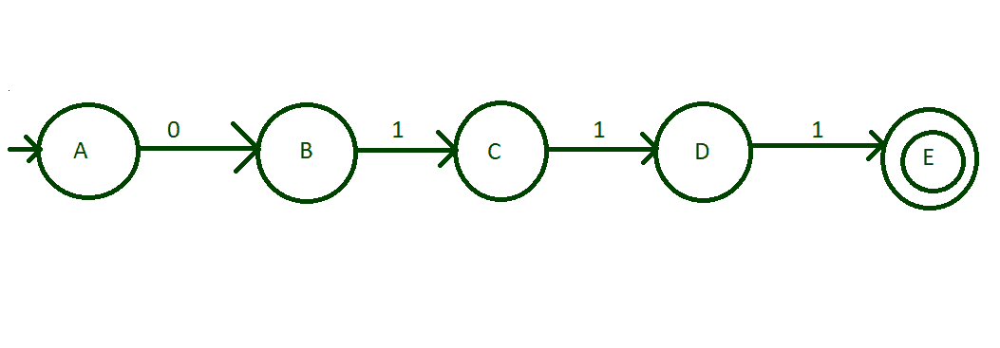
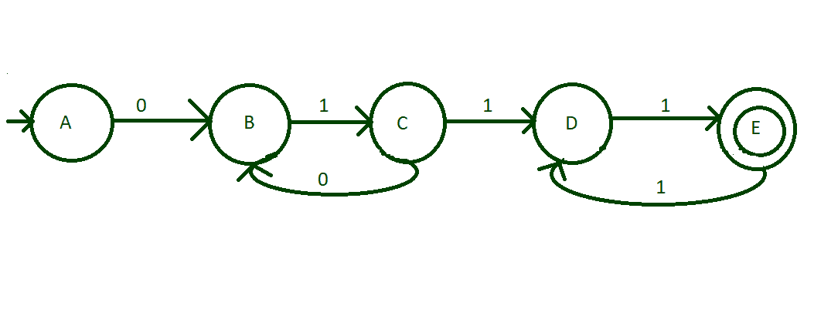
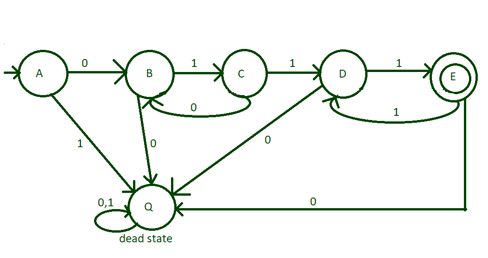

# 构建一个 DFA，接受包含“01”I 次和“1”2j 次的二进制字符串

> 原文:[https://www . geesforgeks . org/build-a-DFA-to-accept-a-binary-string-contain-01-I-times-and-1-2j-times/](https://www.geeksforgeeks.org/build-a-dfa-to-accept-a-binary-string-containing-01-i-times-and-1-2j-times/)

给定一个二进制字符串 **str** ，任务是构建一个接受给定二进制字符串的 DFA，如果它包含“01”I 次和“1”2j 次，即，


**示例:**

> **输入:** str = "011111"
> **输出:**接受
> **解释:**
> 字符串遵循如下语言:(01) <sup>1</sup> (1) <sup>2*2</sup>
> 
> **输入:** str = "01111"
> **输出:**不接受

[DFA 或确定性有限自动机](https://www.geeksforgeeks.org/introduction-of-finite-automata/)是一种有限状态机，如果字符串达到最终状态，它将接受该字符串(在特定条件下)，否则将拒绝该字符串。
在 DFA 中，没有内存的概念，因此我们必须逐个字符地检查字符串，从第 0 个字符开始。该问题的输入字符集为{0，1}。为了使 DFA 有效，必须为输入集的每个符号定义一个在每个状态到有效状态的转换规则。因此，遵循以下步骤来设计 DFA:

1.  创建初始阶段，并将 0 和 1 转换到下一个可能的状态。
2.  0 的转变之后总是跟随 1 的转变。
3.  创建一个初始状态，并将其输入字母，即 0 和 1 转换为两个不同的状态。
4.  每次转换后检查字符串是否被接受，以忽略错误。
5.  首先，对最小长度的字符串进行 DfA，然后一步一步地进行。
6.  根据对字符串的接受程度定义最终状态。

**<u>设计 DFA 的分步方法:</u>**

*   **步骤 1:** 最小可能可接受字符串为 0111，即(01) <sup>1</sup> (11) <sup>1</sup> 。因此，创建一个初始状态“A”，使 0 转换到状态“B”，然后 1 从“B”转换到状态“C”，然后 1 从“C”转换到“D”，然后 1 从“D”转换到“E”，如图所示，使这个阶段“E”成为最终状态。



*   **第二步:**现在，考虑字符串有连续的(01)，然后后面跟着连续的(11)来结束字符串。因此，当我> 1 时，从状态“C”到状态“B”转换“0”，从状态“E”到状态“D”转换“1”。因此，像 010111、011111、010111111 等字符串。现在可以接受了。



*   **第三步:**我们已经处理了所有可能接受的字符串。但是，很少有输入字母不过渡到任何状态。在这种情况下，所有这些类型的输入都将被发送到某个死状态，以阻止它们不可接受的进一步转换。死状态的输入字母将被发送到死状态本身。因此，DFA 的最终设计是:



下面是上述方法的实现:

## Java 语言(一种计算机语言，尤用于创建网站)

```
// Java code for the above DFA
import java.util.*;

class GFG{

// Function for the state A
static void checkstatea(String n)
{
  if (n.length() % 2 != 0 ||
      n.length() < 4)
    System.out.print("string not accepted");
  else
  {   
    int i = 0;

    // State transition to B
    // if the character is 0
    if (n.charAt(i) == '0')
      stateb(n.substring(1));
    else
      System.out.print("string not accepted");
  }
}

// Function for the state B
static void stateb(String n)
{
  int i = 0;

  if (n.charAt(i) == '0')
    System.out.print("string not accepted");

  // State transition to C
  // if the character is 1
  else
    statec(n.substring(1));
}

// Function for the state C
static void statec(String n)
{
  int i = 0;

  // State transition to D
  // if the character is 1
  if (n.charAt(i) == '1')
    stated(n.substring(1));

  // State transition to B
  // if the character is 0
  else
    stateb(n.substring(1));
}

// Function for the state D
static void stated(String n)
{
  int i = 0;

  if (n.length() == 1)
  {
    if (n.charAt(i) == '1')
      System.out.print("string accepted");
    else
      System.out.print("string not accepted");
  }
  else
  {

    // State transition to E
    // if the character is 1
    if (n.charAt(i) == '1')
      statee(n.substring(1));
    else
      System.out.print("string not accepted");
  }
}

// Function for the state E    
static void statee(String n)
{
  int i = 0;

  if (n.length() == 1)
  {
    if (n.charAt(i) == '0')
      System.out.print("string not accepted");
    else
      System.out.print("string accepted");
  }
  else
  {
    if (n.charAt(i) == '0')
      System.out.print("string not accepted");

    stated(n.substring(1));
  }
}

// Driver code
public static void main(String []args)
{

  // Take string input
  String n ="011111";

  // Call stateA to check the input
  checkstatea(n);
}
}

// This code is contributed by pratham76
```

## 蟒蛇 3

```
# Python3 program for the given
# language

# Function for the state A
def checkstatea(n):
    if(len(n)%2!=0 or len(n)<4):
        print("string not accepted")
    else:   
        i=0

        # State transition to B
        # if the character is 0
        if(n[i]=='0'):
            stateb(n[1:])
        else:
            print("string not accepted")

# Function for the state B
def stateb(n):
    i=0
    if(n[i]=='0'):
        print("string not accepted")

    # State transition to C
    # if the character is 1
    else:
        statec(n[1:])

# Function for the state C
def statec(n):
    i=0

    # State transition to D
    # if the character is 1
    if(n[i]=='1'):
        stated(n[1:])

    # State transition to B
    # if the character is 0
    else:
        stateb(n[1:])

# Function for the state D
def stated(n):
    i=0
    if(len(n)==1):
        if(n[i]=='1'):
            print("string accepted")
        else:
            print("string not accepted")
    else:

        # State transition to E
        # if the character is 1
        if(n[i]=='1'):
            statee(n[1:])
        else:
            print("string not accepted")  

# Function for the state E    
def statee(n):
    i=0
    if(len(n)==1):
        if(n[i]=='0'):
            print("string not accepted")
        else:
            print("string accepted")

    else:
        if(n[i]=='0'):
            print("string not accepted")
        stated(n[1:])

# Driver code
if __name__ == "__main__":

    n = "011111"
    checkstatea(n)

```

## C#

```
// C# code for the above DFA
using System;
using System.Collections;
using System.Collections.Generic;
class GFG{

// Function for the state A
static void checkstatea(string n)
{
  if(n.Length % 2 != 0 ||
     n.Length < 4)
    Console.Write("string not accepted");
  else
  {   
    int i = 0;

    // State transition to B
    // if the character is 0
    if(n[i] == '0')
      stateb(n.Substring(1));
    else
      Console.Write("string not accepted");
  }
}

// Function for the state B
static void stateb(string n)
{
  int i = 0;
  if(n[i] == '0')
    Console.Write("string not accepted");

  // State transition to C
  // if the character is 1
  else
    statec(n.Substring(1));
}

// Function for the state C
static void statec(string n)
{
  int i = 0;

  // State transition to D
  // if the character is 1
  if(n[i] == '1')
    stated(n.Substring(1));

  // State transition to B
  // if the character is 0
  else
    stateb(n.Substring(1));
}

// Function for the state D
static void stated(string n)
{
  int i = 0;
  if(n.Length == 1)
  {
    if(n[i] == '1')
      Console.Write("string accepted");
    else
      Console.Write("string not accepted");
  }
  else
  {
    // State transition to E
    // if the character is 1
    if(n[i] == '1')
      statee(n.Substring(1));
    else
      Console.Write("string not accepted");
  }
}

// Function for the state E    
static void statee(string n)
{
  int i = 0;
  if(n.Length == 1)
  {
    if(n[i] == '0')
      Console.Write("string not accepted");
    else
      Console.Write("string accepted");
  }
  else
  {
    if(n[i] == '0')
      Console.Write("string not accepted");
    stated(n.Substring(1));
  }
}

// Driver code
public static void Main(string []args)
{
  // Take string input
  string n ="011111";

  // Call stateA to check the input
  checkstatea(n);
}
}

// This code is contributed by rutvik_56
```

## java 描述语言

```
<script>

      // JavaScript code for the above DFA
      // Function for the state A
      function checkstatea(n) {
        if (n.length % 2 !== 0 || n.length < 4)
          document.write("string not accepted");
        else {
          var i = 0;

          // State transition to B
          // if the character is 0
          if (n[i] === "0") stateb(n.substring(1));
          else document.write("string not accepted");
        }
      }

      // Function for the state B
      function stateb(n) {
        var i = 0;
        if (n[i] === "0") document.write("string not accepted");
        // State transition to C
        // if the character is 1
        else statec(n.substring(1));
      }

      // Function for the state C
      function statec(n) {
        var i = 0;

        // State transition to D
        // if the character is 1
        if (n[i] === "1") stated(n.substring(1));
        // State transition to B
        // if the character is 0
        else stateb(n.substring(1));
      }

      // Function for the state D
      function stated(n) {
        var i = 0;
        if (n.length === 1) {
          if (n[i] === "1") document.write("string accepted");
          else document.write("string not accepted");
        } else {
          // State transition to E
          // if the character is 1
          if (n[i] === "1") statee(n.substring(1));
          else document.write("string not accepted");
        }
      }

      // Function for the state E
      function statee(n) {
        var i = 0;
        if (n.length == 1) {
          if (n[i] === "0") document.write("string not accepted");
          else document.write("string accepted");
        } else {
          if (n[i] === "0") document.write("string not accepted");
          stated(n.substring(1));
        }
      }

      // Driver code
      // Take string input
      var n = "011111";

      // Call stateA to check the input
      checkstatea(n);

</script>
```

**Output:** 

```
string accepted
```