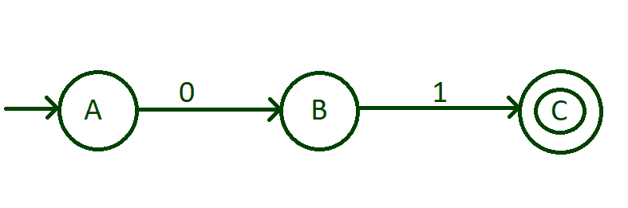
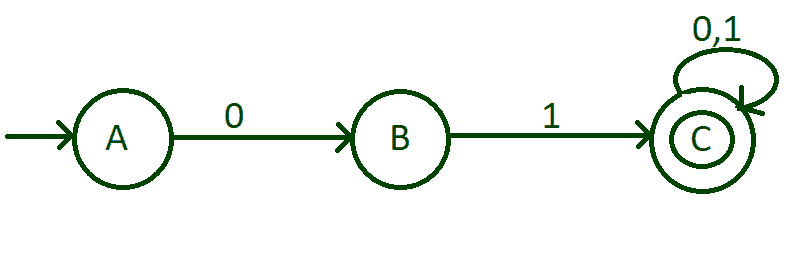
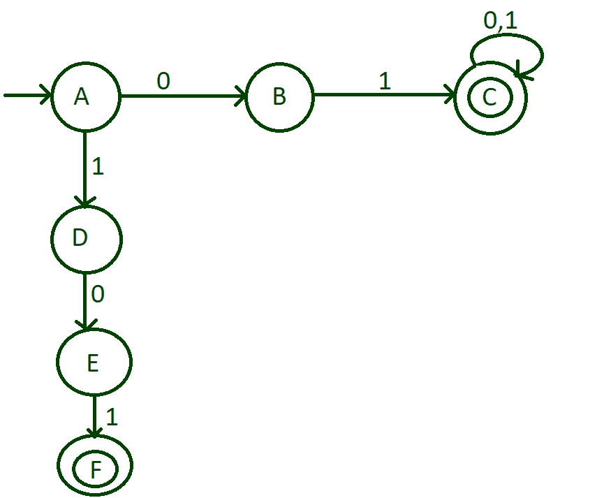
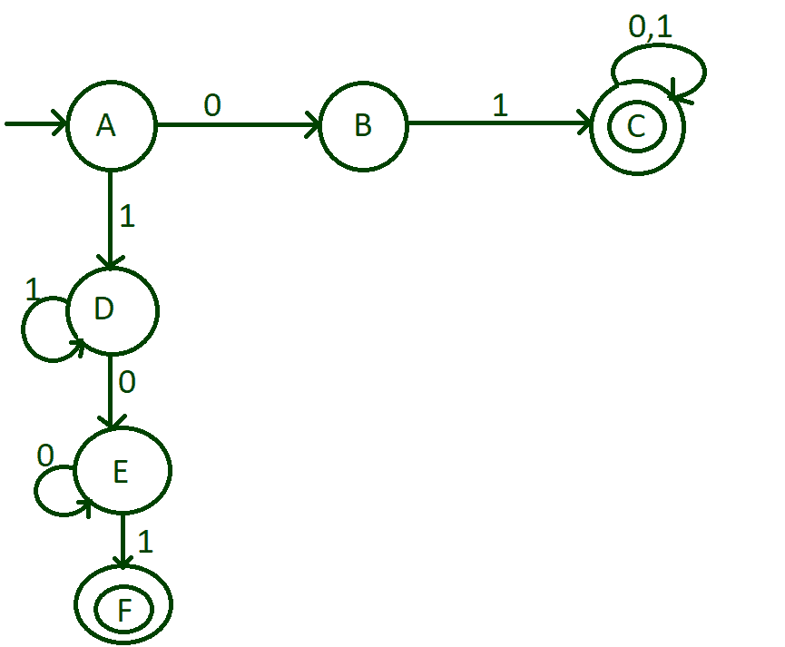
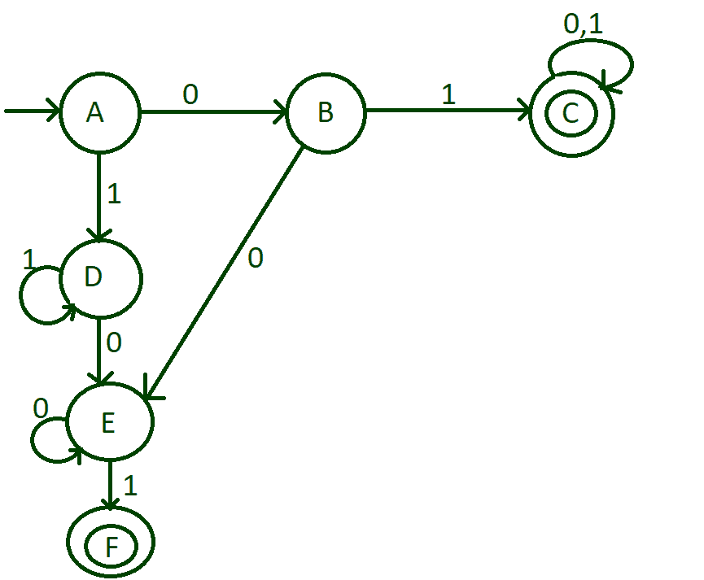
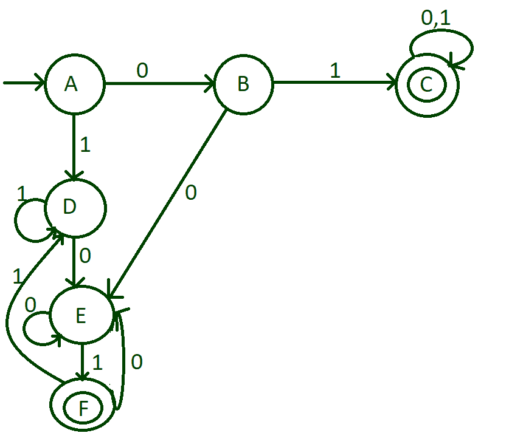
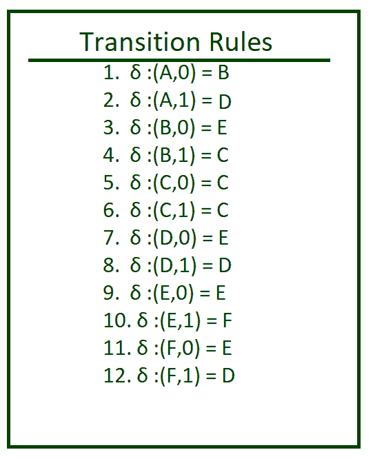

# 构建一个 DFA 来接受以“01”

开头或结尾的二进制字符串

> 原文:[https://www . geesforgeks . org/build-a-DFA-to-accept-binary-strings-以-01 开头或结尾/](https://www.geeksforgeeks.org/build-a-dfa-to-accept-binary-strings-that-starts-or-ends-with-01/)

给定二进制字符串 **str** ，任务是构建一个 DFA，如果字符串以“01”开头或以“01”结尾，则接受该字符串。

> **输入:** str = "010000"
> **输出:**接受
> **解释:**
> 给定字符串以“01”开头。
> 
> **输入:** str = "1100111"
> **输出:**不接受
> **解释:**
> 给定的字符串既不以“01”开头也不以“01”结尾。

[DFA 或确定性有限自动机](https://www.geeksforgeeks.org/introduction-of-finite-automata/)是一种有限状态机，如果字符串达到最终状态，则接受它(在某些特定条件下)，否则拒绝它。
在 DFA 中，没有内存的概念，因此我们必须逐个字符地检查字符串，从第 0 个字符开始。该问题的输入字符集为{0，1}。为了使 DFA 有效，必须为输入集的每个符号定义一个在每个状态到有效状态的转换规则。因此，遵循以下步骤来设计 DFA:

*   在这种情况下，以 01 开头或以 01 结尾或以 01 开头和以 01 结尾的字符串应该是可以接受的。
*   创建一个初始状态，并将其输入字母，即 0 和 1 转换为两个不同的状态。
*   每次转换后检查字符串是否被接受，以忽略错误。
*   首先，对最小长度的字符串进行 DfA，然后一步一步地进行。
*   根据对字符串的接受程度定义最终状态。

**<u>设计 DFA 的分步方法:</u>**

*   **第一步:**做一个初始状态“A”。最小可能字符串是 01，这是可以接受的。为此，将 0 从状态“A”转换为状态“B”，然后将 1 从状态“B”转换为状态“C”，并注意该状态“C”是最终状态。



*   **第二步:**现在，我们设计了从 01 开始的 DFA。要接受所有以 01 开头的字符串，如 011、010、010000、01111、01010000100001 等，我们需要将 0 和 1 的自循环置于状态“C”。这个自循环包含 0 和 1 的所有组合。



*   **第三步:**现在，我们需要考虑以“01”结尾的字符串。我们完成了状态“A”的 0 的转换，然后输入状态“A”的 1。以 01 结尾的最小可能字符串是 101。为此，执行状态“A”的输入 1 到状态“D”的转换，然后执行输入 0 从状态“D”到状态“E”的转换，然后执行输入 1 从状态“E”到状态“F”的转换，并注意这个“F”状态是最终状态。



*   **第四步:**还有一种可能，任意数量的 1 从 01 开始，然后以 01 结束。为此，在状态“D”上进行 1 的自循环，任何数量的 0 都可以出现在最后出现的 1 之前。为此，放一个 0 的自循环，状态为“E”。



*   **第五步:**到目前为止，我们已经完成了以 1 开头，以 01 结尾的字符串。现在，我们需要考虑以 0 开始，以 01 结束的字符串。为此，将输入 0 从状态“B”转换到状态“E”。



*   **第六步:**现在只剩下状态“F”的输入字母。将输入 1 从状态“F”转换到状态“D”，然后将输入 0 从状态“F”转换到状态“E”。



**<u>以上 DFA 的过渡表和过渡规则:</u>**

<figure class="table">

| 状态 | 输入(0) | 输入(1) |
| --- | --- | --- |
| ——>一个 | B | D |
| B | E | C |
| C* | C | C |
| D | E | D |
| E | E | F |
| F* | E | D |



下面是上述方法的实现:

## C++

```
// C++ program to check if a string
// either starts or ends with 01
#include<bits/stdc++.h>
using namespace std;

void stateA(string);
void stateB(string);
void stateC(string);
void stateD(string);
void stateE(string);
void stateF(string);

// Function for transition
// state A
void checkstateA(string n)
{

    // State transition to
    // B if the character is
    // 0
    if(n[0] == '0')
       stateB(n.substr(1));

    // State transition to
    // D if the character is
    // 1
    else
       stateD(n.substr(1));
}

// Function for transition
// state B        
void stateB(string n)
{

    // Check if the string has
    // ended
    if (n.length() == 0)
        cout << "string not accepted";
    else
    {

        // State transition to C
        // if the character is 1
        if(n[0] == '1')
            stateC(n.substr(1));

        // State transition to D
        // if the character is 0
        else
            stateD(n.substr(1));
    }    
}

// Function for transition
// state C
void stateC(string n)
{
    cout << "String accepted";
}

// Function for transition
// state D
void stateD(string n)
{
    if (n.length() == 0)
        cout << "string not accepted";
    else
    {

        // State transition to D
        // if the character is 1
        if (n[0] == '1')
            stateD(n.substr(1));

        // State transition to E
        // if the character is 0
        else
            stateE(n.substr(1));
    }
}

// Function for transition
// state E
void stateE(string n)
{
    if (n.length() == 0)
        cout << "string not accepted";
    else
    {

        // State transition to E
        // if the character is 0
        if(n[0] == '0')
            stateE(n.substr(1));

        // State transition to F
        // if the character is 1
        else
            stateF(n.substr(1));
    }
}

// Function for transition
// state F
void stateF(string n)
{
    if(n.length() == 0)
        cout << "string accepred";
    else
    {

        // State transition to D
        // if the character is 1
        if(n[0] == '1')
            stateD(n.substr(1));

        // State transition to E
        // if the character is 0
        else
            stateE(n.substr(1));
    }
}

// Driver code
int main()
{
    string n = "0100101";

    checkstateA(n);
    return 0;
}

// This code is contributed by chitranayal
```

## Java 语言(一种计算机语言，尤用于创建网站)

```
// Java program to check if a string
// either starts or ends with 01
import java.util.*;

class GFG{

// Function for transition
// state A
static void checkstateA(String n)
{

    // State transition to
    // B if the character is
    // 0
    if (n.charAt(0) == '0')
       stateB(n.substring(1));

    // State transition to
    // D if the character is
    // 1
    else
       stateD(n.substring(1));
}

// Function for transition
// state B        
static void stateB(String n)
{

    // Check if the string has
    // ended
    if (n.length() == 0)
        System.out.println("string not accepted");
    else
    {

        // State transition to C
        // if the character is 1
        if (n.charAt(0) == '1')
            stateC(n.substring(1));

        // State transition to D
        // if the character is 0
        else
            stateD(n.substring(1));
    }    
}

// Function for transition
// state C
static void stateC(String n)
{
    System.out.println("String accepted");
}

// Function for transition
// state D
static void stateD(String n)
{
    if (n.length() == 0)
        System.out.println("string not accepted");
    else
    {

        // State transition to D
        // if the character is 1
        if (n.charAt(0) == '1')
            stateD(n.substring(1));

        // State transition to E
        // if the character is 0
        else
            stateE(n.substring(1));
    }
}

// Function for transition
// state E
static void stateE(String n)
{
    if (n.length() == 0)
       System.out.println("string not accepted");
    else
    {

        // State transition to E
        // if the character is 0
        if(n.charAt(0) == '0')
            stateE(n.substring(1));

        // State transition to F
        // if the character is 1
        else
            stateF(n.substring(1));
    }
}

// Function for transition
// state F
static void stateF(String n)
{
    if (n.length() == 0)
        System.out.println("string accepred");
    else
    {

        // State transition to D
        // if the character is 1
        if (n.charAt(0) == '1')
            stateD(n.substring(1));

        // State transition to E
        // if the character is 0
        else
            stateE(n.substring(1));
    }
}

// Driver Code
public static void main(String args[])
{
    String n = "0100101";

    checkstateA(n);
}
}

// This code is contributed by jyoti369
```

## 蟒蛇 3

```
# Python3 program to check if
# a string either starts or
# ends with 01

# Function for transition
# state A
def checkstateA(n):

    # State transition to
    # B if the character is
    # 0
    if(n[0]=='0'):
        stateB(n[1:])

    # State transition to
    # D if the character is
    # 1
    else:
        stateD(n[1:])

# Function for transition
# state B        
def stateB(n):

    # Check if the string has
    # ended
    if (len(n)== 0):
        print("string not accepted")
    else:   

        # State transition to C
        # if the character is 1
        if(n[0]=='1'):
            stateC(n[1:])

        # State transition to D
        # if the character is 0
        else:
            stateD(n[1:])

# Function for transition
# state C   
def stateC(n):
    print("String accepted")

# Function for transition
# state D
def stateD(n):
    if (len(n)== 0):
        print("string not accepted")
    else:   

        # State transition to D
        # if the character is 1
        if (n[0]=='1'):
            stateD(n[1:])

        # State transition to E
        # if the character is 0
        else:
            stateE(n[1:])

# Function for transition
# state E
def stateE(n):
    if (len(n)== 0):
        print("string not accepted")
    else:  

        # State transition to E
        # if the character is 0
        if(n[0]=='0'):
            stateE(n[1:])

        # State transition to F
        # if the character is 1
        else:
            stateF(n[1:])

# Function for transition
# state F
def stateF(n):
    if(len(n)== 0):
        print("string accepred")
    else:

        # State transition to D
        # if the character is 1
        if(n[0]=='1'):
            stateD(n[1:])

        # State transition to E
        # if the character is 0
        else:
            stateE(n[1:])

# Driver code
if __name__ == "__main__":
    n = "0100101"
    checkstateA(n)
```

## C#

```
// C# program to check if
// a string either starts
// or ends with 01
using System;
using System.Collections;
using System.Collections.Generic;
class GFG{

// Function for transition
// state A
static void checkstateA(string n)
{
  // State transition to
  // B if the character is
  // 0
  if(n[0] == '0')
    stateB(n.Substring(1));

  // State transition to
  // D if the character is
  // 1
  else
    stateD(n.Substring(1));
}

// Function for transition
// state B        
static void stateB(string n)
{    
  // Check if the string has
  // ended
  if (n.Length == 0)
  {
    Console.Write("string not accepted");
  }
  else
  {
    // State transition to C
    // if the character is 1
    if(n[0] == '1')
      stateC(n.Substring(1));

    // State transition to D
    // if the character is 0
    else
      stateD(n.Substring(1));
  }    
}

// Function for transition
// state C
static void stateC(string n)
{
  Console.Write("string accepted");
}

// Function for transition
// state D
static void stateD(string n)
{
  if (n.Length == 0)
    Console.Write("string not accepted");
  else
  {

    // State transition to D
    // if the character is 1
    if (n[0] == '1')
      stateD(n.Substring(1));

    // State transition to E
    // if the character is 0
    else
      stateE(n.Substring(1));
  }
}

// Function for transition
// state E
static void stateE(string n)
{
  if (n.Length == 0)
    Console.Write("string not accepted");
  else
  {

    // State transition to E
    // if the character is 0
    if(n[0] == '0')
      stateE(n.Substring(1));

    // State transition to F
    // if the character is 1
    else
      stateF(n.Substring(1));
  }
}

// Function for transition
// state F
static void stateF(string n)
{
  if(n.Length == 0)
    Console.Write("string accepted");
  else
  {
    // State transition to D
    // if the character is 1
    if(n[0] == '1')
      stateD(n.Substring(1));

    // State transition to E
    // if the character is 0
    else
      stateE(n.Substring(1));
  }
}

// Driver code
public static void Main(string []args)
{
  string n = "0100101";
  checkstateA(n);
}
}

// This code is contributed by rutvik_56
```

## java 描述语言

```
<script>

// JavaScript program to check if
// a string either starts
// or ends with 01

// Function for transition
// state A
function checkstateA(n)
{
  // State transition to
  // B if the character is
  // 0
  if(n[0] == '0')
    stateB(n.substr(1));

  // State transition to
  // D if the character is
  // 1
  else
    stateD(n.substr(1));
}

// Function for transition
// state B       
function stateB(n)
{   
  // Check if the string has
  // ended
  if (n.length == 0)
  {
    document.write("string not accepted");
  }
  else
  {
    // State transition to C
    // if the character is 1
    if(n[0] == '1')
      stateC(n.substr(1));

    // State transition to D
    // if the character is 0
    else
      stateD(n.substr(1));
  }   
}

// Function for transition
// state C
function stateC(n)
{
  document.write("string accepted");
}

// Function for transition
// state D
function stateD(n)
{
  if (n.length == 0)
    Console.Write("string not accepted");
  else
  {

    // State transition to D
    // if the character is 1
    if (n[0] == '1')
      stateD(n.substr(1));

    // State transition to E
    // if the character is 0
    else
      stateE(n.substr(1));
  }
}

// Function for transition
// state E
function stateE(n)
{
  if (n.length == 0)
    document.write("string not accepted");
  else
  {

    // State transition to E
    // if the character is 0
    if(n[0] == '0')
      stateE(n.substr(1));

    // State transition to F
    // if the character is 1
    else
      stateF(n.substr(1));
  }
}

// Function for transition
// state F
function stateF(n)
{
  if(n.length == 0)
    document.write("string accepted");
  else
  {
    // State transition to D
    // if the character is 1
    if(n[0] == '1')
      stateD(n.substr(1));

    // State transition to E
    // if the character is 0
    else
      stateE(n.substr(1));
  }
}

// Driver Code

    let n = "0100101";
  checkstateA(n);

</script>
```

**Output:** 

```
String accepted
```

**时间复杂度:**O(N)
T3】辅助空间: O(N)

</figure>