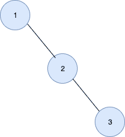
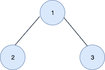
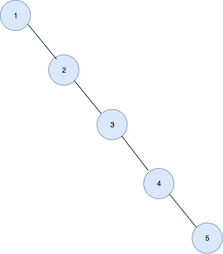

# 从 BST 构建二叉树，这样它的层级顺序遍历会打印排序后的数据

> 原文:[https://www . geesforgeks . org/build-二叉树-from-BST-so-it-level-order-遍历-打印-排序-数据/](https://www.geeksforgeeks.org/build-binary-tree-from-bst-such-that-its-level-order-traversal-prints-sorted-data/)

从给定的[二叉查找树](https://www.geeksforgeeks.org/binary-search-tree-set-1-search-and-insertion/)构建一个[二叉树](https://www.geeksforgeeks.org/binary-tree-data-structure/)，这样它的级别顺序遍历输出排序的数据。
**例:**

> **输入:**
> 
> 
> 
> **输出:** 1 2 3
> 
> 
> 
> **输入:**
> 
> 
> 
> **输出:** 1 2 3 4 5

**进场:**

*   执行给定二叉查找树的有序遍历。
*   将每个节点按级别顺序添加到二叉树中。
*   最后，打印创建的二叉树的级别顺序遍历。

以下是上述方法的实现:

## C++

```
// C++ implementation of the approach
#include <bits/stdc++.h>
using namespace std;

// Structure to hold the contents
// of the new node
struct node {
    int data;
    node *left, *right;
}* root1 = NULL;

// Helper function to add and
// return the newly added node
node* add(int data)
{
    node* newnode = new node;
    newnode->data = data;
    newnode->left = newnode->right = NULL;
    return newnode;
}

// Function to add a node to the
// Binary Tree in the level order
void addinBT(int data)
{

    // If it is the first node
    // to be added then make
    // it the root node
    if (root1 == NULL)
        root1 = add(data);
    else {
        queue<node*> Q;
        Q.push(root1);
        while (!Q.empty()) {

            // Get and remove the front
            node* temp = Q.front();
            Q.pop();

            // If the left child of the current
            // node is null then create the new
            // node here and break
            if (temp->left == NULL) {
                temp->left = add(data);
                break;
            }
            else
                Q.push(temp->left);

            // If the right child of the current
            // node is null then create the new
            // node here and break
            if (temp->right == NULL) {
                temp->right = add(data);
                break;
            }
            else
                Q.push(temp->right);
        }
    }
}

// Function to add a node to
// the Binary Search tree
node* addinBST(node* root, int data)
{

    // If the current node is null
    // then create a new node here
    // with the given data
    if (root == NULL)
        root = add(data);

    // If the data is smaller than the
    // current node's data then recur
    // for the left sub-tree
    else if (data < root->data)
        root->left = addinBST(root->left, data);

    // Else recur for the right sub-tree
    else
        root->right = addinBST(root->right, data);
    return root;
}

// Function to perform a level order
// insertion in the Binary Tree from
// the given Binary Search tree
void addinorder(node* root)
{
    if (root == NULL)
        return;
    addinorder(root->left);
    addinBT(root->data);
    addinorder(root->right);
}

// Function to print the level order
// traversal of the binary tree
void printlvl()
{
    queue<node*> Q;

    // Push root to the queue
    Q.push(root1);
    while (!Q.empty()) {

        // Get the front
        node* temp = Q.front();

        // Remove the front
        Q.pop();

        // Print the data
        cout << temp->data << " ";

        // Push the left child
        if (temp->left != NULL)
            Q.push(temp->left);

        // Push the right child
        if (temp->right != NULL)
            Q.push(temp->right);
    }
}

// Driver code
int main()
{
    // Create the Binary Search Tree
    node* root = NULL;
    root = addinBST(root, 1);
    root = addinBST(root, 2);
    root = addinBST(root, 3);
    root = addinBST(root, 4);
    root = addinBST(root, 5);

    // Add nodes of the Binary Search
    // Tree to the Binary Tree
    addinorder(root);

    // Print the level order traversal
    // of the Binary Tree
    printlvl();

    return 0;
}
```

## Java 语言(一种计算机语言，尤用于创建网站)

```
// Java implementation of the approach
import java.util.*;

class GFG
{

// Structure to hold the contents
// of the new node
static class node
{
    int data;
    node left, right;
}
static node root1 = null;

// Helper function to add and
// return the newly added node
static node add(int data)
{
    node newnode = new node();
    newnode.data = data;
    newnode.left = newnode.right = null;
    return newnode;
}

// Function to add a node to the
// Binary Tree in the level order
static void addinBT(int data)
{

    // If it is the first node
    // to be added then make
    // it the root node
    if (root1 == null)
        root1 = add(data);
    else
    {
        Queue<node> Q = new LinkedList<>();
        Q.add(root1);
        while (!Q.isEmpty())
        {

            // Get and remove the front
            node temp = Q.peek();
            Q.remove();

            // If the left child of the current
            // node is null then create the new
            // node here and break
            if (temp.left == null)
            {
                temp.left = add(data);
                break;
            }
            else
                Q.add(temp.left);

            // If the right child of the current
            // node is null then create the new
            // node here and break
            if (temp.right == null)
            {
                temp.right = add(data);
                break;
            }
            else
                Q.add(temp.right);
        }
    }
}

// Function to add a node to
// the Binary Search tree
static node addinBST(node root, int data)
{

    // If the current node is null
    // then create a new node here
    // with the given data
    if (root == null)
        root = add(data);

    // If the data is smaller than the
    // current node's data then recur
    // for the left sub-tree
    else if (data < root.data)
        root.left = addinBST(root.left, data);

    // Else recur for the right sub-tree
    else
        root.right = addinBST(root.right,
                                   data);
    return root;
}

// Function to perform a level order
// insertion in the Binary Tree from
// the given Binary Search tree
static void addinorder(node root)
{
    if (root == null)
        return;
    addinorder(root.left);
    addinBT(root.data);
    addinorder(root.right);
}

// Function to print the level order
// traversal of the binary tree
static void printlvl()
{
    Queue<node> Q = new LinkedList<>();

    // Push root to the queue
    Q.add(root1);
    while (!Q.isEmpty())
    {

        // Get the front
        node temp = Q.peek();

        // Remove the front
        Q.remove();

        // Print the data
        System.out.print(temp.data + " ");

        // Push the left child
        if (temp.left != null)
            Q.add(temp.left);

        // Push the right child
        if (temp.right != null)
            Q.add(temp.right);
    }
}

// Driver code
public static void main(String[] args)
{
    // Create the Binary Search Tree
    node root = null;
    root = addinBST(root, 1);
    root = addinBST(root, 2);
    root = addinBST(root, 3);
    root = addinBST(root, 4);
    root = addinBST(root, 5);

    // Add nodes of the Binary Search
    // Tree to the Binary Tree
    addinorder(root);

    // Print the level order traversal
    // of the Binary Tree
    printlvl();
}
}

// This code is contributed by Rajput-Ji
```

## 蟒蛇 3

```
# Python3 implementation of the approach

# Structure to hold the contents
# of the new node
class add:

    # Constructor to create a new node
    def __init__(self, data):
        self.data = data
        self.left = self.right = None

root1 = None

# Function to add a node to the
# Binary Tree in the level order
def addinBT(data):
    global root1

    # If it is the first node
    # to be added then make
    # it the root node
    if (root1 == None):
        root1 = add(data)
    else:
        Q = [root1]
        while (len(Q)):

            # Get and remove the front
            temp = Q[0]
            Q.pop(0)

            # If the left child of the current
            # node is None then create the new
            # node here and break
            if (temp.left == None):
                temp.left = add(data)
                break
            else:
                Q.append(temp.left)

            # If the right child of the current
            # node is None then create the new
            # node here and break
            if (temp.right == None):
                temp.right = add(data)
                break
            else:
                Q.append(temp.right)

# Function to add a node to
# the Binary Search tree
def addinBST( root, data):

    # If the current node is None
    # then create a new node here
    # with the given data
    if (root == None):
        root = add(data)

    # If the data is smaller than the
    # current node's data then recur
    # for the left sub-tree
    elif (data < root.data):
        root.left = addinBST(root.left, data)

    # Else recur for the right sub-tree
    else:
        root.right = addinBST(root.right, data)
    return root

# Function to perform a level order
# insertion in the Binary Tree from
# the given Binary Search tree
def addinorder( root):
    if (root == None):
        return
    addinorder(root.left)
    addinBT(root.data)
    addinorder(root.right)

# Function to print the level order
# traversal of the binary tree
def printlvl():

    Q = []

    # Push root to the
    Q.append(root1)
    while (len(Q)):

        # Get the front
        temp = Q[0]

        # Remove the front
        Q.pop(0)

        # Print the data
        print(temp.data ,end=" ")

        # Push the left child
        if (temp.left != None):
            Q.append(temp.left)

        # Push the right child
        if (temp.right != None):
            Q.append(temp.right)

# Driver code

# Create the Binary Search Tree
root = add(1)
root = addinBST(root, 2)
root = addinBST(root, 3)
root = addinBST(root, 4)
root = addinBST(root, 5)

# Add nodes of the Binary Search
# Tree to the Binary Tree
addinorder(root)

# Print the level order traversal
# of the Binary Tree
printlvl()

# This code is contributed by SHUBHAMSINGH10
```

## C#

```
// C# implementation of the approach
using System;
using System.Collections.Generic;

class GFG
{

// Structure to hold the contents
// of the new node
public class node
{
    public int data;
    public node left, right;
}
static node root1 = null;

// Helper function to add and
// return the newly added node
static node add(int data)
{
    node newnode = new node();
    newnode.data = data;
    newnode.left = newnode.right = null;
    return newnode;
}

// Function to add a node to the
// Binary Tree in the level order
static void addinBT(int data)
{

    // If it is the first node
    // to be added then make
    // it the root node
    if (root1 == null)
        root1 = add(data);
    else
    {
        Queue<node> Q = new Queue<node>();
        Q.Enqueue(root1);
        while (Q.Count != 0)
        {

            // Get and remove the front
            node temp = Q.Peek();
            Q.Dequeue();

            // If the left child of the current
            // node is null then create the new
            // node here and break
            if (temp.left == null)
            {
                temp.left = add(data);
                break;
            }
            else
                Q.Enqueue(temp.left);

            // If the right child of the current
            // node is null then create the new
            // node here and break
            if (temp.right == null)
            {
                temp.right = add(data);
                break;
            }
            else
                Q.Enqueue(temp.right);
        }
    }
}

// Function to add a node to
// the Binary Search tree
static node addinBST(node root, int data)
{

    // If the current node is null
    // then create a new node here
    // with the given data
    if (root == null)
        root = add(data);

    // If the data is smaller than the
    // current node's data then recur
    // for the left sub-tree
    else if (data < root.data)
        root.left = addinBST(root.left,
                                 data);

    // Else recur for the right sub-tree
    else
        root.right = addinBST(root.right,
                                   data);
    return root;
}

// Function to perform a level order
// insertion in the Binary Tree from
// the given Binary Search tree
static void addinorder(node root)
{
    if (root == null)
        return;
    addinorder(root.left);
    addinBT(root.data);
    addinorder(root.right);
}

// Function to print the level order
// traversal of the binary tree
static void printlvl()
{
    Queue<node> Q = new Queue<node>();

    // Push root to the queue
    Q.Enqueue(root1);
    while (Q.Count != 0)
    {

        // Get the front
        node temp = Q.Peek();

        // Remove the front
        Q.Dequeue();

        // Print the data
        Console.Write(temp.data + " ");

        // Push the left child
        if (temp.left != null)
            Q.Enqueue(temp.left);

        // Push the right child
        if (temp.right != null)
            Q.Enqueue(temp.right);
    }
}

// Driver code
public static void Main(String[] args)
{
    // Create the Binary Search Tree
    node root = null;
    root = addinBST(root, 1);
    root = addinBST(root, 2);
    root = addinBST(root, 3);
    root = addinBST(root, 4);
    root = addinBST(root, 5);

    // Add nodes of the Binary Search
    // Tree to the Binary Tree
    addinorder(root);

    // Print the level order traversal
    // of the Binary Tree
    printlvl();
}
}

// This code is contributed by Rajput-Ji
```

## java 描述语言

```
<script>

// JavaScript implementation of the approach

// Structure to hold the contents
// of the new node
class node
{
    constructor()
    {
        this.data = 0;
        this.left = null;
        this.right = null;
    }
}

var root1 = null;

// Helper function to add and
// return the newly added node
function add(data)
{
    var newnode = new node();
    newnode.data = data;
    newnode.left = newnode.right = null;
    return newnode;
}

// Function to add a node to the
// Binary Tree in the level order
function addinBT(data)
{

    // If it is the first node
    // to be added then make
    // it the root node
    if (root1 == null)
        root1 = add(data);
    else
    {
        var Q = [];
        Q.push(root1);
        while (Q.Count != 0)
        {

            // Get and remove the front
            var temp = Q[0];
            Q.shift();

            // If the left child of the current
            // node is null then create the new
            // node here and break
            if (temp.left == null)
            {
                temp.left = add(data);
                break;
            }
            else
                Q.push(temp.left);

            // If the right child of the current
            // node is null then create the new
            // node here and break
            if (temp.right == null)
            {
                temp.right = add(data);
                break;
            }
            else
                Q.push(temp.right);
        }
    }
}

// Function to add a node to
// the Binary Search tree
function addinBST(root, data)
{

    // If the current node is null
    // then create a new node here
    // with the given data
    if (root == null)
        root = add(data);

    // If the data is smaller than the
    // current node's data then recur
    // for the left sub-tree
    else if (data < root.data)
        root.left = addinBST(root.left,
                                 data);

    // Else recur for the right sub-tree
    else
        root.right = addinBST(root.right,
                                   data);
    return root;
}

// Function to perform a level order
// insertion in the Binary Tree from
// the given Binary Search tree
function addinorder(root)
{
    if (root == null)
        return;
    addinorder(root.left);
    addinBT(root.data);
    addinorder(root.right);
}

// Function to print the level order
// traversal of the binary tree
function printlvl()
{
    var Q = [];

    // Push root to the queue
    Q.push(root1);
    while (Q.Count != 0)
    {

        // Get the front
        var temp = Q[0];

        // Remove the front
        Q.shift();

        // Print the data
        document.write(temp.data + " ");

        // Push the left child
        if (temp.left != null)
            Q.push(temp.left);

        // Push the right child
        if (temp.right != null)
            Q.push(temp.right);
    }
}

// Driver code
// Create the Binary Search Tree
var root = null;
root = addinBST(root, 1);
root = addinBST(root, 2);
root = addinBST(root, 3);
root = addinBST(root, 4);
root = addinBST(root, 5);
// Add nodes of the Binary Search
// Tree to the Binary Tree
addinorder(root);
// Print the level order traversal
// of the Binary Tree
printlvl();

</script>
```

**Output:** 

```
1 2 3 4 5
```

**时间复杂度** : O(N)。
**辅助空间** : O(N)。