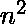

# 布伦斯-惠勒数据转换算法

> 原文:[https://www . geeksforgeeks . org/burrows-wheeler-data-transform-algorithm/](https://www.geeksforgeeks.org/burrows-wheeler-data-transform-algorithm/)

<u>**什么是布伦斯-惠勒变换？**</u>
BWT 是一种数据转换算法，它以转换后的消息更具可压缩性的方式重构数据。从技术上讲，它是字符串字符的字典式可逆排列。这是在实现 Burrows-Wheeler 数据压缩算法时连续执行的三个步骤中的第一个，该算法构成了 Unix 压缩实用程序 bzip2 的基础。

<u>**为什么是 BWT？背后的主要思想。**</u>
BWT 最重要的应用是在生物科学中发现的，在生物科学中，基因组(用 A、C、T、G 字母写成的长串)没有很多次运行，但它们有很多次重复。
BWT 的想法是构建一个数组，该数组的行都是按字典顺序循环移位的输入字符串，并返回该数组的最后一列，该列往往有长串相同的字符。这样做的好处是，一旦字符被聚集在一起，它们实际上就有了一个顺序，这可以使我们的字符串对于其他算法(如游程编码和霍夫曼编码)更具可压缩性。
关于 BWT，值得注意的是，这种特殊的转换是可逆的，数据开销最小。

<u>**BWT 算法涉及的步骤**</u>
我们就拿**这个词来说吧“香蕉{ content } { x201 }；**为例。

*   **步骤 1:** 形成给定文本的所有循环旋转。

    ```
                                         banana$ 
           $    b                        $banana 
        a           a                    a$banan
       Cyclic rotations    ---------->   na$bana
        n         n                      ana$ban 
              a                          nana$ba
                                         anana$b

    ```

*   **第二步:**下一步是按字典顺序对旋转进行排序。**“{ content }”；**符号在词典中被视为第一个字母，甚至在**‘a’**之前。

    ```
    banana$                    $banana
    $banana                    a$banan
    a$banan       Sorting      ana$ban
    na$bana      ---------->   anana$b 
    ana$ban    alphabetically  banana$
    nana$ba                    na$bana
    anana$b                    nana$ba

    ```

*   **第三步:**最后一列是我们输出的 BWT。

    ```
    BWT(banana$) = annb$aa

    ```

**示例:**

> **输入:** text = "香蕉{ content } # x201D
> **输出:**布伦斯-惠勒变换
> 
> **输入:**text = " abracadabra { content } # x201；
> **输出:**布伦斯-惠勒变换

<u>**为什么最后一列被认为是 BWT？**T3】</u>

1.  最后一列具有比任何其他列更好的符号聚类。
2.  如果我们只有弦的 BWT，我们可以完全恢复其余的循环旋转。其余的列不具备计算 BWT 逆时非常重要的这一特性。

<u>**为什么是“{ content }”；符号嵌入在文本中？**</u>
即使我们的文本没有与任何 EOF 字符( **'{content})连接，我们也可以计算 BWT；**这里)。**“{ content }”的寓意；**符号在计算 BWT 逆时出现。

<u>**实施方式**</u>

1.  让我们实例化**“香蕉{content} ”;**作为我们的**输入 _ 文本**并实例化字符数组 **bwt_arr** 作为我们的输出。
2.  让我们得到**“香蕉{content}”的所有后缀；**并计算它的**后缀 _arr** 来存储每个后缀的索引。

    ```
    0 banana$                6 $   
    1 anana$                 5 a$
    2 nana$      Sorting     3 ana$
    3 ana$     ---------->   1 anana$
    4 na$     alphabetically 0 banana$
    5 a$                     4 na$
    6 $                      2 nana$

    ```

3.  迭代 **[后缀 _arr](https://www.geeksforgeeks.org/suffix-array-set-1-introduction/)** ，现在让我们添加到我们的输出数组 **bwt_arr** ，每个旋转的最后一个字符。
4.  **input_text** 从后缀数组中当前值表示的位置开始的每次旋转的最后一个字符可以用 **input_text[(后缀 _ arr[I]–1+n)% n]**来计算，其中 **n** 是**后缀 _arr** 中的元素数量。

    ```
    bwt_arr[0] 
      = input_text[(suffix_arr[0] - 1 + 7) % 7] 
      = input_text[5] 
      = a
    bwt_arr[1] 
      = input_text[(suffix_arr[1] - 1 + 7) % 7] 
      = input_text[4] 
      = n

    ```

下面是上述实现方式的代码

```
// C program to find Burrows Wheeler transform
// of a given text

#include <stdio.h>
#include <stdlib.h>
#include <string.h>

// Structure to store data of a rotation
struct rotation {
    int index;
    char* suffix;
};

// Compares the rotations and
// sorts the rotations alphabetically
int cmpfunc(const void* x, const void* y)
{
    struct rotation* rx = (struct rotation*)x;
    struct rotation* ry = (struct rotation*)y;
    return strcmp(rx->suffix, ry->suffix);
}

// Takes text to be transformed and its length as
// arguments and returns the corresponding suffix array
int* computeSuffixArray(char* input_text, int len_text)
{
    // Array of structures to store rotations and
    // their indexes
    struct rotation suff[len_text];

    // Structure is needed to maintain old indexes of
    // rotations after sorting them
    for (int i = 0; i < len_text; i++) {
        suff[i].index = i;
        suff[i].suffix = (input_text + i);
    }

    // Sorts rotations using comparison
    // function defined above
    qsort(suff, len_text, sizeof(struct rotation),
          cmpfunc);

    // Stores the indexes of sorted rotations
    int* suffix_arr
        = (int*)malloc(len_text * sizeof(int));
    for (int i = 0; i < len_text; i++)
        suffix_arr[i] = suff[i].index;

    // Returns the computed suffix array
    return suffix_arr;
}

// Takes suffix array and its size
// as arguments and returns the
// Burrows - Wheeler Transform of given text
char* findLastChar(char* input_text,
                   int* suffix_arr, int n)
{
    // Iterates over the suffix array to find
    // the last char of each cyclic rotation
    char* bwt_arr = (char*)malloc(n * sizeof(char));
    int i;
    for (i = 0; i < n; i++) {
        // Computes the last char which is given by
        // input_text[(suffix_arr[i] + n - 1) % n]
        int j = suffix_arr[i] - 1;
        if (j < 0)
            j = j + n;

        bwt_arr[i] = input_text[j];
    }

    bwt_arr[i] = '\0';

    // Returns the computed Burrows - Wheeler Transform
    return bwt_arr;
}

// Driver program to test functions above
int main()
{
    char input_text[] = "banana{content}quot;;
    int len_text = strlen(input_text);

    // Computes the suffix array of our text
    int* suffix_arr
        = computeSuffixArray(input_text, len_text);

    // Adds to the output array the last char
    // of each rotation
    char* bwt_arr
        = findLastChar(input_text, suffix_arr, len_text);

    printf("Input text : %s\n", input_text);
    printf("Burrows - Wheeler Transform : %s\n",
           bwt_arr);
    return 0;
}
```

**Output:**

```
Input text : banana$
Burrows - Wheeler Transform : annb$aa

```

<u>**时间复杂度:**</u> O(  Logn)。这是因为上面用于构建后缀数组的方法具有 O(  Logn)时间复杂度，这是由于 O(nLogn)排序算法中字符串比较的 O(n)时间。

<u>**锻炼:**</u>

1.  [计算 O(nLogn)时间内的后缀数组](https://www.geeksforgeeks.org/suffix-array-set-2-a-nlognlogn-algorithm/)然后实现 BWT。
2.  [实现布伦斯-惠勒变换的逆变换。](https://www.geeksforgeeks.org/inverting-burrows-wheeler-transform/)

本文由 **Anureet Kaur** 供稿。如果你喜欢 GeeksforGeeks 并想投稿，你也可以使用[contribute.geeksforgeeks.org](http://www.contribute.geeksforgeeks.org)写一篇文章或者把你的文章邮寄到 contribute@geeksforgeeks.org。看到你的文章出现在极客博客主页上，帮助其他极客。

如果你发现任何不正确的地方，或者你想分享更多关于上面讨论的话题的信息，请写评论。