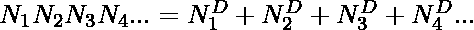

# 阿姆斯特朗编号的 C/C++程序

> 原文:[https://www . geesforgeks . org/c-c-program-for-Armstrong-numbers/](https://www.geeksforgeeks.org/c-c-program-for-armstrong-numbers/)

给定一个数字 **N** ，任务是检查给定的数字是否为阿姆斯特朗数。如果给定的号码是阿姆斯壮号码，则打印**“是”**否则打印**“否”**。

> 如果
> 
> 其中 **D** 是数字 **N**
> 中的数字，N(1)、N(2)、N(3)…是数字 **N** 的数字，则 **D** 数字的正整数称为[阿姆斯特朗-订单的数字](https://www.geeksforgeeks.org/program-for-armstrong-numbers/)**D**(订单是数字的数量)。

**示例:**

> **输入:** N = 153
> **输出:**是
> **说明:**
> 153 是阿姆斯壮数。
> 1*1*1 + 5*5*5 + 3*3*3 = 153
> 
> **输入:** 120
> **输出:**否
> **说明:**
> 120 不是阿姆斯壮数。
> 1*1*1 + 2*2*2 + 0*0*0 = 9

**方法:**思路是统计给定数字 **N** 中的位数(比如 **d** )。对于给定数字 **N** 中的每一个数字(比如 **r** ，求 **r <sup>d</sup>** 的值，如果所有值的总和为 **N** ，则打印**“是”**，否则打印**“否”**。

下面是上述方法的实现:

## C

```
// C program to find Armstrong number
#include <stdio.h>

// Function to calculate N raised
// to the power D
int power(int N, unsigned int D)
{
    if (D == 0)
        return 1;

    if (D % 2 == 0)
        return power(N, D / 2)
               * power(N, D / 2);

    return N * power(N, D / 2)
           * power(N, D / 2);
}

// Function to calculate the order of
// the number
int order(int N)
{
    int r = 0;

    // For each digit
    while (N) {
        r++;
        N = N / 10;
    }
    return r;
}

// Function to check whether the given
// number is Armstrong number or not
int isArmstrong(int N)
{
    // Calling order function
    int D = order(N);

    int temp = N, sum = 0;

    // For each digit
    while (temp) {
        int Ni = temp % 10;
        sum += power(Ni, D);
        temp = temp / 10;
    }

    // If satisfies Armstrong condition
    if (sum == N)
        return 1;
    else
        return 0;
}

// Driver Code
int main()
{
    // Given Number N
    int N = 153;

    // Function Call
    if (isArmstrong(N) == 1)
        printf("True\n");
    else
        printf("False\n");
    return 0;
}
```

## C++

```
// C++ program to find Armstrong number
#include <bits/stdc++.h>
using namespace std;

// Function to calculate N raised
// to the power D
int power(int N, unsigned int D)
{
    if (D == 0)
        return 1;

    if (D % 2 == 0)
        return power(N, D / 2)
               * power(N, D / 2);

    return N * power(N, D / 2)
           * power(N, D / 2);
}

// Function to calculate the order of
// the number
int order(int N)
{
    int r = 0;

    // For each digit
    while (N) {
        r++;
        N = N / 10;
    }
    return r;
}

// Function to check whether the given
// number is Armstrong number or not
int isArmstrong(int N)
{
    // To find order of N
    int D = order(N);

    int temp = N, sum = 0;

    // Traverse each digit
    while (temp) {
        int Ni = temp % 10;
        sum += power(Ni, D);
        temp = temp / 10;
    }

    // If satisfies Armstrong condition
    if (sum == N)
        return 1;
    else
        return 0;
}

// Driver Code
int main()
{
    // Given Number N
    int N = 153;

    // Function Call
    if (isArmstrong(N) == 1)
        cout << "True";
    else
        cout << "False";
    return 0;
}
```

**Output:**

```
True

```

**时间复杂度:***O(log<sub>10</sub>N)*
T7】辅助空间: *O(1)*