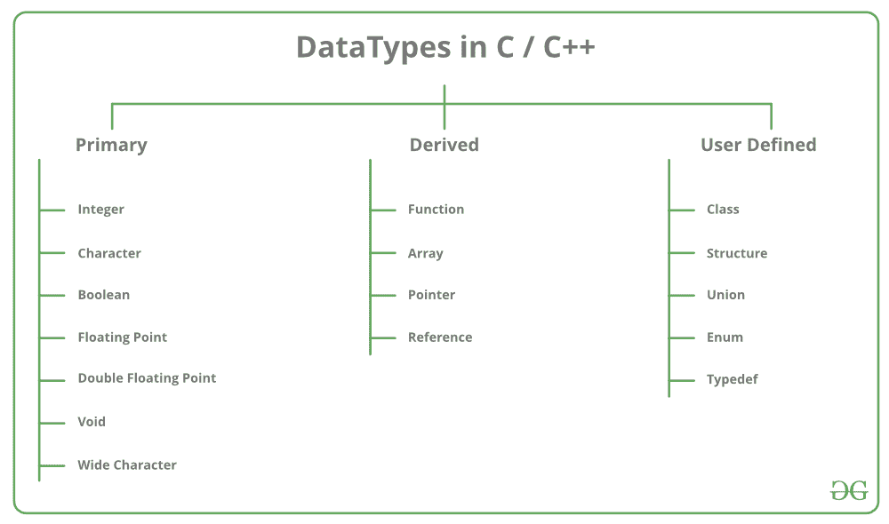
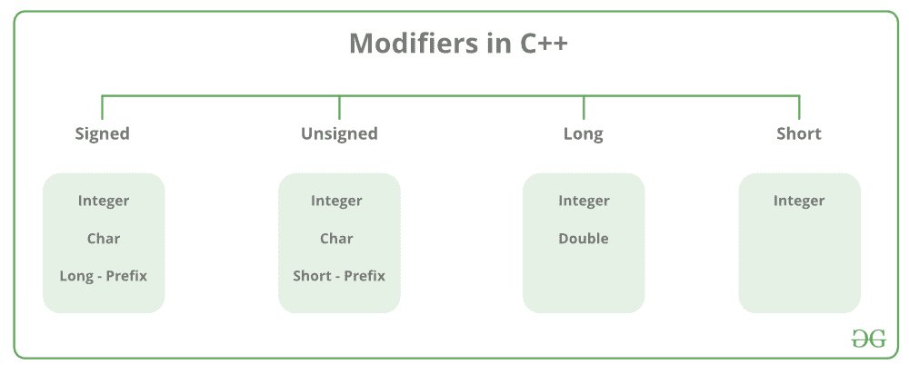

# C++数据类型

> 原文:[https://www.geeksforgeeks.org/c-data-types/](https://www.geeksforgeeks.org/c-data-types/)

所有[变量](https://www.geeksforgeeks.org/variables-and-keywords-in-c/)在声明时使用数据类型来限制要存储的数据类型。因此，我们可以说数据类型用于告诉变量它可以存储的数据类型。每当在 C++中定义一个变量时，编译器都会根据声明该变量的数据类型为该变量分配一些内存。每种数据类型都需要不同的内存量。



C++中的数据类型主要分为三种:

1.  **原始数据类型**:这些数据类型是内置或者预定义的数据类型，用户可以直接使用来声明变量。例如:int、char、float、bool 等。C++中可用的基本数据类型有:
    *   整数
    *   性格；角色；字母
    *   布尔代数学体系的
    *   浮点
    *   双浮点
    *   无价值或无效
    *   宽字符
2.  [**派生数据类型:**](https://www.geeksforgeeks.org/derived-data-types-in-c/) 从原语或内置数据类型派生的数据类型称为派生数据类型。这些可以是四种类型，即:
    *   功能
    *   排列
    *   指针
    *   参考
3.  [**抽象或用户自定义数据类型**](https://www.geeksforgeeks.org/user-defined-derived-data-types-in-c/) :这些数据类型由用户自己定义。比如，用 C++定义一个类或者一个结构。C++提供了以下用户定义的数据类型:
    *   班级
    *   结构
    *   联盟
    *   列举
    *   Typedef 定义的数据类型

本文讨论 C++中可用的**原始数据类型**。

*   **整数**:整数数据类型使用的关键字是 **int** 。整数通常需要 4 字节的内存空间，范围从-2147483648 到 2147483647。

*   **字符**:字符数据类型用于存储字符。用于字符数据类型的关键字是**字符**。字符通常需要 1 字节的内存空间，范围从-128 到 127 或 0 到 255。

*   **布尔**:布尔数据类型用于存储布尔值或逻辑值。一个布尔变量可以存储*真*或*假*。用于布尔数据类型的关键字是**布尔**。

*   **浮点**:浮点数据类型用于存储单精度浮点值或十进制值。用于浮点数据类型的关键字是**浮点**。浮点变量通常需要 4 字节的内存空间。

*   **双浮点**:双浮点数据类型用于存储双精度浮点值或十进制值。双浮点数据类型使用的关键字是**双**。双变量通常需要 8 字节的内存空间。

*   **void** : Void 表示没有任何值。void 数据类型表示无值实体。Void 数据类型用于那些不返回值的函数。

*   [**宽字符**](https://www.geeksforgeeks.org/wide-char-and-library-functions-in-c/) :宽字符数据类型也是一种字符数据类型，但该数据类型的大小大于正常的 8 位数据类型。以 **wchar_t** 为代表。一般为 2 或 4 字节长。

**数据类型修饰符**

顾名思义，数据类型修饰符与内置数据类型一起使用，以修改特定数据类型可以容纳的数据长度。



C++中可用的数据类型修饰符有:

*   **签名**
*   **无符号**
*   **短**
*   **长**

下表总结了与类型修饰符组合时内置数据类型的修改大小和范围:

<figure class="table">

| 数据类型 | 大小(字节) | 范围 |
| 短整型 | Two | -32，768 至 32，767 |
| 无符号短整型 | Two | 0 至 65，535 |
| 无符号整数 | four | 0 至 4，294，967，295 |
| （同 Internationalorganizations）国际组织 | four | -2，147，483，648 至 2，147，483，647 |
| 长整型 | four | -2，147，483，648 至 2，147，483，647 |
| 无符号长整型 | eight | 0 至 4，294，967，295 |
| 长整型 | eight | -(2^63)到(2^63)-1 |
| 无符号长整型 | eight | 0 至 18，446，744，073，709，551，615 |
| 有符号字符 | one | -128 到 127 |
| 无符号字符 | one | 0 到 255 |
| 漂浮物 | four |   |
| 两倍 | eight |   |
| 长双 | Twelve |   |
| wchar_t | 2 或 4 | 1 个宽字符 |

**注**:以上数值可能因编译器而异。在上面的例子中，我们考虑了 GCC 32 位。
我们可以使用 size of()运算符显示所有数据类型的大小，并将数据类型的关键字作为参数传递给该函数，如下所示:

## 卡片打印处理机（Card Print Processor 的缩写）

```
// C++ program to sizes of data types
#include<iostream>
using namespace std;

int main()
{
    cout << "Size of char : " << sizeof(char)
      << " byte" << endl;
    cout << "Size of int : " << sizeof(int)
      << " bytes" << endl;
    cout << "Size of short int : " << sizeof(short int)
      << " bytes" << endl;
    cout << "Size of long int : " << sizeof(long int)
       << " bytes" << endl;
    cout << "Size of signed long int : " << sizeof(signed long int)
       << " bytes" << endl;
    cout << "Size of unsigned long int : " << sizeof(unsigned long int)
       << " bytes" << endl;
    cout << "Size of float : " << sizeof(float)
       << " bytes" <<endl;
    cout << "Size of double : " << sizeof(double)
       << " bytes" << endl;
    cout << "Size of wchar_t : " << sizeof(wchar_t)
       << " bytes" <<endl;

    return 0;
}
```

输出:

```
Size of char : 1 byte
Size of int : 4 bytes
Size of short int : 2 bytes
Size of long int : 8 bytes
Size of signed long int : 8 bytes
Size of unsigned long int : 8 bytes
Size of float : 4 bytes
Size of double : 8 bytes
Size of wchar_t : 4 bytes
```

本文由 [**哈什·阿加瓦尔**](https://www.facebook.com/harsh.agarwal.16752) 供稿。如果你喜欢 GeeksforGeeks 并想投稿，你也可以使用[contribute.geeksforgeeks.org](http://www.contribute.geeksforgeeks.org)写一篇文章或者把你的文章邮寄到 contribute@geeksforgeeks.org。看到你的文章出现在极客博客主页上，帮助其他极客。
如果发现有不正确的地方，或者想分享更多关于上述话题的信息，请写评论。

</figure>