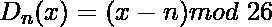
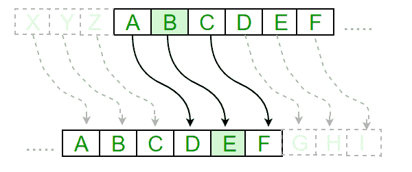

# 密码学中的凯撒密码

> 原文:[https://www . geesforgeks . org/Caesar-cipher-in-crypto/](https://www.geeksforgeeks.org/caesar-cipher-in-cryptography/)

凯撒密码技术是最早和最简单的加密技术方法之一。这只是一种替换密码，即给定文本的每个字母都被字母表中某个固定位置的字母替换。比如移位 1，A 会被 B 取代，B 会变成 C，以此类推。这种方法显然是以朱利叶斯·凯撒的名字命名的，他显然用它来和他的官员交流。
因此，要对给定的文本进行加密，我们需要一个整数值，称为 shift，它表示文本中每个字母向下移动的位置数。
加密可以用模运算表示，先把字母转换成数字，根据方案，A = 0，B = 1，…，Z = 25。用移位 n 加密一个字母可以用数学方法来描述。


(带移位 n 的加密相位)


(带移位 n 的解密相位)



**例:**

```
Text : ABCDEFGHIJKLMNOPQRSTUVWXYZ
Shift: 23
Cipher: XYZABCDEFGHIJKLMNOPQRSTUVW

Text : ATTACKATONCE
Shift: 4
Cipher: EXXEGOEXSRGI
```

**凯撒密码算法:**
**输入:**

1.  一串小写字母，称为文本。
2.  0-25 之间的整数，表示所需的移位。

**程序:**

*   一次遍历给定的文本一个字符。
*   对于每个字符，根据规则转换给定的字符，这取决于我们是加密还是解密文本。
*   返回生成的新字符串。

接收文本(字符串)和移位值(整数)并返回加密文本的程序。

## C++

```
// A C++ program to illustrate Caesar Cipher Technique
#include <iostream>
using namespace std;

// This function receives text and shift and
// returns the encrypted text
string encrypt(string text, int s)
{
    string result = "";

    // traverse text
    for (int i=0;i<text.length();i++)
    {
        // apply transformation to each character
        // Encrypt Uppercase letters
        if (isupper(text[i]))
            result += char(int(text[i]+s-65)%26 +65);

    // Encrypt Lowercase letters
    else
        result += char(int(text[i]+s-97)%26 +97);
    }

    // Return the resulting string
    return result;
}

// Driver program to test the above function
int main()
{
    string text="ATTACKATONCE";
    int s = 4;
    cout << "Text : " << text;
    cout << "\nShift: " << s;
    cout << "\nCipher: " << encrypt(text, s);
    return 0;
}
```

## Java 语言(一种计算机语言，尤用于创建网站)

```
//A Java Program to illustrate Caesar Cipher Technique
class CaesarCipher
{
    // Encrypts text using a shift od s
    public static StringBuffer encrypt(String text, int s)
    {
        StringBuffer result= new StringBuffer();

        for (int i=0; i<text.length(); i++)
        {
            if (Character.isUpperCase(text.charAt(i)))
            {
                char ch = (char)(((int)text.charAt(i) +
                                  s - 65) % 26 + 65);
                result.append(ch);
            }
            else
            {
                char ch = (char)(((int)text.charAt(i) +
                                  s - 97) % 26 + 97);
                result.append(ch);
            }
        }
        return result;
    }

    // Driver code
    public static void main(String[] args)
    {
        String text = "ATTACKATONCE";
        int s = 4;
        System.out.println("Text  : " + text);
        System.out.println("Shift : " + s);
        System.out.println("Cipher: " + encrypt(text, s));
    }
}
```

## 计算机编程语言

```
#A python program to illustrate Caesar Cipher Technique
def encrypt(text,s):
    result = ""

    # traverse text
    for i in range(len(text)):
        char = text[i]

        # Encrypt uppercase characters
        if (char.isupper()):
            result += chr((ord(char) + s-65) % 26 + 65)

        # Encrypt lowercase characters
        else:
            result += chr((ord(char) + s - 97) % 26 + 97)

    return result

#check the above function
text = "ATTACKATONCE"
s = 4
print "Text  : " + text
print "Shift : " + str(s)
print "Cipher: " + encrypt(text,s)
```

## C#

```
// A C# Program to illustrate Caesar Cipher Technique
using System;
using System.Text;

public class CaesarCipher
{
    // Encrypts text using a shift od s
    public static StringBuilder encrypt(String text, int s)
    {
        StringBuilder result= new StringBuilder();

        for (int i=0; i<text.Length; i++)
        {
            if (char.IsUpper(text[i]))
            {
                char ch = (char)(((int)text[i] +
                                s - 65) % 26 + 65);
                result.Append(ch);
            }
            else
            {
                char ch = (char)(((int)text[i] +
                                s - 97) % 26 + 97);
                result.Append(ch);
            }
        }
        return result;
    }

    // Driver code
    public static void Main(String[] args)
    {
        String text = "ATTACKATONCE";
        int s = 4;
        Console.WriteLine("Text : " + text);
        Console.WriteLine("Shift : " + s);
        Console.WriteLine("Cipher: " + encrypt(text, s));
    }
}

/* This code contributed by PrinciRaj1992 */
```

## 服务器端编程语言（Professional Hypertext Preprocessor 的缩写）

```
<?php
// A PHP program to illustrate Caesar
// Cipher Technique

// This function receives text and shift
// and returns the encrypted text
function encrypt($text, $s)
{
    $result = "";

    // traverse text
    for ($i = 0; $i < strlen($text); $i++)
    {
        // apply transformation to each
        // character Encrypt Uppercase letters
        if (ctype_upper($text[$i]))
            $result = $result.chr((ord($text[$i]) +
                               $s - 65) % 26 + 65);

    // Encrypt Lowercase letters
    else
        $result = $result.chr((ord($text[$i]) +
                           $s - 97) % 26 + 97);
    }

    // Return the resulting string
    return $result;
}

// Driver Code
$text = "ATTACKATONCE";
$s = 4;
echo "Text : " . $text;
echo "\nShift: " . $s;
echo "\nCipher: " . encrypt($text, $s);

// This code is contributed by ita_c
?>
```

## java 描述语言

```
<script>
//A Javascript Program to illustrate Caesar Cipher Technique

    // Encrypts text using a shift od s
    function encrypt(text, s)
    {
        let result=""
        for (let i = 0; i < text.length; i++)
        {
            let char = text[i];
            if (char.toUpperCase(text[i]))
            {
                let ch =  String.fromCharCode((char.charCodeAt(0) + s-65) % 26 + 65);
                result += ch;
            }
            else
            {
                let ch = String.fromCharCode((char.charCodeAt(0) + s-97) % 26 + 97);
                result += ch;
            }
        }
        return result;
    }

    // Driver code
    let text = "ATTACKATONCE";
    let s = 4;
    document.write("Text  : " + text + "<br>");
    document.write("Shift : " + s + "<br>");
    document.write("Cipher: " + encrypt(text, s) + "<br>");

    //  This code is contributed by avanitrachhadiya2155
</script>
```

**输出:**

```
Text : ATTACKATONCE
Shift: 4
Cipher: EXXEGOEXSRGI
```

**如何解密？**
我们可以写另一个函数解密类似于加密，这将应用相反方向的给定位移解密原始文本。然而我们可以利用模下密码的循环性质，因此我们可以简单地观察

```
Cipher(n) = De-cipher(26-n)
```

因此，我们可以使用相同的函数来解密，取而代之的是，我们将修改 shift 值，使得 shift = 26-shift(关于 C++中的示例运行，请参考)。

https://www.youtube.com/watch?v=S472gPqwF

-o

本文由**阿舒托什·库马尔供稿。**如果你喜欢 GeeksforGeeks 并想投稿，你也可以写一篇文章，把你的文章邮寄到 contribute@geeksforgeeks.org。看到你的文章出现在极客博客主页上，帮助其他极客。

如果发现有不正确的地方，请写评论，或者想分享更多关于以上讨论话题的信息