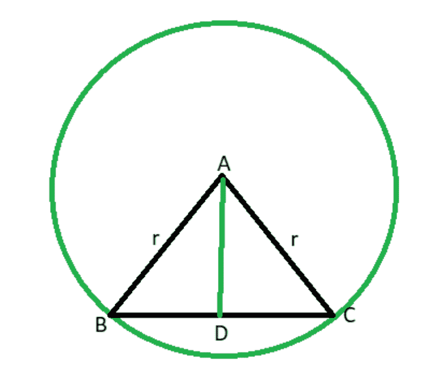
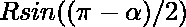
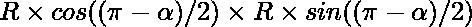
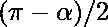
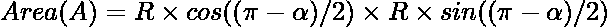
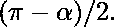

# 计算以圆的半径为边的等腰三角形的面积和高度

> 原文:[https://www . geesforgeks . org/计算边为圆半径的等腰三角形的面积和高度/](https://www.geeksforgeeks.org/calculate-area-and-height-of-an-isosceles-triangle-whose-sides-are-radii-of-a-circle/)

给定整数 **R** 、表示圆的半径和扇形 **AB** ( *如下图*所示)在中心 **O** 处形成的角度，任务是尽可能求出点 **A** 、 **B** 和 **O** 连接形成的三角形的高度和[面积。否则，打印**“不可能”。**](https://www.geeksforgeeks.org/c-program-find-area-triangle/)

[](https://media.geeksforgeeks.org/wp-content/uploads/20210130000428/isosc.png)

**示例:**

> **输入:** R = 5， = 120
> **输出:**
> 三角形的高度为 2.5
> 三角形的面积为 10.8253
> **说明:**给定的面积和高度可以用公式计算出来:
> 高度= 
> 面积= 
> 
> **输入:** R = 12， = 240
> **输出:**不可能

**方法:**给定的问题可以基于以下观察来解决:

> **观测值:**
> 
> [](https://media.geeksforgeeks.org/wp-content/uploads/20210130000428/isosc.png)
> 
> *   假设在弦 **AB** 上从点 **O** 画一条垂线，该垂线在点 **D** 处切割弦。那么三角形的高度将是 **OD** 。>
> *   根据圆的性质，点 **D** 将弦 **AB** 分成两等份，三角形 **AOD** 和 **BOD** 将是相似的三角形。>
> *   角度**∪OAB****∪OBA**同样为三角形 **AOD** 和 **BOD** 相似且相等
> *   三角形 OAB 的高度可以使用以下公式计算:
>     *   
> *   三角形的面积可以计算为:
>     *   

按照以下步骤解决问题:>

*   检查角度是否大于 **180** 或等于 **0** ，然后打印**“不可能”。**
*   现在[以弧度转换角度。](https://www.geeksforgeeks.org/program-to-convert-degree-to-radian/)
*   将角度≈OAB 和 OBA 计算为
*   现在用上面讨论的公式计算出三角形 **OAB** 的高度和面积，打印出来。

下面是上述方法的实现:>

## C++

```
// C++ program for the above approach

#include <bits/stdc++.h>
using namespace std;

// Function to convert given
// angle from degree to radian
double Convert(double degree)
{
    double pi = 3.14159265359;
    return (degree * (pi / 180));
}

// Function to calculate height
// and area of the triangle OAB
void areaAndHeightOfTraingle(
    double radius,
    double a)
{
    if (a >= 180 || a == 0) {
        cout << "Not possible";
        return;
    }

    // Stores the angle OAB and OBA
    double base_angle = (180 - a) / 2;

    // Stores the angle in radians
    double radians = Convert(base_angle);

    // Stores the height
    double height = sin(radians) * radius;

    // Print height of the triangle
    cout << "Height of triangle "
         << height << endl;

    // Stores the base of triangle OAB
    double base = cos(radians) * radius;

    // Stores the area of the triangle
    double area = base * height;

    // Print the area of triangle OAB
    cout << "Area of triangle "
         << area << endl;
}

// Driver Code
int main()
{
    double R = 5, angle = 120;
    areaAndHeightOfTraingle(R, angle);

    return 0;
}
```

## Java 语言(一种计算机语言，尤用于创建网站)

```
// Java program for the above approach
import java.util.*;
class GFG
{

  // Function to convert given
  // angle from degree to radian
  static double Convert(double degree)
  {
    double pi = 3.14159265359;
    return (degree * (pi / 180));
  }

  // Function to calculate height
  // and area of the triangle OAB
  static void areaAndHeightOfTraingle(
    double radius, double a)
  {
    if (a >= 180 || a == 0)
    {
      System.out.println("Not possible");
      return;
    }

    // Stores the angle OAB and OBA
    double base_angle = (180 - a) / 2;

    // Stores the angle in radians
    double radians = Convert(base_angle);

    // Stores the height
    double height = Math.sin(radians) * radius;

    // Print height of the triangle
    System.out.println("Height of triangle " + height);

    // Stores the base of triangle OAB
    double Base = Math.cos(radians) * radius;

    // Stores the area of the triangle
    double area = Base * height;

    // Print the area of triangle OAB
    System.out.println("Area of triangle " + area);
  }

  // Driver Code
  public static void main(String[] args)
  {
    double R = 5, angle = 120;
    areaAndHeightOfTraingle(R, angle);
  }
}

// This code is contributed by sanjoy_62.
```

## 蟒蛇 3

```
# Python3 program for the above approach
from math import sin,cos

# Function to convert given
# angle from degree to radian
def Convert(degree):
    pi = 3.14159265359
    return (degree * (pi / 180))

# Function to calculate height
# and area of the triangle OAB
def areaAndHeightOfTraingle(radius, a):
    if (a >= 180 or a == 0):
        print("Not possible")
        return

    # Stores the angle OAB and OBA
    base_angle = (180 - a) / 2

    # Stores the angle in radians
    radians = Convert(base_angle)

    # Stores the height
    height = sin(radians) * radius

    # Print height of the triangle
    print("Height of triangle ", round(height, 1))

    # Stores the base of triangle OAB
    base = cos(radians) * radius

    # Stores the area of the triangle
    area = base * height

    # Print the area of triangle OAB
    print("Area of triangle ", round(area, 4))

# Driver Code
if __name__ == '__main__':
    R , angle = 5, 120
    areaAndHeightOfTraingle(R, angle)

    # This code is contributed by mohit kumar 29.
```

## C#

```
// C# program for the above approach
using System;
public class GFG
{

    // Function to convert given
    // angle from degree to radian
    static double Convert(double degree)
    {
        double pi = 3.14159265359;
        return (degree * (pi / 180));
    }

    // Function to calculate height
    // and area of the triangle OAB
    static void areaAndHeightOfTraingle(
        double radius, double a)
    {
        if (a >= 180 || a == 0)
        {
            Console.WriteLine("Not possible");
            return;
        }

        // Stores the angle OAB and OBA
        double base_angle = (180 - a) / 2;

        // Stores the angle in radians
        double radians = Convert(base_angle);

        // Stores the height
        double height = Math.Sin(radians) * radius;

        // Print height of the triangle
        Console.WriteLine("Height of triangle " + height);

        // Stores the base of triangle OAB
        double Base = Math.Cos(radians) * radius;

        // Stores the area of the triangle
        double area = Base * height;

        // Print the area of triangle OAB
        Console.WriteLine("Area of triangle " + area);
    }

    // Driver Code
    static public void Main ()
    {
        double R = 5, angle = 120;
        areaAndHeightOfTraingle(R, angle);
    }
}

// This code is contributed by AnkThon
```

## java 描述语言

```
<script>

// Javascript program for the above approach

// Function to convert given
// angle from degree to radian
function Convert(degree)
{
    var pi = 3.14159265359;
    return (degree * (pi / 180));
}

// Function to calculate height
// and area of the triangle OAB
function areaAndHeightOfTraingle(radius, a)
{
    if (a >= 180 || a == 0)
    {
        document.write("Not possible");
        return;
    }

    // Stores the angle OAB and OBA
    var base_angle = (180 - a) / 2;

    // Stores the angle in radians
    var radians = Convert(base_angle);

    // Stores the height
    var height = Math.sin(radians) * radius;

    // Print height of the triangle
    document.write("Height of triangle " + height + "<br>");

    // Stores the base of triangle OAB
    var Base = Math.cos(radians) * radius;

    // Stores the area of the triangle
    var area = Base * height;

    // Print the area of triangle OAB
    document.write("Area of triangle " + area);
}

// Driver code
var R = 5, angle = 120;

areaAndHeightOfTraingle(R, angle);

// This code is contributed by Khushboogoyal499

</script>
```

**Output:** 

```
Height of triangle 2.5
Area of triangle 10.8253
```

***时间复杂度:**O(1)*
T5**辅助空间:** O(1)