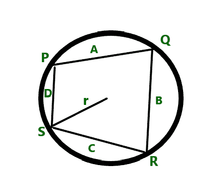
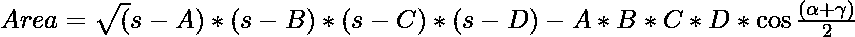
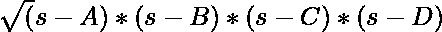

# 计算给定边长的循环四边形的面积

> 原文:[https://www . geeksforgeeks . org/计算给定边长的循环四边形面积/](https://www.geeksforgeeks.org/calculate-area-of-a-cyclic-quadrilateral-with-given-side-lengths/)

给定四个正整数 **A** 、 **B** 、 **C** 和 **D** 表示一个[循环四边形](https://www.geeksforgeeks.org/length-of-diagonals-of-a-cyclic-quadrilateral-using-the-length-of-sides/)的边长，任务是求循环四边形的面积。

**示例:**

> **输入:** A = 10，B = 15，C = 20，D = 25
> T3】输出: 273.861
> 
> **输入:** A = 10，B = 30，C = 50，D = 20
> T3】输出: 443.706

**方法:**给定的问题可以基于以下观察来解决:

*   循环四边形是顶点都在一个圆上的四边形。这个圆被称为外接圆或外接圆，顶点被称为共圆。

[](https://media.geeksforgeeks.org/wp-content/uploads/20210309020339/cyclic.png)

*   上图中 **r** 为外接圆半径， **A** 、 **B** 、 **C** 、 **D** 分别为边长 **PQ** 、 **QR** 、 **RS** 、 **SP** 。
*   四边形的面积由 [**给出，布雷施耐德公式**](https://en.wikipedia.org/wiki/Bretschneider%27s_formula) 为:

> 
> 
> 其中，A、B、C 和 D 是三角形的边，
> α和γ是四边形的对角。
> 
> 因为，四边形的对角之和是 180 度。因此，cos(180/2) = cos(90) = 0 的值。
> 
> 因此，求面积的公式简化为。

因此，想法是将的值打印为给定四边形的合成面积。

下面是上述方法的实现:

## C++

```
// C++ program for the above approach

#include <bits/stdc++.h>
using namespace std;

// Function to find the area
// of cyclic quadrilateral
float calculateArea(float A, float B,
                    float C, float D)
{
    // Stores the value of
    // half of the perimeter
    float S = (A + B + C + D) / 2;

    // Stores area of cyclic quadrilateral
    float area = sqrt((S - A) * (S - B)
                      * (S - C) * (S - D));

    // Return the resultant area
    return area;
}

// Driver Code
int main()
{
    float A = 10;
    float B = 15;
    float C = 20;
    float D = 25;
    cout << calculateArea(A, B, C, D);

    return 0;
}
```

## Java 语言(一种计算机语言，尤用于创建网站)

```
// Java program for the above approach
import java.io.*;

class GFG{

// Function to find the area
// of cyclic quadrilateral
static float calculateArea(float A, float B,
                           float C, float D)
{

    // Stores the value of
    // half of the perimeter
    float S = (A + B + C + D) / 2;

    // Stores area of cyclic quadrilateral
    float area = (float)Math.sqrt((S - A) * (S - B) *
                                  (S - C) * (S - D));

    // Return the resultant area
    return area;
}

// Driver code
public static void main (String[] args)
{
    float A = 10;
    float B = 15;
    float C = 20;
    float D = 25;

    System.out.println(calculateArea(A, B, C, D));

}
}

// This code is contributed by Ankita saini
```

## 蟒蛇 3

```
# Python3 program for the above approach
from math import sqrt

# Function to find the area
# of cyclic quadrilateral
def calculateArea(A, B, C, D):

    # Stores the value of
    # half of the perimeter
    S = (A + B + C + D) // 2

    # Stores area of cyclic quadrilateral
    area = sqrt((S - A) * (S - B) *
                (S - C) * (S - D))

    # Return the resultant area
    return area

# Driver Code
if __name__ == '__main__':

    A = 10
    B = 15
    C = 20
    D = 25

    print(round(calculateArea(A, B, C, D), 3))

# This code is contributed by mohit kumar 29
```

## C#

```
// C# program for the above approach
using System;

class GFG{

// Function to find the area
// of cyclic quadrilateral
static float calculateArea(float A, float B,
                           float C, float D)
{

    // Stores the value of
    // half of the perimeter
    float S = (A + B + C + D) / 2;

    // Stores area of cyclic quadrilateral
    float area = (float)Math.Sqrt((S - A) * (S - B) *
                                  (S - C) * (S - D));

    // Return the resultant area
    return area;
}

// Driver Code
static public void Main()
{
    float A = 10;
    float B = 15;
    float C = 20;
    float D = 25;

    Console.Write(calculateArea(A, B, C, D));
}
}

// This code is contributed by code_hunt
```

## java 描述语言

```
<script>
// java script  program for the above approach

// Function to find the area
//of cyclic quadrilateral
function calculateArea(A, B, C, D){

    //Stores the value of
    // half of the perimeter
    let S = (A + B + C + D) /2

    // Stores area of cyclic quadrilateral
    let area = Math.sqrt((S - A) * (S - B) *
                (S - C) * (S - D))

    //Return the resultant area
    return area;
    }

// Driver Code

    let  A = 10;
    let B = 15;
    let C = 20;
    let D = 25;

    document.write(calculateArea(A, B, C, D).toFixed(3))

//this code is contributed by sravan kumar
</script>
```

**Output:** 

```
273.861
```

***时间复杂度:**O(1)*
T5**辅助空间:** O(1)