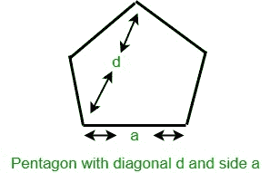
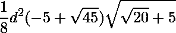

# 计算给定对角线的五边形面积

> 原文:[https://www . geeksforgeeks . org/计算给定对角线的五边形面积/](https://www.geeksforgeeks.org/calculate-area-of-pentagon-with-given-diagonal/)

给定一个整数 **d** ，它是一个[五边形](https://en.wikipedia.org/wiki/Pentagon)的对角线长度，任务是找到那个五边形的面积。



**例:**

> **输入:** d = 5
> **输出:** 16.4291
> **输入:** d = 10
> **输出:** 65.7164

**逼近:**五边形是一个正多边形，有五条等边，所有的角都相等。五边形的内角各为 108 度，五边形所有角度之和为 540 度。如果 **d** 是五边形的对角线，那么它的面积由下式给出:



以下是上述方法的实现:

## C++

```
// C++ program to find the area of
// Pentagon with given diagonal
#include <bits/stdc++.h>
using namespace std;

// Function to return the area of the
// pentagon with diagonal d
float pentagonArea(float d)
{
    float area;

    // Formula to find area
    area = (d * d * (-5 + sqrt(45)) * sqrt(sqrt(20) + 5)) / 8;

    return area;
}

// Driver code
int main()
{
    float d = 5;
    cout << pentagonArea(d);
    return 0;
}
```

## Java 语言(一种计算机语言，尤用于创建网站)

```
// Java program to find the area of
// Pentagon with given diagonal
import java.text.*;
class GFG{
// Function to return the area of the
// pentagon with diagonal d
static double pentagonArea(double d)
{
    double area;

    // Formula to find area
    area = (d * d * (-5 + Math.sqrt(45)) * Math.sqrt(Math.sqrt(20) + 5)) / 8;

    return area;
}

// Driver code
public static void main(String[] args)
{
    double d = 5;
    DecimalFormat dec = new DecimalFormat("#0.0000");
    System.out.println(dec.format(pentagonArea(d)));
}
}
// This code is contributed by mits
```

## 蟒蛇 3

```
# Python3 program to find the area of
# Pentagon with given diagonal

# from math lib import sqrt() method
from math import sqrt

# Function to return the area of the
# pentagon with diagonal d
def pentagonArea(d) :

    # Formula to find area
    area = (d * d * (-5 + sqrt(45)) * sqrt(sqrt(20) + 5)) / 8

    return round(area , 4)

# Driver code
if __name__ == "__main__" :

    d = 5
    print(pentagonArea(d))

# This code is contributed by Ryuga
```

## C#

```
// C# program to find the area of
// Pentagon with given diagonal
using System;

class GFG{
// Function to return the area of the
// pentagon with diagonal d
static double pentagonArea(double d)
{
    double area;

    // Formula to find area
    area = (d * d * (-5 + Math.Sqrt(45)) * Math.Sqrt(Math.Sqrt(20) + 5)) / 8;

    return area;
}

// Driver code
public static void Main()
{
    double d = 5;
    Console.WriteLine("{0:F4}",pentagonArea(d));
}
}
// This code is contributed by mits
```

## 服务器端编程语言（Professional Hypertext Preprocessor 的缩写）

```
<?php
// PHP program to find the area of
// Pentagon with given diagonal
// Function to return the area of the
// pentagon with diagonal d
 Function pentagonArea($d)
{
    $area;

    // Formula to find area
    $area= ($d * $d * (-5 +sqrt(45)) * sqrt(sqrt(20) + 5)) / 8;

    return $area;
}

// Driver code
{
    $d = 5;
    echo(pentagonArea($d));
    return 0;
}
//This code is contributed by Mukul singh.
```

## java 描述语言

```
<script>
// javascript program to find the area of
// Pentagon with given diagonal

// Function to return the area of the
// pentagon with diagonal d
function pentagonArea( d)
{
    let area;

    // Formula to find area
    area = (d * d * (-5 + Math.sqrt(45)) * Math.sqrt(Math.sqrt(20) + 5)) / 8;
    return area;
}

// Driver code
    let d = 5;
    document.write(pentagonArea(d).toFixed(4));

// This code is contributed by gauravrajput1
</script>
```

**Output:** 

```
16.4291
```