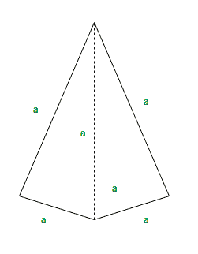

# 计算四面体面积和体积的程序

> 原文:[https://www.geeksforgeeks.org/calculate-area-tetrahedron/](https://www.geeksforgeeks.org/calculate-area-tetrahedron/)

四面体只是一个底部为三角形的金字塔。它是一个实心对象，有四个三角形面，三个在侧面或侧面，一个在底部或底部，四个顶点或角。如果面都是全等的等边三角形，那么四面体就叫做正四面体。



四面体的面积可以通过以下公式计算:

```
Area = sqrt(3)*(side*side)
```

**示例:**

```
Input : side = 3
Output : 15.5885

Input : side = 20
Output : 692.82
```

## C++

```
// C++ Program to Calculate
// area of tetrahedron
#include<iostream>
#include<math.h>
using namespace std;

//Utility Function
double area_of_tetrahedron(int side)
{
    return (sqrt(3)*(side*side));
}

//Driver Code
int main()
{
    int side=3;
    cout<< "Area of Tetrahedron ="
        << area_of_tetrahedron(side);
}

// This code is contributed by anant321.
```

## Java 语言(一种计算机语言，尤用于创建网站)

```
// Java Program to Calculate
// area of tetrahedron
import java.util.*;
import java.lang.*;

class GFG {

    // Utility Function
    public static double area_of_tetrahedron(int side)
    {
        return (Math.sqrt(3) * (side * side));

    }

    // Driver code
    public static void main(String[] args)
    {
        int side = 3;
        System.out.println("Area of Tetrahedron ="
                     + area_of_tetrahedron(side));
    }
}
// This code is contributed
// by Prasad Kshirsagar
```

## 蟒蛇 3

```
# Python3 Program to
# Calculate area of
# tetrahedron
import math

def area_of_tetrahedron(side):
    return (math.sqrt(3) *
           (side * side));

# Driver Code
side = 3;
print("Area of Tetrahedron = ",
       round(area_of_tetrahedron(side), 4));

# This code is contributed by mits
```

## C#

```
// C# Program to Calculate
// area of tetrahedron
using System;

class GFG
{
// Utility Function
public static double area_of_tetrahedron(int side)
{
    return (Math.Sqrt(3) *
           (side * side));

}

// Driver code
static public void Main ()
{
    int side = 3;
    Console.WriteLine("Area of Tetrahedron = " +
                     area_of_tetrahedron(side));
}
}

// This code is contributed
// by akt_mit
```

## 服务器端编程语言（Professional Hypertext Preprocessor 的缩写）

```
<?php
// PHP Program to Calculate
// area of tetrahedron

function area_of_tetrahedron($side)
{
    return (sqrt(3) * ($side * $side));
}

    // Driver Code
    $side = 3;
    echo "Area of Tetrahedron = ",
          area_of_tetrahedron($side);

// This code is contributed by aj_36.
?>
```

## java 描述语言

```
<script>
// javascript Program to Calculate
// area of tetrahedron

// Utility Function
function area_of_tetrahedron( side)
{
    return (Math.sqrt(3) * (side * side));
}

// Driver Code
let side = 3;
document.write("Area of Tetrahedron ="
+ area_of_tetrahedron(side).toFixed(4));

// This code contributed by aashish1995

</script
```

**输出:**

```
Area of Tetrahedron =15.5885
```

四面体的体积可以通过以下公式求出:

> 体积= a <sup>3</sup> /(6√2)

**示例:**

```
Input : side = 3
Output : 3.18

Input : side = 20
Output : 942.81
```

## C++

```
// C++ code to find the volume of a tetrahedron
#include <bits/stdc++.h>
using namespace std;

// Function to calculate volume
double vol_tetra(int side)
{
    double volume = (pow(side, 3) /
                    (6 * sqrt(2)));
    return volume;
}

// Driver code
int main()
{
    int side = 3;
    double vol = vol_tetra(side);
    vol = (double)round(vol * 100) / 100;
    cout << vol;

    return 0;
}

// This code is contributed by suresh07
```

## Java 语言(一种计算机语言，尤用于创建网站)

```
// Java code to find the volume of a tetrahedron
import java.io.*;

class Tetrahedron {
    // Function to calculate volume
    static double vol_tetra(int side)
    {
        double volume = (Math.pow(side, 3) / (6 * Math.sqrt(2)));
        return volume;
    }

    // Driver Code
    public static void main(String[] args)
    {
        int side = 3;
        double vol = vol_tetra(side);
        vol = (double)Math.round(vol * 100) / 100;
        System.out.println(vol);
    }
}
```

## 蟒蛇 3

```
# Python code to find the volume of a tetrahedron
import math
def vol_tetra(side):
    volume = (side ** 3 / (6 * math.sqrt(2)))
    return round(volume, 2)

# Driver Code
side = 3
vol = vol_tetra(side)
print(vol)
```

## C#

```
// C# code to find the volume of a tetrahedron
using System;

class Tetrahedron {
    // Function to calculate volume
    static double vol_tetra(int side)
    {
        double volume = (Math.Pow(side, 3) / (6 * Math.Sqrt(2)));
        return volume;
    }

    // Driver Code
    public static void Main()
    {
        int side = 3;
        double vol = vol_tetra(side);
        vol = (double)Math.Round(vol * 100) / 100;
        Console.WriteLine(vol);
    }
}

// This code is contributed
// by vt_m.
```

## 服务器端编程语言（Professional Hypertext Preprocessor 的缩写）

```
<?php
// PHP program to find the
// volume of a tetrahedron

// Function to calculate volume
function vol_tetra($side)
{
    $volume = (pow($side, 3) /
                  (6 * sqrt(2)));
    return $volume;
}

// Driver Code
$side = 3;
$vol = vol_tetra($side);
echo $vol;

// This code is contributed by ajit
?>
```

## java 描述语言

```
<script>
// javascript code to find the volume of a tetrahedron

function vol_tetra(side)
{
    let volume = (Math.pow(side, 3) / (6 * Math.sqrt(2)));
    return volume;
}

// Driver Code
let side = 3;
let vol = vol_tetra(side);
vol = Math.round(vol * 100) / 100;
document.write(vol);

// This code is contributed by gauravrajput1

</script>
```

**输出:**

```
3.18
```