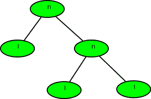
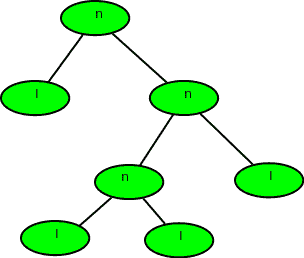

# 根据预排序计算完整二叉树的深度

> 原文:[https://www . geesforgeks . org/calculate-depth-full-二叉树-preorder/](https://www.geeksforgeeks.org/calculate-depth-full-binary-tree-preorder/)

给定二叉树的前序，计算其[深度(或高度)](https://www.geeksforgeeks.org/write-a-c-program-to-find-the-maximum-depth-or-height-of-a-tree/)【从深度 0 开始】。预订单是由两个可能的字符组成的字符串。

1.  “l”表示叶子
2.  “n”表示内部节点

给定的树可以看作是一个完整的二叉树，其中每个节点都有 0 或两个子节点。节点的两个子节点可以是“n”或“l ”,也可以是两者的混合。
**例:**

```
Input  : nlnll
Output : 2
Explanation :
```



```
Input  : nlnnlll
Output : 3
```



二叉树的前序是这样遍历的
同样，我们会得到一串字符(由‘n’和‘l’组成)，所以也没有必要实现树。
递归函数为:
1)基本情况:返回 0；当 tree[i] = 'l '或 I>= strlen(tree)
2)find _ depth(tree[i++])//左子树
3)find _ depth(tree[i++])//右子树
其中 I 是字符串树的索引。

## C++

```
// C++ program to find height of full binary tree
// using preorder
#include <bits/stdc++.h>
using namespace std;

// function to return max of left subtree height
// or right subtree height
int findDepthRec(char tree[], int n, int& index)
{
    if (index >= n || tree[index] == 'l')
        return 0;

    // calc height of left subtree (In preorder
    // left subtree is processed before right)
    index++;
    int left = findDepthRec(tree, n, index);

    // calc height of right subtree
    index++;
    int right = findDepthRec(tree, n, index);

    return max(left, right) + 1;
}

// Wrapper over findDepthRec()
int findDepth(char tree[], int n)
{
    int index = 0;
    findDepthRec(tree, n, index);
}

// Driver program
int main()
{
    // Your C++ Code
    char tree[] = "nlnnlll";
    int n = strlen(tree);

    cout << findDepth(tree, n) << endl;

    return 0;
}
```

## Java 语言(一种计算机语言，尤用于创建网站)

```
// Java program to find height
// of full binary tree using
// preorder
import java .io.*;

class GFG
{
    // function to return max
    // of left subtree height
    // or right subtree height
    static int findDepthRec(String tree,
                            int n, int index)
    {
        if (index >= n ||
            tree.charAt(index) == 'l')
            return 0;

        // calc height of left subtree
        // (In preorder left subtree
        // is processed before right)
        index++;
        int left = findDepthRec(tree,
                                n, index);

        // calc height of
        // right subtree
        index++;
        int right = findDepthRec(tree, n, index);

        return Math.max(left, right) + 1;
    }

    // Wrapper over findDepthRec()
    static int findDepth(String tree,
                         int n)
    {
        int index = 0;
        return (findDepthRec(tree,
                             n, index));
    }

    // Driver Code
    static public void main(String[] args)
    {
        String tree = "nlnnlll";
        int n = tree.length();
        System.out.println(findDepth(tree, n));
    }
}

// This code is contributed
// by anuj_67.
```

## 蟒蛇 3

```
#Python program to find height of full binary tree
# using preorder

# function to return max of left subtree height
# or right subtree height
def findDepthRec(tree, n, index) :

    if (index[0] >= n or tree[index[0]] == 'l'):
        return 0

    # calc height of left subtree (In preorder
    # left subtree is processed before right)
    index[0] += 1
    left = findDepthRec(tree, n, index)

    # calc height of right subtree
    index[0] += 1
    right = findDepthRec(tree, n, index)
    return (max(left, right) + 1)

# Wrapper over findDepthRec()
def findDepth(tree, n) :

    index = [0]
    return findDepthRec(tree, n, index)

# Driver program to test above functions
if __name__ == '__main__':
    tree= "nlnnlll"
    n = len(tree)

    print(findDepth(tree, n))

# This code is contributed by SHUBHAMSINGH10
```

## C#

```
// C# program to find height of
// full binary tree using preorder
using System;

class GFG {

    // function to return max of left subtree
    // height or right subtree height
    static int findDepthRec(char[] tree, int n, int index)
    {
        if (index >= n || tree[index] == 'l')
            return 0;

        // calc height of left subtree (In preorder
        // left subtree is processed before right)
        index++;
        int left = findDepthRec(tree, n, index);

        // calc height of right subtree
        index++;
        int right = findDepthRec(tree, n, index);

        return Math.Max(left, right) + 1;
    }

    // Wrapper over findDepthRec()
    static int findDepth(char[] tree, int n)
    {
        int index = 0;
        return (findDepthRec(tree, n, index));
    }

    // Driver program
    static public void Main()
    {
        char[] tree = "nlnnlll".ToCharArray();
        int n = tree.Length;
        Console.WriteLine(findDepth(tree, n));
    }
}

// This code is contributed by vt_m.
```

## java 描述语言

```
<script>
    // Javascript program to find height of
    // full binary tree using preorder

    // function to return max of left subtree
    // height or right subtree height
    function findDepthRec(tree, n, index)
    {
        if (index >= n || tree[index] == 'l')
            return 0;

        // calc height of left subtree (In preorder
        // left subtree is processed before right)
        index++;
        let left = findDepthRec(tree, n, index);

        // calc height of right subtree
        index++;
        let right = findDepthRec(tree, n, index);

        return Math.max(left, right) + 1;
    }

    // Wrapper over findDepthRec()
    function findDepth(tree, n)
    {
        let index = 0;
        return (findDepthRec(tree, n, index));
    }

    let tree = "nlnnlll".split('');
    let n = tree.length;
    document.write(findDepth(tree, n));

</script>
```

**输出:**

```
3
```

**时间复杂度:** O(N)

**辅助空间:** O(1)

本文由 [**舒巴姆·古普塔**](https://www.facebook.com/Shubh1307) 供稿。如果你喜欢 GeeksforGeeks 并想投稿，你也可以使用[write.geeksforgeeks.org](https://write.geeksforgeeks.org)写一篇文章或者把你的文章邮寄到 contribute@geeksforgeeks.org。看到你的文章出现在极客博客主页上，帮助其他极客。
如果发现有不正确的地方，或者想分享更多关于上述话题的信息，请写评论。