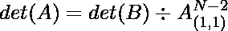

# 用枢轴凝聚法计算矩阵的行列式

> 原文:[https://www . geeksforgeeks . org/calculate-矩阵的行列式-使用-pivotal-conclusion-method/](https://www.geeksforgeeks.org/calculate-determinant-of-a-matrix-using-pivotal-condensation-method/)

给定维度为 **N** 的正方形[矩阵](https://www.geeksforgeeks.org/matrix/) **mat[][]** ，任务是使用枢轴凝聚法找到矩阵的[行列式。](https://www.geeksforgeeks.org/determinant-of-a-matrix/)

**示例:**

> **输入:** mat[][] = {{1，2，3}，{4，5，6}，{7，8，9}}
> **输出:** 0
> **解释:**
> 执行 R3 = R3–R2 将矩阵 mat[][]修改为{{1，2，3}，{4，5，6}，{1，1，1}}。
> 表演 R2 = R2–R1 将矩阵 mat[][]修改为{{1，2，3}，{1，1，1}，{1，1，1}}。
> 现在，行 R2 和 R3 相等。
> 因此，矩阵的行列式的意志等于零(利用矩阵的性质)。
> 
> **输入:** mat[][] = {{1，0，2，-1}，{3，0，0，5}，{2，1，4，-3}，{1，0，5，0}}
> **输出:** 30

**方法:**思路是利用[枢纽凝聚法](https://en.wikipedia.org/wiki/Pivot_element)计算矩阵**mat【】【】**的[行列式。以下是建议方法的详细说明:](https://www.geeksforgeeks.org/determinant-of-a-matrix/)

在这种计算维数的行列式 **N × N** 、[方阵](https://www.geeksforgeeks.org/how-to-access-elements-of-a-square-matrix/)的方法中:

*   首先将维度 **N*N** 的矩阵 **A[][]** 简化为维度**(N–1)*(N–1)**的矩阵 **B[][]** :

> 

*   然后利用公式从矩阵 **B[][]** 中求出 **A[][]** 的行列式值，

> 

*   现在进一步将矩阵化简为**(N–2)*(N–2)**，计算矩阵的行列式 **B[][]** 。
*   重复上述过程，直到矩阵变成尺寸 **2*2** 。
*   然后使用公式 **det(A) = ad-bc** 计算维度 **2×2** 矩阵的行列式，对于矩阵称 **A[][]** 为 **{{a，b}，{c，d}}** 。

按照以下步骤解决问题:

*   初始化一个变量，比如说 **D** ，来存储矩阵的[行列式。](https://www.geeksforgeeks.org/determinant-of-a-matrix/)
*   当 **N** 大于 **2** 时迭代，检查以下内容:
    *   检查 **mat[0][0]** 是否为 **0** ，然后用下一行交换当前行，使得 **mat[i][0] > 0** 使用矩阵的属性。
    *   否则，如果没有找到使 **mat[i][0] > 0** 的行，则打印零。
    *   现在，将 **D** 乘以**幂(1 / mat[0][0]，N–2)**。
    *   使用公式**B[I–1][j–1]= mat[0][0 * mat[I][I]–mat[0]–mat[0][j]* mat[0][0]**，计算维度**(N–1)x(N–1)**的下一个矩阵，比如**B[][][]**。
    *   分配 **mat = B** 。
*   将 **D** 乘以维度 **2×2** 的矩阵**mat【】[]**的行列式，即**mat[0][0]* mat[1][1]–mat[0][j]* mat[I][0]。**
*   最后，打印存储在 **D** 中的值。

下面是上述方法的实现:

## C++

```
// C++ program for the above approach
#include <bits/stdc++.h>
using namespace std;

// Function to swap values
void swap(float& i, float& j)
{
    float temp = i;
    i = j;
    j = temp;
}

// Function to find the determinant
// of matrix M[][]
float determinantOfMatrix(
    vector<vector<float> > mat, int N)
{
    float mul = 1;

    // Iterate over N while N > 2
    while (N > 2) {

        // Store the reduced matrix
        // of dimension (N-1)x(N-1)
        float M[N - 1][N - 1];

        int next_index = 1;

        // Check if first element
        // of first row is zero
        while (mat[0][0] == 0) {

            if (mat[next_index][0] > 0) {

                // For swapping
                for (int k = 0; k < N; k++) {
                    swap(mat[0][k],
                         mat[next_index][k]);
                }

                // Update mul
                mul = mul * pow((-1),
                                (next_index));
            }

            else if (next_index == (N - 1))
                return 0;
            next_index++;
        }

        // Store the first element
        // of the matrix
        float p = mat[0][0];

        // Multiply the mul by
        // (1/p) to the power n-2
        mul = mul * pow(1 / p, N - 2);

        // Calculate the next matrix
        // of dimension (N-1) x (N-1)
        for (int i = 1; i < N; i++) {
            for (int j = 1; j < N; j++) {

                // Calculate each element of
                // the matrix from previous
                // matrix
                M[i - 1][j - 1] = mat[0][0]
                                      * mat[i][j]
                                  - mat[i][0]
                                        * mat[0][j];
            }
        }

        // Copy elements of the matrix
        // M into mat to use it in
        // next iteration
        for (int i = 0;
             i < (N - 1); i++) {

            for (int j = 0;
                 j < (N - 1); j++) {

                mat[i][j] = M[i][j];
            }
        }

        // Decrement N by one
        N--;
    }

    // Calculate the determinant
    // of reduced 2x2 matrix and
    // multiply it with factor mul
    float D = mul * (mat[0][0]
                         * mat[1][1]
                     - mat[0][1]
                           * mat[1][0]);

    // Print the determinant
    cout << D;
}

// Driver Code
int main()
{
    // Given matrix
    vector<vector<float> > mat = { { 1, 0, 2, -1 },
                                   { 3, 0, 0, 5 },
                                   { 2, 1, 4, -3 },
                                   { 1, 0, 5, 0 } };

    // Size of the matrix
    int N = mat.size();

    // Function Call
    determinantOfMatrix(mat, N);

    return 0;
}
```

## Java 语言(一种计算机语言，尤用于创建网站)

```
// Java program for the above approach
import java.util.*;
class GFG
{

// Function to find the determinant
// of matrix M[][]
static void determinantOfMatrix(int[][] mat, int N)
{
    int mul = 1;

    // Iterate over N while N > 2
    while (N > 2)
    {

        // Store the reduced matrix
        // of dimension (N-1)x(N-1)
        int [][]M = new int[N - 1][N - 1];
        int next_index = 1;

        // Check if first element
        // of first row is zero
        while (mat[0][0] == 0)
        {
            if (mat[next_index][0] > 0)
            {

                // For swapping
                for (int k = 0; k < N; k++)
                {
                    int temp = mat[0][k];
                    mat[0][k] = mat[next_index][k];
                    mat[next_index][k] = temp;

                }

                // Update mul
                mul = (int) (mul * Math.pow((-1),
                                (next_index)));
            }
            else if (next_index == (N - 1))
                return;
            next_index++;
        }

        // Store the first element
        // of the matrix
        int p = mat[0][0];

        // Multiply the mul by
        // (1/p) to the power n-2
        mul = (int) (mul * Math.pow(1 / p, N - 2));

        // Calculate the next matrix
        // of dimension (N-1) x (N-1)
        for (int i = 1; i < N; i++)
        {
            for (int j = 1; j < N; j++)
            {

                // Calculate each element of
                // the matrix from previous
                // matrix
                M[i - 1][j - 1] = mat[0][0]
                                      * mat[i][j]
                                  - mat[i][0]
                                        * mat[0][j];
            }
        }

        // Copy elements of the matrix
        // M into mat to use it in
        // next iteration
        for (int i = 0;
             i < (N - 1); i++)
        {
            for (int j = 0;
                 j < (N - 1); j++)
            {
                mat[i][j] = M[i][j];
            }
        }

        // Decrement N by one
        N--;
    }

    // Calculate the determinant
    // of reduced 2x2 matrix and
    // multiply it with factor mul
    int D = mul * (mat[0][0]
                         * mat[1][1]
                     - mat[0][1]
                           * mat[1][0]);

    // Print the determinant
    System.out.print(D);
}

// Driver Code
public static void main(String[] args)
{

    // Given matrix
    int[][] mat = { { 1, 0, 2, -1 },
                                   { 3, 0, 0, 5 },
                                   { 2, 1, 4, -3 },
                                   { 1, 0, 5, 0 } };

    // Size of the matrix
    int N = mat.length;

    // Function Call
    determinantOfMatrix(mat, N);
}
}

// This code is contributed by 29AjayKumar
```

## 蟒蛇 3

```
# Pyhton 3 program for the above approach

# Function to find the determinant
# of matrix M[][]
def determinantOfMatrix(mat, N):
    mul = 1

    # Iterate over N while N > 2
    while (N > 2):
        # Store the reduced matrix
        # of dimension (N-1)x(N-1)
        M = [[0 for i in range(N-1)] for j in range(N-1)]

        next_index = 1

        # Check if first element
        # of first row is zero
        while (mat[0][0] == 0):
            if (mat[next_index][0] > 0):
                # For swapping
                for k in range(N):
                    temp = mat[0][k]
                    mat[0][k] = mat[next_index][k]
                    mat[next_index][k] = temp

                # Update mul
                mul = mul * pow((-1),(next_index))

            elif (next_index == (N - 1)):
                return 0;
            next_index += 1

        # Store the first element
        # of the matrix
        p = mat[0][0]

        # Multiply the mul by
        # (1/p) to the power n-2
        mul = mul * pow(1 / p, N - 2)

        # Calculate the next matrix
        # of dimension (N-1) x (N-1)
        for i in range(1,N):
            for j in range(1,N,1):
                # Calculate each element of
                # the matrix from previous
                # matrix
                M[i - 1][j - 1] = mat[0][0] * mat[i][j] - mat[i][0] * mat[0][j]

        # Copy elements of the matrix
        # M into mat to use it in
        # next iteration
        for i in range(N - 1):
            for j in range(N - 1):
                mat[i][j] = M[i][j]

        # Decrement N by one
        N -= 1

    # Calculate the determinant
    # of reduced 2x2 matrix and
    # multiply it with factor mul
    D = mul * (mat[0][0] * mat[1][1] - mat[0][1] * mat[1][0])

    # Print the determinant
    print(int(D))

# Driver Code
if __name__ == '__main__':
    # Given matrix
    mat = [[1, 0, 2, -1],[3, 0, 0, 5], [2, 1, 4, -3], [1, 0, 5, 0]]

    # Size of the matrix
    N = len(mat)

    # Function Call
    determinantOfMatrix(mat, N)

    # This code is contributed by bgangwar59.
```

## C#

```
// C# program for the above approach
using System;

public class GFG
{

// Function to find the determinant
// of matrix [,]M
static void determinantOfMatrix(int[,] mat, int N)
{
    int mul = 1;

    // Iterate over N while N > 2
    while (N > 2)
    {

        // Store the reduced matrix
        // of dimension (N-1)x(N-1)
        int [,]M = new int[N - 1,N - 1];
        int next_index = 1;

        // Check if first element
        // of first row is zero
        while (mat[0,0] == 0)
        {
            if (mat[next_index,0] > 0)
            {

                // For swapping
                for (int k = 0; k < N; k++)
                {
                    int temp = mat[0,k];
                    mat[0,k] = mat[next_index,k];
                    mat[next_index,k] = temp;

                }

                // Update mul
                mul = (int) (mul * Math.Pow((-1),
                                (next_index)));
            }
            else if (next_index == (N - 1))
                return;
            next_index++;
        }

        // Store the first element
        // of the matrix
        int p = mat[0,0];

        // Multiply the mul by
        // (1/p) to the power n-2
        mul = (int) (mul * Math.Pow(1 / p, N - 2));

        // Calculate the next matrix
        // of dimension (N-1) x (N-1)
        for (int i = 1; i < N; i++)
        {
            for (int j = 1; j < N; j++)
            {

                // Calculate each element of
                // the matrix from previous
                // matrix
                M[i - 1,j - 1] = mat[0,0]
                                      * mat[i,j]
                                  - mat[i,0]
                                        * mat[0,j];
            }
        }

        // Copy elements of the matrix
        // M into mat to use it in
        // next iteration
        for (int i = 0;
             i < (N - 1); i++)
        {
            for (int j = 0;
                 j < (N - 1); j++)
            {
                mat[i,j] = M[i,j];
            }
        }

        // Decrement N by one
        N--;
    }

    // Calculate the determinant
    // of reduced 2x2 matrix and
    // multiply it with factor mul
    int D = mul * (mat[0,0]
                         * mat[1,1]
                     - mat[0,1]
                           * mat[1,0]);

    // Print the determinant
    Console.Write(D);
}

// Driver Code
public static void Main(String[] args)
{

    // Given matrix
    int[,] mat = { { 1, 0, 2, -1 },
                                   { 3, 0, 0, 5 },
                                   { 2, 1, 4, -3 },
                                   { 1, 0, 5, 0 } };

    // Size of the matrix
    int N = mat.GetLength(0);

    // Function Call
    determinantOfMatrix(mat, N);
}
}

// This code is contributed by Rajput-Ji
```

## java 描述语言

```
<script>
    // Javascript program for the above approach

    // Function to find the determinant
    // of matrix M[][]
    function determinantOfMatrix(mat, N)
    {
        let mul = 1;

        // Iterate over N while N > 2
        while (N > 2)
        {

            // Store the reduced matrix
            // of dimension (N-1)x(N-1)
            let M = new Array(N - 1);
            for(let i = 0; i < N - 1; i++)
            {
                M[i] = new Array(N - 1);
                for(let j = 0; j < N - 1; j++)
                {
                    M[i][j] = 0;
                }
            }
            let next_index = 1;

            // Check if first element
            // of first row is zero
            while (mat[0][0] == 0)
            {
                if (mat[next_index][0] > 0)
                {

                    // For swapping
                    for (let k = 0; k < N; k++)
                    {
                        let temp = mat[0][k];
                        mat[0][k] = mat[next_index][k];
                        mat[next_index][k] = temp;

                    }

                    // Update mul
                    mul = (mul * Math.pow((-1),
                                    (next_index)));
                }
                else if (next_index == (N - 1))
                    return;
                next_index++;
            }

            // Store the first element
            // of the matrix
            let p = mat[0][0];

            // Multiply the mul by
            // (1/p) to the power n-2
            mul = (mul * Math.pow(parseInt(1 / p, 10), N - 2));

            // Calculate the next matrix
            // of dimension (N-1) x (N-1)
            for (let i = 1; i < N; i++)
            {
                for (let j = 1; j < N; j++)
                {

                    // Calculate each element of
                    // the matrix from previous
                    // matrix
                    M[i - 1][j - 1] = mat[0][0]
                                          * mat[i][j]
                                      - mat[i][0]
                                            * mat[0][j];
                }
            }

            // Copy elements of the matrix
            // M into mat to use it in
            // next iteration
            for (let i = 0;
                 i < (N - 1); i++)
            {
                for (let j = 0;
                     j < (N - 1); j++)
                {
                    mat[i][j] = M[i][j];
                }
            }

            // Decrement N by one
            N--;
        }

        // Calculate the determinant
        // of reduced 2x2 matrix and
        // multiply it with factor mul
        let D = mul * (mat[0][0]
                             * mat[1][1]
                         - mat[0][1]
                               * mat[1][0]);

        // Print the determinant
        document.write(D);
    }

    // Given matrix
    let mat = [ [ 1, 0, 2, -1 ],
               [ 3, 0, 0, 5 ],
               [ 2, 1, 4, -3 ],
               [ 1, 0, 5, 0 ] ];

    // Size of the matrix
    let N = mat.length;

    // Function Call
    determinantOfMatrix(mat, N);

// This code is contributed by decode2207.
</script>
```

**Output:** 

```
30
```

***时间复杂度:**O(N<sup>3</sup>)*
***辅助空间:** O(N <sup>2</sup> )*