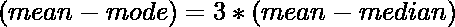
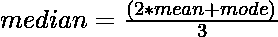

# 根据给定的平均值和模式值计算中位数

> 原文:[https://www . geeksforgeeks . org/从给定值计算中值和模式/](https://www.geeksforgeeks.org/calculate-median-from-given-values-of-mean-and-mode/)

给定两个整数**表示**和**模式**，代表随机一组数据的[表示](https://en.wikipedia.org/wiki/Mean)和[模式](https://en.wikipedia.org/wiki/Mode_(statistics))，任务是计算该组数据的[中值](https://www.geeksforgeeks.org/python-pandas-dataframe-median/)。

> **输入:**均值= 3，模式= 6
> T3】输出: 4
> 
> **输入:**均值= 1，模式= 1
> **输出** : 1

**逼近:**利用这组数据的**均值**、**模式**、**中值**之间的数学关系，可以解决给定的问题。下面是它们之间的关系:

> => 
> 
> => 

所以思路是在给定均值和模式的情况下，用上面的公式求数据的[中值。](https://www.geeksforgeeks.org/median-of-stream-of-integers-running-integers/)

下面是上述方法的实现:

## C++

```
// C++ program for the above approach

#include <bits/stdc++.h>
using namespace std;

// Function to find the median of a
// group of data with given mean and mode
void findMedian(int Mean, int Mode)
{
    // Calculate the median
    double Median = (2 * Mean + Mode) / 3.0;

    // Print the median
    cout << Median;
}

// Driver Code
int main()
{
    int mode = 6, mean = 3;
    findMedian(mean, mode);

    return 0;
}
```

## Java 语言(一种计算机语言，尤用于创建网站)

```
// Java program for the above approach
import java.util.*;

class GFG{

// Function to find the median of a
// group of data with given mean and mode
static void findMedian(int Mean, int Mode)
{

    // Calculate the median
    double Median = (2 * Mean + Mode) / 3.0;

    // Print the median
    System.out.print((int)Median);
}

// Driver code
public static void main (String[] args)
{
    int mode = 6, mean = 3;

    findMedian(mean, mode);
}
}

// This code is contributed by code_hunt
```

## 蟒蛇 3

```
# Python3 program for the above approach

# Function to find the median of
# a group of data with given mean and mode
def findMedian(Mean, Mode):

    # Calculate the median
    Median = (2 * Mean + Mode) // 3

    # Print the median
    print(Median)

# Driver code
Mode = 6
Mean = 3

findMedian(Mean, Mode)

# This code is contributed by virusbuddah
```

## C#

```
// C# program for the above approach
using System;
class GFG
{

// Function to find the median of a
// group of data with given mean and mode
static void findMedian(int Mean, int Mode)
{

    // Calculate the median
    double Median = (2 * Mean + Mode) / 3.0;

    // Print the median
    Console.Write(Median);
}

// Driver Code
public static void Main()
{
    int mode = 6, mean = 3;
    findMedian(mean, mode);
}
}

// This code is contributed by ipg2016107.
```

## java 描述语言

```
<script>

// Javascript program for the above approach 

// Function to find the median of a
// group of data with given mean and mode
function findMedian(Mean, Mode)
{

    // Calculate the median
    var Median = (2 * Mean + Mode) / 3.0;

    // Print the median
    document.write(Median);
}

// Driver Code
var mode = 6, mean = 3;

findMedian(mean, mode);

// This code is contributed by Ankita saini

</script>
```

**Output:** 

```
4
```

***时间复杂度:**O(1)*
T5**辅助空间:** O(1)