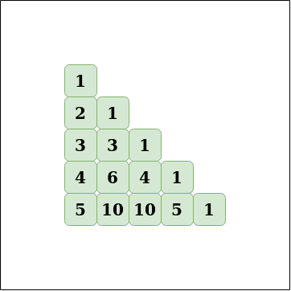

# 用帕斯卡三角形计算 nCr

> 原文:[https://www . geeksforgeeks . org/calculate-NCR-using-Pascal-triangle/](https://www.geeksforgeeks.org/calculate-ncr-using-pascals-triangle/)

[帕斯卡三角形](https://en.wikipedia.org/wiki/Pascal%27s_triangle#Combinations)的一个有用的应用是[组合](https://www.geeksforgeeks.org/permutation-and-combination/)的计算。找**T5】nC<sub>r</sub>T9】的公式是 **n！/ r！*(n–r)！**也是帕斯卡三角形的一个单元格的公式。
**帕斯卡三角形:**** 



```
Input: n = 5, r = 3
Output: 10
Explanation:
n! / r! * (n - r)! = 5! / 3! * (2!) = 120 / 12 = 10

Input: n = 7, r = 2
Output: 21
Explanation:
n! / r! * (n - r)! = 7! / 5! * (2!) = 42 / 2 = 21
```

**方法:**想法是将帕斯卡三角形存储在一个矩阵中，那么 **<sup>n</sup> C <sub>r</sub>** 的值将是第**n**行和第**r**列的单元格值。
*要创建帕斯卡三角形，请使用以下两个公式:*

1.  **<sup>n</sup> C <sub>0</sub> = 1** ，从一组 n 个元素中选择 0 个元素的方式数为 0
2.  **<sup>n</sup>C<sub>r</sub>=<sup>n-1</sup>C<sub>r-1</sub>+<sup>n-1</sup>C<sub>r</sub>T13】从一组 n 个元素中选择 r 个元素的方式数是从 n-1 个元素中选择 r-1 个元素的方式和从 n-1 个元素中选择 r 个元素的方式的总和。**

想法是使用子问题的值来计算较大值的答案。例如，要计算 <sup>n</sup> C <sub>r</sub> ，使用 <sup>n-1</sup> C <sub>r-1</sub> 和 <sup>n-1</sup> C <sub>r</sub> 的值。所以 DP 可以用来对范围内的所有值进行预处理。
**算法:**

1.  创建大小为 1000 * 1000 的矩阵，分配基本案例的值，即运行从 0 到 1000 的循环，并分配矩阵[i][0] = 1， <sup>n</sup> C <sub>0</sub> = 1
2.  运行从 i = 1 到 1000 的嵌套循环(外部循环)，内部循环从 j = 1 到 i + 1。
3.  对于每个元素(I，j)，使用公式<sup>n</sup>C<sub>r</sub>=<sup>n-1</sup>C<sub>r-1</sub>+<sup>n-1</sup>C<sub>r</sub>为*矩阵[i][j] =矩阵[i-1][j-1] +矩阵[i-1][j]* 赋值
4.  填充矩阵后，将 <sup>n</sup> C <sub>r</sub> 的值作为矩阵[n][r]返回

**执行:**

## C++

```
// C++ implementation of the approach
#include <bits/stdc++.h>
using namespace std;

// Initialize the matrix with 0
int l[1001][1001] = { 0 };

void initialize()
{

    // 0C0 = 1
    l[0][0] = 1;
    for (int i = 1; i < 1001; i++) {
        // Set every nCr = 1 where r = 0
        l[i][0] = 1;
        for (int j = 1; j < i + 1; j++) {

            // Value for the current cell of Pascal's triangle
            l[i][j] = (l[i - 1][j - 1] + l[i - 1][j]);
        }
    }
}

// Function to return the value of nCr
int nCr(int n, int r)
{
    // Return nCr
    return l[n][r];
}

// Driver code
int main()
{
    // Build the Pascal's triangle
    initialize();
    int n = 8;
    int r = 3;
    cout << nCr(n, r);
}

// This code is contributed by ihritik
```

## Java 语言(一种计算机语言，尤用于创建网站)

```
// Java implementation of the approach

class GFG {
    // Initialize the matrix with 0
    static int l[][] = new int[1001][1001];

    static void initialize()
    {

        // 0C0 = 1
        l[0][0] = 1;
        for (int i = 1; i < 1001; i++) {
            // Set every nCr = 1 where r = 0
            l[i][0] = 1;
            for (int j = 1; j < i + 1; j++) {

                // Value for the current cell of Pascal's triangle
                l[i][j] = (l[i - 1][j - 1] + l[i - 1][j]);
            }
        }
    }

    // Function to return the value of nCr
    static int nCr(int n, int r)
    {
        // Return nCr
        return l[n][r];
    }
    // Driver code
    public static void main(String[] args)
    {
        // Build the Pascal's triangle
        initialize();
        int n = 8;
        int r = 3;
        System.out.println(nCr(n, r));
    }
}

// This code is contributed by ihritik
```

## 蟒蛇 3

```
# Python3 implementation of the approach

# Initialize the matrix with 0
l = [[0 for i in range(1001)] for j in range(1001)]

def initialize():

    # 0C0 = 1
    l[0][0] = 1
    for i in range(1, 1001):

        # Set every nCr = 1 where r = 0
        l[i][0] = 1
        for j in range(1, i + 1):

            # Value for the current cell of Pascal's triangle
            l[i][j] = (l[i - 1][j - 1] + l[i - 1][j])

# Function to return the value of nCr
def nCr(n, r):
    # Return nCr
    return l[n][r]

# Driver code
# Build the Pascal's triangle
initialize()
n = 8
r = 3
print(nCr(n, r))
```

## C#

```
// C# implementation of the approach

using System;
class GFG {
    // Initialize the matrix with 0
    static int[, ] l = new int[1001, 1001];

    static void initialize()
    {

        // 0C0 = 1
        l[0, 0] = 1;
        for (int i = 1; i < 1001; i++) {
            // Set every nCr = 1 where r = 0
            l[i, 0] = 1;
            for (int j = 1; j < i + 1; j++) {

                // Value for the current cell of Pascal's triangle
                l[i, j] = (l[i - 1, j - 1] + l[i - 1, j]);
            }
        }
    }

    // Function to return the value of nCr
    static int nCr(int n, int r)
    {
        // Return nCr
        return l[n, r];
    }
    // Driver code
    public static void Main()
    {
        // Build the Pascal's triangle
        initialize();
        int n = 8;
        int r = 3;
        Console.WriteLine(nCr(n, r));
    }
}

// This code is contributed by ihritik
```

## java 描述语言

```
<script>

// JavaScript implementation of the approach

// Initialize the matrix with 0
let l =
new Array(1001).fill(0).map(() => new Array(1001).fill(0));

function initialize()
{

    // 0C0 = 1
    l[0][0] = 1;
    for (let i = 1; i < 1001; i++) {
        // Set every nCr = 1 where r = 0
        l[i][0] = 1;
        for (let j = 1; j < i + 1; j++) {

            // Value for the current cell
            // of Pascal's triangle
            l[i][j] = (l[i - 1][j - 1] + l[i - 1][j]);
        }
    }
}

// Function to return the value of nCr
function nCr(n, r)
{
    // Return nCr
    return l[n][r];
}

// Driver code

    // Build the Pascal's triangle
    initialize();
    let n = 8;
    let r = 3;
    document.write(nCr(n, r));

// This code is contributed by Mayank Tyagi

</script>
```

**Output:** 

```
56
```

**复杂度分析:**

*   **时间复杂度:** O(1)。
    所有对的值都是预计算的，因此回答查询的时间是 O(1)，尽管预计算需要一些时间，但理论上预计算需要恒定的时间。
*   **空间复杂度:** O(1)。
    需要恒定的空间。