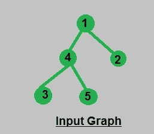
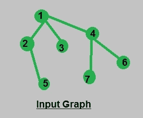
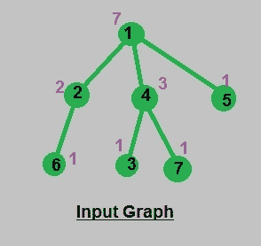

# 计算所有子树中的节点数|使用 DFS

> 原文:[https://www . geesforgeks . org/calculate-number-nodes-subtrees-using-DFS/](https://www.geeksforgeeks.org/calculate-number-nodes-subtrees-using-dfs/)

给定邻接表形式的树，我们必须计算每个节点的子树中的节点数，同时计算特定节点的子树中的节点数，该节点也将被添加为子树中的节点，因此叶子的子树中的节点数为 1。
**例:**

```
Input : Consider the Graph mentioned below:
```



```
Output : Nodes in subtree of 1 : 5
         Nodes in subtree of 2 : 1
         Nodes in subtree of 3 : 1
         Nodes in subtree of 4 : 3
         Nodes in subtree of 5 : 1

Input : Consider the Graph mentioned below:
```



```
Output : Nodes in subtree of 1 : 7
         Nodes in subtree of 2 : 2
         Nodes in subtree of 3 : 1
         Nodes in subtree of 4 : 3
         Nodes in subtree of 5 : 1
         Nodes in subtree of 6 : 1
         Nodes in subtree of 7 : 1
```

**说明:**首先我们要计算值 count[s]:节点 s 的子树中的节点数，其中子树包含节点本身及其子树中的所有节点。因此，我们可以使用 DFS 和 DP 的概念递归地计算节点的数量，其中我们应该只处理每个边一次，并计算用于计算其表示 DP(动态规划)概念的父节点的 count[]的子节点的[]值。
**时间复杂度:O(n)** 【在处理所有(n-1)条边】。

```
Algorithm :
void numberOfNodes(int s, int e)
{
    vector::iterator u;
    count1[s] = 1;
    for (u = adj[s].begin(); u != adj[s].end(); u++)
    {
        // condition to omit reverse path
        // path from children to parent 
        if (*u == e)
            continue;

        // recursive call for DFS
        numberOfNodes(*u, s);

        // update count[] value of parent using
        // its children
        count1[s] += count1[*u];
    }
}
```

## C++

```
// CPP code to find number of nodes
// in subtree of each node
#include <bits/stdc++.h>
using namespace std;

const int N = 8;

// variables used to store data globally
int count1[N];

// adjacency list representation of tree
vector<int> adj[N];

// function to calculate no. of nodes in a subtree
void numberOfNodes(int s, int e)
{
    vector<int>::iterator u;
    count1[s] = 1;
    for (u = adj[s].begin(); u != adj[s].end(); u++) {

        // condition to omit reverse path
        // path from children to parent
        if (*u == e)
            continue;

        // recursive call for DFS
        numberOfNodes(*u, s);

        // update count[] value of parent using
        // its children
        count1[s] += count1[*u];
    }
}

// function to add edges in graph
void addEdge(int a, int b)
{
    adj[a].push_back(b);
    adj[b].push_back(a);
}

// function to print result
void printNumberOfNodes()
{
    for (int i = 1; i < N; i++) {
        cout << "\nNodes in subtree of " << i;
        cout << ": " << count1[i];
    }
}

// driver function
int main()
{
    // insertion of nodes in graph
    addEdge(1, 2);
    addEdge(1, 4);
    addEdge(1, 5);
    addEdge(2, 6);
    addEdge(4, 3);
    addEdge(4, 7);

    // call to perform dfs calculation
    // making 1  as root of tree
    numberOfNodes(1, 0);

    // print result
    printNumberOfNodes();
    return 0;
}
```

## Java 语言(一种计算机语言，尤用于创建网站)

```
// A Java code to find number of nodes
// in subtree of each node
import java.util.ArrayList;

public class NodesInSubtree
{
    // variables used to store data globally
    static final int N = 8;
    static int count1[] = new int[N];

    // adjacency list representation of tree
    static ArrayList<Integer> adj[] = new ArrayList[N];

    // function to calculate no. of nodes in a subtree
    static void numberOfNodes(int s, int e)
    {
        count1[s] = 1;
        for(Integer u: adj[s])
        {
            // condition to omit reverse path
            // path from children to parent
            if(u == e)
                continue;

            // recursive call for DFS
            numberOfNodes(u ,s);

            // update count[] value of parent using
            // its children
            count1[s] += count1[u];
        }
    }

    // function to add edges in graph
    static void addEdge(int a, int b)
    {
        adj[a].add(b);
        adj[b].add(a);
    }

    // function to print result
    static void printNumberOfNodes()
    {
        for (int i = 1; i < N; i++)
            System.out.println("Node of a subtree of "+ i+
                                       " : "+ count1[i]);
    }

    // Driver function
    public static void main(String[] args)
    {
        // Creating list for all nodes
        for(int i = 0; i < N; i++)
            adj[i] = new ArrayList<>();

        // insertion of nodes in graph
        addEdge(1, 2);
        addEdge(1, 4);
        addEdge(1, 5);
        addEdge(2, 6);
        addEdge(4, 3);
        addEdge(4, 7);

        // call to perform dfs calculation
        // making 1  as root of tree
        numberOfNodes(1, 0);

        // print result
        printNumberOfNodes();

    }

}
// This code is contributed by Sumit Ghosh
```

## 蟒蛇 3

```
# Python3 code to find the number of
# nodes in the subtree of each node
N = 8

# variables used to store data globally
count1 = [0] * (N)

# Adjacency list representation of tree
adj = [[] for i in range(N)]

# Function to calculate no. of
# nodes in subtree
def numberOfNodes(s, e):

    count1[s] = 1
    for u in adj[s]:

        # Condition to omit reverse path
        # path from children to parent
        if u == e:
            continue

        # recursive call for DFS
        numberOfNodes(u, s)

        # update count[] value of parent
        # using its children
        count1[s] += count1[u]

# Function to add edges in graph
def addEdge(a, b):

    adj[a].append(b)
    adj[b].append(a)

# Function to print result
def printNumberOfNodes():

    for i in range(1, N):
        print("Nodes in subtree of", i,
                        ":", count1[i])

# Driver Code
if __name__ == "__main__":

    # insertion of nodes in graph
    addEdge(1, 2)
    addEdge(1, 4)
    addEdge(1, 5)
    addEdge(2, 6)
    addEdge(4, 3)
    addEdge(4, 7)

    # call to perform dfs calculation
    # making 1 as root of tree
    numberOfNodes(1, 0)

    # print result
    printNumberOfNodes()

# This code is contributed by Rituraj Jain
```

## C#

```
// C# code to find number of nodes
// in subtree of each node
using System;
using System.Collections.Generic;
class GFG
{
    // variables used to store data globally
    static readonly int N = 8;
    static int []count1 = new int[N];

    // adjacency list representation of tree
    static List<int> []adj = new List<int>[N];

    // function to calculate no. of nodes in a subtree
    static void numberOfNodes(int s, int e)
    {
        count1[s] = 1;
        foreach(int u in adj[s])
        {
            // condition to omit reverse path
            // path from children to parent
            if(u == e)
                continue;

            // recursive call for DFS
            numberOfNodes(u, s);

            // update count[] value of parent using
            // its children
            count1[s] += count1[u];
        }
    }

    // function to add edges in graph
    static void addEdge(int a, int b)
    {
        adj[a].Add(b);
        adj[b].Add(a);
    }

    // function to print result
    static void printNumberOfNodes()
    {
        for (int i = 1; i < N; i++)
            Console.WriteLine("Node of a subtree of "+ i +
                                        " : "+ count1[i]);
    }

    // Driver Code
    public static void Main(String[] args)
    {
        // Creating list for all nodes
        for(int i = 0; i < N; i++)
            adj[i] = new List<int>();

        // insertion of nodes in graph
        addEdge(1, 2);
        addEdge(1, 4);
        addEdge(1, 5);
        addEdge(2, 6);
        addEdge(4, 3);
        addEdge(4, 7);

        // call to perform dfs calculation
        // making 1 as root of tree
        numberOfNodes(1, 0);

        // print result
        printNumberOfNodes();
    }
}

// This code is contributed by PrinciRaj1992
```

## java 描述语言

```
<script>
    // A Javascript code to find number of nodes
    // in subtree of each node

    // variables used to store data globally
    let N = 8;
    let count1 = new Array(N);

    // adjacency list representation of tree
    let adj = new Array(N);

    // function to calculate no. of nodes in a subtree
    function numberOfNodes(s, e)
    {
        count1[s] = 1;
        for(let u = 0; u < adj[s].length; u++)
        {
            // condition to omit reverse path
            // path from children to parent
            if(adj[s][u] == e)
                continue;

            // recursive call for DFS
            numberOfNodes(adj[s][u] ,s);

            // update count[] value of parent using
            // its children
            count1[s] += count1[adj[s][u]];
        }
    }

    // function to add edges in graph
    function addEdge(a, b)
    {
        adj[a].push(b);
        adj[b].push(a);
    }

    // function to print result
    function printNumberOfNodes()
    {
        for (let i = 1; i < N; i++)
            document.write("Node of a subtree of "+ i+
                                       " : "+ count1[i] + "</br>");
    }

    // Creating list for all nodes
    for(let i = 0; i < N; i++)
      adj[i] = [];

    // insertion of nodes in graph
    addEdge(1, 2);
    addEdge(1, 4);
    addEdge(1, 5);
    addEdge(2, 6);
    addEdge(4, 3);
    addEdge(4, 7);

    // call to perform dfs calculation
    // making 1  as root of tree
    numberOfNodes(1, 0);

    // print result
    printNumberOfNodes();

    // This code is contributed by suresh07.
</script>
```

**输出:**

```
Nodes in subtree of 1: 7
Nodes in subtree of 2: 2
Nodes in subtree of 3: 1
Nodes in subtree of 4: 3
Nodes in subtree of 5: 1
Nodes in subtree of 6: 1
Nodes in subtree of 7: 1
```

**输入输出图解:**



本文由[**Shivam Pradhan(anuj _ charm)**](https://www.facebook.com/anuj.charm)供稿。如果你喜欢 GeeksforGeeks 并想投稿，你也可以使用[write.geeksforgeeks.org](https://write.geeksforgeeks.org)写一篇文章或者把你的文章邮寄到 review-team@geeksforgeeks.org。看到你的文章出现在极客博客主页上，帮助其他极客。
如果发现有不正确的地方，或者想分享更多关于上述话题的信息，请写评论。