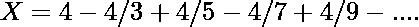

# 用 Python 计算圆周率

> 原文:[https://www.geeksforgeeks.org/calculate-pi-with-python/](https://www.geeksforgeeks.org/calculate-pi-with-python/)

圆周率是一个无理数，有非循环的十进制值。我们通常知道圆周率=3.14 或圆周率=22/7，但为了方便起见，这只是一个近似值。python 中有两种方法可以计算 pi 的值:

**方法 1:** 利用莱布尼茨公式

公式是–



这个级数是永无止境的，这个级数包含的项越多，X 的值收敛到π的值就越近。

**进场:**

*   Initialize k=1 //这个变量将用作莱布尼茨公式的分母，它将增加 2
*   initialize sum=0 // sum 将添加该系列的所有柠檬
*   运行一个从 0 到 1000000//的 for 循环，在这个值下，我们得到 Pi 的最精确值
*   在循环内部，检查 i%2==0，然后进行求和=求和+4/k
*   否则，做求和=求和-4/k
*   将 k 增加 2，转到步骤 3

**下面是实现:**

## 蟒蛇 3

```
# Initialize denominator
k = 1

# Initialize sum
s = 0

for i in range(1000000):

    # even index elements are positive
    if i % 2 == 0:
        s + = 4/k
    else:

        # odd index elements are negative
        s -= 4/k

    # denominator is odd
    k += 2

print(s)
```

**输出:**

```
3.1415916535897743
```

**方法 2:** 采用 acos()方法。

**进场:**

1.  π的值使用 [acos()函数](https://www.geeksforgeeks.org/acos-function-in-c-stl/)计算，该函数返回一个介于**[-π，π]**之间的数值。
2.  因为使用 **acos(0.0)** 将返回**2 *π**的值。因此要得到**π**的值:

```
 pi = round(2*acos(0.0));
```

**下面是实现:**

## 蟒蛇 3

```
# Python3 program to calculate the
# value of pi up to 3 decimal places
from math import acos

# Function that prints the
# value of pi upto N
# decimal places
def printValueOfPi():

    # Find value of pi upto 3 places
    # using acos() function
    pi = round(2 * acos(0.0), 3)

    # Print value of pi upto
    # N decimal places
    print(pi)

# Driver Code
if __name__ == "__main__":

    # Function that prints
    # the value of pi
    printValueOfPi()
```

**输出:**

```
3.142
```

**方法 3:** 使用 NumPy

在这个方法中，我们将使用 numpy.pi 方法来计算 pi 值。

## 蟒蛇 3

```
import numpy

print( numpy.pi )
```

**输出:**

```
3.141592653589793
```

**方法 4:** 使用数学模块

Python 有一个名为 math 的内置库，我们可以简单地导入 math 并打印 pi 的值。

## 蟒蛇 3

```
import math

print( math.pi )
```

**输出:**

```
3.141592653589793
```