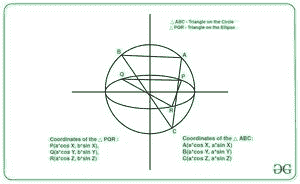

# 计算椭圆内接三角形与辅助圆上对应点形成的三角形的面积比

> 原文:[https://www . geesforgeks . org/compute-椭圆内接三角形面积比和辅助圆上对应点形成的三角形面积比/](https://www.geeksforgeeks.org/calculate-ratio-of-area-of-a-triangle-inscribed-in-an-ellipse-and-the-triangle-formed-by-corresponding-points-on-auxiliary-circle/)

给定两个整数 **A** 和 **B** 表示[椭圆](https://en.wikipedia.org/wiki/Ellipse)的[半长轴和半短轴](https://en.wikipedia.org/wiki/Semi-major_and_semi-minor_axes)的长度，任务是计算椭圆内接的任意三角形与其辅助圆上对应点形成的三角形的比值。

**示例:**

> **输入** : A = 1，B = 2
> **输出** : 2
> **解释**:比值= B / A = 2 / 1 = 2
> 
> **输入** : A = 2，B = 3
> **输出** : 1.5

**进场:**

[](https://media.geeksforgeeks.org/wp-content/uploads/20210401053726/download-300x184.jfif)

这个想法基于以下数学公式:

*   设椭圆上的 3 点为 **P(a cosX，b sinX)，Q(a cosY，b sinY)，R(a cosZ，b sinZ)。**
*   所以辅助圆上对应的点是 **A(一个 cosX，一个 sinX)，B(一个 cosY，一个 sinY)，C(一个 cosZ，一个 sinZ)。**
*   现在，用[公式计算三角形的面积](https://www.geeksforgeeks.org/c-program-find-area-triangle/)使用三角形的给定点。

> **面积(PQR) /面积(ABC) = b / a**

按照以下步骤解决问题:

*   将椭圆[半长轴与半短轴](https://www.geeksforgeeks.org/program-to-find-the-area-of-an-ellipse/)的比值存储在一个变量中，比如说**结果。**
*   打印**结果**的值作为所需答案。**T3】**

下面是上述方法的实现:

## C++

```
// C++ program for the above approach
#include <bits/stdc++.h>
using namespace std;

// Function to calculate ratio of a
// triangle inscribed in an ellipse to
// the triangle on the auxiliary circle
void triangleArea(int a, int b)
{
    // Stores the ratio of the
    // semi-major to semi-minor axes
    double ratio = (double)b / a;

    // Print the ratio
    cout << ratio;
}

// Driver Code
int main()
{
    int a = 1, b = 2;
    triangleArea(a, b);

    return 0;
}
```

## Java 语言(一种计算机语言，尤用于创建网站)

```
// Java program for the above approach
class GFG{

// Function to calculate ratio of a
// triangle inscribed in an ellipse to
// the triangle on the auxiliary circle
static void triangleArea(int a, int b)
{

    // Stores the ratio of the
    // semi-major to semi-minor axes
    double ratio = (double)b / a;

    // Print the ratio
    System.out.println(ratio);
}

// Driver Code
public static void main(String args[])
{
    int a = 1, b = 2;

    triangleArea(a, b);
}
}

// This code is contributed by AnkThon
```

## 蟒蛇 3

```
# Python3 program for the above approach

# Function to calculate ratio of a
# triangle inscribed in an ellipse to
# the triangle on the auxiliary circle
def triangleArea(a, b):

    # Stores the ratio of the
    # semi-major to semi-minor axes
    ratio = b / a

    # Print the ratio
    print(ratio)

# Driver Code
if __name__ == "__main__" :

    a = 1
    b = 2

    triangleArea(a, b)

# This code is contributed by AnkThon
```

## C#

```
// C# program for the above approach
using System;
using System.Collections.Generic;

class GFG{

// Function to calculate ratio of a
// triangle inscribed in an ellipse to
// the triangle on the auxiliary circle
static void triangleArea(int a, int b)
{

    // Stores the ratio of the
    // semi-major to semi-minor axes
    double ratio = (double)b / a;

    // Print the ratio
    Console.WriteLine(ratio);
}

// Driver Code
public static void Main()
{
    int a = 1, b = 2;

    triangleArea(a, b);
}
}

// This code is contributed by bgangwar59
```

## java 描述语言

```
<script>

// JavaScript program for the above approach

// Function to calculate ratio of a
// triangle inscribed in an ellipse to
// the triangle on the auxiliary circle
function triangleArea(a, b){

    // Stores the ratio of the
    // semi-major to semi-minor axes
    ratio = b / a

    // Print the ratio
    document.write(ratio)
}

// Driver Code
var a = 1
var b = 2

triangleArea(a, b)

// This code is contributed by AnkThon

</script>
```

**Output:** 

```
2
```

***时间复杂度:**O(1)*
T5**辅助空间:** O(1)