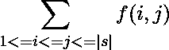

# 计算给定字符串的特殊字符与子字符串长度之比的总和

> 原文:[https://www . geeksforgeeks . org/计算给定字符串的特殊字符与子字符串长度之比之和/](https://www.geeksforgeeks.org/calculate-sum-of-ratio-of-special-characters-to-length-of-substrings-of-the-given-string/)

给定一个字符串 **str** 和一个特殊字符数组**specialArray【】**，任务是为给定字符串的所有可能的子字符串找到特殊字符数与子字符串长度之比的和。

> 子串中特殊字符的数量与给定字符串的子串长度之比由下式给出
> 
> 
> 
> 以上计算的比值之和由
> 
> 给出

**示例:**

> **输入:**str = " abcdabac "，specialArray[] = {'a '，' b '，' c '，' d'}
> **输出:** 28.00000
> **解释:**
> 字符串长度= 7
> 所有可能的子字符串的计数= (7 * (8 + 1)) / 2 = 28
> 由于字符串的所有字符都包含在 spreciarlray[]，因此每个子字符串的特殊字符计数与子字符串长度的比率
> 因此，比值之和=子串数* 1 = 28。
> 
> **输入:** str = "abcd "，specialArray[] = {'b '，' c ' }
> T3】输出: 5.83333

**方法:**
按照以下步骤解决问题:

*   对于从 1 到 N 的每一个可能的子串长度，找出长度为 x 的每个子串中特殊字符的计数，并将计数和 x 的比值加到答案中。
*   要在恒定时间内找到每个子字符串中特殊字符的计数，请使用以下关系创建特殊字符计数的前缀和数组:

> **前缀[i] =前缀[I–1]+特殊(s[I])；**

*   计算索引**【I，j】**内子串中特殊字符的数量由下式给出:

> 前缀[j–1]–前缀[I–1]
> 因此，特殊字符数与子串长度的比值，
> f(i，j) =(前缀[j–1]–前缀[I–1])/(j–I+1)

下面是上述方法的实现:

## C++

```
// C++ Program to implement
// the above approach
#include <bits/stdc++.h>
using namespace std;

const int N = 1e5 + 5;

// Stores frequency of special
// characters in the array
vector<int> prefix(N, 0);

// Stores prefix sum
vector<int> sum(N, 0);

// Function to check whether a character
// is special or not
bool isSpecial(char c,
               vector<char>& special)
{
    for (auto& i : special)

        // If current character
        // is special
        if (i == c)
            return true;

    // Otherwise
    return false;
}

// Function to find sum of ratio of
// count of special characters and
// length of substrings
double countRatio(string& s,
                  vector<char>& special)
{

    int n = s.length();
    for (int i = 0; i < n; i++) {

        // Calculate the prefix sum of
        // special nodes
        prefix[i] = int(isSpecial(s[i],
                                  special));
        if (i > 0)
            prefix[i] += prefix[i - 1];
    }

    for (int i = 0; i < n; i++) {

        // Generate prefix sum array
        sum[i] = prefix[i];
        if (i > 0)
            sum[i] += sum[i - 1];
    }

    double ans = 0;
    for (int i = 1; i <= n; i++) {

        // Calculate ratio for substring
        int count = sum[n - 1]
                    - (i > 1 ? sum[i - 2] : 0);
        count
            -= (i < n ? sum[n - i - 1] : 0);

        ans += double(count) / double(i);
    }

    return ans;
}

// Driver Code;
int main()
{
    string s = "abcd";
    vector<char> special = { 'b', 'c' };

    double ans = countRatio(s, special);

    cout << fixed << setprecision(6)
         << ans << endl;

    return 0;
}
```

## Java 语言(一种计算机语言，尤用于创建网站)

```
// Java Program to implement
// the above approach
import java.util.*;
class GFG{

static int N = 1000000 + 5;

// Stores frequency of special
// characters in the array
static int []prefix = new int[N];

// Stores prefix sum
static int []sum = new int[N];

// Function to check
// whether a character
// is special or not
static int isSpecial(char c,
                     char[] special)
{
  for (char i : special)

    // If current character
    // is special
    if (i == c)
      return 1;

  // Otherwise
  return 0;
}

// Function to find sum of ratio of
// count of special characters and
// length of subStrings
static  double countRatio(char []s,
                          char[] special)
{
  int n = s.length;
  for (int i = 0; i < n; i++)
  {
    // Calculate the prefix sum of
    // special nodes
    prefix[i] = (isSpecial(s[i],
                 special));
    if (i > 0)
      prefix[i] += prefix[i - 1];
  }

  for (int i = 0; i < n; i++)
  {
    // Generate prefix sum array
    sum[i] = prefix[i];
    if (i > 0)
      sum[i] += sum[i - 1];
  }

  double ans = 0;
  for (int i = 1; i <= n; i++)
  {
    // Calculate ratio for subString
    int count = sum[n - 1] - (i > 1 ?
                sum[i - 2] : 0);
    count -= (i < n ?
              sum[n - i - 1] : 0);
    ans += (double)count / (double)i;
  }

  return ans;
}

// Driver Code;
public static void main(String[] args)
{
  String s = "abcd";
  char[] special = {'b', 'c'};
  double ans = countRatio(s.toCharArray(),
                          special);
  System.out.format("%.6f",ans);
}
}

// This code is contributed by gauravrajput1
```

## 蟒蛇 3

```
# Python3 program to implement
# the above approach
N = 100005

# Stores frequency of special
# characters in the array
prefix = [0] * N

# Stores prefix sum
sum = [0] * N

# Function to check whether a character
# is special or not
def isSpecial(c, special):

    for i in special:

        # If current character
        # is special
        if (i == c):
            return True

    # Otherwise
    return False

# Function to find sum of ratio of
# count of special characters and
# length of substrings
def countRatio(s, special):

    n = len(s)
    for i in range(n):

        # Calculate the prefix sum of
        # special nodes
        prefix[i] = int(isSpecial(s[i],
                                  special))
        if (i > 0):
            prefix[i] += prefix[i - 1]

    for i in range(n):

        # Generate prefix sum array
        sum[i] = prefix[i]
        if (i > 0):
            sum[i] += sum[i - 1]

    ans = 0
    for i in range(1, n + 1):

        # Calculate ratio for substring
        if i > 1:
            count = sum[n - 1]- sum[i - 2]
        else:
            count = sum[n - 1]
        if i < n:
            count -= sum[n - i - 1]

        ans += count / i

    return ans

# Driver Code
if __name__ == "__main__":

    s = "abcd"
    special = [ 'b', 'c' ]

    ans = countRatio(s, special)

    print('%.6f' % ans)

# This code is contributed by chitranayal
```

## C#

```
// C# Program to implement
// the above approach
using System;

class GFG{

static int N = 1000000 + 5;

// Stores frequency of special
// characters in the array
static int []prefix = new int[N];

// Stores prefix sum
static int []sum = new int[N];

// Function to check
// whether a character
// is special or not
static int isSpecial(char c,
                     char[] special)
{
  foreach(char i in special)

    // If current character
    // is special
    if (i == c)
      return 1;

  // Otherwise
  return 0;
}

// Function to find sum of ratio of
// count of special characters and
// length of subStrings
static  double countRatio(char []s,
                          char[] special)
{
  int n = s.Length;
  for(int i = 0; i < n; i++)
  {

    // Calculate the prefix sum of
    // special nodes
    prefix[i] = (isSpecial(s[i],
                 special));
    if (i > 0)
      prefix[i] += prefix[i - 1];
  }

  for(int i = 0; i < n; i++)
  {

    // Generate prefix sum array
    sum[i] = prefix[i];

    if (i > 0)
      sum[i] += sum[i - 1];
  }

  double ans = 0;
  for(int i = 1; i <= n; i++)
  {

    // Calculate ratio for subString
    int count = sum[n - 1] - (i > 1 ?
                sum[i - 2] : 0);
    count -= (i < n ?
              sum[n - i - 1] : 0);
    ans += (double)count / (double)i;
  }
  return ans;
}

// Driver Code;
public static void Main(String[] args)
{
  String s = "abcd";
  char[] special = {'b', 'c'};
  double ans = countRatio(s.ToCharArray(),
                          special);

  Console.WriteLine("{0:F6}", ans);
}
}

// This code is contributed by Princi Singh
```

## java 描述语言

```
<script>

// Javascript program to implement
// the above approach
var N = 1000005;

// Stores frequency of special
// characters in the array
var prefix = Array(N).fill(0);

// Stores prefix sum
var sum = Array(N).fill(0);

// Function to check whether a character
// is special or not
function isSpecial(c, special)
{  
    var ans = false;
    special.forEach(i => {

        // If current character
        // is special
        if (i == c)
            ans =true;
    });

    // Otherwise
    return ans;

}

// Function to find sum of ratio of
// count of special characters and
// length of substrings
function countRatio(s, special)
{
    var n = s.length;
    for(var i = 0; i < n; i++)
    {

        // Calculate the prefix sum of
        // special nodes
        prefix[i] = (isSpecial(s[i],
                               special));
        if (i > 0)
            prefix[i] += prefix[i - 1];
    }

    for(var i = 0; i < n; i++)
    {

        // Generate prefix sum array
        sum[i] = prefix[i];

        if (i > 0)
            sum[i] += sum[i - 1];
    }

    var ans = 0;
    for(var i = 1; i <= n; i++)
    {

        // Calculate ratio for substring
        var count = sum[n - 1] -
         ((i > 1) ? sum[i - 2] : 0);

        count -= ((i < n) ? sum[n - i - 1] : 0);

        ans += ((count) / (i));
    }
    return ans;
}

// Driver Code;
var s = "abcd";
var special = [ 'b', 'c' ];
var ans = countRatio(s.split(''), special);

document.write( ans.toFixed(6));

// This code is contributed by itsok

</script>
```

**Output:** 

```
5.833333
```

***时间复杂度:** O(N)*
***空间复杂度:** O(N)*