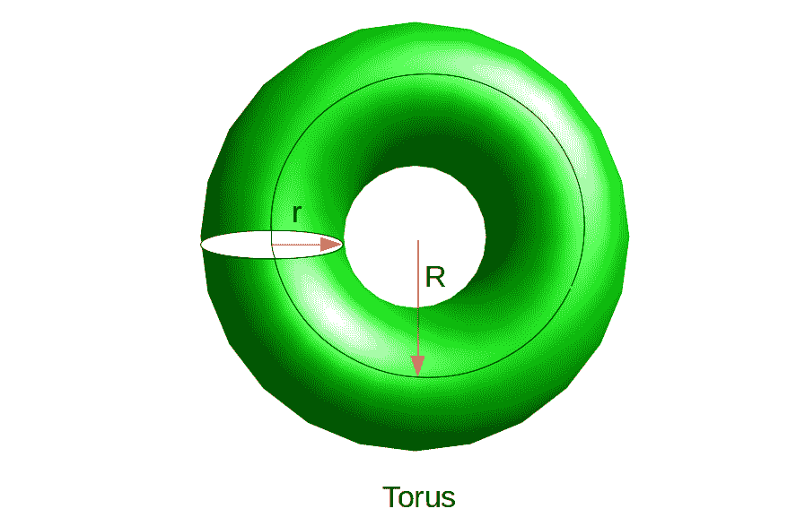

# 计算圆环体的体积和表面积

> 原文:[https://www . geesforgeks . org/compute-volume-and-surface-area-of-torus/](https://www.geeksforgeeks.org/calculate-volume-and-surface-area-of-torus/)

这篇文章是关于环面的表面和数学概念。
通过沿着由较大圆(半径 R)构成的直线旋转一个小圆(半径 R)而形成的三维形状。



花托

**属性:**

1.  它可以通过沿着一条由一个大圆(半径为 R)构成的直线旋转一个小圆(半径为 R)来制作。
2.  它不是多面体
3.  它没有顶点或边

*   **表面积**
    圆环体的表面积由公式给出–

```
Surface Area = 4 × Pi^2 × R × r
```

*   其中 R 是小圆的半径，R 是大圆的半径，π是常数π= 3.14159。

*   **体积**
    圆锥体的体积由公式给出–

```
Volume = 2 × Pi^2 × R × r^2
```

*   其中 R 是小圆的半径，R 是大圆的半径，π是常数π= 3.14159。

**示例:**

```
Input : r=3, R=7
Output :
     Volume: 1243.568195
     Surface: 829.045464
```

## C++

```
// C++ program to calculate volume
// and surface area of Torus
#include<bits/stdc++.h>
using namespace std;

int main()
{
    // radius of inner circle
    double r = 3;

    // distance from origin to center of inner circle
    // radius of black circle in figure
    double R = 7;

    // Value of Pi
    float pi = (float)3.14159;
    double Volume = 0;
    Volume = 2 * pi * pi * R * r * r;
    cout<<"Volume: "<<Volume<<endl;

    double Surface = 4 * pi * pi * R * r;
    cout<<"Surface: "<<Surface<<endl;
}
```

## C

```
// C program to calculate volume 
// and surface area of Torus
#include <stdio.h>
int main()
{
    // radius of inner circle
    double r = 3;

    // distance from origin to center of inner circle
    // radius of black circle in figure
    double R = 7;

    // Value of Pi
    float pi = (float)3.14159;
    double Volume = 0;
    Volume = 2 * pi * pi * R * r * r;
    printf("Volume: %f", Volume);

    double Surface = 4 * pi * pi * R * r;
    printf("\nSurface: %f", Surface);
}
```

## Java 语言(一种计算机语言，尤用于创建网站)

```
// Java program to calculate volume 
// and surface area of Torus
class Test {

    public static void main(String args[])
    {

        // radius of inner circle
        double r = 3;

        // distance from origin to center of inner circle
        // radius of black circle in figure
        double R = 7;

        // Value of Pi
        float pi = (float)3.14159;
        double Volume = 0;
        Volume = 2 * pi * pi * R * r * r;
        System.out.printf("Volume: %f", Volume);

        double Surface = 4 * pi * pi * R * r;
        System.out.printf("\nSurface: %f", Surface);
    }
}
```

## 蟒蛇 3

```
# Python3 program to calculate volume
# and surface area of Torus
# radius of inner circle
r = 3

# distance from origin to center of inner circle
# radius of black circle in figure
R = 7

# Value of Pi
pi = 3.14159
Volume = (float)(2 * pi * pi * R * r * r);
print("Volume: ", Volume);
Surface = (float)(4 * pi * pi * R * r);
print("Surface: ", Surface);
```

## C#

```
// C# program to calculate volume 
// and surface area of Torus 
using System;

class GFG 
{ 

// Driver Code
public static void Main() 
{ 

    // radius of inner circle 
    double r = 3; 

    // distance from origin to center 
    // of inner circle radius of black
    // circle in figure 
    double R = 7; 

    // Value of Pi 
    float pi = (float)3.14159; 
    double Volume = 0; 
    Volume = 2 * pi * pi * R * r * r; 
    Console.WriteLine("Volume: {0}", Volume); 

    double Surface = 4 * pi * pi * R * r; 
    Console.WriteLine("Surface: {0}", Surface); 
} 
} 

// This code is contributed by Soumik
```

## 服务器端编程语言（Professional Hypertext Preprocessor 的缩写）

```
<?php
// PHP program to calculate volume 
// and surface area of Torus 

// radius of inner circle 
$r = 3; 

// distance from origin to center 
// of inner circle radius of black
// circle in figure 
$R = 7; 

// Value of Pi 
$pi = (float)3.14159; 
$Volume = 0; 
$Volume = 2 * $pi * $pi * $R * $r * $r; 

echo "Volume: ", $Volume, "\n"; 

$Surface = 4 * $pi * $pi * $R * $r; 

echo "Surface: ", $Surface, "\n"; 

// This code is contributed by ajit
?>
```

## java 描述语言

```
<script>

// Javascript program to calculate volume
// and surface area of Torus

// radius of inner circle
var r = 3;

// distance from origin to center of inner circle
// radius of black circle in figure
var R = 7;

// Value of Pi
var pi = 3.14159;
var Volume = 0;
Volume = 2 * pi * pi * R * r * r;
document.write("Volume: " + Volume + "<br>");

var Surface = 4 * pi * pi * R * r;
document.write("Surface: " + Surface);

</script>
```

**Output:** 

```
Volume: 1243.568195
Surface: 829.045464
```