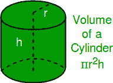
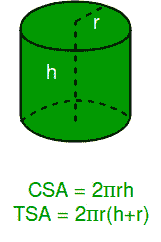

# 计算圆柱体的体积、曲面面积和总表面积

> 原文:[https://www . geesforgeks . org/compute-volume-curve-surface-area-total-surface-area-柱面/](https://www.geeksforgeeks.org/calculate-volume-curved-surface-area-total-surface-area-cylinder/)

给定圆柱体的半径和高度，计算圆柱体的体积、总表面积和曲面面积。

*   **圆柱体的体积:**
    圆柱体的体积定义为圆柱体所占据的三维空间量或圆柱体的存储容量。我们可以用公式
    计算圆柱体的体积



*   其中‘**r**’是底座的半径，而‘**h**是圆柱体的高度。

*   **圆柱体的总表面积** :
    圆柱体的表面积是正好覆盖圆锥体外表面的正方形单元的数量。圆柱体有三个面，一个曲面和两个圆底。圆柱体的总表面积是圆底面积和曲面面积的总和。总表面积包括圆形顶部和底部的面积，以及**曲面面积** (CSA)。
    我们可以用公式计算曲面面积和总表面积:



示例:

```
Input  : Enter Radius Of Cylinder   5
         Enter Height Of Cylinder   8
Output : Volume       Of       Cylinder   =   628.3185307179587
         Total  Surface Area  Of Cylinder =   408.4070449666731
         Curved Surface Area  Of Cylinder =   251.32741228718345

Input  :Enter Radius Of Cylinder   15
        Enter Height Of Cylinder   10
Output :Volume       Of       Cylinder      =   7068.583470577034
        Total  Surface Area  Of Cylinder =   2356.194490192345
        Curved Surface Area  Of Cylinder =   942.4777960769379
```

## C

```
#include <stdio.h>
#define PI 3.14159

// Function To Calculate Volume OF Cylinder
float volume(float r, float h)
{
    float vol = PI * r * r * h;
    printf("Volume of Cylinder = %f \n" ,  vol);
}

// Function To Calculate Total Surface Area OF Cylinder
float totalsurfacearea(float r, float h)
{
    float tsurf_ar = (2 * PI * r * h) + (2 * PI * r * r);
    printf("Total Surface Area Of Cylinder = %f \n" ,  tsurf_ar);
}

// Function To Calculate Curved Surface Area OF Cylinder
float curvedsurfacearea(float r, float h)
{
    float cursurf_ar = (2 * PI * r * h);
    printf("Curved Surface Area Of Cylinder = %f \n" ,  cursurf_ar);
}

// Driver Code
int main()
{
    float r = 5;
    float h = 8;

    // Function Call And Printing Volume, TSA, CSA Of Cylinder
    volume(r, h);
    totalsurfacearea(r, h);
    curvedsurfacearea(r, h);
    return 0;
}
// This code is contributed by Abhishek Agrawal.
```

## C++

```
#include <bits/stdc++.h>
#define PI 3.14159
using namespace std;

// Function To Calculate Volume OF Cylinder
void volume(float r, float h)
{
    float vol = PI * r * r * h;
    cout  << "Volume of Cylinder =    " << vol << "\n" ;
}

// Function To Calculate Total Surface Area OF Cylinder
void totalsurfacearea(float r, float h)
{
    float tsurf_ar = (2 * PI * r * h) + (2 * PI * r * r);
    cout << "Total Surface Area Of Cylinder = " << tsurf_ar << "\n";
}

// Function To Calculate Curved Surface Area OF Cylinder
void curvedsurfacearea(float r, float h)
{
    float cursurf_ar = (2 * PI * r * h);
    cout << "Curved Surface Area Of Cylinder = "
           << cursurf_ar << "\n";
}

// Driver code
int main()
{
    float r = 5;
    float h = 8;
    volume(r, h);
    totalsurfacearea(r, h);
    curvedsurfacearea(r, h);
}
// This code is contributed by Abhishek Agrawal.
```

## Java 语言(一种计算机语言，尤用于创建网站)

```
// java code for illustion....
import java.io.*;

class GFG
{
    static double PI = 3.14159;

    // Function To Calculate Volume OF Cylinder
    static void volume(double r, double h)
    {
        double vol = PI * r * r * h;
            System.out.println( "Volume of Cylinder = "
                                + vol );
    }

    // Function To Calculate Total Surface Area OF Cylinder
    static void totalsurfacearea(double r, double h)
    {
        double tsurf_ar = (2 * PI * r * h) + (2 * PI * r * r);
        System.out.println( "Total Surface Area Of Cylinder = "
                            + tsurf_ar );
    }

    // Function To Calculate Curved Surface Area OF Cylinder
    static void curvedsurfacearea(double r, double h)
    {
        double cursurf_ar = (2 * PI * r * h);
        System.out.println( "Curved Surface Area Of Cylinder = "
                            + cursurf_ar );
    }

    // Driver code
    public static void main (String[] args)
    {
        double r = 7;
        double h = 6;
        volume(r, h);
        totalsurfacearea(r, h);
        curvedsurfacearea(r, h);
    }
}

// This code is contributed by Sunnysingh
```

## 计算机编程语言

```
# Importing Math Library For The Value Of PI
import math
pi = math.pi

# Function To Calculate Volume OF Cylinder
def volume(r, h):
    vol = pi * r * r * h
    return vol

# Function To Calculate Total Surface Area
# of Cylinder
def totalsurfacearea(r, h):
    tsurf_ar = (2 * pi * r * h) + (2 * pi * r * r)
    return tsurf_ar

# Function To Calculate Curved Surface Area
# of Cylinder
def curvedsurfacearea(r, h):
    cursurf_ar = (2 * pi * r * h)
    return cursurf_ar

# Driver Code
r = 5
h = 8
# Function Call And Printing Volume, TSA, CSA Of Cylinder
print("Volume       Of       Cylinder   =  ",volume(r, h))
print("Total  Surface Area  Of Cylinder =  ",totalsurfacearea(r,h))
print("Curved Surface Area  Of Cylinder =  ",curvedsurfacearea(r,h))
```

## C#

```
// C# code for illustion....
using System;

class GFG {

    static double PI = 3.14159;

    // Function To Calculate Volume OF Cylinder
    static void volume(double r, double h)
    {
        double vol = PI * r * r * h;
            Console.WriteLine( "Volume of Cylinder = "
                                + vol );
    }

    // Function To Calculate Total Surface Area
    // OF Cylinder
    static void totalsurfacearea(double r, double h)
    {
        double tsurf_ar = (2 * PI * r * h) +
                                    (2 * PI * r * r);
        Console.WriteLine( "Total Surface Area Of "
                        + "Cylinder = " + tsurf_ar );
    }

    // Function To Calculate Curved Surface Area
    // OF Cylinder
    static void curvedsurfacearea(double r, double h)
    {
        double cursurf_ar = (2 * PI * r * h);
        Console.WriteLine( "Curved Surface Area Of"
                  + " Cylinder = " + cursurf_ar );
    }

    // Driver code
    public static void Main ()
    {
        double r = 5;
        double h = 8;

        volume(r, h);
        totalsurfacearea(r, h);
        curvedsurfacearea(r, h);
    }
}

// This code is contributed by vt_m.
```

## 服务器端编程语言（Professional Hypertext Preprocessor 的缩写）

```
<?php

// Function To Calculate Volume OF Cylinder
function volume( $r, $h)
{
    $PI = 3.14159;
    $vol = $PI * $r * $r * $h;
    echo("Volume of Cylinder =");
    echo($vol);
    echo("\n");
}

// Function To Calculate Total Surface
// Area OF Cylinder
function totalsurfacearea( $r, $h)
{
    $PI = 3.14159;
    $tsurf_ar = (2 * $PI * $r * $h)
                + (2 * $PI * $r * $r);
    echo("Total Surface Area Of Cylinder = ");
    echo($tsurf_ar);
    echo("\n");
}

// Function To Calculate Curved Surface
// Area OF Cylinder
function curvedsurfacearea($r, $h)
{
    $PI =3.14159;
    $cursurf_ar = (2 * $PI * $r * $h);
    echo("Curved Surface Area Of Cylinder = ");
    echo($cursurf_ar);
}

// Driver Code
$r = 5;
$h = 8;

// Function Call And Printing Volume,
// TSA, CSA Of Cylinder
volume($r, $h);
totalsurfacearea($r, $h);
curvedsurfacearea($r, $h);

// This code is contributed by vt_m.
?>
```

## java 描述语言

```
<script>
let PI =  3.141592653589793238;

// Function To Calculate Volume OF Cylinder
function volume( r,  h)
{
    let vol = PI * r * r * h;
    document.write("Volume of Cylinder = " + vol + "<br/>");
}

// Function To Calculate Total Surface Area OF Cylinder
function totalsurfacearea( r,  h)
{
    let tsurf_ar = (2 * PI * r * h) + (2 * PI * r * r);
    document.write("Total Surface Area Of Cylinder = " +  tsurf_ar+  "<br/>");
}

// Function To Calculate Curved Surface Area OF Cylinder
function curvedsurfacearea( r,  h)
{
    let cursurf_ar = (2 * PI * r * h);
    document.write("Curved Surface Area Of Cylinder = " +  cursurf_ar+ "<br/>");
}

// Driver Code
    let r = 5;
    let h = 8;

    // Function Call And Printing Volume, TSA, CSA Of Cylinder
    volume(r, h);
    totalsurfacearea(r, h);
    curvedsurfacearea(r, h);

    // This code is contributed by Rajput-Ji
</script>
```

输出:

```
Volume     Of     Cylinder =  628.3185307179587
Total Surface Area Of Cylinder =  408.4070449666731
Total Surface Area Of Cylinder =  251.32741228718345
```