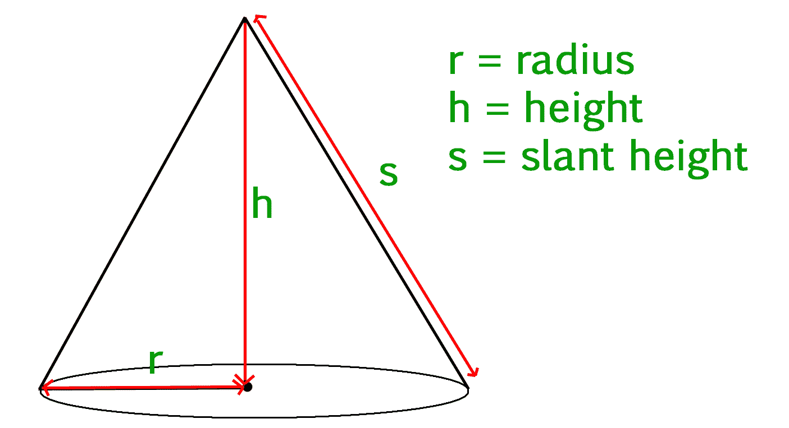

# 计算圆锥体的体积和表面积

> 原文:[https://www . geesforgeks . org/calculate-volume-surface-area-cone/](https://www.geeksforgeeks.org/calculate-volume-surface-area-cone/)

给定圆锥体的倾斜高度、高度和半径，我们必须计算圆锥体的体积和表面积。

*   **圆锥体:**
    圆锥体是一种三维几何形状。它由一个圆形的底部和一个弯曲的侧面(侧面)组成，末端称为顶点或顶点。



*   **圆锥体的体积:**
    圆锥体的体积由公式–
    给出

```
volume = 1/3(pi * r * r * h)
```

*   其中 *r* 为圆形底座的半径， *h* 为高度(底座到顶点的垂直距离)。

*   **圆锥体的表面积:**
    圆锥体的表面积由公式–
    给出

```
area = pi * r * s + pi * r^2  
```

*   其中 *r* 为圆底半径， *s* 为圆锥体的倾斜高度。

**例:**

```
Input : 
radius = 5
slant_height = 13
height = 12
Output :
Volume Of Cone = 314.159
Surface Area Of Cone = 282.743

Input :
radius = 6
slant_height = 10
height = 8
Output : 
Volume Of Cone = 301.593
Surface Area Of Cone = 301.593
```

## C++

```
// CPP program to calculate Volume 
// and Surface area of Cone
#include<iostream>
using namespace std;

float pi = 3.14159;

// Function to calculate
// Volume of cone
float volume(float r, float h)
{
    return (float(1) / float(3)) * pi * 
                             r * r * h;
}

// Function to calculate
// Surface area of cone
float surface_area(float r, float s)
{
    return pi * r * s + pi * r * r;
}

// Driver Code
int main()
{
    float radius = 5;
    float slant_height = 13;
    float height = 12;
    float vol, sur_area;

    // Printing value of volume 
    // and surface area
    cout << "Volume Of Cone : "
        << volume(radius, height) << endl;
    cout << "Surface Area Of Cone : "
        << surface_area(radius, slant_height);
    return 0;
}
```

## Java 语言(一种计算机语言，尤用于创建网站)

```
// Java program to calculate 
// Volume and Surface area of cone
class GFG 
{
    static float pi = 3.14159f;

    // Function to calculate 
    // Volume of cone
    public static float volume(float r, 
                               float h)
    {
        return (float)1 / 3 * pi * h *
                               r * r;
    }

    // Function to calculate 
    // Surface area of cone
    public static float surface_area(float r, 
                                     float s)
    {
        return pi * r * s + pi * r * r;
    }

    // Driver Code
    public static void main(String args[])
    {
        float radius = 5;
        float slant_height = 13;
        float height = 12;
        float vol, sur_area;

        // Printing value of volume
        // and surface area
        System.out.print("Volume Of Cone : ");
        System.out.println(volume(radius, height));

        System.out.print("Surface Area Of Cone : ");
        System.out.println(surface_area(radius, 
                                        slant_height));

    }
}

// This code is contributed by "akanshgupta"
```

## 计算机编程语言

```
''' Python3 program to calculate Volume and 
    Surface area of Cone'''

# Importing Math library for value Of PI
import math
pi = math.pi

# Function to calculate Volume of Cone
def volume(r, h):
    return (1 / 3) * pi * r * r * h

# Function To Calculate Surface Area of Cone
def surfacearea(r, s):
    return pi * r * s + pi * r * r

# Driver Code
radius = float(5)
height = float(12)
slat_height = float(13)
print( "Volume Of Cone : ", volume(radius, height) )
print( "Surface Area Of Cone : ", surfacearea(radius, slat_height) )
```

## C#

```
// C# program to calculate 
// Volume and Surface area of cone
using System;

class GFG 
{
    static float pi = 3.14159f;

    // Function to calculate 
    // Volume of cone
    public static float volume(float r, 
                               float h)
    {
        return (float)1 / 3 * pi * h * 
                               r * r;
    }

    // Function to calculate 
    // Surface area of cone
    public static float surface_area(float r, 
                                     float s)
    {
        return pi * r * s + pi * r * r;
    }

    // Driver Code
    public static void Main()
    {
        float radius = 5;
        float slant_height = 13;
        float height = 12;
        //float vol, sur_area;

        // Printing value of volume 
        // and surface area
        Console.Write("Volume Of Cone : ");
        Console.WriteLine(volume(radius, 
                                 height));

        Console.Write("Surface Area Of Cone : ");
        Console.WriteLine(surface_area(radius, 
                                       slant_height));

    }
}

// This code is contributed by "vt_m"
```

## 服务器端编程语言（Professional Hypertext Preprocessor 的缩写）

```
<?php
// PHP program to calculate Volume 
// and Surface area of Cone

// Function to calculate Volume of cone
function volume( $r, $h)
{
    $pi = 3.14159;
    return (1 / 3) * $pi * $r * 
                     $r * $h;
}

// Function to calculate 
// Surface area of cone
function surface_area($r, $s)
{
    $pi = 3.14159;
    return $pi * $r * $s + $pi *
                      $r * $r;
}

// Driver Code

    $radius = 5;
    $slant_height = 13;
    $height = 12;
    //vol, sur_area;

    // Printing value of volume
    // and surface area
    echo("Volume Of Cone : ");
    echo( volume($radius, $height));
    echo("\n");
    echo("Surface Area Of Cone : ");
    echo( surface_area($radius, 
                       $slant_height));

// This code is contributed by vt_m.

?>
```

## java 描述语言

```
<script>
// javascript program to calculate Volume 
// and Surface area of Cone

const pi = 3.14159;

// Function to calculate
// Volume of cone
function volume( r,  h)
{
    return ((1) / (3)) * pi * 
                             r * r * h;
}

// Function to calculate
// Surface area of cone
function surface_area( r,  s)
{
    return pi * r * s + pi * r * r;
}

// Driver Code

    let radius = 5;
    let slant_height = 13;
    let height = 12;
    let vol, sur_area;

    // Printing value of volume 
    // and surface area
   document.write( "Volume Of Cone : "
        + volume(radius, height).toFixed(2) +"<br/>");
    document.write( "Surface Area Of Cone : "
        + surface_area(radius, slant_height).toFixed(2) +"<br/>");

// This code is contributed by Rajput-Ji 

</script>
```

**输出:**

```
Volume Of Cone : 314.159
Surface Area Of Cone : 282.743
```