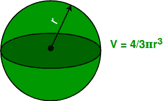
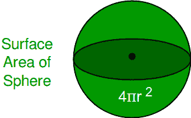

# 计算球体的体积和表面积

> 原文:[https://www . geesforgeks . org/calculate-volume-surface-area-sphere/](https://www.geeksforgeeks.org/calculate-volume-surface-area-sphere/)

给定球体半径，计算球体的体积和表面积。
**球体:**
就像一个圆，它在几何上是一个二维物体，球体在数学上被定义为一组点，这些点都离给定点有相同的距离 **r** ，但在三维空间中。这个距离 **r** 就是球体的半径，给定点就是球体的中心。
对于给定的表面积，球体是体积最大的固体。这就是为什么它在自然界中出现如此之多，如水滴、气泡和行星等。
**球体体积:**
精确填充球体的立方单位数或球体的存储容量。我们可以用公式
计算球体的体积



**球体表面积:**
球体物体的表面积是球体表面所占总面积的量度。我们可以用公式
计算球体的体积



**例:**

```
Input  : Radius Of Sphere = 5
Output : Volume    Of    Sphere :  523.5987755982989
         Surface Area Of Sphere :  314.1592653589793
Explanation:
         Volume =( 4/3 ) * 3.14159 * 5 * 5 * 5 = 523.598
         Surface Area = 4 * 3.14159 * 5 * 5 =314.159

Input  : Radius Of Sphere = 12
Output : Volume    Of    Sphere :  7238.229473870883
         Surface Area Of Sphere :  1809.5573684677208
```

## C++

```
// CPP program to calculate Volume and 
// Surface area of Sphere
#include<bits/stdc++.h>
using namespace std;

// Initializing Value Of PI
float pi = 3.14159;

// Function To Calculate Volume Of Sphere
float volume(float r)
{
    float vol;
    vol = (float(4) / float(3)) * pi * r * r * r;
    return vol;

}

// Function To Calculate Surface Area of Sphere
float surface_area(float r)
{
    float sur_ar;
    sur_ar = 4 * pi * r * r;
    return sur_ar;
}

// Driver Function
int main()
{
    float radius = 12;
    float vol, sur_area;

    // Function Call
    vol = volume(radius);
    sur_area = surface_area(radius);

    // Printing Value Of Volume And Surface Area
    cout << "Volume Of Sphere :" << vol << endl;
    cout << "Surface Area Of Sphere :" << sur_area << endl;
    return 0;
}
```

## Java 语言(一种计算机语言，尤用于创建网站)

```
// Java program to calculate Volume and
// Surface area of Sphere
class GFG {

// Initializing Value Of PI
static float pi = 3.14159f;

// Function To Calculate Volume Of Sphere
static float volume(float r)
{
    float vol;
    vol = ((float)4 / (float)3) * (pi * r * r * r);
    return vol;
}

// Function To Calculate Surface Area of Sphere
static float surface_area(float r) {
    float sur_ar;
    sur_ar = 4 * pi * r * r;
    return sur_ar;
}

// Driver Function
public static void main(String[] args) 
{
    float radius = 12;
    float vol, sur_area;

    // Function Call
    vol = volume(radius);
    sur_area = surface_area(radius);

    // Printing Value Of Volume And Surface Area
    System.out.println("Volume Of Sphere :" + vol);
    System.out.println("Surface Area Of Sphere :" + sur_area);
}
}

// This code is contributed by Anant Agarwal.
```

## 蟒蛇 3

```
''' Python3 program to calculate Volume and 
Surface area of Sphere'''
# Importing Math library for value Of PI
import math
pi = math.pi

# Function to calculate Volume of Sphere
def volume(r):
    vol = (4 / 3) * pi * r * r * r
    return vol

# Function To Calculate Surface Area of Sphere
def surfacearea(r):
    sur_ar = 4 * pi * r * r
    return sur_ar

# Driver Code
radius = float(12)
print( "Volume Of Sphere : ", volume(radius) )
print( "Surface Area Of Sphere : ", surfacearea(radius) )
```

## C#

```
// C# program to calculate Volume and
// Surface area of Sphere
using System;

class GFG {

    // Initializing Value Of PI
    static float pi = 3.14159f;

    // Function To Calculate Volume
    // Of Sphere
    static float volume(float r)
    {
        float vol;
        vol = ((float)4 / (float)3) * 
                           (pi * r * r * r);
        return vol;
    }

    // Function To Calculate Surface Area 
    // of Sphere
    static float surface_area(float r) {
        float sur_ar;
        sur_ar = 4 * pi * r * r;
        return sur_ar;
    }

    // Driver Function
    public static void Main() 
    {
        float radius = 12;
        float vol, sur_area;

        // Function Call
        vol = volume(radius);
        sur_area = surface_area(radius);

        // Printing Value Of Volume And 
        // Surface Area
        Console.WriteLine("Volume Of Sphere :"
                                        + vol);
        Console.WriteLine("Surface Area Of " 
                      + "Sphere :" + sur_area);
    }
}

// This code is contributed by vt_m.
```

## 服务器端编程语言（Professional Hypertext Preprocessor 的缩写）

```
<?php
// PHP program to calculate Volume 
// and Surface area of Sphere

// Function To Calculate 
// Volume Of Sphere
function volume( $r)
{
    $pi = 3.14159;
    $vol = (4 / 3) * $pi * $r * $r * $r;
    return $vol;

}

// Function To Calculate 
// Surface Area of Sphere
function surface_area( $r)
{
    $pi = 3.14159;

    $sur_ar = 4 * $pi * $r * $r;
    return $sur_ar;
}

// Driver Code
$radius = 12;
$vol; $sur_area;

// Function Call
$vol = volume($radius);
$sur_area = surface_area($radius);

// Printing Value Of 
// Volume And Surface Area
echo ("Volume Of Sphere : " );
echo($vol);
echo( " \nSurface Area Of Sphere :");
echo( $sur_area);

// This code is contributed by vt_m.
?>
```

## java 描述语言

```
<script>
// javascript program to calculate Volume and 
// Surface area of Sphere

// Initializing Value Of PI
const pi = 3.14159;

// Function To Calculate Volume Of Sphere
function volume( r)
{
    let vol;
    vol = ((4) / (3)) * pi * r * r * r;
    return vol;
}

// Function To Calculate Surface Area of Sphere
function surface_area( r)
{
    let sur_ar;
    sur_ar = 4 * pi * r * r;
    return sur_ar;
}

// Driver Function

    let radius = 12;
    let vol, sur_area;

    // Function Call
    vol = volume(radius).toFixed(2);
    sur_area = surface_area(radius).toFixed(2);

    // Printing Value Of Volume And Surface Area
    document.write( "Volume Of Sphere :" + vol +"<br/>");
    document.write( "Surface Area Of Sphere :" + sur_area + "<br/>");

    // This code is contributed by Rajput-Ji 
</script>
```

输出:

```
Volume Of Sphere :7238.22
Surface Area Of Sphere :1809.56
```