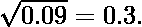

# 使用二分搜索法计算第 n 个实根

> 原文:[https://www . geeksforgeeks . org/computing-n-th-real-root-use-binary-search/](https://www.geeksforgeeks.org/calculating-n-th-real-root-using-binary-search/)

给定两个数 x 和 n，求 x 的第 n 根。

**示例:**

> **输入:**5 2
> T3】输出:2 . 36660 . 66666666666
> 
> **输入:** x = 5，n = 3
> T3】输出: 1.70997594668

为了计算一个数的 n <sup>次</sup>根，我们可以使用以下程序。

1.  如果 x 位于范围**【0，1】**内，那么我们设置下限**低= x** 和上限**高= 1** ，因为对于这个数字范围，第 n 个根总是大于给定的数字，并且永远不能超过 1。
    eg- 
2.  否则我们取**低= 1****高= x** 。
3.  声明一个名为**ε**的变量，并初始化它以获得所需的精度。
    假设ε= 0.01，那么我们可以保证我们对给定数字的第 n 个根的猜测将是
    正确到小数点后 2 位。
4.  声明一个变量 guess 并初始化为 **guess=(低+高)/2。**
5.  运行循环，以便:
    *   如果我们**猜测**的**绝对误差**大于**ε**那么做:
        1.  如果**猜<sup>n</sup>T6 x**，那么**高=猜**
        2.  否则**低=猜测**
        3.  做出新的更好的**猜测**即**猜测=(低+高)/2。**
    *   如果我们的**猜测**的**绝对误差**小于ε，那么退出循环。

**<u>绝对误差:</u>** 绝对误差可以计算为 **abs(猜测 <sup>n</sup> -x)**

## C++

```
// C++ Program to find
// n-th real root of x
#include <bits/stdc++.h>
using namespace std;

void findNthRoot(double x, int n)
{

    // Initialize boundary values
    double low, high;
    if (x >= 0 and x <= 1)
    {
        low = x;
        high = 1;
    }
    else
    {
        low = 1;
        high = x;
    }

    // Used for taking approximations
    // of the answer
    double epsilon = 0.00000001;

    // Do binary search
    double guess = (low + high) / 2;
    while (abs((pow(guess, n)) - x) >= epsilon)
    {
        if (pow(guess, n) > x)
        {
            high = guess;
        }
        else
        {
            low = guess;
        }
        guess = (low + high) / 2;
    }

    cout << fixed << setprecision(16) << guess;
}

// Driver code
int main()
{
    double x = 5;
    int n = 2;
    findNthRoot(x, n);
}

// This code is contributed
// by Subhadeep
```

## Java 语言(一种计算机语言，尤用于创建网站)

```
// Java Program to find n-th real root of x
class GFG
{
    static void findNthRoot(double x, int n)
    {

        // Initialize boundary values
        double low, high;
        if (x >= 0 && x <= 1)
        {
            low = x;
            high = 1;
        }
        else
        {
            low = 1;
            high = x;
        }

        // used for taking approximations
        // of the answer
        double epsilon = 0.00000001;

        // Do binary search
        double guess = (low + high) / 2;
        while (Math.abs((Math.pow(guess, n)) - x)
               >= epsilon)
        {
            if (Math.pow(guess, n) > x)
            {
                high = guess;
            }
            else
            {
                low = guess;
            }
            guess = (low + high) / 2;
        }

        System.out.println(guess);
    }

    // Driver code
    public static void main(String[] args)
    {
        double x = 5;
        int n = 2;
        findNthRoot(x, n);
    }
}

// This code is contributed
// by mits
```

## 蟒蛇 3

```
# Python Program to find n-th real root
# of x

def findNthRoot(x, n):

    # Initialize boundary values
    x = float(x)
    n = int(n)
    if (x >= 0 and x <= 1):
        low = x
        high = 1
    else:
        low = 1
        high = x

    # used for taking approximations
    # of the answer
    epsilon = 0.00000001

    # Do binary search
    guess = (low + high) / 2
    while abs(guess ** n - x) >= epsilon:
        if guess ** n > x:
            high = guess
        else:
            low = guess
        guess = (low + high) / 2
    print(guess)

# Driver code
x = 5
n = 2
findNthRoot(x, n)
```

## C#

```
// C# Program to find n-th real root of x

using System;

public class GFG {
    static void findNthRoot(double x, int n)
    {

        // Initialize boundary values
        double low, high;
        if (x >= 0 && x <= 1)
        {
            low = x;
            high = 1;
        }
        else
        {
            low = 1;
            high = x;
        }

        // used for taking approximations
        // of the answer
        double epsilon = 0.00000001;

        // Do binary search
        double guess = (low + high) / 2;
        while (Math.Abs((Math.Pow(guess, n)) - x)
               >= epsilon)
        {
            if (Math.Pow(guess, n) > x)
            {
                high = guess;
            }
            else
            {
                low = guess;
            }
            guess = (low + high) / 2;
        }

        Console.WriteLine(guess);
    }

    // Driver code
    static public void Main()
    {
        double x = 5;
        int n = 2;
        findNthRoot(x, n);
    }
}

// This code is contributed by akt_mit
```

## java 描述语言

```
<script>

    // Javascript Program to find n-th
    // real root of x

    function findNthRoot(x, n)
    {

        // Initialize boundary values
        let low, high;
        if (x >= 0 && x <= 1)
        {
            low = x;
            high = 1;
        }
        else
        {
            low = 1;
            high = x;
        }

        // used for taking approximations
        // of the answer
        let epsilon = 0.00000001;

        // Do binary search
        let guess = parseInt((low + high) / 2, 10);
        while (Math.abs((Math.pow(guess, n)) - x)
                >= epsilon)
        {
            if (Math.pow(guess, n) > x)
            {
                high = guess;
            }
            else
            {
                low = guess;
            }
            guess = (low + high) / 2;
        }

        document.write(guess);
    }

    let x = 5;
    let n = 2;
    findNthRoot(x, n);

</script>
```

**Output**

```
2.2360679768025875
```

ε= 0.01 时第一个例子的解释

```
Since taking too small value of epsilon as taken in our program might not be feasible for
explanation because it will increase the number of steps drastically so for the sake of
simplicity we are taking epsilon = 0.01
The above procedure will work as follows:
Say we have to calculate the then x = 5, low = 1, high = 5.
Taking epsilon = 0.01
First Guess:
guess = (1 + 5) / 2 = 3
Absolute error = |32 - 5| = 4 > epsilon
guess2 = 9 > 5(x) then high = guess --> high = 3
Second Guess:
guess = (1 + 3) / 2 = 2
Absolute error = |22 - 5| = 1 > epsilon
guess2 = 4 > 5(x) then low = guess --> low = 2
Third Guess:
guess = (2 + 3) / 2 = 2.5
Absolute error = |2.52 - 5| = 1.25 > epsilon
guess2 = 6.25 > 5(x) then high = guess --> high = 2.5
and proceeding so on we will get the  correct up to 2 decimal places i.e.,  = 2.23600456
We will ignore the digits after 2 decimal places since they may or may not be correct.
```