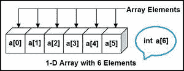
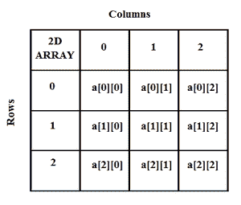
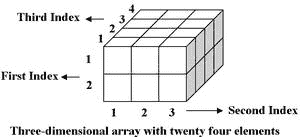

# 使用行主和列主顺序计算一维、二维和三维元素的地址

> 原文:[https://www . geeksforgeeks . org/计算 1-d-2-d 和 3-d 元素的地址-使用行-主-列-主-顺序/](https://www.geeksforgeeks.org/calculation-of-address-of-element-of-1-d-2-d-and-3-d-using-row-major-and-column-major-order/)

本文着重于按行主顺序和列主顺序计算一维、二维和三维数组中任何元素的地址。

**<u>计算一维数组中任意元素的地址</u> :** 一维数组(或一维数组)是一种类型的[线性数组](https://www.geeksforgeeks.org/array-data-structure/)。访问它的元素需要一个下标，这个下标可以代表一个行或列索引。

**示例:**

要查找数组中某个元素的地址，可使用以下公式-

> **地址 A[I]= b+ W *(I–LB)**
> 
> I =要找到其地址的元素子集，
> B =基地址，
> W =存储在任何数组中的一个元素的存储大小(以字节为单位)，
> LB =下限/下标下限(如果未指定，则假设为零)。

**例:**给定一个数组**A【1300…………1900】**的基址为 **1020** 且内存中每个元素的大小为 2 字节，求**A【1700】**的地址？

**解决方案:**

> **给定:**
> 基址 B = 1020
> 下标 LB 的下限/下界= 1300
> 存储在任意数组中的一个元素的存储大小 W = 2 字节
> 要找到的元素的子集 I = 1700
> 
> **公式:**
> 地址 A[I]= b+ W *(I–LB)
> 
> **解决方案:**
> A【1700】地址= 1020+2 *(1700–1300)
> = 1020+2 *(400)
> = 1020+800
> A【1700】地址= 1820

**<u>计算二维数组中任意元素的地址</u> :** 二维数组可以定义为数组的数组。二维数组被组织成矩阵，矩阵可以表示为数组[M][N]中的行和列的集合，其中 M 是行数，N 是列数。

**示例:**

要找到二维数组中任何元素的地址，有以下两种方法

*   行主要顺序
*   列主订单

**行主顺序:** [行主顺序](https://www.geeksforgeeks.org/performance-analysis-of-row-major-and-column-major-order-of-storing-arrays-in-c/)将连续的元素分配到连续的存储位置，这些元素在各行之间移动，然后向下移动到下一行。用简单的语言来说，数组的元素是以逐行的方式存储的。
要使用行主顺序查找元素的地址，请使用以下公式:

> **A[I][J]= b+ W *(I–LR)* N+(J–LC)的地址**
> 
> I =要找到其地址的元素的行子集，
> J =要找到其地址的元素的列子集，
> B =基地址，
> W =存储在数组中的一个元素的存储大小(以字节为单位)，
> LR =矩阵的行/起始行索引的下限(如果没有给定，则假设它为零)，
> LC =矩阵的列/起始列索引的下限(如果没有给定，则假设它为零)，
> N =矩阵中给定的列数。

**示例:**给定一个数组，**arr[1……10][1……15]**，基值 **100** ，内存中每个元素的大小为 **1 字节**。借助行主顺序找到**arr【8】【6】**的地址？

**解决方案:**

> **给定:**
> 基地址 B = 100
> 任意数组中存储的一个元素的存储大小 W = 1 字节
> 待查找地址 I = 8 的元素的行子集
> 待查找地址 J = 6 的元素的列子集
> 矩阵 LR 的行/起始行索引的下限= 1
> 矩阵的列/起始列索引的下限= 1
> 中给定的列数 矩阵 N =上限–下限+1
> = 15–1+1
> = 15
> 
> **公式:**
> A[I][J]= b+ W *(I–LR)* N+(J–LC)的地址
> 
> **解决方案:**
> A[8][6]= 100+1 *(8–1)* 15+(6–1))
> = 100+1 *(7)* 15+(5))
> = 100+1 *(110)
> A[I][J]= 210 的地址

**列主顺序:**如果一个数组的元素是以列主方式存储的，这意味着要在列中移动，然后移动到下一列，那么它就是以列主顺序存储的。要使用列主顺序查找元素的地址，请使用以下公式:

> **A[I][J]= b+ W *(J–LC)* M+(I–LR)的地址**
> 
> I =要找到其地址的元素的行子集，
> J =要找到其地址的元素的列子集，
> B =基地址，
> W =存储在任何数组中的一个元素的存储大小(以字节为单位)，
> LR =矩阵的行/起始行索引的下限(如果没有给定，则假设它为零)，
> LC =矩阵的列/起始列索引的下限(如果没有给定，则假设它为零)，
> M =矩阵中给定的行数。

**例:**给定一个数组**arr[1……10][1……15]**，基值 **100** ，每个元素的大小为 **1 字节**在内存中借助列主顺序找到 arr[8][6]的地址。

**解决方案:**

> **给定:**
> 基地址 B = 100
> 任意数组中存储的一个元素的存储大小 W = 1 字节
> 待查找地址 I = 8 的元素的行子集
> 待查找地址 J = 6 的元素的列子集
> 矩阵 LR 的行/起始行索引的下限= 1
> 矩阵的列/起始列索引的下限= 1
> 中给定的列数 矩阵 M =上限–下限+1
> = 10–1+1
> = 10
> 
> **公式:**
> A[I][J]= b+ W *(J–LC)* M+(I–LR))
> A[8][6]的地址= 100+1 *(6–1)* 10+(8–1))
> = 100+1 *(5)* 10+(7))
> = 100+1 *(57)
> A[I][J]= 157 的地址

从上面的例子中，可以观察到，对于相同的位置，获得了两个不同的地址位置，这是因为在行主顺序中，移动是跨行进行的，然后向下移动到下一行，而在列主顺序中，首先向下移动到第一列，然后是下一列。所以两个答案都是对的。

所以这一切都是基于元素的位置，元素的地址在某些情况下可以被找到，同样的答案也可以通过行-主顺序和列-主顺序得到，在某些情况下，可以得到不同的答案。

**计算三维数组中任意元素的地址:**三维数组是二维数组的集合。它由三个下标指定:

*   块大小
*   行大小
*   列大小

数组中的维数越多，意味着该数组中可以存储的数据越多。

**示例:**

要找到三维数组中任何元素的地址，有以下两种方法

*   行主要顺序
*   列主订单

**行主顺序:**要使用行主顺序查找元素的地址，请使用以下公式:

> **地址[I][j][k]= b+ W * {[(I–LR)* N]+**
> 
> **[(j-LC)]* r+[k-lb]}**
> 
> I =要找到其地址的元素的行子集，
> J =要找到其地址的元素的列子集，
> K =要找到其地址的元素的块子集，
> B =基地址，
> W =存储在任何数组中的一个元素的存储大小(以字节为单位)，
> LR =矩阵的行/起始行索引的下限(如果没有给定，假设它为零)，
> LC =矩阵的列下限/起始列索引(如未给定则假设为零)
> LB =矩阵中块的下限，
> N =矩阵中给定的列数
> R =矩阵中给定的块数。

**例:**给定一个数组**arr【1:9，-4:1，5:10】**基值 **400** 每个元素大小为 **2 字节**在内存中借助行主顺序找到元素**arr【5】【-1】【8】**的地址？

**解决方案:**

> **给定:**
> 要找到地址的元素的行子集 I = 5
> 要找到地址的元素的列子集 J = -1
> 要找到地址的元素的块子集 K = 8
> 基地址 B = 400
> 存储在任何数组中的一个元素的存储大小(以字节为单位) = 2
> 矩阵 LR 行/起始行索引下限= 1
> 矩阵 LC 列/起始列索引下限= -4
> 矩阵 LB 中块的下限= 5
> 矩阵中给定的列数 N =上限–下限+1
> = 1 –(-4)+1
> = 6
> 矩阵中给定的块数 R =上限–下限+1
> = 10–5+1
> = 6
> 
> **公式:**
> 地址为[I][J][K]= b+ W * {[(I–LR)* N]+[(J–LC)]* R+[K–LB]}
> 
> **解:**
> 地址[][][]= 400+2 * {[(5–1)* 6]+[(-1+4)]} * 6+[8–5]
> = 400+2 *(4 * 6+3)* 6+3)
> = 400+2 *(165)
> = 730

**列主顺序:**要使用列主顺序查找元素的地址，请使用以下公式-

> **地址[I][J][K]= b+ W * {[(I–LR)]+[(J–LC)* M]* R+[K–LB]}**
> 
> I =要找到其地址的元素的行子集，
> J =要找到其地址的元素的列子集，
> K =要找到其地址的元素的块子集
> B =基地址，
> W =存储在任何数组中的一个元素的存储大小(以字节为单位)，
> LR =矩阵的行/起始行索引的下限(如果没有给出，假设它为零)，
> LC =矩阵的列下限/起始列索引(如未给定则假设为零)
> LB =矩阵中块的下限，
> M =矩阵中给定的行数，
> R =矩阵中给定的块数。

**例:**给定一个数组 **arr[1:8，-5:5，-10:5]** ，基值 **400** ，每个元素大小为 **4 字节**在内存中借助列主顺序找到元素 **arr[3][3][3]** 的地址？

**解决方案:**

> **给定:**
> 待查找地址 I = 3 的元素的行子集
> 待查找地址 J = 3 的元素的列子集
> 待查找地址 K = 3 的元素的块子集
> 基地址 B = 400
> 存储在任何数组中的一个元素的存储大小(以字节为单位) = 4
> 矩阵 LR 行/起始行索引下限= 1
> 矩阵 LC 列/起始列索引下限= -5
> 矩阵 LB 中块的下限= -10
> 矩阵 M 中给定的行数=上限–下限+1
> = 8–1+1
> = 8
> 矩阵 R 中给定的块数=上限–下限+ 1
> = 5 + 10 + 1
> = 16
> 
> **公式:**
> 地址[I][J][K]= b+ W * {[(I–LR)]+[(J–LC)* M]* R+[K–LB]}
> 
> **解:**
> 地址为【3】【3】【3】= 400+4 * {[(3–1)]+【3+5】* 8]} * 16+【3+10】
> = 400+4 *(2+64)* 16+13)
> = 400+4 *(1069)
> = 400+4276
> = 4676