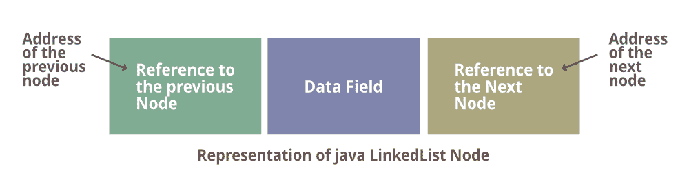
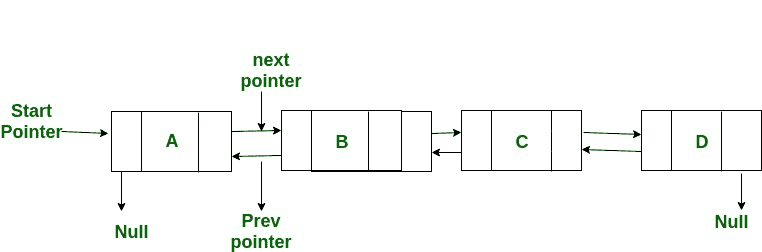

# 我们能用 Java 实现异或链表吗？

> 原文:[https://www . geesforgeks . org/can-we-implement-xor-link-list-in-Java/](https://www.geeksforgeeks.org/can-we-implement-xor-linked-list-in-java/)

从下图中我们可以看出，双链接列表需要两个链接字段来存储下一个节点的地址和正确节点的地址，对吗？所以异或链表通常充当双链表。异或链表的每个节点只需要一个指针字段，它实际上并不存储实际的内存地址，而是存储下一个和前一个节点的地址的按位异或。这将节省内存。

先看这个–[**异或链表–**](https://www.geeksforgeeks.org/xor-linked-list-a-memory-efficient-doubly-linked-list-set-1/)**内存高效双链表。** 现在想知道 XOR LinkedList 的节点是什么样子的。下图是它的外观:

 

现在我们已经完成了[双链表](https://www.geeksforgeeks.org/doubly-linked-list/)的表示。 ***你可能想知道用 java 实现是否可能？*** 。

这个问题的答案很简单，也很有说服力，因为在 C++中有指针，而在 java 语言中没有指针，所以不能在 java 这样的编程语言中实现异或链表。在 Java 中，XOR 双链表是不可能的，因为发生的事情是你不能访问任何对象的实际内存地址，如果没有引用它们的变量，垃圾收集器将删除这些节点。C#的情况也是如此。

当遍历列表时，使用这个节点类的双向链表类将跟踪最后一个节点。同样，您也可以通过对下一个节点的地址和当前节点的异或指针进行异或来向后遍历。虽然我们一次只存储一个前一个节点，而不是每个节点的前一个节点，但我们节省了大量内存。众所周知，现在内存很便宜，所以异或双链表的概念只是理论上的，没有实际应用。

如果我们需要对两个地址进行异或运算，我们需要将内存地址转换成整数，这在 java 中是不可能的。但是在 C++中，我们可以将任何(Node*)、(int *)指向任何数据类型的指针进行类型转换，这取决于您的机器是(32 位为 4)还是(64 位为 8)。long 用于处理 C++中的指针，uintptr_t 也可用。*既然我们不能用 java 实现这一点，但是等等，我们能不能用任何语言实现这一点？是的，我们可以用 C/C++。*

> ***结论:**这个查询的答案是冷冻结 NO，因为我们可以在 C/C++中实现 XOR 链表，因为它有一个惊人的特性，即*我们也可以用 C#等语言实现的指针。