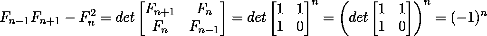

# 卡西尼的身份

> 原文:[https://www.geeksforgeeks.org/cassinis-identity/](https://www.geeksforgeeks.org/cassinis-identity/)

给定一个数字 N，任务是评估下面的表达式。预期时间复杂度为 0(1)。

```
 f(n-1)*f(n+1) - f(n)*f(n)
```

其中 f(n)是第 n 个[斐波那契数](https://www.geeksforgeeks.org/program-for-nth-fibonacci-number/)，n > = 1。前几个斐波那契数是 0，1，1，2，3，5，8，13，…..即(将 0 视为第 0 个斐波那契数)

**示例:**

```
Input : n = 5
Output : -1
f(5-1=4) = 3
f(5+1=6) = 8
f(5)*f(5)= 5*5 = 25
f(4)*f(6)- f(5)*f(5)= 24-25= -1

```

虽然任务很简单，即找到第 n-1、第 n 和第(n+1)个斐波那契数。评估表达式并显示结果。但是这可以在 O(1)时间内使用[卡西尼的身份](https://en.wikipedia.org/wiki/Cassini_and_Catalan_identities)来完成，该身份声明:

```
           f(n-1)*f(n+1) - f(n*n) = (-1)^n 
```

所以，我们不需要计算任何斐波那契项，只需要检查 n 是偶数还是奇数。

**以上公式是如何工作的？**
该公式基于斐波那契数的矩阵表示。
[](https://media.geeksforgeeks.org/wp-content/uploads/cassini-identity.png)

## C/C++

```
// C++ implementation to demonstrate working
// of Cassini’s Identity 
#include<bits/stdc++.h>
using namespace std;

// Returns (-1)^n
int cassini(int n)
{
   return (n & 1) ? -1 : 1;
} 

// Driver program
int main()
{  
   int n = 5;
   cout << cassini(n);
   return 0;
} 
```

## Java 语言(一种计算机语言，尤用于创建网站)

```
// Java implementation to demonstrate working
// of Cassini’s Identity 

class Gfg
{
    // Returns (-1)^n
    static int cassini(int n)
    {
       return (n & 1) != 0 ? -1 : 1;
    } 

    // Driver method
    public static void main(String args[])
    {
         int n = 5;
         System.out.println(cassini(n));
    }
}
```

## 蟒蛇 3

```
# Python implementation
# to demonstrate working
# of Cassini’s Identity 

# Returns (-1)^n
def cassini(n):

   return -1 if (n & 1) else 1

# Driver program

n = 5
print(cassini(n))

# This code is contributed
# by Anant Agarwal.
```

## C#

```
// C# implementation to demonstrate 
// working of Cassini’s Identity
using System;

class GFG {

    // Returns (-1) ^ n
    static int cassini(int n)
    {
       return (n & 1) != 0 ? -1 : 1;
    } 

    // Driver Code
    public static void Main()
    {
         int n = 5;
         Console.Write(cassini(n));
    }
}

// This code is contributed by Nitin Mittal.
```

## 服务器端编程语言（Professional Hypertext Preprocessor 的缩写）

```
<?php
// PHP implementation to 
// demonstrate working of 
// Cassini’s Identity 

// Returns (-1)^n
function cassini($n)
{
    return ($n & 1) ? -1 : 1;
} 

// Driver Code
$n = 5;
echo(cassini($n));

// This code is contributed by Ajit.
?>
```

## Java Script 语言

```
<script>
// Javascript implementation to 
// demonstrate working of 
// Cassini’s Identity 

// Returns (-1)^n 
function cassini(n) 
{ 
    return (n & 1) ? -1 : 1; 
} 

// Driver Code 
let n = 5; 
document.write(cassini(n)); 

// This code is contributed by _saurabh_jaiswal.

</script>
```

**Output :**

```
-1

```

**参考:**
[https://en . Wikipedia . org/wiki/Cassini _ and _ Catalan _ identities](https://en.wikipedia.org/wiki/Cassini_and_Catalan_identities)

本文由 **[萨哈布拉](https://www.facebook.com/sahil.chhabra.965)** 供稿。如果你喜欢 GeeksforGeeks 并想投稿，你也可以使用[contribute.geeksforgeeks.org](http://www.contribute.geeksforgeeks.org)写一篇文章或者把你的文章邮寄到 contribute@geeksforgeeks.org。看到你的文章出现在极客博客主页上，帮助其他极客。

如果你发现任何不正确的地方，或者你想分享更多关于上面讨论的话题的信息，请写评论。