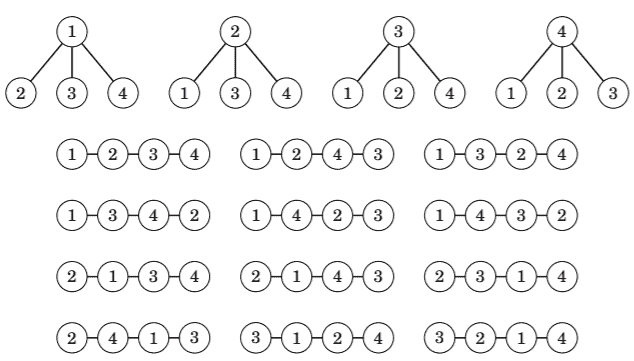
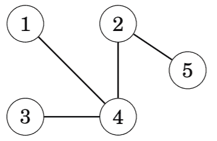
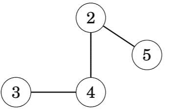
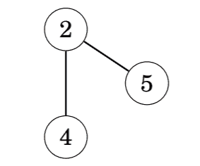
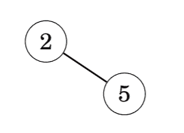

# 凯莱公式

> 原文:[https://www.geeksforgeeks.org/cayleys-formula/](https://www.geeksforgeeks.org/cayleys-formula/)

[**凯莱公式**](https://www.geeksforgeeks.org/g-fact-20-cayleys-formula-for-number-of-labelled-trees/) **:** 这个公式告诉我们可以用 **N** 个顶点构造多少棵树。它声明有**NN–2**标记的树属于 **N** 节点。节点从 **1、2、…、N** 开始标注，如果两个[树的结构或标注不同，则两个](https://www.geeksforgeeks.org/g-fact-20-cayleys-formula-for-number-of-labelled-trees/)树也不同。

**例如:**当 **N** 为 **4** 时，标注树数为**44–2**= 16。

下图描述了标记树的数量:

在上图中，给出了 4 个节点，从中创建了 **16 个标记树**。

**<u>凯莱公式使用普吕弗代码推导</u> :**

**<u>考官代码</u> :**

*   一个**程序代码**是一个描述一个标记树的**(N–2)**数字序列。
*   代码是按照从树上移除**(N–2)**叶子的过程构建的。
*   在每一步中，具有最小标签的叶子被移除，并且其唯一邻居的标签被添加到代码中。

以下是计算以下[图形](https://www.geeksforgeeks.org/graph-data-structure-and-algorithms/)的程序代码的步骤:

*   给定一个有五个节点的图:

*   删除节点 1 并将节点 4 添加到代码中:

*   然后删除节点 3，并将节点 4 添加到代码中:

*   最后，删除节点 4 并将节点 2 添加到代码中:

因此，图中的**程序代码**由 **{4，4，2}** 给出。

*   可以为任何树构造密码。
*   原始树可以从普吕弗码重建。
*   因此，N 个节点的标记树的数量等于**NN–2**，大小为 N 的概率码的数量