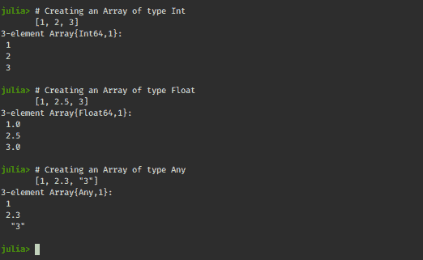
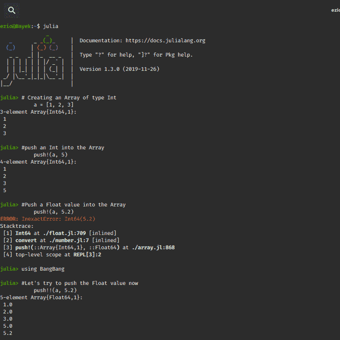
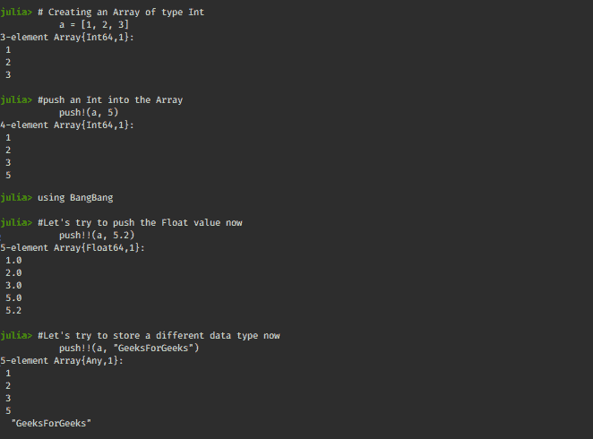
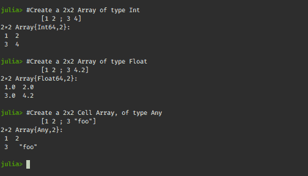
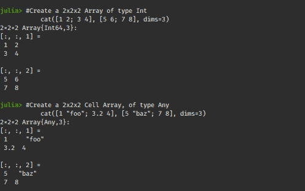
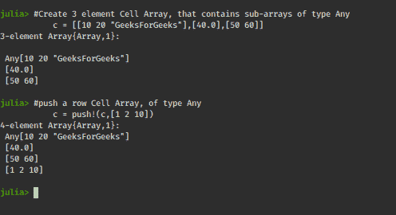

# 朱莉娅中的细胞阵列

> 原文:[https://www.geeksforgeeks.org/cell-arrays-in-julia/](https://www.geeksforgeeks.org/cell-arrays-in-julia/)

**单元格数组**是一种**抽象**数据类型，带有称为单元格的索引数据容器，其中每个单元格可以包含任何类型的数据。它通常用于 Matlab 中存储数据。
来到[朱莉娅](https://www.geeksforgeeks.org/julia-language-introduction/)，朱莉娅的神奇之处之一就是它的类型系统。这是一种严格输入的语言。在 Julia 中，数组可以包含同构**【1，2，3】**或异构类型**【1，2.5，“3”】**的值。默认情况下，Julia 会尝试将这些值提升为常见的具体类型。如果 Julia 不能提升包含的类型，结果数组将是抽象类型**任何**。
**举例:**

## 蟒蛇 3

```
# Creating an Array of type Int
[1, 2, 3]

# Creating an Array of type Float
[1, 2.5, 3]

# Creating an Array of type Any
[1, 2.3, "3"]
```

**输出:**



所以可以说一个**数组{Any}** 相当于一个 Matlab 单元数组。它可以保存不同数据类型的元素。

#### 从常规数组创建单元格数组

使用 Julia 中的一些预定义方法，可以用常规数组创建单元数组。
让我们创建一个类型为 **Int** 的**数组**，看看它是从常规的**数组**到**单元数组**的转换！

## 蟒蛇 3

```
# Creating an Array of type Int
a = [1, 2, 3]

# push an Int into the Array
push!(a, 5)

# So the type <strong>Int</strong> is retained

# Push a Float value into the Array
push!(a, 5.2)
```

**输出:**


当我们试图在整数类型的数组中推一个浮点值时，上面的代码会产生一个错误。这表明 Julia 是严格类型化的，不允许推送任何其他数据类型的元素。
**更改数组的数据类型:**默认情况下，Julia 不会更改数组的类型，因此不允许在数组中推送不同类型的值。这可以通过使用外部包装来避免。
**例:**

## 蟒蛇 3

```
# A special package to allow extended operations with push!()
# Install it by typing "add BangBang"
using BangBang

# Creating an Array of type Int
a = [1, 2, 3]

# push an Int into the Array
push!(a, 5)

# Let's try to push the Float value now
push!!(a, 5.2)
```

**输出:**



上面的代码把 array 转换成 Float64，类似的，它也可以用来把 Array 转换成 string 数组等等。
**例:**

## 蟒蛇 3

```
using BangBang

# Creating an Array of type Int
a = [1, 2, 3]

# push an Int into the Array
push!(a, 5)

# Pushing the Float value
push!!(a, 5.2)

# Let's try to store a different data type now
push!!(a, "GeeksForGeeks")
```

**输出:**



这将常规数组转换为保存异构数据类型值的单元格数组。
**2D 阵列的单元阵列:**

## 蟒蛇 3

```
# Create a 2x2 Array of type Int
[1 2 ; 3 4]

# Create a 2x2 Array of type Float
[1 2 ; 3 4.2]

# Create a 2x2 Cell Array, of type Any
[1 2 ; 3 "foo"]
```

**输出:**



**3D 阵列的单元阵列:**

## 蟒蛇 3

```
# Create a 2x2x2 Array of type Int
cat([1 2; 3 4], [5 6; 7 8], dims=3)

# Create a 2x2x2 Cell Array, of type Any
cat([1 "foo"; 3.2 4], [5 "baz"; 7 8], dims=3)
```

**输出:**



#### 向单元格数组添加行

使用**推送可以在单元格数组的末尾添加额外的行！()**功能。

## 蟒蛇 3

```
# Create 3 element Cell Array,
# that contains sub-arrays of type Any
c = [[10 20 "GeeksForGeeks"], [40.0], [50 60]]

# push a row Cell Array, of type Any
c = push!(c, [1 2 10])
```

**输出:**



**在单元阵列中存储单元阵列:**

## 蟒蛇 3

```
# Create two, 3 element Cell Arrays i and j
i = [2, 3.0, "GeeksForGeeks"]
j = [2.3, 3.3, "CellArrays"]

# Create a 3x2 Array
IJ = [i j]
```