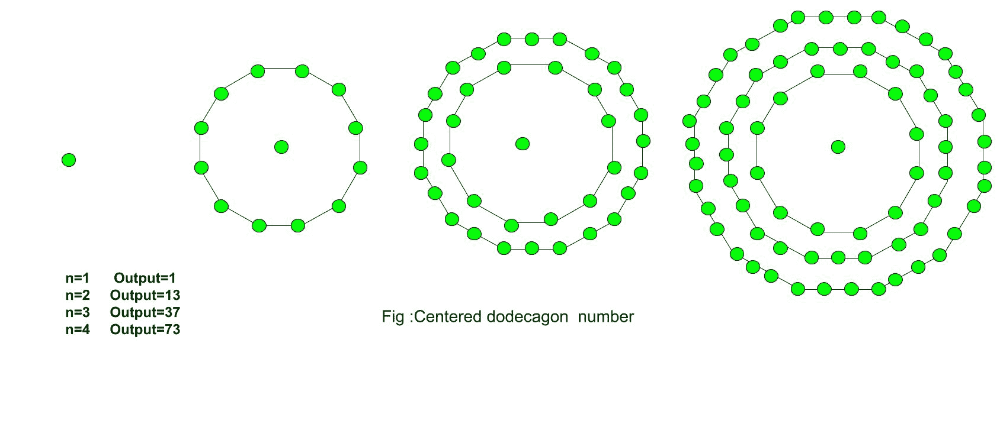

# 居中十二边形数

> 原文:[https://www.geeksforgeeks.org/centered-dodecagonal-number/](https://www.geeksforgeeks.org/centered-dodecagonal-number/)

给定一个数 n，求第 n 个居中的十二边形数。
居中的十二边形数字表示在连续的十二边形(12 边多边形)图层中，位于中心的一个点及其周围的其他点。
**例:**

```
Input :  3
Output : 37

Input : 7
Output :253 
```



前几个居中的十二边形数字是:
1，13，37，73，121，181，253，337，433，541，661……..
第 n 个中心十二边形数的公式:

## C++

```
// C++ Program to find
// nth centered
// Dodecagonal number
#include <bits/stdc++.h>
using namespace std;

// Function to calculate Centered
// Dodecagonal number
int centeredDodecagonal(long int n)
{
    // Formula to calculate nth
    // centered Dodecagonal number
    return 6 * n * (n - 1) + 1;
}

// Driver Code
int main()
{
    long int n = 2;
    cout << centeredDodecagonal(n);
    cout << endl;
    n = 9;
    cout << centeredDodecagonal(n);

    return 0;
}
```

## Java 语言(一种计算机语言，尤用于创建网站)

```
// Java Program to find nth
// centered dodecagonal number
import java.io.*;

class GFG{

// Function to calculate
// centered dodecagonal number
static long centeredDodecagonal(long n)
{

    // Formula to calculate nth
    // centered dodecagonal number
    return 6 * n * (n - 1) + 1;
}

// Driver Code
public static void main(String[] args)
{
    long n = 2;
    System.out.println(centeredDodecagonal(n));

    n = 9;
    System.out.println(centeredDodecagonal(n));
}
}

// This code is contributed by anuj_67
```

## 蟒蛇 3

```
# Python3 program to find nth
# centered dodecagonal number

# Function to calculate
# centered dodecagonal number
def centeredDodecagonal(n) :

    # Formula to calculate nth
    # centered dodecagonal number
    return 6 * n * (n - 1) + 1;

# Driver code
n = 2
print(centeredDodecagonal(n));

n = 9
print(centeredDodecagonal(n));

# This code is contributed by grand_master
```

## C#

```
// C# Program to find nth
// centered dodecagonal number
using System;
class GFG{

// Function to calculate
// centered dodecagonal number
static long centeredDodecagonal(long n)
{

    // Formula to calculate nth
    // centered dodecagonal number
    return 6 * n * (n - 1) + 1;
}

// Driver Code
public static void Main(String[] args)
{
    long n = 2;
    Console.WriteLine(centeredDodecagonal(n));

    n = 9;
    Console.WriteLine(centeredDodecagonal(n));
}
}

// This code is contributed by shivanisinghss2110
```

## java 描述语言

```
<script>

// Javascript Program to find
// nth centered
// Dodecagonal number

// Function to calculate Centered
// Dodecagonal number
function centeredDodecagonal(n)
{

    // Formula to calculate nth
    // centered Dodecagonal number
    return 6 * n * (n - 1) + 1;
}

// Driver Code
let n = 2;
document.write(centeredDodecagonal(n));
document.write("<br>");
n = 9;
document.write(centeredDodecagonal(n));

// This code is contributed by rishavmahato348.
</script>
```

**Output :** 

```
13
433
```

**时间复杂度:**O(1)
T3】辅助空间: O(1)

参考文献
[http://oeis.org/A003154](http://oeis.org/A003154)T3】