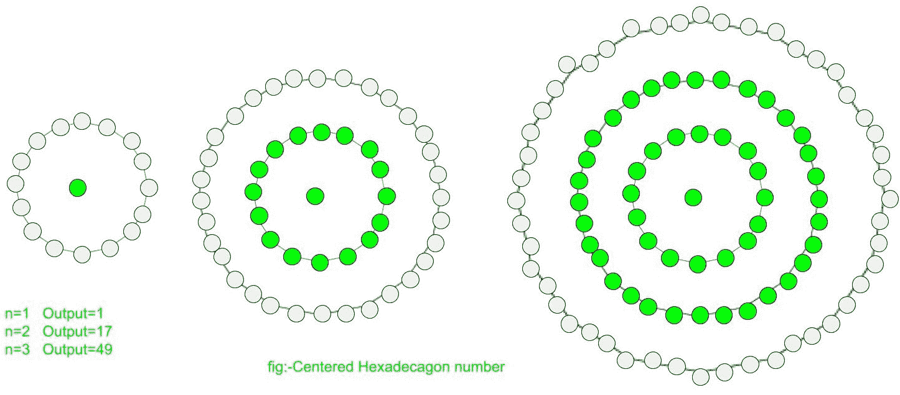

# 居中十六边形数

> 原文:[https://www . geesforgeks . org/centered-十六边形-number/](https://www.geeksforgeeks.org/centered-hexadecagonal-number/)

给定一个数 n，求第 n 个居中的六边形数。
一个以十六边形数字为中心的**表示在连续的十六边形(16 边多边形)图层中，位于中心的一个点及其周围的其他点。**



前几个居中的十六边形数字是:
1，17，49，97，161，241，337，449，577，721，881……

**示例:**

```
Input :  3
Output : 49

Input : 10
Output : 721
```

在数学中，**第 n 个**项的中心十六边数由下式给出:

以下是上述想法的基本实现:

## C++

```
// C++ Program to find
// nth centered hexadecagonal
// number
#include <bits/stdc++.h>
using namespace std;

// centered hexadecagonal function
int center_hexadecagonal_num(long int n)
{
    // Formula to calculate nth
    // centered hexadecagonal number
    return 8 * n * n - 8 * n + 1;
}

// Driver Code
int main()
{
    long int n = 2;
    cout << n << "th centered hexadecagonal number : "
                    << center_hexadecagonal_num(n);
    cout << endl;
    n = 12;
    cout << n << "th centered hexadecagonal numbe : "
                    << center_hexadecagonal_num(n);

    return 0;
}
```

## Java 语言(一种计算机语言，尤用于创建网站)

```
// Java Program to find nth
// centered hexadecagonal number
import java.io.*;

class GFG
{
    // centered hexadecagonal function
    static int center_hexadecagonal_num(int n)
    {
        // Formula to calculate nth
        // centered hexadecagonal number
        return 8 * n * n -
               8 * n + 1;
    }

    // Driver Code
    public static void main(String args[])
    {
        int n = 2;
        System.out.print(n + "th centered " +
                    "hexadecagonal number: ");
        System.out.println(center_hexadecagonal_num(n));

        n = 12;
        System.out.print(n + "th centered " +
                    "hexadecagonal number: ");
        System.out.println(center_hexadecagonal_num(n));
    }
}

// This code is contributed by ajit.
```

## 蟒蛇 3

```
# Program to find nth
# centered hexadecagonal
# number

# centered hexadecagonal
# function
def center_hexadecagonal_num(n):

    # Formula to calculate
    # nth centered hexadecagonal
    # number
    return 8 * n * n - 8 * n + 1

# Driver Code
if __name__ == '__main__' :

    n = 2
    print(n,"nd centered hexadecagonal " +
                              "number : ",
              center_hexadecagonal_num(n))
    n = 12
    print(n,"th centered hexadecagonal " +
                              "number : ",
              center_hexadecagonal_num(n))

# This code is contributed
# by akt_mit
```

## C#

```
// C# Program to find nth
// centered hexadecagonal number
using System;

class GFG
{

    // centered hexadecagonal
    // function
    static int center_hexadecagonal_num(int n)
    {
        // Formula to calculate nth
        // centered hexadecagonal number
        return 8 * n * n -
               8 * n + 1;
    }

    // Driver Code
    static public void Main ()
    {
        int n = 2;
        Console.Write(n + "th centered " +
                    "hexadecagonal number: ");
        Console.WriteLine(center_hexadecagonal_num(n));

        n = 12;
        Console.Write(n + "th centered " +
                    "hexadecagonal number: ");
        Console.WriteLine(center_hexadecagonal_num(n));
    }
}

// This code is contributed by m_kit
```

## 服务器端编程语言（Professional Hypertext Preprocessor 的缩写）

```
<?php
// PHP Program to find
// nth centered hexadecagonal
// number

// centered hexadecagonal function
function center_hexadecagonal_num($n)
{
    // Formula to calculate nth
    // centered hexadecagonal number
    return 8 * $n * $n - 8 * $n + 1;
}

// Driver Code
$n = 2;
echo $n , "th centered hexadecagonal number : ",
                   center_hexadecagonal_num($n);
echo "\n";
$n = 12;
echo $n , "th centered hexadecagonal numbe : ",
                  center_hexadecagonal_num($n);

// This code is contributed by ajit
?>
```

## java 描述语言

```
<script>

// Javascript Program to find nth
// centered hexadecagonal number

// Centered hexadecagonal function
function center_hexadecagonal_num(n)
{

    // Formula to calculate nth
    // centered hexadecagonal number
    return 8 * n * n - 8 * n + 1;
}

// Driver code
var n = 2;
document.write(n + "th centered " +
               "hexadecagonal number: ");
document.write(center_hexadecagonal_num(n) + "<br>");

n = 12;
document.write(n + "th centered " +
               "hexadecagonal number: ");
document.write(center_hexadecagonal_num(n));

// This code is contributed by Ankita saini

</script>
```

**输出:**

```
2th centered hexadecagonal number : 17
12th centered hexadecagonal numbe : 1057
```

**时间复杂度:**O(1)
T3】辅助空间: O(1)

参考文献:
T1】http://oeis.org/A069129T3】