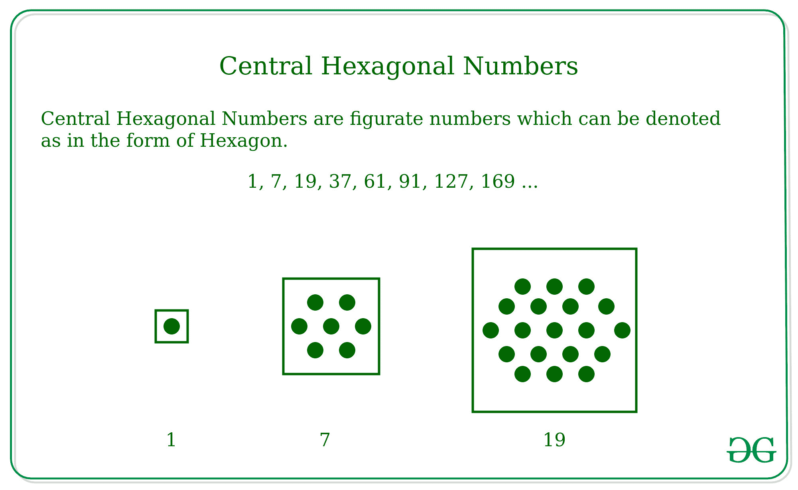

# 居中六边形编号

> 原文:[https://www.geeksforgeeks.org/centered-hexagonal-number/](https://www.geeksforgeeks.org/centered-hexagonal-number/)

给定一个数字 **N** ，任务是找到 N <sup>第</sup>个居中的六边形数字。另外，找到居中的六边形系列。
**例:**

> **输入:** N = 2
> **输出:** 7
> **输入:** N = 10
> **输出:** 271

**中心六边形数字**–中心六边形数字是图形数字，呈六边形。中心六边形数不同于[六边形数](https://www.geeksforgeeks.org/hexagonal-number/)，因为它在中心包含一个元素。
一些中心六边形数字是–

```
1, 7, 19, 37, 61, 91, 127, 169 ... 
```



**例如:**

```
The First N numbers are - 
1, 7, 19, 37, 61, 91, 127 ...

The cumulative sum of these numbers are - 
1, 1+7, 1+7+19, 1+7+19+37...

which is nothing but the sequence -
1, 8, 27, 64, 125, 216 ...

That is in the form of  -
13, 23, 33, 43, 53, 63 ....
```

正如中心六边形数字加起来的第 N <sup>个</sup>项将是第 N <sup>3</sup> 。那就是–

> 1<sup>3</sup>+2<sup>3</sup>+3<sup>3</sup>+4<sup>3</sup>+5<sup>3</sup>+6<sup>3</sup>…。最多 N 个术语= N <sup>3</sup>
> 然后，N <sup>第</sup>个术语将为–
> =>N<sup>3</sup>–(N–1)<sup>3</sup>
> =>**3 * N *(N–1)+1**

**方法:**使用公式–**3 * N *(N–1)+1**求中心六边形数的第 N <sup>项。
以下是上述方法的实现:</sup> 

## C++

```
// Program to find nth
// centered hexadecimal number.
#include <bits/stdc++.h>
using namespace std;

// Function to find centered
// hexadecimal number.
int centeredHexagonalNumber(int n)
{
    // Formula to calculate nth
    // centered hexadecimal number
    // and return it into main function.
    return 3 * n * (n - 1) + 1;
}

// Driver Code
int main()
{
    int n = 10;
    cout << n << "th centered hexagonal number: ";
    cout << centeredHexagonalNumber(n);
    return 0;
}
```

## Java 语言(一种计算机语言，尤用于创建网站)

```
// Java Program to find nth
// centered hexadecimal number
import java.io.*;

class GFG
{

    // Function to find centered
    // hexadecimal number
    static int centeredHexagonalNumber(int n)
    {
        // Formula to calculate nth
        // centered hexadecimal number
        // and return it into main function
        return 3 * n * (n - 1) + 1;
    }

    // Driver Code
    public static void main(String args[])
    {
        int n = 10;
        System.out.print(n + "th centered " +
                       "hexagonal number: ");
        System.out.println(centeredHexagonalNumber(n));

    }
}

// This code is contributed by Nikita Tiwari.
```

## 蟒蛇 3

```
# Python 3 program to find nth
# centered hexagonal number

# Function to find
# centered hexagonal number
def centeredHexagonalNumber(n) :

    # Formula to calculate
    # nth centered hexagonal
    return 3 * n * (n - 1) + 1

# Driver Code
if __name__ == '__main__' :

    n = 10
    print(n, "th centered hexagonal number: "
                , centeredHexagonalNumber(n))

# This code is contributed
# by 'Akanshgupta'
```

## C#

```
// C# Program to find nth
// centered hexadecimal number
using System;

class GFG
{

    // Function to find centered
    // hexadecimal number
    static int centeredHexagonalNumber(int n)
    {
        // Formula to calculate nth
        // centered hexadecimal number
        // and return it into main function
        return 3 * n * (n - 1) + 1;
    }

    // Driver Code
    public static void Main()
    {
        int n = 10;
        Console.Write(n + "th centered "+
                   "hexagonal number: ");
        Console.Write(centeredHexagonalNumber(n));

    }
}

// This code is contributed by vt_m.
```

## 服务器端编程语言（Professional Hypertext Preprocessor 的缩写）

```
<?php
// PHP Program to find nth
// centered hexadecimal number.

// Function to find centered
// hexadecimal number.
function centeredHexagonalNumber( $n)
{

    // Formula to calculate nth
    // centered hexadecimal
    // number and return it
    // into main function.
    return 3 * $n * ($n - 1) + 1;
}

    // Driver Code
    $n = 10;
    echo $n , "th centered hexagonal number: ";
    echo centeredHexagonalNumber($n);

// This code is contributed by anuj_67.
?>
```

## java 描述语言

```
<script>

// Program to find nth
// centered hexadecimal number.

// Function to find centered
// hexadecimal number.
function centeredHexagonalNumber(n)
{

    // Formula to calculate nth
    // centered hexadecimal number
    // and return it into main function.
    return 3 * n * (n - 1) + 1;
}

// Driver Code
let n = 10;
document.write(n + "th centered hexagonal number: ");
document.write(centeredHexagonalNumber(n));

// This code is contributed by rishavmahato348.

</script>
```

**输出:**

```
10th centered hexagonal number: 271
```

**业绩分析:**

*   **时间复杂度:**在上面给出的方法中，我们找到了花费恒定时间的中心六边形数的第 N 个<sup>项。因此，复杂性将是 **O(1)**</sup>
*   **空间复杂度:**在上面给出的方法中，我们没有使用任何其他辅助空间进行计算。因此，空间复杂性将是 **O(1)** 。

### 居中六边形系列

给定一个数字 N，任务是找到中心六边形系列直到 N.
**方法:**
使用循环变量(比如说 **i** )迭代循环，并使用公式–**3 * I *(I–1)+1**
找到中心六边形数字的每个 i <sup>第</sup>项。下面是上述方法的实现:

## C++

```
// Program to find the series
// of centered hexadecimal number
#include <bits/stdc++.h>
using namespace std;

// Function to find the
// series of centered
// hexadecimal number.
void centeredHexagonalSeries(int n)
{
    // Formula to calculate
    // nth centered hexadecimal
    // number.
    for (int i = 1; i <= n; i++)
        cout << 3 * i * (i - 1) + 1
             << " ";
}

// Driver Code
int main()
{
    int n = 10;
    centeredHexagonalSeries(n);
    return 0;
}
```

## Java 语言(一种计算机语言，尤用于创建网站)

```
// Program to find the series of
// centered hexadecimal number.
import java.io.*;

class GFG
{
    // Function to find the series of
    // centered hexadecimal number.
    static void centeredHexagonalSeries(int n)
    {
        // Formula to calculate nth
        // centered hexadecimal number.
        for (int i = 1; i <= n; i++)
            System.out.print( 3 * i *
                            (i - 1) + 1 + " ");
    }

    // Driver Code
    public static void main(String args[])
    {
        int n = 10;
        centeredHexagonalSeries(n);
    }
}

// This code is contributed by Nikita Tiwari.
```

## 蟒蛇 3

```
# Python3 program to find
# nth centered hexagonal number

# Function to find centered hexagonal
# series till n given numbers.
def centeredHexagonalSeries(n) :
    for i in range(1, n + 1) :

        # Formula to calculate nth
        # centered hexagonal series.
        print(3 * i * (i - 1) + 1, end=" ")

# Driver Code
if __name__ == '__main__' :

    n = 10
    centeredHexagonalSeries(n)

# This code is contributed
# by 'Akanshgupta'
```

## C#

```
// C# Program to find the
// series of centered
// hexadecimal number.
using System;

class GFG
{

    // Function to find the
    // series of centered
    // hexadecimal number.
    static void centeredHexagonalSeries(int n)
    {
        // Formula to calculate nth
        // centered hexadecimal number.
        for (int i = 1; i <= n; i++)
            Console.Write( 3 * i *
                         (i - 1) + 1 + " ");
    }

    // Driver Code
    public static void Main()
    {
        int n = 10;
        centeredHexagonalSeries(n);
    }
}

// This code is contributed by vt_m.
```

## 服务器端编程语言（Professional Hypertext Preprocessor 的缩写）

```
<?php
// Program to find the
// series of centered
// hexadecimal number.

// Function to find the
// series of centered
// hexadecimal number.
function centeredHexagonalSeries( $n)
{
    // Formula to calculate
    // nth centered hexadecimal
    // number.
    for ( $i = 1; $i <= $n; $i++)
    echo 3 * $i * ($i - 1) + 1 ," ";
}

// Driver Code
$n = 10;
centeredHexagonalSeries($n);

// This code is contributed by anuj_67.
?>
```

## java 描述语言

```
<script>

// JavaScript program to find the series of
// centered hexadecimal number.

    // Function to find the series of
    // centered hexadecimal number.
    function centeredHexagonalSeries(n)
    {
        // Formula to calculate nth
        // centered hexadecimal number.
        for (let i = 1; i <= n; i++)
            document.write( 3 * i *
                            (i - 1) + 1 + " ");
    }

// Driver code

        let n = 10;
        centeredHexagonalSeries(n);

</script>
```

**输出:**

```
1 7 19 37 61 91 127 169 217 271
```

**时间复杂度:**O(n)
T3】辅助空间: O(1)