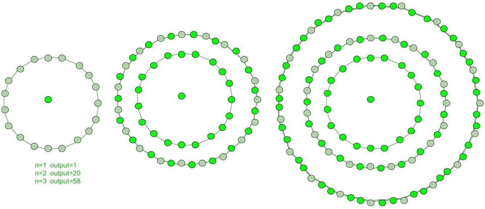
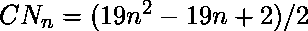

# 居中的非十边形数字

> 原文:[https://www . geeksforgeeks . org/centered-non decadenal-number/](https://www.geeksforgeeks.org/centered-nonadecagonal-number/)

给定一个 n，求第 n 个**个居中的非十边形数。
一个以非十边形数字为中心的**代表在连续的非十边形(19 边多边形)图层中的中心点和围绕它的其他点。**** 

****

**前几个居中的非十边形数字是:
1，20，58，115，191，286，400，533，685，856，1046，1255……………………
**示例:**** 

```
Input :  3
Output : 58 

Input : 13
Output :1483
```

**在数学中，**第 n 个**项的中心非十边形数由下式给出:** 

```

```

**以下是上述思路的基本实现:** 

## **C++**

```
// C++ Program to find
// nth centered
// nonadecagonal number
#include <bits/stdc++.h>
using namespace std;

// centered nonadecagonal
//  function
int center_nonadecagon_num( long int n )
{
    // Formula to calculate nth
    // centered nonadecagonal number
    return (19 * n * n - 19 * n + 2) / 2;
}

// Driver Code
int main()
{
    long int n = 2;
    cout << n << "th centered nonadecagonal number : "
                   << center_nonadecagon_num(n);
    cout << endl;
    n = 7;
    cout << n << "th centered nonadecagonal number : "
                  << center_nonadecagon_num(n);

    return 0;
}
```

## **Java 语言(一种计算机语言，尤用于创建网站)**

```
// Java Program to find nth centered
// nonadecagonal number
import java.io.*;

class GFG {

    // centered nonadecagonal
    // function
    static int center_nonadecagon_num(int n)
    {
        // Formula to calculate nth
        // centered nonadecagonal number
        return (19 * n * n - 19 * n + 2) / 2;
    }

    // Driver code
    public static void main (String[] args)
    {
        int n = 2;
        System.out.print ( n + "th centered "
                + "nonadecagonal number : ");
        System.out.println (
                   center_nonadecagon_num(n));

        n = 7;
        System.out.print ( n + "th centered "
                + "nonadecagonal number : ");
        System.out.println(
                  center_nonadecagon_num(n));
    }
}

// This code is contributed by m_kit
```

## **蟒蛇 3**

```
# Program to find nth
# centered nonadecagonal number
def center_nonadecagon_num(n) :

    # Formula to calculate
    # nth centered nonadecagonal
    # number & return it into
    # main function.

    return (19 * n * n -
            19 * n + 2) // 2

# Driver Code
if __name__ == '__main__' :

    n = 2
    print(n,"nd centered nonadecagonal " +
                              "number : ",
                center_nonadecagon_num(n))

    n = 7
    print(n,"nd centered nonadecagonal " +
                              "number : ",
                center_nonadecagon_num(n))

# This code is contributed by ajit
```

## **C#**

```
// C# Program to find
// nth centered
// nonadecagonal number
using System;

class GFG
{

    // centered nonadecagonal
    // function
    static int center_nonadecagon_num(int n)
    {
        // Formula to calculate nth
        // centered nonadecagonal number
        return (19 * n * n -
                19 * n + 2) / 2;
    }

    // Driver code
    static public void Main ()
    {

        int n = 2;
        Console.Write ( n + "th centered " +
                 "nonadecagonal number : ");
        Console.WriteLine(
                 center_nonadecagon_num(n));

        n = 7;
        Console.Write( n + "th centered " +
                "nonadecagonal number : ");
        Console.WriteLine(
                center_nonadecagon_num(n));
    }
}

// This code is contributed by ajit
```

## **服务器端编程语言（Professional Hypertext Preprocessor 的缩写）**

```
<?php
// PHP Program to find
// nth centered
// nonadecagonal number

// centered nonadecagonal
// function
function center_nonadecagon_num( $n )
{
    // Formula to calculate nth
    // centered nonadecagonal number
    return (19 * $n * $n -
            19 * $n + 2) / 2;
}

// Driver Code
$n = 2;
echo $n ,"th centered " +
         "nonadecagonal number : ",
        center_nonadecagon_num($n);
echo "\n";
$n = 7;
echo $n , "th centered " +
          "nonadecagonal number : ",
         center_nonadecagon_num($n);

// This code is contributed by ajit
?>
```

## **java 描述语言**

```
<script>

// Javascript program to find nth centered
// nonadecagonal number

// centered nonadecagonal
// function
function center_nonadecagon_num(n)
{

    // Formula to calculate nth
    // centered nonadecagonal number
    return (19 * n * n - 19 * n + 2) / 2;
}

// Driver Code
var n = 2;
document.write(n + "th centered " +
               "nonadecagonal number : ");
document.write(center_nonadecagon_num(n) + "<br>");

n = 7;
document.write(n + "th centered " +
               "nonadecagonal number : ");
document.write(center_nonadecagon_num(n));

// This code is contributed by Kirti

</script>
```

****输出:****

```
2th centered nonadecagonal number : 20
7th centered nonadecagonal numbe : 400
```

****时间复杂度:**O(1)
T3】辅助空间: O(1)**

****参考文献:**T2[http://oeis.org/A069132](http://oeis.org/A069132)T5】**