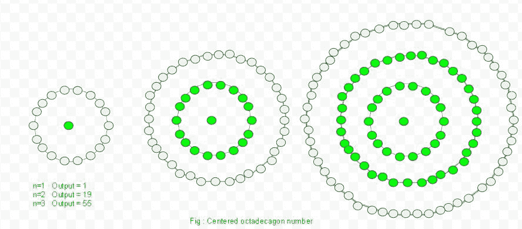
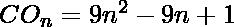

# 中心十八边形数

> 原文:[https://www . geesforgeks . org/centered-十八大-number/](https://www.geeksforgeeks.org/centered-octadecagonal-number/)

给定一个数字 n，求第 n 个**中心十八边形数。
**中心十八边形数字**代表中心的一个点，其他点排列在十八边形(18 边多边形)的连续层中。** 

****

****例:**** 

```
Input :  2
Output : 19

Input : 6
Output : 271
```

**在数学中，**第 n 个**项的中心十八进制数由:
给出**

```

```

**以下是上述思路的基本实现:** 

## **C++**

```
// C++ Program to find the
// nth centered octadecagonal
// number
#include <bits/stdc++.h>
using namespace std;

// centered octadecagon  function
int center_octadecagon_num(long int n)
{
    // Formula to calculate nth
    // centered octadecagonal number
    return 9 * n * n - 9 * n + 1;
}

// Driver Code
int main()
{
    long int n = 3;
    cout << n << "th centered octadecagonal number : "
                  << center_octadecagon_num(n);
    cout << endl;
    n = 13;
    cout << n << "th centered octadecagonal number : "
                 << center_octadecagon_num(n);

    return 0;
}
```

## **Java 语言(一种计算机语言，尤用于创建网站)**

```
// Java Program to find the
// nth centered octadecagonal
// number
import java.io.*;

class GFG
{

// centered octadecagon function
static int center_octadecagon_num(int n)
{

    // Formula to calculate nth
    // centered octadecagonal number
    return 9 * n * n - 9 * n + 1;
}

// Driver Code
public static void main (String[] args)
{
int n = 3;
System.out.print(n + "th centered " +
           "octadecagonal number : ");
System.out.println(center_octadecagon_num(n));

n = 13;
System.out.print(n + "th centered " +
           "octadecagonal number : ");
System.out.println(center_octadecagon_num(n));
}
}

// This code is contributed by ajit
```

## **蟒蛇 3**

```
# Program to find nth
# centered octadecagonal number

# Centered octadecagonal
# number function
def center_octadecagon_num(n) :

    # Formula to calculate
    # nth centered octadecagonal
    # number & return it
    # into main function.
    return(9 * n * n -
           9 * n + 1)

# Driver Code
if __name__ == '__main__' :

    n = 3
    print(n,"rd centered octadecagonal " +
                                "number : ",
                center_octadecagon_num(n))

    n = 13
    print(n,"th centered octadecagonal " +
                              "number : ",
                center_octadecagon_num(n))

# This code is contributed
# by akt_mit
```

## **C#**

```
// C# Program to find the
// nth centered octadecagonal
// number
using System;

class GFG
{

// centered octadecagon function
static int center_octadecagon_num(int n)
{

    // Formula to calculate nth
    // centered octadecagonal number
    return 9 * n * n - 9 * n + 1;
}

// Driver Code
static public void Main ()
{

    int n = 3;
    Console.Write( n + "th centered " +
            "octadecagonal number : ");
    Console.WriteLine( center_octadecagon_num(n));

    n = 13;
    Console.Write( n + "th centered " +
            "octadecagonal number : ");
    Console.WriteLine(center_octadecagon_num(n));
}
}

// This code is contributed by aj_36.
```

## **服务器端编程语言（Professional Hypertext Preprocessor 的缩写）**

```
<?php
// PHP Program to find the
// nth centered octadecagonal
// number

// centered octadecagon function
function center_octadecagon_num($n)
{
    // Formula to calculate nth
    // centered octadecagonal number
    return (9 * $n * $n -
            9 * $n + 1);
}

// Driver Code
$n = 3;
echo $n , "th centered octadecagonal " .
                            "number : ",
             center_octadecagon_num($n);
echo "\n";

$n = 13;
echo $n , "th centered octadecagonal " .
                            "number : ",
             center_octadecagon_num($n);

// This code is contributed by m_kit
?>
```

## **java 描述语言**

```
<script>

// Javascript program to find the
// nth centered octadecagonal
// number

// centered octadecagon function
function center_octadecagon_num(n)
{

    // Formula to calculate nth
    // centered octadecagonal number
    return 9 * n * n - 9 * n + 1;
}

// Driver Code
var n = 3;
document.write(n + "th centered " +
           "octadecagonal number : ");
document.write(center_octadecagon_num(n) + "<br>");

n = 13;
document.write(n + "th centered " +
           "octadecagonal number : ");
document.write(center_octadecagon_num(n));

// This code is contributed by Kirti

</script>
```

****输出:****

```
3th centered octadecagonal number : 55
13th centered octadecagonal number : 1405
```

****时间复杂度:**O(1)
T3】辅助空间: O(1)**