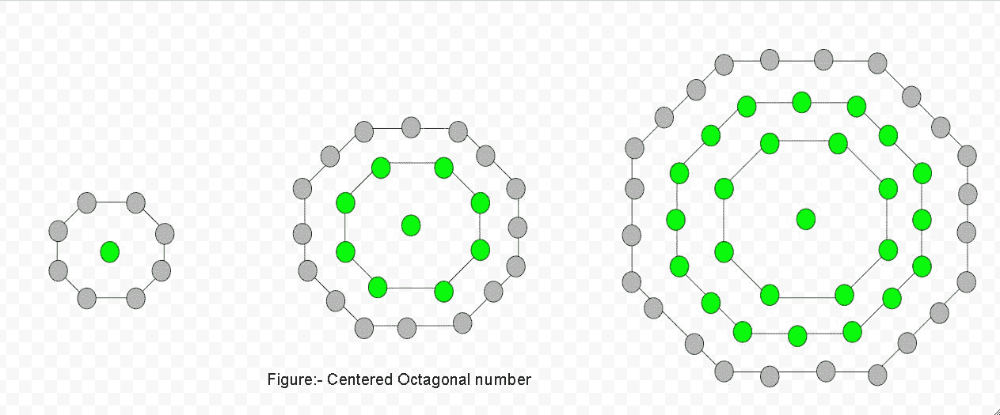

# 居中八角数字

> 原文:[https://www.geeksforgeeks.org/centered-octagonal-number/](https://www.geeksforgeeks.org/centered-octagonal-number/)

给定一个数 n，求第 n 个位于中心的八角形数。
一个以**为中心的八边形数字**代表一个八边形，在连续的八边形层中，一个点在中心，其他点围绕着中心点。



**例:**

```
Input :  2
Output : 9

Input : 5
Output : 81
```

居中八角形**第 n**号由:
给出

上述方法的基本实现:

## C++

```
// Program to find nth
// centered octagonal
// number
#include <bits/stdc++.h>
using namespace std;

// Centered octagonal number function
int cen_octagonalnum(long int n)
{
    // Formula to calculate nth
    // centered octagonal number &
    // return it into main function.
    return (4 * n * n - 4 * n + 1);
}

// Driver Code
int main()
{
    long int n = 6;
    cout << n << "th  centered"
                 << " octagonal number : ";
    cout << cen_octagonalnum(n);
    cout << endl;
    n = 11;
    cout << n << "th  centered"
                  << " octagonal number : ";
    cout << cen_octagonalnum(n);

    return 0;
}
```

## Java 语言(一种计算机语言，尤用于创建网站)

```
// Java Program to find nth
// centered octagonal number
import java.io.*;

class GFG
{

    // Function to find centered
    // octagonal number
    static int centeredoctagonalNumber(int n)
    {
        // Formula to calculate nth
        // centered octagonal number
        // and return it into main function
        return 4 * n * (n - 1) + 1;
    }

    // Driver Code
    public static void main(String args[])
    {
        int n = 6;
        System.out.print(n + "th centered " +
                       "octagonal number: ");
        System.out.println(
                 centeredoctagonalNumber(n));

        n = 11;
        System.out.print(n + "th centered " +
                       "octagonal number: ");
        System.out.println(
                  centeredoctagonalNumber(n));

    }
}

// This code has been contributed by Prasad_Kshirsagar.
```

## 蟒蛇 3

```
# Program to find nth
# centered octagonal number

def cen_octagonalnum(n) :

    # Formula to calculate nth
    # centered octagonal number
    return (4 * n * n -
            4 * n + 1)

# Driver Code
if __name__ == '__main__' :

    n = 6
    print(n,"th Centered",
            "octagonal number: ",
             cen_octagonalnum(n))
    n = 11
    print(n,"th Centered" ,
            "octagonal number: ",
             cen_octagonalnum(n))

# This code is contributed
# by akt_mit
```

## C#

```
// Program to find nth centered octagonal
// number
using System;

public class GFG{

    // Centered octagonal number function
    static long cen_octagonalnum(long  n)
    {

        // Formula to calculate nth
        // centered octagonal number &
        // return it into main function.
        return (4 * n * n - 4 * n + 1);
    }

    // Driver code
    static public void Main ()
    {
        long n = 6;
        Console.WriteLine(n + "th centered"
                    + " octagonal number : "
        + cen_octagonalnum(n));

        n = 11;
        Console.WriteLine(n + "th centered"
                    + " octagonal number : "
                    + cen_octagonalnum(n));
    }
}

// This code is contributed by anuj_67.
```

## 服务器端编程语言（Professional Hypertext Preprocessor 的缩写）

```
<?php
// Program to find nth
// centered octagonal
// number

// Centered octagonal
// number function
function cen_octagonalnum($n)
{
    // Formula to calculate nth
    // centered octagonal number &
    // return it into main function.
    return (4 * $n * $n -
            4 * $n + 1);
}

// Driver Code
$n = 6;
echo $n ,"th centered",
     " octagonal number : ";
echo cen_octagonalnum($n);
echo "\n";

$n = 11;
echo $n , "th centered",
     " octagonal number : ";
echo cen_octagonalnum($n);

// This code is contributed by ajit
?>
```

## java 描述语言

```
<script>

// Javascript Program to find nth
// centered octagonal number

// Function to find centered
// octagonal number
function centeredoctagonalNumber(n)
{

    // Formula to calculate nth
    // centered octagonal number
    // and return it into main function
    return 4 * n * (n - 1) + 1;
}

// Driver Code
var n = 6;
document.write(n + "th centered " +
               "octagonal number: ");
document.write(centeredoctagonalNumber(n) + "<br>");

n = 11;
document.write(n + "th centered " +
               "octagonal number: ");
document.write(centeredoctagonalNumber(n));

// This code is contributed by Kirti

</script>
```

**输出**

```
6th  centered octagonal number : 121
11th  centered octagonal number : 441
```

**时间复杂度:**O(1)
T3】辅助空间: O(1)